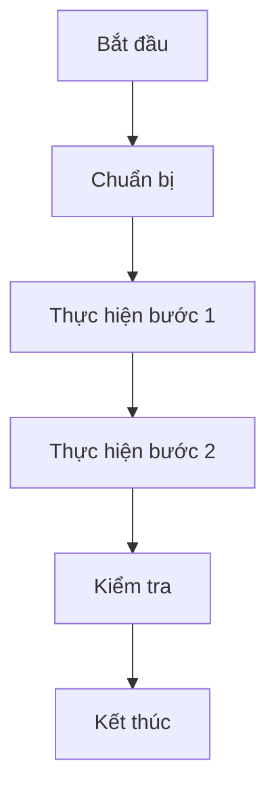
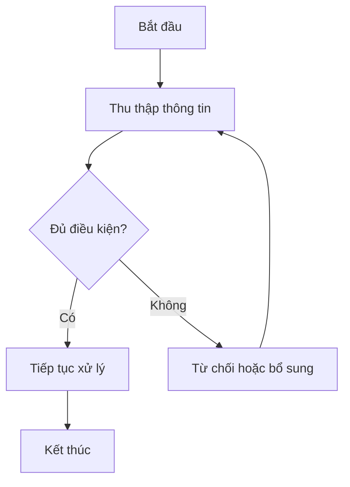
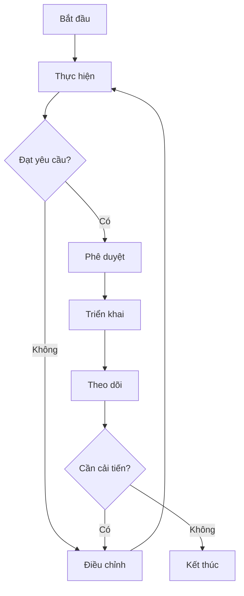
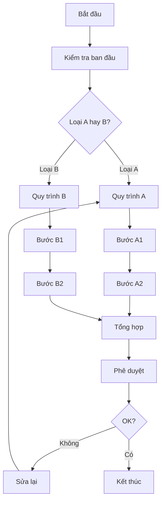
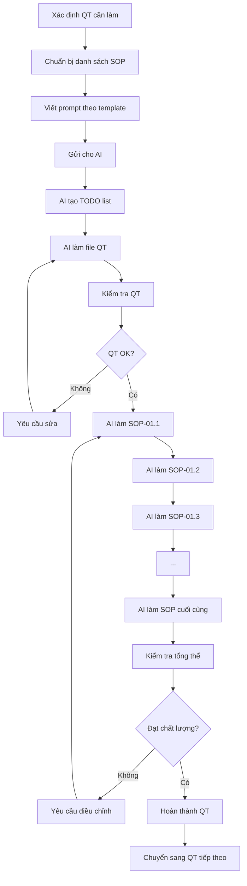

# PROMPT TẠO TÀI LIỆU ISO CHUẨN CHO TRƯỜNG HỌC

## 🎯 MỤC ĐÍCH PROMPT

Prompt này giúp AI tạo ra bộ tài liệu ISO chất lượng cao, đầy đủ cho các Quy tắc (QT) của trường liên cấp quốc tế, với cấu trúc và chất lượng tương tự QT-01 đã hoàn thành.

---

## 📋 TEMPLATE PROMPT CHUẨN

```
NHIỆM VỤ: Hoàn thiện tài liệu ISO cho QT-[XX]: [Tên Quy tắc]

CONTEXT:
Bạn là một chuyên gia quản lý giáo dục quốc tế có 15+ năm kinh nghiệm. 
Bạn đang giúp tôi xây dựng bộ tài liệu ISO cho trường liên cấp quốc tế (Mầm non - Tiểu học - THCS).

QUY TẮC CẦN HOÀN THIỆN:
- Mã: QT-[XX]
- Tên: [Tên đầy đủ quy tắc]
- Số SOP: [X] quy trình cha
- Tổng số quy trình con: [Y] files

DANH SÁCH CÁC SOP:
[Copy từ file QT-XX_Ten_Quy_Tac.md]

YÊU CẦU KỸ THUẬT:

1. FILE QT (File tổng quan):
   ✅ Cấu trúc chuẩn ISO với 12 mục:
      1. Thông tin tài liệu (Bảng)
      2. Mục đích (Bullet points với giải thích)
      3. Phạm vi áp dụng (Bảng đối tượng + Khu vực)
      4. Tài liệu tham chiếu (Bảng các luật, nghị định, ISO)
      5. Thuật ngữ và viết tắt (Bảng định nghĩa)
      6. Trách nhiệm và phân công (Chi tiết từng vai trò)
      7. Cấu trúc quy trình (Bảng liệt kê tất cả SOP với mục đích, tần suất)
      8. Chỉ tiêu và mục tiêu (Bảng KPI đo lường được)
      9. Giám sát và cải tiến (Lịch kiểm tra + Bảng báo cáo)
      10. Xử lý vi phạm (Bảng 4 cấp độ)
      11. Phụ lục (Danh sách, biểu mẫu, số điện thoại khẩn cấp)
      12. Phê duyệt và hiệu lực (Bảng chữ ký)
   
   ✅ Tất cả danh sách phải dạng BẢNG (table markdown)
   ✅ Có giải thích, ghi chú cụ thể cho mỗi mục
   ✅ Dài ~250-300 dòng

2. FILE SOP (Quy trình chi tiết):
   ✅ Cấu trúc chuẩn ISO với 11 mục:
      1. Thông tin quy trình (Bảng)
      2. Mục đích (Bullet points, giải thích cụ thể)
      3. Phạm vi áp dụng (Bảng chi tiết)
      4. Quy trình thực hiện (Chia 4-6 giai đoạn, mỗi giai đoạn có bước 1-5)
      5. Lưu đồ Mermaid (QUAN TRỌNG!)
      6. Biểu mẫu liên quan (Bảng)
      7. Tiêu chuẩn và chỉ tiêu (Bảng KPI)
      8. Trách nhiệm cụ thể (Bảng)
      9. Lưu ý quan trọng (Chia nhỏ 3-4 mục con với icon ⚠️, ✅, 🔥...)
      10. Phụ lục (Checklist, mẫu biểu mẫu, bảng tra cứu)
      11. FAQ (5 câu hỏi thường gặp)
      12. Phê duyệt (Bảng chữ ký)
   
   ✅ Giải thích QUY TRÌNH bằng LỜI (chi tiết, dễ hiểu)
   ✅ Lưu đồ Mermaid:
      - KHÔNG sử dụng dấu ngoặc tròn ( )
      - KHÔNG sử dụng dấu nháy kép " "
      - Dùng graph TD hoặc graph LR
      - Các node ngắn gọn, súc tích
      - Có decision nodes (hình thoi)
      - Có start và end rõ ràng
   ✅ Dài ~300-500 dòng (tùy độ phức tạp)

3. NGUYÊN TẮC VIẾT:
   ✅ Ngôn ngữ chuyên nghiệp nhưng dễ hiểu
   ✅ Câu văn ngắn gọn, súc tích
   ✅ Sử dụng số liệu cụ thể (%, thời gian, số lượng)
   ✅ Có ví dụ thực tế
   ✅ Phân loại rõ ràng (bảng, cấp độ, mức độ)
   ✅ Icon phù hợp (🔥, ⚠️, ✅, 🚌, 🍽️...)
   ✅ Highlight điểm quan trọng bằng **BOLD** hoặc CAPS

4. NỘI DUNG CHUYÊN MÔN:
   ✅ Dựa trên thực tế trường quốc tế
   ✅ Tuân thủ pháp luật Việt Nam
   ✅ Tham chiếu ISO quốc tế (nếu có)
   ✅ Có tính khả thi cao
   ✅ Cân bằng giữa lý tưởng và thực tế

HƯỚNG DẪN THỰC HIỆN:

Bước 1: Đọc kỹ cấu trúc QT-01 đã hoàn thành (file QT-01_An_toan_Bao_mat_PCCC.md)
Bước 2: Đọc 2-3 file SOP mẫu (SOP-01.1, SOP-01.4, SOP-02.1) để hiểu format
Bước 3: Bắt đầu với FILE QT tổng quan trước
Bước 4: Sau đó làm TỪNG FILE SOP theo thứ tự
Bước 5: Mỗi file phải HOÀN CHỈNH, KHÔNG để "..." hoặc "Đang cập nhật"

YÊU CẦU ĐẶC BIỆT:
- Làm từng file một, hoàn thiện 100% mới chuyển file tiếp theo
- Mỗi lưu đồ Mermaid phải chạy được, không lỗi syntax
- Tất cả bảng phải có đủ cột, đủ dữ liệu
- FAQ phải thực tế, giải đáp được thắc mắc thật

OUTPUT MONG MUỐN:
- 1 file QT hoàn chỉnh (~250-300 dòng)
- [X] files SOP hoàn chỉnh (~300-500 dòng/file)
- Tất cả đều theo chuẩn ISO, có lưu đồ Mermaid, FAQ, bảng biểu đầy đủ
```

---

## 📚 VÍ DỤ PROMPT CỤ THỂ CHO TỪNG QT

### **Ví dụ 1: QT-02 - Nhân sự, Lao động, Văn hóa**

```
NHIỆM VỤ: Hoàn thiện tài liệu ISO cho QT-02: Nhân sự – Lao động – Văn hóa

CONTEXT:
Bạn là chuyên gia quản lý nhân sự giáo dục quốc tế, hiểu rõ về tuyển dụng, 
đào tạo, đánh giá và văn hóa tổ chức trong môi trường trường học.

QUY TẮC: QT-02 - Nhân sự – Lao động – Văn hóa

CÁC SOP CẦN HOÀN THIỆN:
SOP-01: Tuyển dụng (5 quy trình con)
  - SOP-01.1: Xây dựng kế hoạch tuyển dụng
  - SOP-01.2: Đăng tin tuyển dụng
  - SOP-01.3: Sàng lọc hồ sơ ứng viên
  - SOP-01.4: Phỏng vấn ứng viên
  - SOP-01.5: Đánh giá và lựa chọn ứng viên

SOP-02: OnBoarding (4 quy trình con)
SOP-03: Đào tạo (4 quy trình con)
SOP-04: Đánh giá chất lượng (4 quy trình con)
SOP-05: Phúc lợi (4 quy trình con)
SOP-06: Khen thưởng - Văn hóa (4 quy trình con)
SOP-07: Kỷ luật lao động (4 quy trình con)

YÊU CẦU:
1. FILE QT-02: Theo format QT-01 (12 mục, bảng biểu đầy đủ)
2. 29 FILES SOP: Mỗi file theo format SOP chuẩn (11 mục, có lưu đồ Mermaid)

ĐẶC ĐIỂM QT-02:
- Tập trung vào quản lý con người
- Tuân thủ Bộ luật Lao động Việt Nam
- Tham chiếu ISO 9001 (quản lý chất lượng), ISO 45001 (ATVSLĐ)
- Chú trọng văn hóa doanh nghiệp, môi trường làm việc
- Quy trình tuyển dụng phải đảm bảo chất lượng giáo viên quốc tế

BẮT ĐẦU với FILE QT-02 (file tổng quan) trước!
```

### **Ví dụ 2: QT-03 - Tài chính, Ngân sách, Kế toán**

```
NHIỆM VỤ: Hoàn thiện QT-03: Tài chính – Ngân sách – Kế toán

CONTEXT:
Bạn là chuyên gia tài chính giáo dục, am hiểu về kế toán trường học, 
quản lý ngân sách, thu chi, báo cáo tài chính theo chuẩn quốc tế.

QUY TẮC: QT-03

CÁC SOP:
SOP-01: Thu học phí (5 files)
SOP-02: Chi lương (4 files)
SOP-03: Ngân sách - Dự toán (4 files)
SOP-04: Mua sắm (4 files)
SOP-05: Thanh toán (4 files)
SOP-06: Quản lý công nợ (4 files)
SOP-07: Thuế - Bảo hiểm (4 files)
SOP-08: Báo cáo tài chính (4 files)

ĐẶC ĐIỂM QT-03:
- Tuân thủ Luật Kế toán, Luật Thuế Việt Nam
- Tham chiếu VAS (Chuẩn mực kế toán VN)
- Minh bạch, trách nhiệm giải trình
- Kiểm soát nội bộ chặt chẽ
- Quy trình phê duyệt rõ ràng

FORMAT: Giống QT-01 (Bảng, Lưu đồ Mermaid, FAQ...)

BẮT ĐẦU!
```

### **Ví dụ 3: QT-05 - Giảng dạy, Học liệu, Đánh giá**

```
NHIỆM VỤ: Hoàn thiện QT-05: Giảng dạy – Học liệu – Đánh giá

CONTEXT:
Bạn là chuyên gia giáo dục, am hiểu phương pháp giảng dạy quốc tế,
thiết kế chương trình, đánh giá học sinh, lesson study, công nghệ giáo dục.

QUY TẮC: QT-05

CÁC SOP:
SOP-01: Thiết kế giáo án (5 files)
SOP-02: Quản lý học liệu (5 files)
SOP-03: Tổ chức giờ dạy (5 files)
SOP-04: Kiểm tra - Đánh giá (5 files)
SOP-05: Lesson Study (5 files)
SOP-06: Thư viện số (5 files)

ĐẶC ĐIỂM QT-05:
- Tập trung vào chất lượng giảng dạy
- Kết hợp phương pháp quốc tế (IB, Cambridge...) và Việt Nam
- Đánh giá theo năng lực, không chỉ điểm số
- Lesson Study - phương pháp Nhật Bản
- Công nghệ giáo dục (LMS, học liệu số)

FORMAT: Giống QT-01

BẮT ĐẦU!
```

---

## 🔑 ĐIỂM QUAN TRỌNG CẦN NHỚ

### **Đối với FILE QT (Tổng quan):**

1. **MỤC 1 - THÔNG TIN TÀI LIỆU:**
   ```
   | **Thuộc tính** | **Thông tin** |
   | Mã tài liệu | QT-XX |
   | Tên tài liệu | ... |
   | Phiên bản | 1.0 |
   | Ngày ban hành | [Ngày/Tháng/Năm] |
   | Người soạn thảo | ... |
   | Phạm vi áp dụng | Toàn trường - Tất cả cấp học |
   ```

2. **MỤC 7 - CẤU TRÚC QUY TRÌNH:**
   - Liệt kê TẤT CẢ SOP dưới dạng BẢNG
   - Mỗi SOP có: Mã | Tên | Mục đích | Tần suất

3. **MỤC 8 - CHỈ TIÊU:**
   - Phải đo lường được (%, số lượng, thời gian)
   - Có phương pháp đo cụ thể

### **Đối với FILE SOP (Quy trình):**

1. **MỤC 4 - QUY TRÌNH THỰC HIỆN:**
   - Chia thành 4-6 giai đoạn (###)
   - Mỗi giai đoạn có 3-5 bước (****)
   - Mỗi bước giải thích BẰNG LỜI rõ ràng
   - Có bảng, checklist hỗ trợ

2. **MỤC 5 - LƯU ĐỒ MERMAID:**
   ```mermaid
   graph TD
       A[Bắt đầu] --> B[Bước 1]
       B --> C{Điều kiện?}
       C -->|Có| D[Hành động 1]
       C -->|Không| E[Hành động 2]
       D --> F[Kết thúc]
       E --> F
   ```
   
   **CHÚ Ý:**
   - KHÔNG dùng dấu ( ) trong text node
   - KHÔNG dùng dấu " " trong text node
   - Dùng text ngắn gọn
   - Có decision nodes (hình thoi {})
   - Logic rõ ràng, dễ theo dõi

3. **MỤC 10 - PHỤ LỤC:**
   - Checklist thực tế
   - Mẫu biểu mẫu (vẽ bằng text art nếu cần)
   - Bảng tra cứu nhanh
   - Ví dụ minh họa

4. **MỤC 11 - FAQ:**
   - 5 câu hỏi thực tế nhất
   - Trả lời ngắn gọn, cụ thể
   - Format: **Q1: ... ?** A: ...

---

## 📖 TÀI LIỆU THAM KHẢO MẪU

**Xem các file đã hoàn thành để hiểu rõ format:**

1. **File QT mẫu:**
   - `QT-01_An_toan_Bao_mat_PCCC/QT-01_An_toan_Bao_mat_PCCC.md`

2. **File SOP mẫu (Chi tiết nhất):**
   - `SOP-01.1_Kiem_tra_PCCC_dinh_ky.md` (~363 dòng)
   - `SOP-01.3_Huan_luyen_nhan_vien_PCCC.md` (~498 dòng)
   - `SOP-01.4_Xu_ly_su_co_chay_no.md` (~538 dòng)

3. **File SOP mẫu (Ngắn gọn hơn):**
   - `SOP-02.3_Bao_tri_va_kiem_tra_xe.md` (~150-200 dòng)
   - `SOP-03.2_Xay_dung_thuc_don.md` (~100-150 dòng)

**LƯU Ý:** 
- SOP quan trọng, phức tạp → Viết dài, chi tiết (400-500 dòng)
- SOP đơn giản → Viết ngắn gọn hơn (150-250 dòng)
- Nhưng VẪN ĐỦ 11 mục và có lưu đồ Mermaid!

---

## 🎨 MẪU LƯU ĐỒ MERMAID CHUẨN

### **Mẫu 1: Quy trình tuyến tính**


### **Mẫu 2: Có phân nhánh**


### **Mẫu 3: Quy trình lặp**


### **Mẫu 4: Quy trình phức tạp (nhiều nhánh)**


**QUY TẮC VÀNG:**
- Node text: **NGẮN GỌN, KHÔNG có ( ) " "**
- Ví dụ TỐT: `A[Bắt đầu]`, `B{Đạt không?}`, `C[Kiểm tra]`
- Ví dụ XẤU: `A[Bắt đầu (năm học)]`, `B{"Đạt không?"}`, `C[Kiểm tra "chất lượng"]`

---

## 📊 BẢNG TRA CỨU NHANH CẤU TRÚC

### **File QT (12 mục):**

| STT | Mục | Format | Độ dài |
|---|---|---|---|
| 1 | Thông tin tài liệu | Bảng | 8-10 dòng |
| 2 | Mục đích | Bullet + giải thích | 10-15 dòng |
| 3 | Phạm vi | 2 bảng (Đối tượng + Khu vực) | 15-20 dòng |
| 4 | Tài liệu tham chiếu | Bảng | 10-15 dòng |
| 5 | Thuật ngữ | Bảng | 10-20 dòng |
| 6 | Trách nhiệm | Văn bản + bảng | 30-50 dòng |
| 7 | Cấu trúc SOP | Nhiều bảng (1 bảng/SOP) | 50-80 dòng |
| 8 | Chỉ tiêu KPI | Bảng | 10-15 dòng |
| 9 | Giám sát | Văn bản + bảng | 20-30 dòng |
| 10 | Xử lý vi phạm | Bảng 4 cấp | 10-15 dòng |
| 11 | Phụ lục | Danh sách, bảng | 20-40 dòng |
| 12 | Phê duyệt | Bảng | 10 dòng |

### **File SOP (11 mục):**

| STT | Mục | Format | Độ dài |
|---|---|---|---|
| 1 | Thông tin | Bảng | 8-10 dòng |
| 2 | Mục đích | Bullet + giải thích | 10-15 dòng |
| 3 | Phạm vi | Bảng hoặc văn bản | 20-40 dòng |
| 4 | Quy trình | 4-6 giai đoạn, mỗi giai đoạn 3-5 bước | 100-200 dòng |
| 5 | Lưu đồ Mermaid | Code block mermaid | 30-50 dòng |
| 6 | Biểu mẫu | Bảng | 10-15 dòng |
| 7 | Tiêu chuẩn KPI | Bảng | 10-15 dòng |
| 8 | Trách nhiệm | Bảng | 10-15 dòng |
| 9 | Lưu ý | 3-4 mục con với icon | 30-50 dòng |
| 10 | Phụ lục | Checklist, mẫu, bảng | 30-60 dòng |
| 11 | FAQ | 5 Q&A | 15-20 dòng |
| 12 | Phê duyệt | Bảng | 10 dòng |

---

## ✅ CHECKLIST CHẤT LƯỢNG

Khi hoàn thành mỗi file, kiểm tra:

**File QT:**
- [ ] Có đủ 12 mục theo thứ tự
- [ ] Tất cả thông tin quan trọng đều dạng BẢNG
- [ ] Có giải thích, ghi chú cụ thể
- [ ] Liệt kê đủ tất cả SOP với bảng chi tiết
- [ ] Có KPI đo lường được
- [ ] Có bảng xử lý vi phạm 4 cấp độ
- [ ] Có phụ lục hữu ích (SĐT khẩn cấp, danh sách thiết bị...)
- [ ] Độ dài: 250-300 dòng

**File SOP:**
- [ ] Có đủ 11-12 mục theo thứ tự
- [ ] Giải thích quy trình BẰNG LỜI chi tiết
- [ ] Có lưu đồ Mermaid chạy được (không lỗi syntax)
- [ ] Lưu đồ KHÔNG có dấu ( ) hoặc " " trong text
- [ ] Tất cả thông tin quan trọng dạng BẢNG
- [ ] Có checklist thực tế trong phụ lục
- [ ] Có 5 câu FAQ hữu ích
- [ ] Có bảng phê duyệt
- [ ] Độ dài: 150-500 dòng (tùy độ phức tạp)

---

## 🎯 CÁCH SỬ DỤNG PROMPT NÀY

### **Bước 1: Xác định QT cần làm**
Ví dụ: QT-02, QT-03, QT-04...

### **Bước 2: Copy template phù hợp**
Chọn 1 trong 3 ví dụ trên hoặc tự viết theo format

### **Bước 3: Điền thông tin cụ thể**
- Tên QT
- Danh sách SOP (copy từ file tổng quan đã tạo)
- Đặc điểm riêng của QT đó

### **Bước 4: Gửi cho AI**
Paste prompt vào và yêu cầu: "Bắt đầu với file QT trước, sau đó làm từng SOP"

### **Bước 5: Kiểm tra chất lượng**
Dùng checklist ở trên để verify từng file

### **Bước 6: Yêu cầu điều chỉnh (nếu cần)**
- "Bổ sung thêm ví dụ cho mục X"
- "Làm lưu đồ chi tiết hơn"
- "Thêm checklist cho phần Y"

---

## 💡 MẸO TỐI ƯU HÓA

### **Để có kết quả TỐT NHẤT:**

1. **Làm tuần tự:**
   - File QT trước
   - Sau đó từng SOP theo thứ tự (01.1 → 01.2 → ...)
   - KHÔNG nhảy lung tung

2. **Tạo TODO list:**
   - Yêu cầu AI tạo TODO cho tất cả file
   - AI sẽ tự cập nhật khi hoàn thành từng file
   - Dễ theo dõi tiến độ

3. **Tận dụng context window:**
   - AI có thể làm nhiều file trong 1 lượt
   - Nếu file đơn giản, yêu cầu làm 3-5 files cùng lúc
   - Nếu file phức tạp, làm từng file

4. **Phản hồi ngắn gọn:**
   - "Tiếp tục" → AI sẽ làm tiếp
   - "OK" → AI sẽ làm tiếp
   - "Làm nốt đi" → AI sẽ hoàn thành hết

5. **Điều chỉnh độ dài:**
   - Nếu muốn ngắn gọn: "Làm ngắn hơn, ~150-200 dòng/SOP"
   - Nếu muốn chi tiết: "Làm chi tiết như SOP-01.4" (~500 dòng)

---

## 🔄 QUY TRÌNH LÀM QT MỚI (CHUẨN)



---

## 📌 LƯU Ý QUAN TRỌNG

### **KHI AI HẾT TOKEN:**

Nếu AI báo gần hết token (thường không xảy ra với các AI hiện đại), bạn có thể:

1. **Lưu tiến độ:**
   - Note xem đã làm đến đâu (SOP nào)
   - Copy TODO list

2. **Bắt đầu session mới:**
   - Dùng prompt này
   - Nói rõ: "Tôi đã có QT-XX và SOP-01 đến SOP-0Y, cần làm tiếp từ SOP-0Z"
   - Cung cấp file mẫu đã làm

3. **Hoặc đơn giản:**
   - Nói "Tiếp tục" → AI sẽ tự summarize và làm tiếp

### **BẢO ĐẢM NHẤT QUÁN:**

- Dùng cùng 1 AI (không nhảy giữa các AI)
- Tham chiếu các file đã làm
- Giữ nguyên format, style
- Kiểm tra cross-reference giữa các file

---

## 🚀 BẮT ĐẦU NGAY!

**Prompt mẫu sẵn sàng dùng ngay:**

```
Bạn là chuyên gia quản lý giáo dục quốc tế. Tôi cần bạn hoàn thiện tài liệu 
ISO cho QT-[XX]: [Tên QT] theo chuẩn đã làm với QT-01.

Yêu cầu:
1. File QT: 12 mục, bảng biểu đầy đủ, có giải thích (~250-300 dòng)
2. File SOP: 11 mục, giải thích bằng lời, có lưu đồ Mermaid KHÔNG dùng () "" (~300-500 dòng)
3. Tất cả danh sách dạng BẢNG
4. Thực tế trường học quốc tế Việt Nam

Tham khảo format từ các file QT-01 đã hoàn thành.

Danh sách SOP cần làm:
[Paste danh sách từ file QT-XX_Ten_Quy_Tac.md]

Tạo TODO list và BẮT ĐẦU với file QT-[XX] (tổng quan) trước!
```

---

**Chúc bạn thành công với các QT tiếp theo!** 🎓📚✨

*Tài liệu này được tạo dựa trên kinh nghiệm hoàn thiện QT-01 thành công.*

