# SOP-01.1: KIỂM TRA PCCC ĐỊNH KỲ

## 1. THÔNG TIN QUY TRÌNH

| **Thuộc tính** | **Nội dung** |
|---|---|
| Mã SOP | SOP-01.1 |
| Tên quy trình | Kiểm tra Phòng cháy chữa cháy định kỳ |
| Quy trình cha | SOP-01: Quản lý PCCC |
| Phiên bản | 1.0 |
| Ngày ban hành | [Ngày/Tháng/Năm] |
| Người phê duyệt | Hiệu trưởng |
| Phạm vi áp dụng | Toàn bộ khuôn viên trường học |
| Tần suất thực hiện | Hàng tháng (kiểm tra thường xuyên), Hàng quý (kiểm tra toàn diện) |

## 2. MỤC ĐÍCH

Quy trình này được thiết lập nhằm:

- **Đảm bảo sẵn sàng hoạt động**: Kiểm tra toàn bộ hệ thống PCCC luôn trong trạng thái sẵn sàng phục vụ khi cần thiết
- **Phát hiện sớm hư hỏng**: Xác định các thiết bị hỏng hóc, hết hạn sử dụng để kịp thời thay thế, bảo trì
- **Tuân thủ quy định**: Đáp ứng yêu cầu của Luật PCCC và các quy định về kiểm tra định kỳ
- **Giảm thiểu rủi ro**: Ngăn ngừa tình trạng thiết bị không hoạt động khi xảy ra cháy nổ
- **Lưu vết kiểm tra**: Tạo hồ sơ theo dõi lịch sử kiểm tra, bảo trì cho từng thiết bị

## 3. PHẠM VI ÁP DỤNG

### 3.1. Đối tượng kiểm tra

| **Loại thiết bị** | **Vị trí** | **Số lượng** | **Tiêu chuẩn kiểm tra** |
|---|---|---|---|
| Bình chữa cháy xách tay | Hành lang, phòng học, văn phòng | [Điền số] | TCVN 6305:2016 |
| Hệ thống báo cháy tự động | Tòa nhà, khu vực trọng yếu | [Điền số] đầu báo | TCVN 5738:2001 |
| Hệ thống sprinkler | Khu vực trọng yếu | [Điền số] đầu phun | NFPA 25 |
| Vòi chữa cháy | Tòa nhà, sân vườn | [Điền số] | TCVN 2622:1995 |
| Bơm chữa cháy | Phòng máy PCCC | [Điền số] | Theo hướng dẫn NSX |
| Đèn thoát hiểm | Cầu thang, lối thoát hiểm | [Điền số] | TCVN 7336:2016 |
| Cửa thoát hiểm | Các tòa nhà | [Điền số] | TCVN 6160:1996 |
| Hệ thống phát thanh khẩn cấp | Toàn trường | 1 hệ thống | Theo hướng dẫn NSX |

### 3.2. Đối tượng thực hiện

- **Trách nhiệm chính**: Trưởng phòng An toàn - Bảo vệ
- **Người thực hiện**: Nhân viên kỹ thuật, Bảo vệ được đào tạo
- **Giám sát**: Phó Hiệu trưởng phụ trách hậu cần
- **Hỗ trợ**: Đơn vị cung cấp thiết bị PCCC (kiểm tra chuyên sâu định kỳ)

## 4. QUY TRÌNH THỰC HIỆN

### 4.1. Chuẩn bị (Trước 3 ngày)

**Bước 1: Lập kế hoạch kiểm tra**

Trưởng phòng An toàn lập kế hoạch kiểm tra tháng/quý, bao gồm:
- Thời gian kiểm tra cụ thể (ngày, giờ)
- Phân công nhân viên thực hiện từng khu vực
- Danh sách thiết bị cần kiểm tra (theo sơ đồ mặt bằng)
- Chuẩn bị công cụ, biểu mẫu kiểm tra
- Thông báo cho các bộ phận có liên quan

**Bước 2: Chuẩn bị công cụ và tài liệu**

Chuẩn bị các công cụ và tài liệu sau:
- Biểu mẫu kiểm tra PCCC (Form QT01-F01)
- Máy đo áp suất bình chữa cháy
- Đèn pin, thang nhôm (kiểm tra đầu báo khói)
- Máy đo decibel (kiểm tra còi báo cháy)
- Sổ theo dõi bảo trì thiết bị
- Camera hoặc điện thoại (chụp ảnh minh chứng)
- Thẻ niêm phong, tem kiểm tra
- Bảng hiệu "Đang kiểm tra - Không sử dụng"

**Bước 3: Thông báo và phối hợp**

- Thông báo lịch kiểm tra cho Ban Giám hiệu, các khối lớp
- Phối hợp với đơn vị cung cấp dịch vụ bảo trì (nếu cần kiểm tra chuyên sâu)
- Chuẩn bị kế hoạch dự phòng (nếu phát hiện hỏng hóc nghiêm trọng)

### 4.2. Thực hiện kiểm tra

**Bước 4: Kiểm tra bình chữa cháy xách tay**

Tại mỗi vị trí bình chữa cháy, thực hiện kiểm tra các hạng mục sau:

| **Hạng mục** | **Tiêu chí đạt** | **Xử lý nếu không đạt** |
|---|---|---|
| Vị trí đặt bình | Đúng vị trí quy định, dễ lấy, không bị che khuất | Di chuyển, bố trí lại |
| Biển chỉ dẫn | Rõ ràng, dễ nhìn, không bị hư hỏng | Thay mới biển |
| Kích thước, loại bình | Đúng loại theo khu vực (CO2, bột, foam) | Thay đổi loại bình phù hợp |
| Kim áp suất | Nằm trong vùng xanh (1.0 - 1.2 MPa) | Nạp lại áp suất hoặc thay bình |
| Hạn sử dụng | Chưa hết hạn (ghi trên thân bình) | Thay bình mới, niêm phong |
| Vòi phun, chốt an toàn | Nguyên vẹn, không bị rỉ sét, hư hỏng | Thay thế, bảo trì |
| Thân bình | Không bị lõm, móp, rỉ sét | Thay bình mới |
| Tem kiểm định | Còn hiệu lực (kiểm định 1 năm/lần) | Gửi kiểm định hoặc thay mới |

**Bước 5: Kiểm tra hệ thống báo cháy tự động**

Kiểm tra theo trình tự sau:

*A. Kiểm tra tủ trung tâm báo cháy:*
- Nguồn điện chính và nguồn dự phòng (bình ắc quy)
- Đèn báo trạng thái (đèn xanh: bình thường)
- Kiểm tra log lỗi, cảnh báo
- Kiểm tra kết nối mạng, màn hình hiển thị

*B. Kiểm tra đầu báo khói/nhiệt (sampling test):*
- Chọn ngẫu nhiên 20% số đầu báo để kiểm tra chi tiết
- Dùng bình khói test hoặc que test đầu báo
- Xác nhận đầu báo phát tín hiệu về tủ trung tâm
- Kiểm tra còi báo động tại khu vực
- Ghi nhận thời gian phản ứng (< 10 giây)

*C. Kiểm tra nút nhấn báo cháy thủ công:*
- Kiểm tra vị trí, biển chỉ dẫn
- Kiểm tra kính bảo vệ, búa đập kính
- Test kết nối với tủ trung tâm (không làm vỡ kính)

**Bước 6: Kiểm tra hệ thống chữa cháy tự động (Sprinkler)**

| **Hạng mục** | **Cách kiểm tra** | **Tiêu chí đạt** |
|---|---|---|
| Đầu phun sprinkler | Quan sát bằng mắt | Không bị vỡ, rò rỉ, bám bụi quá dày |
| Van điều khiển | Kiểm tra vị trí van | Ở trạng thái mở, có niêm phong |
| Áp suất nước | Đọc đồng hồ áp suất | Trong khoảng quy định (0.5 - 1.0 MPa) |
| Bơm chữa cháy | Chạy thử bơm | Khởi động nhanh, áp suất đủ |
| Van thử nghiệm | Mở van test | Nước phun ra, bơm tự động khởi động |

**Bước 7: Kiểm tra vòi chữa cháy (hydrant) trong nhà và ngoài trời**

- Mở tủ vòi chữa cháy, kiểm tra:
  - Vòi chữa cháy, cuộn ống bố (không bị rách, hư hỏng)
  - Van đóng/mở nước (hoạt động tốt, không bị kẹt)
  - Đầu phun (không bị tắc, rỉ sét)
- Mở van kiểm tra lưu lượng và áp suất nước
- Kiểm tra hộp đựng vòi (khô ráo, không bị ẩm mốc)

**Bước 8: Kiểm tra đèn chiếu sáng thoát hiểm và biển chỉ dẫn**

| **Đối tượng** | **Tiêu chí kiểm tra** |
|---|---|
| Đèn Exit (thoát hiểm) | Sáng liên tục, không bị hỏng bóng đèn |
| Đèn sự cố | Tự động bật khi cắt điện, thời lượng pin ≥ 90 phút |
| Biển chỉ dẫn thoát hiểm | Rõ ràng, không bị che khuất, có phản quang |
| Lối thoát hiểm | Thông thoáng, không bị chặn, khóa |

**Bước 9: Kiểm tra hệ thống phát thanh khẩn cấp**

- Kiểm tra micro phát thanh
- Thử phát tin nhắn test đến từng khu vực
- Xác nhận âm thanh rõ ràng, không bị nhiễu
- Kiểm tra chức năng tự động phát khi có cháy

### 4.3. Xử lý kết quả

**Bước 10: Ghi nhận và phân loại kết quả**

Sau khi kiểm tra, phân loại thiết bị theo 3 mức:

| **Mức độ** | **Tiêu chí** | **Hành động** |
|---|---|---|
| **Đạt (Xanh)** | Hoạt động tốt, không có vấn đề | Dán tem kiểm tra, ghi sổ theo dõi |
| **Cần bảo trì (Vàng)** | Có dấu hiệu hư hỏng nhỏ, cần bảo trì | Lên kế hoạch bảo trì trong vòng 7 ngày |
| **Không đạt (Đỏ)** | Hỏng hóc nghiêm trọng, mất chức năng | Thay thế ngay, cách ly khu vực |

**Bước 11: Lập báo cáo kiểm tra**

Lập báo cáo theo biểu mẫu QT01-R01, bao gồm:
- Thông tin chung (ngày kiểm tra, người kiểm tra, khu vực)
- Bảng tổng hợp kết quả (số lượng thiết bị đạt/không đạt)
- Danh sách thiết bị cần thay thế, bảo trì
- Ảnh chụp minh chứng (thiết bị hỏng hóc)
- Đề xuất cải tiến (nếu có)
- Chữ ký người kiểm tra và Trưởng phòng An toàn

**Bước 12: Trình Ban Giám hiệu và triển khai khắc phục**

- Trình báo cáo cho Ban Giám hiệu (trong vòng 3 ngày)
- Lập kế hoạch khắc phục (ngân sách, thời gian, nhà cung cấp)
- Thực hiện khắc phục theo kế hoạch
- Kiểm tra lại sau khi khắc phục

**Bước 13: Lưu trữ hồ sơ**

- Lưu báo cáo kiểm tra vào Hồ sơ PCCC
- Cập nhật sổ theo dõi thiết bị PCCC
- Lưu ảnh chụp vào thư mục điện tử
- Thời gian lưu trữ: Tối thiểu 3 năm

## 5. LƯU ĐỒ QUY TRÌNH

```mermaid
graph TD
    A[Bắt đầu] --> B[Lập kế hoạch kiểm tra]
    B --> C[Chuẩn bị công cụ và biểu mẫu]
    C --> D[Thông báo các bộ phận]
    D --> E{Kiểm tra bình chữa cháy}
    
    E --> E1[Kiểm tra vị trí]
    E1 --> E2[Kiểm tra áp suất]
    E2 --> E3[Kiểm tra hạn sử dụng]
    E3 --> E4[Kiểm tra thân bình]
    E4 --> F
    
    F{Kiểm tra hệ thống báo cháy} --> F1[Kiểm tra tủ trung tâm]
    F1 --> F2[Test đầu báo khói]
    F2 --> F3[Test nút nhấn]
    F3 --> G
    
    G{Kiểm tra Sprinkler} --> G1[Kiểm tra đầu phun]
    G1 --> G2[Kiểm tra van]
    G2 --> G3[Kiểm tra bơm]
    G3 --> H
    
    H{Kiểm tra vòi chữa cháy} --> H1[Kiểm tra vòi và ống]
    H1 --> H2[Test áp suất nước]
    H2 --> I
    
    I{Kiểm tra đèn thoát hiểm} --> I1[Kiểm tra đèn Exit]
    I1 --> I2[Test đèn sự cố]
    I2 --> J
    
    J{Kiểm tra phát thanh} --> J1[Test micro]
    J1 --> J2[Test loa từng khu vực]
    J2 --> K
    
    K[Ghi nhận kết quả] --> L{Phân loại}
    L -->|Đạt| M[Dán tem kiểm tra]
    L -->|Cần bảo trì| N[Lập kế hoạch bảo trì]
    L -->|Không đạt| O[Thay thế ngay]
    
    M --> P[Lập báo cáo]
    N --> P
    O --> P
    
    P --> Q[Trình Ban Giám hiệu]
    Q --> R{Cần khắc phục?}
    
    R -->|Có| S[Thực hiện khắc phục]
    S --> T[Kiểm tra lại]
    T --> U[Lưu trữ hồ sơ]
    
    R -->|Không| U
    U --> V[Kết thúc]
```



## 6. BIỂU MẪU LIÊN QUAN

| **Mã biểu mẫu** | **Tên biểu mẫu** | **Mục đích** |
|---|---|---|
| QT01-F01 | Biểu mẫu kiểm tra PCCC định kỳ | Ghi nhận kết quả kiểm tra từng thiết bị |
| QT01-F02 | Sổ theo dõi thiết bị PCCC | Theo dõi lịch sử bảo trì, thay thế |
| QT01-F03 | Tem kiểm tra PCCC | Dán lên thiết bị sau khi kiểm tra |
| QT01-R01 | Báo cáo kiểm tra PCCC | Báo cáo tổng hợp cho Ban Giám hiệu |
| QT01-F04 | Phiếu yêu cầu bảo trì/thay thế | Đề xuất mua sắm, sửa chữa thiết bị |

## 7. TIÊU CHUẨN VÀ CHỈ TIÊU

| **Chỉ tiêu** | **Mục tiêu** | **Phương pháp đo** |
|---|---|---|
| Tỷ lệ thiết bị đạt kiểm tra | ≥ 98% | Số thiết bị đạt / Tổng số thiết bị × 100% |
| Thời gian hoàn thành kiểm tra | ≤ 2 ngày | Từ khi bắt đầu đến khi hoàn thành |
| Tỷ lệ hoàn thành đúng hạn | 100% | Kiểm tra đúng tháng/quý quy định |
| Thời gian khắc phục lỗi | ≤ 7 ngày | Từ phát hiện đến hoàn thành sửa chữa |
| Tỷ lệ thiết bị được dán tem | 100% | Số thiết bị có tem / Tổng số thiết bị |

## 8. TRÁCH NHIỆM CỤ THỂ

| **Vai trò** | **Trách nhiệm** |
|---|---|
| **Trưởng phòng An toàn** | - Phê duyệt kế hoạch kiểm tra<br>- Giám sát quá trình kiểm tra<br>- Ký duyệt báo cáo<br>- Đề xuất ngân sách khắc phục |
| **Nhân viên kỹ thuật** | - Thực hiện kiểm tra theo checklist<br>- Ghi nhận kết quả trung thực<br>- Dán tem kiểm tra<br>- Báo cáo ngay nếu phát hiện nguy hiểm |
| **Nhân viên bảo vệ** | - Hỗ trợ kiểm tra (thang, đèn pin)<br>- Đảm bảo an toàn khi kiểm tra<br>- Canh gác khu vực kiểm tra |
| **Phó Hiệu trưởng** | - Duyệt ngân sách bảo trì, thay thế<br>- Giám sát tiến độ khắc phục<br>- Đánh giá hiệu quả công tác PCCC |

## 9. LƯU Ý QUAN TRỌNG

### 9.1. An toàn khi kiểm tra

- ⚠️ **Không test bình chữa cháy bằng cách xả hết thuốc** - Chỉ kiểm tra kim áp suất
- ⚠️ **Không tự ý sửa chữa thiết bị chuyên dụng** - Liên hệ đơn vị bảo trì có chứng chỉ
- ⚠️ **Sử dụng thang đúng quy cách** khi kiểm tra đầu báo khói trên cao
- ⚠️ **Tắt hệ thống trước khi test** để tránh báo động nhầm gây hoảng loạn
- ⚠️ **Đeo găng tay, giày bảo hộ** khi kiểm tra các thiết bị cơ khí

### 9.2. Xử lý tình huống đặc biệt

| **Tình huống** | **Xử lý** |
|---|---|
| Phát hiện > 50% thiết bị hỏng | Báo cáo khẩn cấp Ban Giám hiệu, tạm dừng hoạt động khu vực |
| Thiết bị mới lắp đặt | Yêu cầu nhà cung cấp hướng dẫn kiểm tra, nghiệm thu |
| Thời tiết xấu (mưa, bão) | Hoãn kiểm tra ngoài trời, ưu tiên kiểm tra trong nhà |
| Trùng với sự kiện lớn | Điều chỉnh lịch kiểm tra, thông báo trước 1 tuần |

### 9.3. Bài học kinh nghiệm

- Nên kiểm tra vào sáng sớm hoặc chiều muộn (tránh giờ học)
- Chụp ảnh "trước - sau" khi thay thế thiết bị
- Gắn mã QR code lên thiết bị để tra cứu lịch sử nhanh
- Huấn luyện giáo viên nhận biết dấu hiệu thiết bị hỏng
- Xây dựng kho dự phòng thiết bị thay thế khẩn cấp

## 10. PHỤ LỤC

### 10.1. Mẫu tem kiểm tra

```
┌─────────────────────────┐
│   THIẾT BỊ PCCC ĐÃ     │
│      KIỂM TRA          │
├─────────────────────────┤
│ Ngày kiểm tra: ___/___  │
│ Kết quả: ☐ Đạt ☐ Ko đạt │
│ Người kiểm tra: ______  │
│ Lần kiểm tra tiếp: _/_ │
└─────────────────────────┘
```

### 10.2. Checklist nhanh bình chữa cháy (30s/bình)

- [ ] Vị trí đúng
- [ ] Biển chỉ dẫn rõ
- [ ] Kim áp suất vùng xanh
- [ ] Chưa hết hạn
- [ ] Không rỉ sét, móp méo
- [ ] Dán tem kiểm tra

### 10.3. Bảng màu áp suất bình chữa cháy

| **Màu vùng** | **Áp suất (MPa)** | **Ý nghĩa** | **Xử lý** |
|---|---|---|---|
| Đỏ (thấp) | < 0.8 | Áp suất thấp, không sử dụng được | Nạp lại ngay |
| Xanh | 0.8 - 1.2 | Áp suất tốt, sử dụng bình thường | OK |
| Đỏ (cao) | > 1.2 | Áp suất quá cao, nguy hiểm | Giảm áp hoặc thay bình |

## 11. CÂU HỎI THƯỜNG GẶP (FAQ)

**Q1: Nếu phát hiện bình chữa cháy hết hạn, có sử dụng được không?**  
A: Không nên sử dụng. Bình hết hạn có thể mất áp, thuốc bị vón cục, hiệu quả chữa cháy kém. Nên thay bình mới ngay.

**Q2: Tần suất kiểm tra bao lâu một lần?**  
A: Kiểm tra ngoại quan hàng tháng, kiểm tra chuyên sâu hàng quý, kiểm định chuyên môn 1 năm/lần.

**Q3: Ai được phép kiểm tra hệ thống PCCC?**  
A: Nhân viên kỹ thuật đã qua đào tạo PCCC. Kiểm tra chuyên sâu cần có đơn vị có chứng chỉ.

**Q4: Phát hiện thiết bị hỏng có cần báo cơ quan PCCC không?**  
A: Không bắt buộc trừ khi hỏng hóc nghiêm trọng ảnh hưởng an toàn. Chỉ cần báo cáo nội bộ và khắc phục.

**Q5: Có được test hệ thống báo cháy giả lập không?**  
A: Được, nhưng phải thông báo trước cho toàn trường để tránh hoảng loạn. Nên test ngoài giờ học.

---

**PHÊ DUYỆT**

| Người soạn thảo | Trưởng phòng An toàn | Hiệu trưởng |
|---|---|---|
| [Họ tên] | [Họ tên] | [Họ tên] |
| Ngày: ___/___/___ | Ngày: ___/___/___ | Ngày: ___/___/___ |

---
*Tài liệu này là tài liệu nội bộ, phải được đào tạo trước khi thực hiện.*
