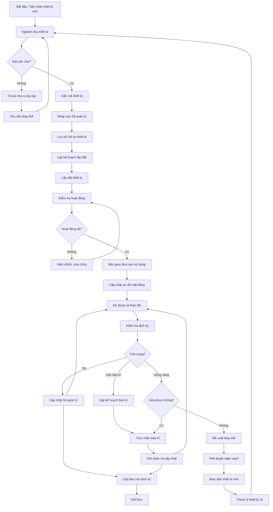

# SOP-01.2: QUẢN LÝ THIẾT BỊ PCCC

## 1. THÔNG TIN QUY TRÌNH

| **Thuộc tính** | **Nội dung** |
|---|---|
| Mã SOP | SOP-01.2 |
| Tên quy trình | Quản lý thiết bị Phòng cháy chữa cháy |
| Quy trình cha | SOP-01: Quản lý PCCC |
| Phiên bản | 1.0 |
| Ngày ban hành | [Ngày/Tháng/Năm] |
| Người phê duyệt | Hiệu trưởng |
| Phạm vi áp dụng | Toàn bộ thiết bị PCCC trong trường |
| Chu kỳ cập nhật | Liên tục (theo diễn biến thực tế) |

## 2. MỤC ĐÍCH

Quy trình này thiết lập hệ thống quản lý toàn diện các thiết bị PCCC nhằm:

- **Kiểm soát tài sản**: Theo dõi đầy đủ số lượng, vị trí, tình trạng của từng thiết bị PCCC
- **Đảm bảo sẵn sàng**: Thiết bị luôn trong trạng thái hoạt động tốt, sẵn sàng sử dụng
- **Quản lý vòng đời**: Theo dõi từ khi mua sắm, lắp đặt, bảo trì đến khi thanh lý
- **Tối ưu chi phí**: Lập kế hoạch mua sắm, bảo trì hợp lý, tránh lãng phí
- **Tuân thủ quy định**: Đáp ứng yêu cầu về hồ sơ thiết bị PCCC theo pháp luật
- **Truy xuất nguồn gốc**: Dễ dàng tra cứu lịch sử, nhà cung cấp, bảo hành của thiết bị

## 3. PHẠM VI ÁP DỤNG

### 3.1. Danh mục thiết bị quản lý

| **Nhóm thiết bị** | **Chi tiết** | **Số lượng** | **Giá trị ước tính** |
|---|---|---|---|
| **Bình chữa cháy** | Bình CO2, bột, foam các loại | [Điền số] | [Điền số] VNĐ |
| **Hệ thống báo cháy** | Tủ trung tâm, đầu báo, còi, nút nhấn | [Điền số] | [Điền số] VNĐ |
| **Hệ thống sprinkler** | Đầu phun, van, bơm, bồn nước | [Điền số] | [Điền số] VNĐ |
| **Vòi chữa cháy** | Vòi, ống bố, tủ đựng, van | [Điền số] | [Điền số] VNĐ |
| **Thiết bị thoát hiểm** | Đèn Exit, đèn sự cố, biển chỉ dẫn | [Điền số] | [Điền số] VNĐ |
| **Thiết bị phụ trợ** | Thang thoát hiểm, mặt nạ phòng độc, áo chống cháy | [Điền số] | [Điền số] VNĐ |
| **Hệ thống phát thanh** | Micro, loa, trung tâm xử lý | 1 hệ thống | [Điền số] VNĐ |

### 3.2. Đối tượng thực hiện

- **Chủ trì**: Trưởng phòng An toàn - Bảo vệ
- **Thực hiện**: Nhân viên kỹ thuật, Thủ kho thiết bị
- **Phối hợp**: Phòng Tài chính (ngân sách), Phòng Hành chính (mua sắm)
- **Giám sát**: Phó Hiệu trưởng phụ trách

## 4. QUY TRÌNH THỰC HIỆN

### 4.1. Tiếp nhận và đăng ký thiết bị mới

**Bước 1: Nghiệm thu thiết bị mới**

Khi có thiết bị PCCC mới (mua mới hoặc thay thế), thực hiện nghiệm thu:

| **Hạng mục kiểm tra** | **Tiêu chí** | **Ghi chú** |
|---|---|---|
| Hồ sơ thiết bị | Giấy chứng nhận, hướng dẫn sử dụng, tem kiểm định | Bản gốc hoặc bản sao có xác nhận |
| Ngoại quan | Không bị hư hỏng, trầy xước, móp méo | Chụp ảnh minh chứng |
| Số lượng | Đúng theo hợp đồng/đơn hàng | Đối chiếu với phiếu giao hàng |
| Thông số kỹ thuật | Đúng yêu cầu kỹ thuật, tiêu chuẩn Việt Nam | Kiểm tra nhãn mác, tem kiểm định |
| Phụ kiện | Đầy đủ phụ tùng, dụng cụ lắp đặt | Theo danh mục nhà sản xuất |
| Bảo hành | Thời gian và điều kiện bảo hành rõ ràng | Có phiếu bảo hành chính thức |

**Bước 2: Gắn mã thiết bị và nhập kho**

- Gắn mã định danh cho thiết bị (mã QR code hoặc tem số)
  - Cấu trúc mã: **TB-PCCC-[Loại]-[Số thứ tự]-[Năm]**
  - Ví dụ: TB-PCCC-BCH-001-2024 (Bình chữa cháy số 1 năm 2024)
- Nhập thông tin vào Sổ quản lý thiết bị PCCC (Form QT01-F05)
- Chụp ảnh thiết bị, lưu vào hồ sơ điện tử
- Lập phiếu nhập kho thiết bị

**Bước 3: Lưu trữ hồ sơ thiết bị**

Tạo hồ sơ cho mỗi thiết bị, bao gồm:
- Thông tin chung (tên, mã, loại, nhà sản xuất, nhà cung cấp)
- Hợp đồng mua bán, phiếu nghiệm thu
- Hướng dẫn sử dụng, bảo trì
- Giấy chứng nhận chất lượng, tem kiểm định
- Phiếu bảo hành
- Lịch sử kiểm tra, bảo trì (cập nhật liên tục)

### 4.2. Lắp đặt và đưa vào sử dụng

**Bước 4: Lập kế hoạch lắp đặt**

- Xác định vị trí lắp đặt theo thiết kế PCCC
- Phân công nhân viên hoặc thuê đơn vị chuyên nghiệp
- Chuẩn bị công cụ, vật tư phụ trợ
- Thông báo cho các bộ phận có liên quan

**Bước 5: Lắp đặt và kiểm tra hoạt động**

- Lắp đặt theo đúng hướng dẫn của nhà sản xuất
- Kiểm tra kết nối (điện, nước, tín hiệu)
- Thử nghiệm hoạt động ban đầu
- Hiệu chỉnh, tinh chỉnh nếu cần
- Làm biển chỉ dẫn, dán tem "Đã nghiệm thu"

**Bước 6: Bàn giao đưa vào sử dụng**

- Lập biên bản bàn giao thiết bị
- Hướng dẫn sử dụng cho người phụ trách khu vực
- Cập nhật sơ đồ mặt bằng thiết bị PCCC
- Đưa vào danh sách kiểm tra định kỳ

### 4.3. Quản lý và theo dõi trong quá trình sử dụng

**Bước 7: Cập nhật thông tin thiết bị**

Liên tục cập nhật các thông tin sau vào Sổ quản lý thiết bị:

| **Loại thông tin** | **Nội dung** | **Tần suất cập nhật** |
|---|---|---|
| Tình trạng hoạt động | Tốt / Cần bảo trì / Hỏng | Sau mỗi lần kiểm tra |
| Lịch sử kiểm tra | Ngày kiểm tra, kết quả, người kiểm tra | Hàng tháng/quý |
| Lịch sử bảo trì | Ngày bảo trì, nội dung, chi phí | Mỗi lần bảo trì |
| Lịch sử sự cố | Ngày phát hiện, mô tả, xử lý | Khi có sự cố |
| Thay thế linh kiện | Linh kiện nào, ngày thay, chi phí | Mỗi lần thay thế |
| Bảo hành | Tình trạng bảo hành, ngày hết hạn | Định kỳ 6 tháng |

**Bước 8: Kiểm tra và đánh giá định kỳ**

- Kiểm tra tình trạng thiết bị theo SOP-01.1
- Đánh giá hiệu quả hoạt động
- Xác định thiết bị cần bảo trì hoặc thay thế
- Báo cáo cho Trưởng phòng An toàn

**Bước 9: Lập kế hoạch bảo trì**

Dựa trên kết quả kiểm tra, lập kế hoạch bảo trì:
- Danh sách thiết bị cần bảo trì
- Nội dung công việc cụ thể
- Thời gian dự kiến thực hiện
- Dự trù chi phí
- Đơn vị thực hiện (nội bộ hoặc thuê ngoài)

### 4.4. Bảo trì và sửa chữa

**Bước 10: Thực hiện bảo trì**

Bảo trì thiết bị theo 3 loại:

| **Loại bảo trì** | **Mô tả** | **Tần suất** | **Người thực hiện** |
|---|---|---|---|
| **Bảo trì phòng ngừa** | Vệ sinh, kiểm tra, điều chỉnh định kỳ | Theo kế hoạch | Nhân viên kỹ thuật |
| **Bảo trì khắc phục** | Sửa chữa khi phát hiện hỏng hóc | Khi cần thiết | Nhân viên kỹ thuật hoặc đơn vị chuyên nghiệp |
| **Bảo trì cải tiến** | Nâng cấp, thay thế công nghệ mới | Theo nhu cầu | Đơn vị chuyên nghiệp |

**Bước 11: Ghi nhận và cập nhật**

Sau mỗi lần bảo trì:
- Lập phiếu bảo trì thiết bị (Form QT01-F06)
- Cập nhật vào Sổ quản lý thiết bị
- Dán tem "Đã bảo trì" lên thiết bị
- Chụp ảnh trước và sau bảo trì
- Lưu hóa đơn, chứng từ chi phí

### 4.5. Thay thế và thanh lý

**Bước 12: Xác định thiết bị cần thay thế**

Thiết bị cần thay thế khi:
- Hết hạn sử dụng (theo quy định)
- Hư hỏng nghiêm trọng, không sửa chữa được
- Chi phí sửa chữa > 70% giá trị thiết bị mới
- Không còn phụ tùng thay thế
- Lạc hậu công nghệ, không đáp ứng tiêu chuẩn mới

**Bước 13: Trình phê duyệt và mua sắm**

- Lập Phiếu đề xuất thay thế thiết bị (Form QT01-F07)
- Trình Ban Giám hiệu phê duyệt ngân sách
- Phối hợp với Phòng Hành chính mua sắm
- Theo dõi tiến độ giao hàng

**Bước 14: Thanh lý thiết bị cũ**

- Lập biên bản thanh lý thiết bị
- Tháo gỡ thiết bị cũ an toàn
- Cập nhật trạng thái "Đã thanh lý" trong Sổ quản lý
- Xử lý thiết bị theo quy định (bán phế liệu, tái chế)
- Lưu giữ hồ sơ thanh lý

### 4.6. Báo cáo và tổng hợp

**Bước 15: Lập báo cáo quản lý thiết bị**

Định kỳ lập các báo cáo sau:

| **Loại báo cáo** | **Nội dung** | **Tần suất** | **Người nhận** |
|---|---|---|---|
| Báo cáo tồn kho thiết bị | Số lượng, giá trị, tình trạng | Hàng quý | Ban Giám hiệu, Phòng Tài chính |
| Báo cáo bảo trì | Tổng hợp công việc bảo trì, chi phí | Hàng tháng | Trưởng phòng An toàn |
| Báo cáo thiết bị hỏng | Danh sách thiết bị hỏng, nguyên nhân | Khi có sự cố | Ban Giám hiệu |
| Báo cáo dự trù mua sắm | Nhu cầu mua sắm năm sau | Hàng năm | Ban Giám hiệu, Phòng Tài chính |

## 5. LƯU ĐỒ QUY TRÌNH



## 6. BIỂU MẪU LIÊN QUAN

| **Mã biểu mẫu** | **Tên biểu mẫu** | **Mục đích** |
|---|---|---|
| QT01-F05 | Sổ quản lý thiết bị PCCC | Theo dõi toàn bộ thiết bị từ A-Z |
| QT01-F06 | Phiếu bảo trì thiết bị PCCC | Ghi nhận công việc bảo trì |
| QT01-F07 | Phiếu đề xuất thay thế thiết bị | Đề xuất mua sắm, thay thế |
| QT01-F08 | Biên bản nghiệm thu thiết bị | Nghiệm thu khi mua mới |
| QT01-F09 | Biên bản thanh lý thiết bị | Thanh lý thiết bị hỏng, cũ |
| QT01-F10 | Phiếu yêu cầu sửa chữa khẩn cấp | Báo cáo thiết bị hỏng đột xuất |
| QT01-R02 | Báo cáo tồn kho thiết bị PCCC | Báo cáo định kỳ cho lãnh đạo |

## 7. TIÊU CHUẨN VÀ CHỈ TIÊU

| **Chỉ tiêu** | **Mục tiêu** | **Phương pháp đo** |
|---|---|---|
| Tỷ lệ thiết bị có hồ sơ đầy đủ | 100% | Số thiết bị có hồ sơ / Tổng số thiết bị × 100% |
| Tỷ lệ thiết bị hoạt động tốt | ≥ 95% | Số thiết bị tốt / Tổng số thiết bị × 100% |
| Thời gian xử lý thiết bị hỏng | ≤ 48 giờ | Từ phát hiện đến hoàn thành sửa chữa/thay thế |
| Tỷ lệ thiết bị được bảo trì đúng hạn | 100% | Số thiết bị bảo trì đúng hạn / Tổng số × 100% |
| Độ chính xác dữ liệu | ≥ 98% | Kiểm tra thực tế vs Sổ quản lý |
| Chi phí bảo trì/Giá trị thiết bị | ≤ 10%/năm | Tổng chi phí bảo trì / Giá trị thiết bị × 100% |

## 8. TRÁCH NHIỆM CỤ THỂ

| **Vai trò** | **Trách nhiệm** |
|---|---|
| **Trưởng phòng An toàn** | - Phê duyệt kế hoạch mua sắm, bảo trì<br>- Giám sát việc quản lý thiết bị<br>- Ký duyệt các báo cáo<br>- Quyết định thanh lý thiết bị |
| **Nhân viên kỹ thuật** | - Cập nhật Sổ quản lý thiết bị hàng ngày<br>- Thực hiện bảo trì định kỳ<br>- Kiểm tra tình trạng thiết bị<br>- Lập phiếu đề xuất sửa chữa/thay thế |
| **Thủ kho thiết bị** | - Quản lý kho phụ tùng, linh kiện<br>- Nhập/xuất thiết bị theo quy trình<br>- Lưu trữ hồ sơ thiết bị<br>- Kiểm kê định kỳ |
| **Phòng Tài chính** | - Phân bổ ngân sách mua sắm, bảo trì<br>- Thanh toán chi phí<br>- Theo dõi giá trị tài sản PCCC<br>- Báo cáo tài chính |
| **Phòng Hành chính** | - Thực hiện đấu thầu, mua sắm<br>- Ký hợp đồng với nhà cung cấp<br>- Theo dõi bảo hành<br>- Xử lý thanh lý |

## 9. LƯU Ý QUAN TRỌNG

### 9.1. Nguyên tắc quản lý

- ✅ **Mỗi thiết bị phải có mã định danh duy nhất** - Không trùng lặp
- ✅ **Cập nhật thông tin ngay sau mỗi thay đổi** - Không được trễ hạn
- ✅ **Lưu trữ hồ sơ song song** - Cả giấy tờ và điện tử
- ✅ **Bảo mật thông tin thiết bị** - Không để lộ ra bên ngoài
- ✅ **Sao lưu dữ liệu định kỳ** - Tránh mất mát thông tin

### 9.2. Xử lý tình huống đặc biệt

| **Tình huống** | **Xử lý** |
|---|---|
| Thiết bị bị mất hoặc bị đánh cắp | Báo cáo công an, lập biên bản, cập nhật "Mất" trong Sổ quản lý |
| Thiết bị hỏng trong thời gian bảo hành | Liên hệ nhà cung cấp, yêu cầu bảo hành, theo dõi tiến độ |
| Phát hiện thiết bị không đúng tiêu chuẩn | Ngừng sử dụng ngay, yêu cầu đổi trả, báo cáo cơ quan chức năng |
| Thay đổi vị trí thiết bị | Cập nhật sơ đồ mặt bằng, thông báo cho toàn trường |
| Nhận thiết bị tài trợ | Nghiệm thu kỹ, nhập quản lý như thiết bị mua mới |

### 9.3. Bảo quản thiết bị

**Điều kiện bảo quản tốt:**
- Nhiệt độ: 10-35°C, độ ẩm: 40-70%
- Không tiếp xúc trực tiếp với ánh nắng, mưa
- Tránh va chạm mạnh, rung lắc
- Không để gần hóa chất ăn mòn
- Kiểm tra định kỳ khi không sử dụng

**Kho lưu trữ phụ tùng:**
- Có sổ nhập/xuất kho rõ ràng
- Sắp xếp theo loại, dễ tìm kiếm
- Kiểm kê hàng tháng
- Đảm bảo đủ phụ tùng thay thế khẩn cấp

## 10. PHỤ LỤC

### 10.1. Mẫu thẻ thiết bị (gắn lên thiết bị)

```
┌─────────────────────────────┐
│    THIẾT BỊ PCCC TRƯỜNG    │
│      [Tên trường]          │
├─────────────────────────────┤
│ Mã thiết bị: TB-PCCC-___   │
│ Tên thiết bị: ____________  │
│ Ngày lắp đặt: ___/___/___   │
│ Hạn kiểm định: ___/___/___  │
│ Liên hệ sự cố: [Số ĐT]     │
└─────────────────────────────┘
   [QR Code]
```

### 10.2. Cấu trúc Sổ quản lý thiết bị PCCC

| **Cột** | **Nội dung** |
|---|---|
| STT | Số thứ tự |
| Mã TB | Mã định danh thiết bị |
| Tên TB | Tên đầy đủ thiết bị |
| Loại | Nhóm thiết bị (bình chữa cháy, báo cháy...) |
| Nhà SX | Hãng sản xuất |
| Model | Ký hiệu model |
| Năm SX | Năm sản xuất |
| Vị trí | Tòa nhà, tầng, phòng |
| Ngày mua | Ngày mua hoặc nhận |
| Giá trị | Giá trị tài sản (VNĐ) |
| NCC | Nhà cung cấp |
| BH đến | Ngày hết hạn bảo hành |
| KĐ đến | Ngày hết hạn kiểm định |
| Tình trạng | Tốt / Cần BT / Hỏng |
| Ghi chú | Thông tin bổ sung |

### 10.3. Checklist kiểm kê thiết bị PCCC (hàng quý)

- [ ] Đối chiếu số lượng thực tế với Sổ quản lý
- [ ] Kiểm tra vị trí đặt thiết bị (có thay đổi không?)
- [ ] Kiểm tra tình trạng tem, mã thiết bị (có rõ ràng không?)
- [ ] Kiểm tra hạn kiểm định, bảo hành (có còn hiệu lực?)
- [ ] Rà soát thiết bị hỏng chưa xử lý
- [ ] Cập nhật thông tin thay đổi
- [ ] Lập báo cáo kiểm kê

### 10.4. Vòng đời thiết bị PCCC

```
Mua sắm → Nghiệm thu → Nhập kho → Lắp đặt → Sử dụng
    ↑                                          ↓
    ←─────── Thanh lý ←──── Hỏng nặng ←─── Bảo trì
```

## 11. CÂU HỎI THƯỜNG GẶP (FAQ)

**Q1: Phải làm gì khi phát hiện thiết bị mất mã định danh?**  
A: Gắn lại mã mới, cập nhật thông tin, thông báo cho Trưởng phòng An toàn để rà soát.

**Q2: Thiết bị hết bảo hành có cần cập nhật vào Sổ quản lý không?**  
A: Có, phải cập nhật ngày hết bảo hành để theo dõi chi phí sửa chữa sau này.

**Q3: Ai được phép xuất thiết bị từ kho?**  
A: Chỉ Thủ kho hoặc người được ủy quyền, phải có Phiếu xuất kho có chữ ký phê duyệt.

**Q4: Thiết bị tài trợ có cần quản lý như thiết bị mua không?**  
A: Có, hoàn toàn giống nhau, chỉ khác ở nguồn kinh phí (ghi "Tài trợ" trong Ghi chú).

**Q5: Bao lâu kiểm kê thiết bị một lần?**  
A: Kiểm kê toàn bộ hàng quý, kiểm kê đột xuất khi phát hiện mất mát hoặc có yêu cầu.

---

**PHÊ DUYỆT**

| Người soạn thảo | Trưởng phòng An toàn | Hiệu trưởng |
|---|---|---|
| [Họ tên] | [Họ tên] | [Họ tên] |
| Ngày: ___/___/___ | Ngày: ___/___/___ | Ngày: ___/___/___ |

---
*Tài liệu này là tài liệu nội bộ, không được sao chép và phổ biến ra bên ngoài.*
