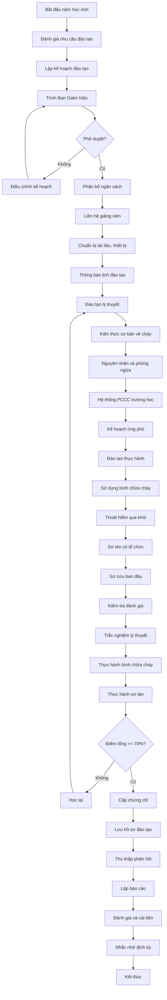

# SOP-01.3: HUẤN LUYỆN NHÂN VIÊN PCCC

## 1. THÔNG TIN QUY TRÌNH

| **Thuộc tính** | **Nội dung** |
|---|---|
| Mã SOP | SOP-01.3 |
| Tên quy trình | Huấn luyện nhân viên Phòng cháy chữa cháy |
| Quy trình cha | SOP-01: Quản lý PCCC |
| Phiên bản | 1.0 |
| Ngày ban hành | [Ngày/Tháng/Năm] |
| Người phê duyệt | Hiệu trưởng |
| Phạm vi áp dụng | Toàn bộ cán bộ, giáo viên, nhân viên |
| Tần suất đào tạo | 6 tháng/lần (bắt buộc), Hàng năm (toàn trường) |

## 2. MỤC ĐÍCH

Quy trình này thiết lập hệ thống đào tạo, huấn luyện PCCC toàn diện nhằm:

- **Nâng cao nhận thức**: Giúp mọi người hiểu rõ tầm quan trọng của PCCC và trách nhiệm cá nhân
- **Trang bị kiến thức**: Cung cấp kiến thức cơ bản về phòng cháy, nguyên nhân cháy, cách phòng ngừa
- **Rèn luyện kỹ năng**: Thực hành sử dụng thiết bị PCCC, sơ tán, cứu hộ cơ bản
- **Xây dựng phản xạ**: Tạo phản ứng tự động, nhanh nhạy khi có cháy nổ
- **Tuân thủ quy định**: Đáp ứng yêu cầu đào tạo PCCC theo Luật PCCC 2001
- **Giảm thiểu thiệt hại**: Ứng phó kịp thời, đúng cách để giảm thiệt hại về người và tài sản

## 3. PHẠM VI ÁP DỤNG

### 3.1. Đối tượng đào tạo

| **Nhóm đối tượng** | **Yêu cầu đào tạo** | **Cấp độ** | **Tần suất** |
|---|---|---|---|
| **Ban Giám hiệu** | Quản lý an toàn, ra quyết định khẩn cấp | Nâng cao | Hàng năm |
| **Trưởng phòng An toàn** | Chuyên sâu PCCC, huấn luyện viên | Chuyên nghiệp | 6 tháng/lần |
| **Giáo viên** | Sơ tán học sinh, sử dụng bình chữa cháy | Cơ bản + | Hàng năm |
| **Nhân viên bảo vệ** | Phát hiện cháy, báo động, hỗ trợ dập cháy | Trung cấp | 6 tháng/lần |
| **Nhân viên bếp** | Phòng cháy bếp, xử lý cháy dầu mỡ | Chuyên môn | 6 tháng/lần |
| **Nhân viên kỹ thuật** | Bảo trì thiết bị, xử lý sự cố kỹ thuật | Trung cấp | 6 tháng/lần |
| **Nhân viên hành chính** | Kiến thức cơ bản, thoát hiểm | Cơ bản | Hàng năm |
| **Học sinh** | Nhận biết nguy hiểm, thoát hiểm an toàn | Phổ thông | Hàng năm |

### 3.2. Nội dung đào tạo phân cấp

**Cấp độ Cơ bản (2 giờ):**
- Kiến thức về lửa và cháy
- Nguyên nhân cháy thường gặp
- Biển báo PCCC
- Lối thoát hiểm
- Cách gọi 114

**Cấp độ Trung cấp (4 giờ):**
- Nội dung cơ bản +
- Sử dụng bình chữa cháy
- Hỗ trợ sơ tán
- Sơ cứu ban đầu
- Thực hành dập cháy

**Cấp độ Nâng cao (8 giờ):**
- Nội dung trung cấp +
- Quản lý tình huống khẩn cấp
- Điều phối sơ tán
- Phối hợp với lực lượng PCCC
- Đánh giá rủi ro

**Cấp độ Chuyên nghiệp (16+ giờ):**
- Nội dung nâng cao +
- Huấn luyện viên PCCC
- Thiết kế kế hoạch PCCC
- Audit an toàn PCCC
- Cấp chứng chỉ

## 4. QUY TRÌNH THỰC HIỆN

### 4.1. Lập kế hoạch đào tạo hàng năm

**Bước 1: Đánh giá nhu cầu đào tạo**

Trưởng phòng An toàn thực hiện đánh giá:
- Rà soát danh sách nhân viên mới (chưa đào tạo)
- Kiểm tra nhân viên đã đào tạo (hết hạn chứng chỉ)
- Xác định nhóm cần đào tạo nâng cao
- Phân tích sự cố năm trước (thiếu kỹ năng gì?)
- Yêu cầu mới từ cơ quan quản lý

**Bước 2: Xây dựng kế hoạch đào tạo**

Lập kế hoạch chi tiết bao gồm:

| **Thông tin** | **Nội dung** |
|---|---|
| Mục tiêu | Số lượng người đào tạo, tỷ lệ đạt chứng chỉ |
| Đối tượng | Danh sách cụ thể từng nhóm |
| Nội dung | Chương trình đào tạo chi tiết |
| Thời gian | Lịch đào tạo cụ thể (ngày, giờ, địa điểm) |
| Giảng viên | Nội bộ hoặc mời chuyên gia |
| Ngân sách | Chi phí giảng viên, tài liệu, thiết bị, chứng chỉ |
| Thiết bị | Bình chữa cháy tập huấn, projector, tài liệu |

**Bước 3: Phê duyệt và triển khai**

- Trình Ban Giám hiệu phê duyệt kế hoạch và ngân sách
- Liên hệ giảng viên (Cảnh sát PCCC hoặc đơn vị có chứng chỉ)
- Chuẩn bị địa điểm, tài liệu, thiết bị
- Thông báo lịch đào tạo cho toàn trường (trước 2 tuần)

### 4.2. Chuẩn bị đào tạo

**Bước 4: Chuẩn bị tài liệu và thiết bị**

*Tài liệu:*
- Giáo trình PCCC (in hoặc điện tử)
- Slide bài giảng
- Video minh họa cháy nổ
- Sơ đồ thoát hiểm trường học
- Biểu mẫu điểm danh, đánh giá

*Thiết bị:*
- Bình chữa cháy training (có thể nạp lại)
- Khay đốt lửa tập dập cháy
- Mô hình sơ tán
- Micro, loa, projector
- Dụng cụ sơ cứu

**Bước 5: Chuẩn bị địa điểm**

- Phòng lý thuyết: Sân khấu, bàn ghế, điều hòa
- Khu thực hành: Sân thoáng, có nước, an toàn
- Kiểm tra thiết bị âm thanh, ánh sáng
- Chuẩn bị nước uống, bảng tên
- Bố trí bảo vệ, y tế hỗ trợ

### 4.3. Thực hiện đào tạo

**Bước 6: Đào tạo lý thuyết (40-50%)**

*Nội dung chính:*

1. **Kiến thức cơ bản về cháy (30 phút)**
   - Tam giác lửa: nhiên liệu + oxy + nhiệt
   - Các giai đoạn cháy
   - Phân loại cháy (A, B, C, D, E)
   - Sản phẩm cháy độc hại

2. **Nguyên nhân cháy phổ biến (30 phút)**
   - Chập điện, quá tải
   - Sơ suất con người
   - Cháy do thiên tai
   - Cháy từ bếp ăn
   - Trường hợp thực tế

3. **Biện pháp phòng ngừa (30 phút)**
   - 5 không (không để nguồn lửa, không để dễ cháy...)
   - Kiểm tra định kỳ
   - Phân công trách nhiệm
   - Nội quy an toàn

4. **Hệ thống PCCC trường học (30 phút)**
   - Sơ đồ mặt bằng thiết bị
   - Lối thoát hiểm
   - Điểm tập trung
   - Hệ thống báo động
   - Các đội ứng phó

5. **Kế hoạch ứng phó khẩn cấp (30 phút)**
   - Quy trình báo cháy
   - Vai trò từng người
   - Cách sơ tán học sinh
   - Liên lạc khẩn cấp

**Bước 7: Đào tạo thực hành (50-60%)**

*Nội dung thực hành:*

1. **Sử dụng bình chữa cháy (60 phút)**
   - Giới thiệu các loại bình
   - Cách nhận biết bình còn áp
   - Quy tắc P.A.S.S:
     - **P**ull (kéo chốt an toàn)
     - **A**im (ngắm đáy đám cháy)
     - **S**queeze (bóp cò phun)
     - **S**weep (quét từ trái sang phải)
   - Mỗi người thực hành 1 lần

2. **Thoát hiểm qua khói (30 phút)**
   - Tư thế cúi thấp, che mũi
   - Sờ cửa trước khi mở
   - Đi sát tường
   - Không dùng thang máy
   - Mô phỏng trong phòng tối

3. **Sơ tán có tổ chức (45 phút)**
   - Giáo viên điểm danh
   - Dẫn học sinh theo hàng
   - Giữ trật tự, không hoảng loạn
   - Tập trung tại điểm an toàn
   - Báo cáo số người
   - Thực hành toàn trường

4. **Sơ cứu ban đầu (30 phút)**
   - Xử lý bỏng
   - Xử lý hít phải khói
   - Xử lý ngạt khí
   - Tư thế hồi sức
   - CPR cơ bản (nếu có thời gian)

**Bước 8: Kiểm tra đánh giá**

Đánh giá kết quả học viên:

| **Hình thức** | **Nội dung** | **Tiêu chí đạt** | **Tỷ trọng** |
|---|---|---|---|
| Trắc nghiệm lý thuyết | 20 câu hỏi, 30 phút | ≥ 16/20 câu đúng | 40% |
| Thực hành bình chữa cháy | Sử dụng đúng quy trình P.A.S.S | Hoàn thành độc lập | 30% |
| Thực hành sơ tán | Thoát đúng lối, đúng tư thế | Hoàn thành an toàn | 20% |
| Thái độ học tập | Tham gia tích cực | Đầy đủ, nghiêm túc | 10% |

**Điểm tổng ≥ 70%: Đạt → Cấp chứng chỉ**  
**Điểm < 70%: Không đạt → Học lại**

### 4.4. Sau đào tạo

**Bước 9: Cấp chứng chỉ và lưu hồ sơ**

- Cấp Chứng chỉ huấn luyện PCCC (Form QT01-CC01)
- Thông tin: Họ tên, ngày đào tạo, cấp độ, ngày hết hạn
- Chứng chỉ có giá trị 2 năm
- Lưu danh sách học viên vào Sổ đào tạo PCCC
- Lưu bài kiểm tra, ảnh thực hành
- Cập nhật hồ sơ cá nhân nhân viên

**Bước 10: Đánh giá và cải tiến**

- Thu thập phản hồi từ học viên (Form QT01-F11)
- Đánh giá chất lượng giảng viên
- Phân tích tỷ lệ đạt/không đạt
- Xác định điểm cần cải thiện
- Cập nhật nội dung cho lần sau

**Bước 11: Lập báo cáo đào tạo**

Báo cáo gửi Ban Giám hiệu bao gồm:
- Thời gian, địa điểm, giảng viên
- Số lượng học viên tham gia
- Tỷ lệ đạt/không đạt
- Chi phí thực tế
- Đánh giá chung
- Kế hoạch đào tạo tiếp theo
- Ảnh minh chứng

### 4.5. Đào tạo bổ sung và duy trì

**Bước 12: Nhắc nhở định kỳ**

- Gửi email nhắc nhở kiến thức PCCC (hàng tháng)
- Tổ chức mini-game PCCC (hàng quý)
- Treo poster, video clip về PCCC
- Chia sẻ tin tức cháy nổ để rút kinh nghiệm

**Bước 13: Đào tạo nhân viên mới**

- Đào tạo PCCC trong chương trình Onboarding
- Thời gian: 2 giờ (lý thuyết + thực hành cơ bản)
- Hoàn thành trước khi bắt đầu làm việc chính thức
- Cấp chứng chỉ tạm thời, tham gia đào tạo chính thức sau

## 5. LƯU ĐỒ QUY TRÌNH



## 6. BIỂU MẪU LIÊN QUAN

| **Mã biểu mẫu** | **Tên biểu mẫu** | **Mục đích** |
|---|---|---|
| QT01-F11 | Danh sách học viên đào tạo PCCC | Điểm danh, theo dõi tham gia |
| QT01-F12 | Đề kiểm tra lý thuyết PCCC | Đánh giá kiến thức |
| QT01-F13 | Phiếu đánh giá thực hành | Đánh giá kỹ năng |
| QT01-F14 | Phiếu phản hồi đào tạo | Thu thập ý kiến học viên |
| QT01-CC01 | Chứng chỉ huấn luyện PCCC | Xác nhận hoàn thành đào tạo |
| QT01-F15 | Sổ theo dõi đào tạo PCCC | Lưu lịch sử đào tạo cá nhân |
| QT01-R03 | Báo cáo đào tạo PCCC | Báo cáo cho Ban Giám hiệu |

## 7. TIÊU CHUẨN VÀ CHỈ TIÊU

| **Chỉ tiêu** | **Mục tiêu** | **Phương pháp đo** |
|---|---|---|
| Tỷ lệ nhân viên được đào tạo | 100% | Số người đào tạo / Tổng số nhân viên × 100% |
| Tỷ lệ đạt chứng chỉ | ≥ 95% | Số người đạt / Số người tham gia × 100% |
| Điểm trung bình lý thuyết | ≥ 85/100 | Tổng điểm / Số học viên |
| Tỷ lệ thực hành đạt | 100% | Số người thực hành đạt / Tổng số × 100% |
| Độ hài lòng đào tạo | ≥ 90% | Khảo sát phản hồi |
| Chi phí đào tạo/người | ≤ 200,000 VNĐ | Tổng chi phí / Số học viên |

## 8. TRÁCH NHIỆM CỤ THỂ

| **Vai trò** | **Trách nhiệm** |
|---|---|
| **Trưởng phòng An toàn** | - Lập kế hoạch đào tạo hàng năm<br>- Liên hệ giảng viên<br>- Tổ chức và điều phối đào tạo<br>- Cấp chứng chỉ<br>- Lập báo cáo |
| **Giảng viên PCCC** | - Giảng dạy lý thuyết<br>- Hướng dẫn thực hành<br>- Kiểm tra đánh giá<br>- Tư vấn kỹ thuật |
| **Phó Hiệu trưởng** | - Phê duyệt kế hoạch<br>- Phân bổ ngân sách<br>- Giám sát chất lượng đào tạo |
| **Giáo viên, Nhân viên** | - Tham gia đầy đủ, đúng giờ<br>- Học tập nghiêm túc<br>- Thực hành tích cực<br>- Áp dụng vào công việc |
| **Phòng Hành chính** | - Hỗ trợ chuẩn bị địa điểm<br>- In tài liệu, chứng chỉ<br>- Thanh toán chi phí |

## 9. LƯU Ý QUAN TRỌNG

### 9.1. An toàn khi thực hành

- ⚠️ **Thực hành dập cháy phải ở khu vực an toàn** - Xa nhà kho, cây xanh
- ⚠️ **Có bình chữa cháy dự phòng** - Phòng trường hợp cháy lan
- ⚠️ **Nhân viên y tế phải có mặt** - Sơ cứu khi bị bỏng, ngạt khói
- ⚠️ **Không ép học viên sợ cao leo thang** - Tôn trọng giới hạn cá nhân
- ⚠️ **Kiểm tra bình chữa cháy trước khi dùng** - Tránh bình hỏng, nguy hiểm

### 9.2. Đảm bảo chất lượng

**Lựa chọn giảng viên:**
- Ưu tiên giảng viên từ Cảnh sát PCCC
- Giảng viên phải có chứng chỉ huấn luyện viên PCCC
- Có kinh nghiệm giảng dạy cho trường học
- Phương pháp giảng dạy sinh động, thực tế

**Nội dung đào tạo:**
- Cập nhật theo quy định mới nhất
- Sử dụng video, hình ảnh thực tế
- Liên hệ với tình huống trường học cụ thể
- Tránh lý thuyết khô khan

**Thực hành:**
- Mỗi người phải thực hành ít nhất 1 lần
- Giảng viên quan sát, sửa lỗi trực tiếp
- Ghi nhận video để ôn tập sau

### 9.3. Xử lý tình huống

| **Tình huống** | **Xử lý** |
|---|---|---|
| Học viên vắng mặt | Sắp xếp lớp bổ sung hoặc học nhóm sau |
| Học viên không đạt | Tư vấn, hỗ trợ học lại (miễn phí lần đầu) |
| Thời tiết xấu khi thực hành | Hoãn phần thực hành, bổ sung ngày khác |
| Thiết bị hỏng giữa buổi học | Dùng thiết bị dự phòng hoặc demo video |
| Học viên bị thương nhẹ | Sơ cứu ngay, báo cáo, rút kinh nghiệm |

## 10. PHỤ LỤC

### 10.1. Nội dung khung 20 câu hỏi trắc nghiệm

**Chủ đề phân bổ:**
- Kiến thức về cháy: 4 câu
- Nguyên nhân cháy: 3 câu
- Phòng ngừa cháy: 3 câu
- Thiết bị PCCC: 4 câu
- Sơ tán và thoát hiểm: 4 câu
- Sơ cứu: 2 câu

**Ví dụ câu hỏi:**

*Câu 1: Tam giác lửa bao gồm những yếu tố nào?*
- A. Nhiệt + Oxy + Ánh sáng
- B. Nhiệt + Oxy + Nhiên liệu ✅
- C. Nhiệt + Nước + Nhiên liệu
- D. Oxy + Nhiên liệu + Gió

*Câu 2: Số điện thoại báo cháy là?*
- A. 113
- B. 114 ✅
- C. 115
- D. 116

*Câu 3: Khi sử dụng bình chữa cháy, ngắm vào đâu?*
- A. Ngọn lửa
- B. Giữa đám cháy
- C. Đáy đám cháy ✅
- D. Trên cao

### 10.2. Mẫu chứng chỉ huấn luyện PCCC

```
┌────────────────────────────────────────┐
│     [Logo trường]                      │
│                                        │
│     CHỨNG CHỈ HUẤN LUYỆN PCCC         │
│                                        │
│  Chứng nhận: [Họ và tên]              │
│  Chức vụ: _________________________    │
│                                        │
│  Đã hoàn thành chương trình huấn luyện │
│  Phòng cháy chữa cháy                  │
│  Cấp độ: [Cơ bản/Trung cấp/Nâng cao]  │
│                                        │
│  Ngày đào tạo: ___/___/_______         │
│  Điểm số: ____/100                     │
│  Có giá trị đến: ___/___/_______       │
│                                        │
│  [Chữ ký Giảng viên] [Chữ ký Hiệu trưởng]│
└────────────────────────────────────────┘
```

### 10.3. Checklist chuẩn bị đào tạo

**1 tuần trước:**
- [ ] Xác nhận giảng viên
- [ ] Đặt địa điểm
- [ ] Gửi thông báo lịch đào tạo
- [ ] Đặt in tài liệu

**3 ngày trước:**
- [ ] Chuẩn bị thiết bị
- [ ] Kiểm tra projector, loa
- [ ] Nạp bình chữa cháy training
- [ ] Chuẩn bị khay đốt lửa
- [ ] Photocopy bài kiểm tra

**1 ngày trước:**
- [ ] Sắp xếp bàn ghế
- [ ] Test thiết bị âm thanh
- [ ] Chuẩn bị bảng tên, bút
- [ ] Thông báo bảo vệ, y tế
- [ ] Kiểm tra nước uống

**Trong buổi đào tạo:**
- [ ] Điểm danh học viên
- [ ] Chụp ảnh minh chứng
- [ ] Ghi nhận ý kiến
- [ ] Thu bài kiểm tra
- [ ] Cấp chứng chỉ

## 11. CÂU HỎI THƯỜNG GẶP (FAQ)

**Q1: Nhân viên mới có bắt buộc đào tạo PCCC không?**  
A: Có, bắt buộc trong vòng 1 tháng kể từ ngày nhận việc. Đào tạo sơ bộ trong Onboarding, đào tạo chính thức khi có lớp tập trung.

**Q2: Chứng chỉ PCCC có giá trị bao lâu?**  
A: 2 năm. Sau đó phải đào tạo lại để gia hạn chứng chỉ.

**Q3: Nếu không đạt có phải trả tiền học lại không?**  
A: Học lại lần đầu miễn phí. Từ lần thứ 2 trở đi thu phí 50% chi phí đào tạo.

**Q4: Có thể mời giảng viên ngoài không?**  
A: Có, nhưng phải có chứng chỉ huấn luyện viên PCCC do cơ quan có thẩm quyền cấp.

**Q5: Học sinh có cần đào tạo PCCC không?**  
A: Có, nhưng ở mức phổ thông (nhận biết nguy hiểm, thoát hiểm). Tích hợp vào giáo dục kỹ năng sống.

---

**PHÊ DUYỆT**

| Người soạn thảo | Trưởng phòng An toàn | Hiệu trưởng |
|---|---|---|
| [Họ tên] | [Họ tên] | [Họ tên] |
| Ngày: ___/___/___ | Ngày: ___/___/___ | Ngày: ___/___/___ |

---
*Tài liệu này là tài liệu nội bộ, không được sao chép và phổ biến ra bên ngoài.*
