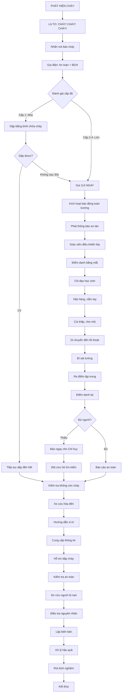

# SOP-01.4: XỬ LÝ SỰ CỐ CHÁY NỔ

## 1. THÔNG TIN QUY TRÌNH

| **Thuộc tính** | **Nội dung** |
|---|---|
| Mã SOP | SOP-01.4 |
| Tên quy trình | Xử lý sự cố cháy nổ |
| Quy trình cha | SOP-01: Quản lý PCCC |
| Phiên bản | 1.0 |
| Ngày ban hành | [Ngày/Tháng/Năm] |
| Người phê duyệt | Hiệu trưởng |
| Phạm vi áp dụng | Toàn trường - Áp dụng khi có cháy nổ |
| Mức độ ưu tiên | KHẨN CẤP - MỨC CAO NHẤT |

## 2. MỤC ĐÍCH

Quy trình này thiết lập các bước xử lý khẩn cấp khi xảy ra cháy nổ nhằm:

- **Bảo vệ tính mạng**: Ưu tiên số 1 là an toàn của học sinh, giáo viên, nhân viên
- **Dập cháy kịp thời**: Khống chế đám cháy ở giai đoạn đầu, ngăn cháy lan rộng
- **Sơ tán an toàn**: Đưa mọi người ra khỏi khu vực nguy hiểm nhanh chóng, có tổ chức
- **Cứu người bị nạn**: Sơ cứu ban đầu, đưa đi cấp cứu kịp thời
- **Giảm thiểu thiệt hại**: Bảo vệ tài sản, hạn chế tối đa thiệt hại về người và của
- **Phối hợp chuyên nghiệp**: Làm việc hiệu quả với lực lượng PCCC, y tế, công an
- **Khôi phục nhanh**: Xử lý hậu quả, điều tra nguyên nhân, rút kinh nghiệm

## 3. PHẠM VI ÁP DỤNG

### 3.1. Phân loại cấp độ cháy

| **Cấp độ** | **Đặc điểm** | **Thời gian phản ứng** | **Xử lý** |
|---|---|---|---|
| **Cấp 1 - Nhẹ** | Cháy nhỏ, trong tầm kiểm soát, diện tích < 2m² | Ngay lập tức | Dập bằng bình chữa cháy |
| **Cấp 2 - Trung bình** | Cháy lan nhanh, 2-10m², có khói nhiều | < 3 phút | Dập + Báo 114 + Sơ tán 1 phần |
| **Cấp 3 - Nặng** | Cháy lan rộng > 10m², không kiểm soát được | < 1 phút | Báo 114 NGAY + Sơ tán toàn trường |
| **Cấp 4 - Nghiêm trọng** | Cháy lớn, nổ, có người bị thương | < 30 giây | Báo 114 + 115 + 113, Sơ tán khẩn cấp |

### 3.2. Vai trò trong đội ứng phó cháy

| **Vai trò** | **Người đảm nhiệm** | **Nhiệm vụ chính** |
|---|---|---|
| **Chỉ huy chung** | Hiệu trưởng hoặc Phó Hiệu trưởng | Ra quyết định, điều phối toàn bộ |
| **Đội dập cháy** | Trưởng phòng An toàn + Bảo vệ + Kỹ thuật | Dập cháy bằng thiết bị PCCC |
| **Đội sơ tán** | Giáo viên chủ nhiệm + Trợ giảng | Dẫn học sinh ra khỏi tòa nhà |
| **Đội cứu hộ** | Nhân viên y tế + Giáo viên thể dục | Sơ cứu, cứu người bị kẹt |
| **Đội liên lạc** | Nhân viên văn phòng | Gọi 114, 115, thông báo phụ huynh |
| **Đội hậu cần** | Nhân viên hành chính | Mở cổng, hướng dẫn xe cứu hỏa |
| **Đội kiểm đếm** | Tổ trưởng chuyên môn | Điểm danh, báo cáo số người |

## 4. QUY TRÌNH XỬ LÝ KHẨN CẤP

### 4.1. Phát hiện và báo động (0-60 giây)

**Bước 1: Phát hiện cháy**

Dấu hiệu cháy:
- Thấy khói, ngọn lửa
- Ngửi mùi khét, cháy
- Nghe tiếng nổ, tiếng kêu của còi báo cháy
- Nhiệt độ tăng đột ngột
- Cảm biến báo cháy kêu

**Bước 2: Báo động ngay lập tức**

Người phát hiện phải:

1. **La to "CHÁY! CHÁY!" 3 lần**
2. **Nhấn nút báo cháy thủ công** (nếu có gần)
3. **Gọi điện ngay cho:**
   - Trưởng phòng An toàn: [Số ĐT]
   - Ban Giám hiệu: [Số ĐT]
   - Tổng đài 114 (nếu cháy lớn)

**Công thức báo cháy qua điện thoại 114:**
```
"Xin chào, tôi báo cháy!
- Địa chỉ: [Tên trường đầy đủ + Số nhà + Đường]
- Vị trí cháy: [Tòa nhà nào, tầng mấy, phòng gì]
- Mức độ: [Cháy nhỏ/lớn, có khói nhiều/ít]
- Người bị nạn: [Có/không, số lượng]
- Người báo: [Họ tên + Số điện thoại]
- Đang làm gì: [Đang sơ tán học sinh]"
```

**Bước 3: Kích hoạt hệ thống báo động**

- Trưởng phòng An toàn kích hoạt còi báo động toàn trường
- Phát thông báo qua loa:
  *"Thông báo khẩn cấp! Có cháy tại [vị trí]. Toàn trường thực hiện sơ tán theo phương án. Giữ trật tự, không hoảng loạn!"*
- Lặp lại 3 lần

### 4.2. Dập cháy ban đầu (60-180 giây)

**Bước 4: Đánh giá tình huống (10 giây)**

Trả lời 4 câu hỏi:
1. Cháy cấp mấy? (1-4)
2. Có người bị kẹt không?
3. Đường thoát hiểm có an toàn không?
4. Có thể dập được không?

**Bước 5: Quyết định: Dập hay Chạy**

| **Tình huống** | **Quyết định** |
|---|---|
| Cháy nhỏ (< 2m²), không có khói nhiều, có bình chữa cháy | **DẬP** |
| Cháy lan nhanh, khói dày đặc, không có thiết bị | **CHẠY + GỌI 114** |
| Có người bị kẹt | **CỨU NGƯỜI trước, sau đó gọi 114** |
| Nghi ngờ có chất nổ, hóa chất nguy hiểm | **CHẠY NGAY + GỌI 114** |

**Bước 6: Dập cháy bằng bình chữa cháy (nếu an toàn)**

Quy tắc PASS:
- **P**ull: Kéo chốt an toàn
- **A**im: Ngắm đáy đám cháy (không ngắm ngọn lửa)
- **S**queeze: Bóp cò phun
- **S**weep: Quét từ trái sang phải

**Lưu ý:**
- Đứng cách đám cháy 2-3 mét, quay lưng về phía lối thoát
- Chỉ dập tối đa 30 giây, nếu không dập được thì chạy
- Không mở cửa đột ngột (kiểm tra nhiệt độ cửa trước)
- Dập cháy điện: TẮT ĐIỆN trước, dùng bình CO2 hoặc bột
- Dập cháy dầu mỡ: KHÔNG dùng nước, dùng bột hoặc foam

**Bước 7: Ngăn cháy lan**

Trong khi dập cháy:
- Đóng cửa các phòng xung quanh
- Tắt điều hòa, quạt (tránh cháy lan theo gió)
- Di chuyển vật dễ cháy ra xa
- Kéo rèm cửa sổ để ngăn gió

### 4.3. Sơ tán khẩn cấp (Đồng thời với dập cháy)

**Bước 8: Giáo viên chủ nhiệm điều khiển lớp**

Khi nghe báo động:

1. **Giữ bình tĩnh, trấn an học sinh**
   - "Các em bình tĩnh, cô/thầy sẽ dẫn các em ra ngoài an toàn"

2. **Điểm danh nhanh bằng mắt**
   - Ghi nhớ học sinh vắng (nếu có)

3. **Chỉ đạo học sinh**
   - Cúi thấp, che mũi bằng khăn ướt (nếu có khói)
   - Xếp hàng 2, nắm tay nhau
   - Không la hét, không chen lấn
   - Không quay lại lấy đồ

4. **Dẫn đầu sơ tán**
   - Giáo viên đi đầu, trợ giảng/học sinh lớn đi cuối
   - Đi sát tường, theo lối thoát hiểm gần nhất
   - Kiểm tra cửa trước khi mở

5. **Đưa đến điểm tập trung**
   - Điểm tập trung: [Sân trường/Khu vực quy định]
   - Cách tòa nhà cháy tối thiểu 50m
   - Điểm danh lại, báo cáo cho Chỉ huy

**Bước 9: Ưu tiên sơ tán**

Thứ tự ưu tiên:
1. **Lớp Mầm non, Mẫu giáo** (khó di chuyển)
2. **Lớp ở tầng cao** (xa lối thoát)
3. **Học sinh khuyết tật, ốm** (cần hỗ trợ đặc biệt)
4. **Các lớp còn lại** (theo gần-xa)
5. **Nhân viên văn phòng**

**Bước 10: Xử lý tình huống đặc biệt**

| **Tình huống** | **Xử lý** |
|---|---|
| Học sinh hoảng loạn | Giáo viên nắm tay, dẫn riêng |
| Khói dày, không nhìn thấy | Bò sát sàn, sờ tường đi |
| Cửa thoát bị chặn | Dùng lối thoát dự phòng, hoặc ở lại phòng, bịt kín cửa, vẫy cửa sổ |
| Học sinh bị ngã | Dừng lại, đỡ dậy, tiếp tục |
| Quần áo bốc cháy | Lăn người trên sàn, đập tắt lửa |

### 4.4. Cứu hộ và sơ cứu

**Bước 11: Cứu người bị kẹt**

Chỉ cứu khi:
- An toàn cho người cứu
- Biết chính xác vị trí nạn nhân
- Có ít nhất 2 người đi cùng

Cách cứu:
- Cúi thấp, che mũi, mang theo bình chữa cháy
- Gọi to tên nạn nhân
- Kéo/cõng ra ngoài nhanh nhất
- Nếu không cứu được, ghi nhận vị trí báo lính cứu hỏa

**Bước 12: Sơ cứu ban đầu**

*Đối với người bị bỏng:*
1. Làm mát vùng bỏng bằng nước sạch 10-15 phút
2. Không bôi kem, dầu, kem đánh răng
3. Phủ băng gạc sạch, không bóc quần áo dính vào vết bỏng
4. Gọi 115 hoặc đưa đi bệnh viện

*Đối với người hít phải khói:*
1. Đưa ra ngoài trời, thoáng khí
2. Nới lỏng quần áo
3. Nếu bất tỉnh: đặt nghiêng, kiểm tra hô hấp
4. Nếu ngừng thở: Thực hiện CPR (nếu biết)
5. Gọi 115 ngay

*Đối với người bị ngạt khí CO:*
1. Đưa ra khỏi khu vực ngay
2. Đặt nằm ngửa, nâng cao chân
3. Kiểm tra mạch, hô hấp
4. Gọi 115, cho thở oxy (nếu có)

### 4.5. Phối hợp với lực lượng cứu hỏa

**Bước 13: Đón và hướng dẫn xe cứu hỏa**

Đội hậu cần:
- Mở toang cổng chính
- Đứng ở đường lớn vẫy tay dẫn xe vào
- Chỉ rõ vị trí cháy
- Hướng dẫn đến trụ nước chữa cháy
- Cung cấp sơ đồ mặt bằng

**Bước 14: Cung cấp thông tin cho chỉ huy PCCC**

Thông tin cần cung cấp:
- Vị trí cháy chính xác
- Diện tích, mức độ cháy
- Số người đã sơ tán, số người còn bên trong (nếu có)
- Vật liệu cháy (gỗ, điện, hóa chất...)
- Các nguy hiểm khác (bình gas, hóa chất, máy móc)
- Đã làm gì (dập, sơ tán, tắt điện...)

**Bước 15: Hỗ trợ lực lượng cứu hỏa**

- Cung cấp chìa khóa các phòng
- Chỉ đường vào khu vực cháy
- Điều động nhân viên cắt điện, cấp nước
- Không can thiệp vào công việc chuyên môn
- Theo dõi lệnh của chỉ huy PCCC

### 4.6. Sau khi dập tắt cháy

**Bước 16: Kiểm đếm và báo cáo**

- Các giáo viên điểm danh lại học sinh tại điểm tập trung
- Báo cáo cho Chỉ huy: "Lớp [X], đầy đủ / thiếu [Y] em"
- Xác nhận toàn trường đã an toàn
- Liên lạc với phụ huynh nếu có học sinh bị thương

**Bước 17: Kiểm tra hiện trường**

Cùng với PCCC kiểm tra:
- Đám cháy đã tắt hoàn toàn chưa
- Còn điểm cháy âm ỉ không
- Kết cấu tòa nhà có an toàn không
- Hệ thống điện, gas có nguy hiểm không

**Chỉ cho phép vào lại khi:**
- Chỉ huy PCCC xác nhận an toàn
- Không còn khói, nhiệt
- Kết cấu nhà ổn định

**Bước 18: Điều tra nguyên nhân**

- Bảo vệ hiện trường (nếu cần điều tra)
- Phối hợp với Cảnh sát PCCC, Công an
- Thu thập chứng cứ (ảnh, video, lời khai)
- Xác định nguyên nhân
- Lập biên bản sự cố

**Bước 19: Xử lý hậu quả**

- Đưa người bị thương đi điều trị
- Tổ chức tâm lý cho học sinh bị sốc
- Đánh giá thiệt hại (người, tài sản)
- Liên hệ bảo hiểm
- Thông báo cơ quan quản lý

**Bước 20: Rút kinh nghiệm**

- Họp đánh giá sau sự cố (trong vòng 3 ngày)
- Phân tích nguyên nhân, diễn biến
- Đánh giá hiệu quả ứng phó
- Xác định sai sót, điểm cần cải thiện
- Cập nhật quy trình
- Tổ chức diễn tập lại

## 5. LƯU ĐỒ QUY TRÌNH



## 6. BIỂU MẪU LIÊN QUAN

| **Mã biểu mẫu** | **Tên biểu mẫu** | **Mục đích** |
|---|---|---|
| QT01-F16 | Biên bản sự cố cháy nổ | Ghi nhận chi tiết sự cố |
| QT01-F17 | Phiếu báo cáo điểm danh khẩn cấp | Báo cáo số người an toàn |
| QT01-F18 | Danh sách người bị nạn | Theo dõi người bị thương |
| QT01-F19 | Báo cáo thiệt hại | Đánh giá thiệt hại người + tài sản |
| QT01-F20 | Biên bản điều tra nguyên nhân | Phối hợp với cơ quan chức năng |
| QT01-R04 | Báo cáo sự cố cháy nổ | Báo cáo tổng hợp cho cấp trên |

## 7. TIÊU CHUẨN VÀ CHỈ TIÊU

| **Chỉ tiêu** | **Mục tiêu** | **Ghi chú** |
|---|---|---|
| Thời gian phát hiện → báo động | ≤ 60 giây | Quyết định sống còn |
| Thời gian bắt đầu sơ tán | ≤ 3 phút | Kể từ khi báo động |
| Thời gian sơ tán hoàn toàn | ≤ 10 phút | Toàn trường 500 người |
| Tỷ lệ điểm danh chính xác | 100% | Không sai sót |
| Tỷ lệ người bị thương | 0% | Mục tiêu tối cao |
| Thời gian xe cứu hỏa đến | 5-10 phút | Phụ thuộc khoảng cách |

## 8. TRÁCH NHIỆM CỤ THỂ

| **Vai trò** | **Trách nhiệm trong sự cố** |
|---|---|
| **Hiệu trưởng** | - Chỉ huy chung<br>- Ra quyết định chiến lược<br>- Liên hệ cơ quan chức năng<br>- Họp báo sau sự cố |
| **Trưởng phòng An toàn** | - Chỉ huy trực tiếp đội dập cháy<br>- Đánh giá tình huống<br>- Quyết định dập hay sơ tán<br>- Phối hợp với PCCC |
| **Giáo viên** | - Bảo vệ học sinh<br>- Sơ tán có tổ chức<br>- Điểm danh, báo cáo<br>- Trấn an tâm lý |
| **Bảo vệ** | - Phát hiện cháy sớm<br>- Dập cháy ban đầu<br>- Mở cổng, dẫn xe cứu hỏa<br>- Bảo vệ hiện trường |
| **Nhân viên y tế** | - Sơ cứu người bị nạn<br>- Phân loại thương tích<br>- Đưa đi cấp cứu<br>- Hỗ trợ tâm lý |

## 9. LƯU Ý QUAN TRỌNG

### 9.1. Nguyên tắc vàng khi có cháy

🔥 **3 KHÔNG:**
- **KHÔNG hoảng loạn** - Giữ bình tĩnh để suy nghĩ đúng
- **KHÔNG quay lại lấy đồ** - Tính mạng quan trọng hơn tài sản
- **KHÔNG sử dụng thang máy** - Có thể kẹt hoặc ngập khói

🔥 **3 CÓ:**
- **CÓ la to báo động** - Cảnh báo mọi người
- **CÓ cúi thấp di chuyển** - Khói độc bốc lên cao
- **CÓ che mũi bằng khăn ướt** - Lọc khói độc

🔥 **Thứ tự ưu tiên: NGƯỜI → CHÁY → TÀI SẢN**

### 9.2. Tín hiệu và khẩu lệnh

**Tín hiệu báo cháy:**
- Còi dài liên tục: CHÁY - SƠ TÁN NGAY
- 3 hồi ngắn: HẾT CHÁY - TẬP TRUNG ĐIỂM DANH

**Khẩu lệnh giáo viên:**
- "Lớp [X], đứng dậy, xếp hàng 2, nắm tay nhau!"
- "Cúi thấp, che mũi, đi theo cô/thầy!"
- "Bình tĩnh, không chạy, không la hét!"
- "Đã an toàn, ngồi xuống, điểm danh!"

### 9.3. Những sai lầm thường gặp

| **Sai lầm** | **Hậu quả** | **Đúng phải làm** |
|---|---|---|
| Chần chừ, không báo ngay | Cháy lan, mất kiểm soát | Báo NGAY khi phát hiện |
| Dập quá lâu, không biết chạy | Bị khói độc, bị bỏng | Dập max 30s, không được thì chạy |
| Mở cửa đột ngột | Oxy vào, cháy bùng phát | Sờ cửa, nếu nóng thì không mở |
| Đứng thẳng đi trong khói | Hít khói độc, ngất | Cúi thấp, bò nếu cần |
| Dùng nước dập cháy điện | Giật điện chết người | Tắt điện, dùng bình CO2/bột |
| Quay lại lấy đồ | Bị kẹt, bị thương | Chạy ra ngoài, không quay lại |

### 9.4. Xử lý tình huống đặc biệt

**Nếu bị kẹt trong phòng:**
1. Đóng cửa, bịt kín khe cửa bằng vải ướt
2. Mở cửa sổ (nếu không có lửa bên ngoài)
3. Vẫy vải sáng màu qua cửa sổ
4. Gọi 114 báo vị trí
5. Nằm sát sàn, gần cửa sổ

**Nếu quần áo bốc cháy:**
1. DỪNG - Không chạy (càng chạy càng cháy mạnh)
2. NẰM - Nằm xuống sàn ngay
3. LĂN - Lăn qua lại để dập lửa
4. Hoặc người khác dùng chăn đập tắt lửa

**Nếu có nhiều khói:**
- Che mũi bằng khăn ướt (hoặc áo)
- Hít thở qua khăn
- Bò sát sàn, ô xy trong hơn ở dưới
- Sờ tường để định hướng

## 10. PHỤ LỤC

### 10.1. Danh sách số điện thoại khẩn cấp

```
╔══════════════════════════════╗
║   SỐ ĐIỆN THOẠI KHẨN CẤP    ║
╠══════════════════════════════╣
║ PCCC:           114          ║
║ Cấp cứu:        115          ║
║ Công an:        113          ║
║                              ║
║ Hiệu trưởng:    [Số ĐT]     ║
║ An toàn:        [Số ĐT]     ║
║ Y tế:           [Số ĐT]     ║
║ Bảo vệ:         [Số ĐT]     ║
║                              ║
║ BV gần nhất:    [Số ĐT]     ║
║ CA Phường:      [Số ĐT]     ║
╚══════════════════════════════╝
```

*Dán ở mỗi phòng học, văn phòng*

### 10.2. Sơ đồ điểm tập trung

```
┌──────────────────────────────┐
│   [Sơ đồ mặt bằng trường]   │
│                              │
│   Tòa nhà A                  │
│   Tòa nhà B                  │
│   Tòa nhà C                  │
│                              │
│   ⭐ Điểm tập trung 1        │
│      (Sân trường chính)      │
│                              │
│   ⭐ Điểm tập trung 2        │
│      (Sân thể dục)           │
│                              │
│   → Lối thoát hiểm chính     │
│   ⇢ Lối thoát hiểm phụ       │
└──────────────────────────────┘
```

### 10.3. Checklist sau sự cố cháy

**Ngay sau khi dập tắt:**
- [ ] Kiểm đếm toàn bộ học sinh, nhân viên
- [ ] Sơ cứu người bị thương
- [ ] Gọi cấp cứu nếu cần
- [ ] Kiểm tra hiện trường an toàn
- [ ] Bảo vệ hiện trường

**Trong ngày:**
- [ ] Lập biên bản sự cố
- [ ] Chụp ảnh hiện trường
- [ ] Báo cáo Ban Giám hiệu
- [ ] Báo cáo Sở GD&ĐT
- [ ] Thông báo phụ huynh
- [ ] Liên hệ bảo hiểm

**Trong tuần:**
- [ ] Điều tra nguyên nhân
- [ ] Đánh giá thiệt hại
- [ ] Họp rút kinh nghiệm
- [ ] Cập nhật quy trình
- [ ] Đào tạo lại nhân viên
- [ ] Khắc phục hậu quả

## 11. CÂU HỎI THƯỜNG GẶP (FAQ)

**Q1: Khi nào nên tự dập, khi nào nên chạy?**  
A: Chỉ dập nếu: cháy < 2m², bạn được đào tạo, có bình chữa cháy, đường thoát ở sau lưng. Còn lại thì CHẠY và gọi 114.

**Q2: Có được phá cửa sổ thoát hiểm không?**  
A: Chỉ khi: cửa ra bị chặn, không còn cách nào khác. Phải bảo vệ mặt, tay, phá từ góc cửa sổ.

**Q3: Nếu học sinh bỏ quên đồ, có cho quay lại không?**  
A: TUYỆT ĐỐI KHÔNG. Tính mạng quan trọng hơn tài sản. Chỉ cho vào lại khi xác nhận AN TOÀN 100%.

**Q4: Bao lâu thì tổ chức diễn tập sau sự cố?**  
A: Trong vòng 2 tuần để rút kinh nghiệm và khắc phục sai sót.

**Q5: Ai chịu trách nhiệm nếu có thiệt hại?**  
A: Hiệu trưởng chịu trách nhiệm chung. Trách nhiệm cá nhân tùy vào nguyên nhân (sơ suất, cố ý, bất khả kháng).

---

**PHÊ DUYỆT**

| Người soạn thảo | Trưởng phòng An toàn | Hiệu trưởng |
|---|---|---|
| [Họ tên] | [Họ tên] | [Họ tên] |
| Ngày: ___/___/___ | Ngày: ___/___/___ | Ngày: ___/___/___ |

---
*Tài liệu này là tài liệu CỰC KỲ QUAN TRỌNG, cần được ĐÀO TẠO ĐỊNH KỲ và DIỄN TẬP THỰC TẾ!*
