# SOP-01.5: BẢO TRÌ HỆ THỐNG BÁO CHÁY

## 1. THÔNG TIN QUY TRÌNH

| **Thuộc tính** | **Nội dung** |
|---|---|
| Mã SOP | SOP-01.5 |
| Tên quy trình | Bảo trì hệ thống báo cháy tự động |
| Quy trình cha | SOP-01: Quản lý PCCC |
| Phiên bản | 1.0 |
| Ngày ban hành | [Ngày/Tháng/Năm] |
| Người phê duyệt | Hiệu trưởng |
| Phạm vi áp dụng | Hệ thống báo cháy tự động toàn trường |
| Tần suất bảo trì | Hàng tháng (cơ bản), Hàng quý (toàn diện), Hàng năm (chuyên sâu) |

## 2. MỤC ĐÍCH

Quy trình này thiết lập hệ thống bảo trì chuyên nghiệp cho hệ thống báo cháy nhằm:

- **Đảm bảo hoạt động liên tục**: Hệ thống luôn sẵn sàng phát hiện và báo động khi có cháy
- **Phát hiện sớm lỗi**: Kiểm tra định kỳ để phát hiện sự cố trước khi trở nên nghiêm trọng
- **Kéo dài tuổi thọ**: Bảo dưỡng đúng cách giúp thiết bị hoạt động bền lâu
- **Giảm chi phí**: Bảo trì phòng ngừa rẻ hơn sửa chữa khẩn cấp
- **Tuân thủ tiêu chuẩn**: Đáp ứng TCVN 5738:2001 và quy định của nhà sản xuất
- **Giảm báo động nhầm**: Hệ thống sạch, hoạt động tốt sẽ ít báo nhầm

## 3. PHẠM VI ÁP DỤNG

### 3.1. Thành phần hệ thống báo cháy

| **Thành phần** | **Mô tả** | **Số lượng** | **Nhà sản xuất** |
|---|---|---|---|
| **Tủ trung tâm báo cháy** | Bộ não điều khiển toàn hệ thống | [Điền số] | [Điền tên] |
| **Đầu báo khói quang** | Phát hiện khói bằng tia hồng ngoại | [Điền số] | [Điền tên] |
| **Đầu báo nhiệt** | Phát hiện nhiệt độ tăng đột ngột | [Điền số] | [Điền tên] |
| **Nút nhấn thủ công** | Người phát hiện cháy nhấn tay | [Điền số] | [Điền tên] |
| **Còi báo động** | Phát âm thanh cảnh báo | [Điền số] | [Điền tên] |
| **Đèn báo hiệu** | Đèn nhấp nháy khi có cháy | [Điền số] | [Điền tên] |
| **Module điều khiển vùng** | Điều khiển từng khu vực | [Điền số] | [Điền tên] |
| **Nguồn điện dự phòng** | Bình ắc quy 24V | [Điền số] | [Điền tên] |

### 3.2. Đối tượng thực hiện

- **Trách nhiệm chính**: Nhân viên kỹ thuật điện - điện tử
- **Giám sát**: Trưởng phòng An toàn
- **Hỗ trợ**: Đơn vị bảo trì chuyên nghiệp (bảo trì chuyên sâu)
- **Phê duyệt**: Phó Hiệu trưởng phụ trách

## 4. QUY TRÌNH THỰC HIỆN

### 4.1. Bảo trì hàng tháng (2-3 giờ)

**Bước 1: Chuẩn bị**

- Thông báo trước cho toàn trường (tránh hoảng loạn khi test)
- Chuẩn bị công cụ: tua vít, đèn pin, khăn lau, bình xịt khí
- Chuẩn bị biểu mẫu kiểm tra (Form QT01-F21)
- Phối hợp với bảo vệ (thang, hỗ trợ)

**Bước 2: Kiểm tra tủ trung tâm báo cháy**

| **Hạng mục** | **Cách kiểm tra** | **Tiêu chí đạt** | **Xử lý nếu lỗi** |
|---|---|---|---|
| Nguồn điện chính | Đọc đồng hồ Volt | 220V ± 10V | Kiểm tra cầu dao, dây nguồn |
| Nguồn dự phòng | Đo điện áp bình ắc quy | 24-28V DC | Sạc hoặc thay bình |
| Đèn báo trạng thái | Quan sát đèn | Đèn xanh: bình thường | Kiểm tra nguyên nhân đèn đỏ/vàng |
| Màn hình LCD | Kiểm tra hiển thị | Rõ ràng, không lỗi | Reset hoặc thay màn hình |
| Log sự kiện | Xem log lỗi | Không có lỗi bất thường | Xử lý lỗi theo hướng dẫn |
| Nút test | Nhấn nút test | Còi kêu, đèn nhấp nháy | Kiểm tra kết nối |

**Bước 3: Vệ sinh tủ trung tâm**

- Tắt nguồn điện chính (giữ nguồn dự phòng)
- Hút bụi bên trong tủ bằng máy hút cầm tay
- Lau chùi bo mạch nhẹ nhàng (không dùng nước)
- Kiểm tra dây kết nối (lỏng, gỉ sét)
- Siết chặt các đầu nối
- Bật lại nguồn, kiểm tra hoạt động

**Bước 4: Kiểm tra đầu báo khói (sampling 20%)**

Chọn ngẫu nhiên 20% đầu báo để kiểm tra:
- Vệ sinh bằng bình xịt khí nén (thổi bụi ra)
- Dùng que test khói hoặc bình khói test
- Xác nhận đầu báo phát tín hiệu về tủ trung tâm trong 10 giây
- Kiểm tra còi báo động khu vực kêu
- Ghi nhận thời gian phản ứng

**Bước 5: Kiểm tra nút nhấn thủ công**

- Kiểm tra kính bảo vệ (nguyên vẹn)
- Kiểm tra búa đập kính (còn dây xích)
- Test kết nối điện (bằng multimeter)
- Vệ sinh mặt kính, biển chỉ dẫn

**Bước 6: Kiểm tra còi và đèn báo động**

| **Thiết bị** | **Kiểm tra** | **Tiêu chí** |
|---|---|---|
| Còi báo động | Bật test từ tủ trung tâm | Âm lượng ≥ 75dB, rõ ràng |
| Đèn báo hiệu | Bật test | Nhấp nháy đúng tần số |
| Loa phát thanh | Phát thử thông báo | Rõ ràng, không bị rè |

**Bước 7: Ghi nhận và xử lý**

- Ghi kết quả vào biểu mẫu
- Dán tem "Đã bảo trì" (ghi ngày)
- Cập nhật sổ bảo trì
- Lập danh sách lỗi cần xử lý
- Báo cáo Trưởng phòng An toàn

### 4.2. Bảo trì hàng quý (1 ngày)

**Bước 8: Kiểm tra toàn bộ đầu báo (100%)**

- Kiểm tra từng đầu báo khói/nhiệt
- Vệ sinh, thổi bụi sạch
- Test hoạt động bằng thiết bị chuyên dụng
- Thay thế đầu báo hỏng
- Hiệu chỉnh độ nhạy (nếu cần)

**Bước 9: Kiểm tra dây dẫn và kết nối**

- Kiểm tra dây tín hiệu từ tủ trung tâm đến các đầu báo
- Kiểm tra hộp đấu nối (ẩm ướt, lỏng)
- Đo điện trở cách điện
- Siết chặt các đầu nối
- Thay thế dây bị hỏng

**Bước 10: Test chức năng tổng thể**

- Kích hoạt 1 đầu báo trong mỗi vùng
- Xác nhận:
  - Tủ trung tâm hiển thị đúng vị trí
  - Còi khu vực kêu
  - Đèn báo nhấp nháy
  - Loa phát thông báo
  - Log ghi nhận sự kiện
- Thời gian phản ứng < 10 giây

**Bước 11: Kiểm tra nguồn dự phòng**

- Ngắt nguồn điện chính
- Xác nhận hệ thống chuyển sang nguồn dự phòng tự động
- Đo điện áp bình ắc quy (phải ≥ 24V)
- Tính thời gian hoạt động (phải ≥ 24 giờ)
- Kiểm tra mạch sạc (khi có điện lưới)

### 4.3. Bảo trì hàng năm (Chuyên sâu - 2-3 ngày)

**Bước 12: Thuê đơn vị chuyên nghiệp**

Liên hệ đơn vị có chứng chỉ thực hiện:
- Kiểm định kỹ thuật toàn bộ hệ thống
- Hiệu chỉnh, lập trình lại (nếu cần)
- Thay thế linh kiện hết tuổi thọ
- Nâng cấp phần mềm
- Cấp giấy chứng nhận kiểm định

**Bước 13: Kiểm tra chuyên sâu**

| **Nội dung** | **Công việc** |
|---|---|
| Tủ trung tâm | Kiểm tra bo mạch, thay linh kiện hỏng |
| Đầu báo | Kiểm tra độ nhạy, hiệu chỉnh |
| Dây dẫn | Đo điện trở, kiểm tra cách điện |
| Nguồn điện | Test chuyển nguồn tự động, kiểm tra mạch sạc |
| Còi, đèn | Đo âm lượng, độ sáng |
| Kết nối mạng | Kiểm tra kết nối với phần mềm quản lý |

**Bước 14: Thay thế thiết bị theo chu kỳ**

| **Thiết bị** | **Tuổi thọ** | **Khi nào thay** |
|---|---|---|
| Đầu báo khói | 10 năm | Hết tuổi thọ hoặc lỗi nhiều lần |
| Bình ắc quy | 3-5 năm | Sạc không lên, điện áp thấp |
| Còi báo động | 7-10 năm | Âm lượng giảm, rè |
| Nút nhấn | 10 năm | Kẹt, không hoạt động |
| Dây tín hiệu | 15 năm | Bị ẩm, rỉ sét, đứt |

**Bước 15: Cập nhật phần mềm và lập trình**

- Backup dữ liệu cấu hình cũ
- Cập nhật firmware mới nhất
- Kiểm tra tương thích
- Lập trình lại các vùng báo cháy
- Test toàn bộ chức năng

### 4.4. Bảo trì sửa chữa khẩn cấp

**Bước 16: Xử lý khi có lỗi đột xuất**

| **Lỗi** | **Triệu chứng** | **Xử lý tạm thời** | **Xử lý lâu dài** |
|---|---|---|---|
| Báo động nhầm | Còi kêu liên tục, không có cháy | Reset tủ trung tâm, vệ sinh đầu báo | Điều chỉnh độ nhạy, thay đầu báo |
| Tủ báo lỗi nguồn | Đèn đỏ nguồn, tiếng beep | Kiểm tra cầu dao, sạc ắc quy | Thay bình ắc quy mới |
| Đầu báo không phản ứng | Test không kêu | Kiểm tra kết nối dây | Thay đầu báo mới |
| Còi không kêu | Có cháy nhưng không báo | Dùng còi dự phòng | Thay còi mới |
| Mất kết nối vùng | 1 vùng không hoạt động | Kiểm tra module điều khiển | Thay module |

**Bước 17: Báo cáo khẩn cấp**

Khi phát hiện lỗi nghiêm trọng:
- Báo ngay cho Trưởng phòng An toàn (< 1 giờ)
- Gắn biển "HỆ THỐNG LỖI - TĂNG CƯỜNG CANH GÁC"
- Bố trí bảo vệ tuần tra thường xuyên hơn
- Sửa chữa trong vòng 24 giờ
- Không để hệ thống lỗi quá 48 giờ

### 4.5. Ghi nhận và báo cáo

**Bước 18: Lập phiếu bảo trì**

Sau mỗi lần bảo trì, lập phiếu ghi:
- Ngày giờ thực hiện
- Người thực hiện
- Nội dung công việc
- Thiết bị kiểm tra/thay thế
- Kết quả (đạt/không đạt)
- Chi phí (nếu có)
- Chữ ký xác nhận

**Bước 19: Cập nhật sổ bảo trì**

- Ghi vào Sổ bảo trì hệ thống báo cháy
- Cập nhật lịch sử từng thiết bị
- Dán tem bảo trì lên tủ trung tâm
- Lưu ảnh trước - sau bảo trì

**Bước 20: Báo cáo định kỳ**

| **Loại báo cáo** | **Tần suất** | **Nội dung** | **Người nhận** |
|---|---|---|---|
| Báo cáo bảo trì tháng | Hàng tháng | Công việc đã làm, tình trạng hệ thống | Trưởng phòng An toàn |
| Báo cáo bảo trì quý | Hàng quý | Tổng hợp chi tiết, đề xuất nâng cấp | Ban Giám hiệu |
| Báo cáo kiểm định | Hàng năm | Kết quả kiểm định, chứng nhận | Ban Giám hiệu, Sở PCCC |

## 5. LƯU ĐỒ QUY TRÌNH

```mermaid
graph TD
    A[Bắt đầu chu kỳ bảo trì] --> B[Thông báo toàn trường]
    B --> C[Chuẩn bị công cụ]
    C --> D[Kiểm tra tủ trung tâm]
    
    D --> E[Kiểm tra nguồn điện chính]
    E --> F[Kiểm tra nguồn dự phòng]
    F --> G[Kiểm tra log lỗi]
    G --> H{Có lỗi?}
    
    H -->|Có| I[Xử lý lỗi]
    I --> J[Ghi nhận]
    H -->|Không| J
    
    J --> K[Vệ sinh tủ trung tâm]
    K --> L[Kiểm tra đầu báo khói]
    
    L --> M[Chọn 20% đầu báo]
    M --> N[Vệ sinh đầu báo]
    N --> O[Test bằng khói]
    O --> P{Phản ứng?}
    
    P -->|Không| Q[Thay đầu báo mới]
    P -->|Có| R[Ghi nhận OK]
    Q --> R
    
    R --> S[Kiểm tra nút nhấn]
    S --> T[Test kết nối]
    T --> U[Vệ sinh]
    
    U --> V[Kiểm tra còi báo động]
    V --> W[Test từ tủ trung tâm]
    W --> X{Kêu đủ to?}
    
    X -->|Không| Y[Thay còi mới]
    X -->|Có| Z[Ghi nhận OK]
    Y --> Z
    
    Z --> AA[Test tổng thể]
    AA --> AB[Kích hoạt 1 đầu báo/vùng]
    AB --> AC[Kiểm tra phản ứng]
    AC --> AD{Đạt yêu cầu?}
    
    AD -->|Không| AE[Sửa chữa ngay]
    AE --> AB
    
    AD -->|Có| AF[Lập phiếu bảo trì]
    AF --> AG[Cập nhật sổ bảo trì]
    AG --> AH[Dán tem bảo trì]
    AH --> AI[Lập báo cáo]
    AI --> AJ[Lưu trữ hồ sơ]
    AJ --> AK[Kết thúc]
```



## 6. BIỂU MẪU LIÊN QUAN

| **Mã biểu mẫu** | **Tên biểu mẫu** | **Mục đích** |
|---|---|---|
| QT01-F21 | Phiếu bảo trì hệ thống báo cháy | Ghi nhận công việc bảo trì |
| QT01-F22 | Checklist kiểm tra tủ trung tâm | Danh sách kiểm tra chi tiết |
| QT01-F23 | Sổ theo dõi bảo trì hệ thống | Lưu lịch sử bảo trì |
| QT01-F24 | Phiếu yêu cầu sửa chữa khẩn cấp | Báo lỗi đột xuất |
| QT01-R05 | Báo cáo bảo trì hệ thống báo cháy | Báo cáo định kỳ |
| QT01-F25 | Biên bản nghiệm thu sau bảo trì | Xác nhận hoàn thành bảo trì |

## 7. TIÊU CHUẨN VÀ CHỈ TIÊU

| **Chỉ tiêu** | **Mục tiêu** | **Phương pháp đo** |
|---|---|---|
| Tỷ lệ hoạt động hệ thống | 99.9% | Thời gian hoạt động / Tổng thời gian × 100% |
| Thời gian phản ứng đầu báo | < 10 giây | Từ khi có khói đến khi còi kêu |
| Tỷ lệ đầu báo hoạt động tốt | ≥ 98% | Số đầu báo OK / Tổng số × 100% |
| Tỷ lệ báo động nhầm | < 2 lần/tháng | Số lần báo nhầm trong tháng |
| Thời gian xử lý lỗi | ≤ 24 giờ | Từ phát hiện đến sửa xong |
| Chi phí bảo trì/năm | ≤ 5% giá trị hệ thống | Tổng chi phí / Giá trị hệ thống × 100% |

## 8. TRÁCH NHIỆM CỤ THỂ

| **Vai trò** | **Trách nhiệm** |
|---|---|
| **Trưởng phòng An toàn** | - Lập kế hoạch bảo trì<br>- Phê duyệt ngân sách<br>- Giám sát chất lượng<br>- Ký duyệt báo cáo |
| **Nhân viên kỹ thuật điện** | - Thực hiện bảo trì hàng tháng<br>- Vệ sinh, kiểm tra thiết bị<br>- Sửa chữa lỗi nhỏ<br>- Ghi chép đầy đủ |
| **Đơn vị bảo trì chuyên nghiệp** | - Bảo trì chuyên sâu hàng quý/năm<br>- Kiểm định kỹ thuật<br>- Thay thế linh kiện lớn<br>- Cấp chứng nhận |
| **Nhân viên bảo vệ** | - Hỗ trợ thang, đèn<br>- Canh gác khi bảo trì<br>- Báo lỗi khi phát hiện |

## 9. LƯU Ý QUAN TRỌNG

### 9.1. An toàn khi bảo trì

- ⚠️ **TẮT nguồn điện trước khi vệ sinh** - Tránh giật điện
- ⚠️ **KHÔNG dùng nước lau bo mạch** - Gây chập, hỏng
- ⚠️ **Đeo găng tay cách điện** - Khi làm việc với điện
- ⚠️ **Thông báo trước khi test** - Tránh gây hoảng loạn
- ⚠️ **Có người giám sát** - Không làm một mình

### 9.2. Nguyên tắc bảo trì

✅ **Bảo trì phòng ngừa tốt hơn sửa chữa**
- Vệ sinh định kỳ giảm 80% lỗi
- Kiểm tra sớm tiết kiệm chi phí

✅ **Ghi chép đầy đủ, chính xác**
- Mỗi lần bảo trì phải có phiếu
- Cập nhật sổ theo dõi ngay

✅ **Sử dụng linh kiện chính hãng**
- Linh kiện kém chất lượng gây lỗi
- Mất bảo hành nếu dùng linh kiện không rõ nguồn gốc

✅ **Backup cấu hình định kỳ**
- Lưu cấu hình hệ thống 3 tháng/lần
- Phòng trường hợp phải reset toàn bộ

### 9.3. Xử lý báo động nhầm

**Nguyên nhân thường gặp:**

| **Nguyên nhân** | **Dấu hiệu** | **Xử lý** |
|---|---|---|
| Đầu báo bám bụi | Báo nhầm liên tục | Vệ sinh đầu báo |
| Độ nhạy cao | Báo khi có khói nhỏ (nấu ăn) | Điều chỉnh độ nhạy hoặc di chuyển vị trí |
| Côn trùng vào đầu báo | Báo nhầm đêm, rạng sáng | Lắp lưới bảo vệ, diệt côn trùng |
| Hư hỏng đầu báo | Báo nhầm ngẫu nhiên | Thay đầu báo mới |
| Nhiễu điện | Khi có sét, máy móc lớn hoạt động | Lắp chống sét, lọc nhiễu |

**Quy trình xử lý báo động nhầm:**
1. Kiểm tra nhanh có cháy thật không
2. Reset tủ trung tâm để tắt còi
3. Phát thông báo: "Báo động nhầm, mọi người yên tâm"
4. Ghi nhận vào sổ
5. Kiểm tra nguyên nhân
6. Xử lý trong ngày

## 10. PHỤ LỤC

### 10.1. Lịch bảo trì hệ thống báo cháy

| **Công việc** | **Tháng 1** | **Tháng 2** | **Tháng 3** | **...** |
|---|---|---|---|---|
| Bảo trì cơ bản | ✓ | ✓ | ✓ | ✓ |
| Bảo trì toàn diện | | | ✓ | |
| Kiểm định hàng năm | | | | [Tháng X] |

### 10.2. Mẫu tem bảo trì

```
┌─────────────────────────┐
│  HỆ THỐNG BÁO CHÁY     │
│    ĐÃ BẢO TRÌ          │
├─────────────────────────┤
│ Ngày BT: ___/___/___    │
│ Người BT: ____________   │
│ Kết quả: ☐ Tốt ☐ Lỗi   │
│ BT tiếp: ___/___/___    │
└─────────────────────────┘
```

### 10.3. Checklist bảo trì hàng tháng (15 phút)

**Tủ trung tâm:**
- [ ] Nguồn điện chính: OK
- [ ] Nguồn dự phòng: ≥ 24V
- [ ] Đèn xanh: Sáng
- [ ] Không có log lỗi
- [ ] Vệ sinh bên ngoài

**Test mẫu:**
- [ ] Test 20% đầu báo khói
- [ ] Test 2-3 nút nhấn
- [ ] Test còi 1-2 khu vực

**Ghi nhận:**
- [ ] Điền phiếu bảo trì
- [ ] Dán tem
- [ ] Cập nhật sổ

### 10.4. Công cụ bảo trì cần thiết

| **Công cụ** | **Mục đích** |
|---|---|
| Multimeter | Đo điện áp, điện trở |
| Tua vít điện tử | Mở nắp thiết bị |
| Đèn pin | Chiếu sáng khi kiểm tra |
| Bình xịt khí nén | Thổi bụi |
| Que test đầu báo | Test đầu báo khói |
| Máy đo decibel | Đo âm lượng còi |
| Thang nhôm | Lên cao kiểm tra |

## 11. CÂU HỎI THƯỜNG GẶP (FAQ)

**Q1: Bao lâu phải kiểm định hệ thống báo cháy?**  
A: 1 năm/lần theo quy định của Bộ Công an. Phải có đơn vị có chứng chỉ thực hiện.

**Q2: Hệ thống báo nhầm liên tục, phải làm sao?**  
A: Vệ sinh đầu báo, điều chỉnh độ nhạy. Nếu vẫn lỗi thì thay đầu báo mới. Không được tắt hệ thống!

**Q3: Bình ắc quy hết, hệ thống có hoạt động không?**  
A: Vẫn hoạt động nếu có điện lưới. Nhưng khi cúp điện thì không hoạt động. Phải thay bình ngay.

**Q4: Ai được phép sửa chữa hệ thống báo cháy?**  
A: Nhân viên kỹ thuật làm việc nhỏ (vệ sinh, thay đầu báo). Sửa lớn phải có đơn vị có chứng chỉ.

**Q5: Chi phí bảo trì hàng năm khoảng bao nhiêu?**  
A: Khoảng 3-5% giá trị hệ thống. Ví dụ hệ thống 100 triệu thì bảo trì ~3-5 triệu/năm.

---

**PHÊ DUYỆT**

| Người soạn thảo | Trưởng phòng An toàn | Hiệu trưởng |
|---|---|---|
| [Họ tên] | [Họ tên] | [Họ tên] |
| Ngày: ___/___/___ | Ngày: ___/___/___ | Ngày: ___/___/___ |

---
*Tài liệu này yêu cầu kiến thức kỹ thuật điện - điện tử. Phải được đào tạo trước khi thực hiện.*
