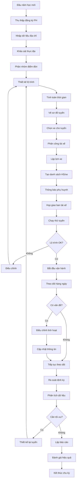

# SOP-02.1: QUẢN LÝ TUYẾN XE

## 1. THÔNG TIN QUY TRÌNH

| **Thuộc tính** | **Nội dung** |
|---|---|
| Mã SOP | SOP-02.1 |
| Tên quy trình | Quản lý tuyến xe đưa đón học sinh |
| Quy trình cha | SOP-02: Quản lý xe đưa đón |
| Phiên bản | 1.0 |
| Ngày ban hành | [Ngày/Tháng/Năm] |
| Người phê duyệt | Hiệu trưởng |
| Phạm vi áp dụng | Tất cả tuyến xe đưa đón của trường |
| Chu kỳ rà soát | Hàng năm (đầu năm học), Hàng tháng (điều chỉnh nhỏ) |

## 2. MỤC ĐÍCH

Quy trình này thiết lập hệ thống quản lý tuyến xe khoa học và an toàn nhằm:

- **Tối ưu hóa lộ trình**: Giảm thời gian đưa đón, tiết kiệm chi phí nhiên liệu
- **Đảm bảo an toàn**: Chọn đường an toàn, tránh đường nguy hiểm, kẹt xe
- **Phục vụ tốt nhất**: Đón đúng giờ, đúng địa điểm, thuận tiện cho phụ huynh
- **Quản lý hiệu quả**: Theo dõi vị trí xe real-time, kiểm soát chặt chẽ
- **Linh hoạt điều chỉnh**: Thích nghi với thay đổi (học sinh mới, chuyển nhà, tắc đường)
- **Tuân thủ quy định**: Đáp ứng quy định về vận tải học sinh

## 3. PHẠM VI ÁP DỤNG

### 3.1. Phân loại tuyến xe

| **Loại tuyến** | **Đặc điểm** | **Số học sinh** | **Loại xe** |
|---|---|---|---|
| **Tuyến gần** | Bán kính < 3km, nội thành | 20-30 em | Xe 16-29 chỗ |
| **Tuyến trung bình** | Bán kính 3-7km | 30-40 em | Xe 29-35 chỗ |
| **Tuyến xa** | Bán kính > 7km, ngoại thành | 35-45 em | Xe 45 chỗ |
| **Tuyến đặc biệt** | 1-2 gia đình thuê riêng | 2-5 em | Xe 7-16 chỗ |

### 3.2. Khung thời gian đưa đón

| **Buổi** | **Giờ đón** | **Giờ đến trường** | **Thời gian tối đa** |
|---|---|---|---|
| **Sáng** | 6:00 - 7:00 | Trước 7:30 | ≤ 90 phút |
| **Trưa** (nếu có) | 11:00 - 11:30 | Trước 12:00 | ≤ 60 phút |
| **Chiều** | 15:30 - 16:30 | Đến nhà trước 17:30 | ≤ 90 phút |

## 4. QUY TRÌNH THỰC HIỆN

### 4.1. Khảo sát và thu thập thông tin (Đầu năm học)

**Bước 1: Thu thập nhu cầu đưa đón**

Gửi Form đăng ký đưa đón (Form QT01-F26) cho phụ huynh, thu thập:

| **Thông tin** | **Mục đích** |
|---|---|
| Họ tên học sinh, lớp | Định danh |
| Địa chỉ đón chính xác | GPS, số nhà, ngõ, ngách |
| Số điện thoại phụ huynh | Liên lạc khẩn cấp (2 số) |
| Người đón | Họ tên, mối quan hệ, ảnh |
| Buổi đưa đón | Sáng, trưa, chiều, cả ngày |
| Yêu cầu đặc biệt | Học sinh khuyết tật, dị ứng... |
| Ghi chú | Đường dễ tắc, khu an ninh... |

**Bước 2: Nhập dữ liệu vào hệ thống**

- Nhập tất cả địa chỉ vào phần mềm quản lý (Google Maps, Excel)
- Gắn mã số cho mỗi điểm đón: DP-[Tuyến]-[STT]
- Phân nhóm theo khu vực địa lý
- Đánh dấu điểm đặc biệt (khó tìm, xa, nguy hiểm)

**Bước 3: Khảo sát thực địa**

Đội khảo sát (Trưởng phòng Xe + Tài xế có kinh nghiệm) đi thực tế:
- Xác nhận địa chỉ chính xác
- Đánh giá độ an toàn đường đi
- Đo khoảng cách, thời gian
- Chụp ảnh điểm đón
- Gặp phụ huynh (nếu cần)
- Xác định điểm dừng an toàn

### 4.2. Thiết kế tuyến xe

**Bước 4: Phân nhóm điểm đón**

Sử dụng phương pháp phân cụm (clustering):
- Nhóm các điểm gần nhau về mặt địa lý
- Mỗi nhóm 20-45 học sinh (tùy loại xe)
- Ưu tiên nhóm theo lộ trình thuận chiều
- Tránh đi vòng, quay đầu nhiều

**Bước 5: Thiết kế lộ trình tối ưu**

Nguyên tắc thiết kế:

| **Nguyên tắc** | **Giải thích** | **Ví dụ** |
|---|---|---|
| **Đón xa trước, gần sau** | Học sinh xa ngồi xe lâu hơn, cần chỗ thoải mái | Đón ngoại thành trước, nội thành sau |
| **Đưa gần trước, xa sau** | Học sinh gần về sớm, giảm thời gian ngồi xe | Đưa nội thành trước, ngoại thành sau |
| **Tránh đường nguy hiểm** | An toàn quan trọng hơn gần | Tránh đường đèo, ngập nước, tội phạm |
| **Tránh giờ cao điểm** | Giảm tắc đường | Xuất phát sớm hơn 15-30 phút |
| **Dự phòng thời gian** | Đề phòng tắc đường, sự cố | Thêm 10-15 phút buffer |

**Bước 6: Tính toán thời gian chi tiết**

Cho mỗi tuyến, tính toán:

```
Thời gian tuyến = Thời gian lái xe + (Số điểm đón × 2 phút) + Buffer 15 phút
```

Ví dụ:
- Khoảng cách: 15km
- Thời gian lái: 30 phút
- Số điểm đón: 8 điểm
- Thời gian dừng: 8 × 2 = 16 phút
- Buffer: 15 phút
- **Tổng: 30 + 16 + 15 = 61 phút**

**Bước 7: Vẽ sơ đồ tuyến xe**

Tạo sơ đồ cho mỗi tuyến bao gồm:
- Bản đồ với các điểm đón đánh số
- Lộ trình đi (mũi tên chỉ chiều)
- Khoảng cách từng đoạn
- Thời gian dự kiến từng đoạn
- Điểm đặc biệt (ngã ba nguy hiểm, đường hẹp...)
- Lộ trình dự phòng (khi tắc đường)

### 4.3. Phân bổ xe và nhân viên

**Bước 8: Chọn xe cho từng tuyến**

| **Tiêu chí** | **Cân nhắc** |
|---|---|
| Số chỗ ngồi | Đủ chỗ + 20% dự phòng |
| Tình trạng xe | Xe tốt cho tuyến xa, xe cũ cho tuyến gần |
| Loại xe | Xe nhỏ cho ngõ hẹp, xe lớn cho đường rộng |
| Thiết bị | Camera, GPS, điều hòa cho tuyến xa |

**Bước 9: Phân công tài xế và nhân viên**

- Tài xế có kinh nghiệm → Tuyến xa, khó
- Tài xế mới → Tuyến gần, dễ
- Nhân viên hỗ trợ: 1 người/xe (bắt buộc cho mầm non)
- Backup: Có 1-2 tài xế dự phòng

**Bước 10: Lập lịch xe**

Tạo bảng phân công:

| **Tuyến** | **Xe** | **Tài xế** | **NV hỗ trợ** | **Giờ xuất phát** | **Số HS** |
|---|---|---|---|---|---|
| Tuyến 1 - Bắc | BKS: 29A-123.45 | Anh A | Chị B | 6:00 | 35 |
| Tuyến 2 - Nam | BKS: 29A-678.90 | Anh C | Chị D | 6:15 | 28 |
| ... | ... | ... | ... | ... | ... |

### 4.4. Triển khai và thông báo

**Bước 11: Tạo danh sách học sinh từng xe**

Mỗi xe có danh sách chi tiết:
- STT, Họ tên, Lớp
- Địa chỉ đón (số nhà, ngõ, mốc đặc biệt)
- Số điện thoại phụ huynh
- Người đón (họ tên, mối quan hệ)
- Ghi chú đặc biệt

**Bước 12: Thông báo cho phụ huynh**

Gửi thông báo (qua app/email/giấy) bao gồm:
- Mã tuyến xe, biển số xe
- Giờ đón dự kiến (± 5 phút)
- Điểm đón chính xác
- Ảnh tài xế và nhân viên
- Số điện thoại liên hệ
- Quy định đưa đón

**Bước 13: Họp giao ban đội xe**

Trước khi khai giảng, họp toàn bộ tài xế:
- Phổ biến lộ trình, danh sách học sinh
- Hướng dẫn sử dụng thiết bị (GPS, camera)
- Nhấn mạnh quy định an toàn
- Phát tài liệu (bản đồ, danh sách)
- Chạy thử tuyến (dry run)

### 4.5. Vận hành và điều chỉnh

**Bước 14: Theo dõi hàng ngày**

Mỗi ngày, Trưởng phòng Xe theo dõi:
- Giờ xuất phát thực tế của từng xe (qua GPS)
- Thời gian đến trường (đúng giờ không?)
- Phản hồi từ tài xế (tắc đường, sự cố...)
- Phản hồi từ phụ huynh (trễ, sai giờ...)
- Số học sinh đi xe từng ngày

**Bước 15: Điều chỉnh linh hoạt**

| **Tình huống** | **Xử lý** |
|---|---|
| Học sinh mới đăng ký | Bổ sung vào tuyến gần nhất, điều chỉnh giờ đón |
| Học sinh chuyển nhà | Cập nhật địa chỉ, chuyển tuyến nếu cần |
| Học sinh nghỉ dài ngày | Ghi nhận, tạm bỏ khỏi danh sách |
| Đường tắc dài hạn | Thay đổi lộ trình dự phòng |
| Phụ huynh phàn nàn giờ đón | Điều chỉnh thứ tự điểm đón |

**Bước 16: Rà soát và tối ưu định kỳ**

Mỗi tháng, phân tích:
- Thời gian thực tế so với kế hoạch
- Điểm đón nào hay trễ
- Tuyến nào quá tải/ít học sinh
- Chi phí nhiên liệu (km/lít)
- Đề xuất sáp nhập hoặc tách tuyến

### 4.6. Báo cáo và đánh giá

**Bước 17: Lập báo cáo định kỳ**

| **Loại báo cáo** | **Tần suất** | **Nội dung** |
|---|---|---|
| Báo cáo hàng ngày | Hàng ngày | Số lượt xe, số HS, sự cố (nếu có) |
| Báo cáo tháng | Hàng tháng | Tổng hợp vận hành, chi phí, điều chỉnh |
| Báo cáo năm | Hàng năm | Đánh giá tổng thể, kế hoạch năm sau |

**Bước 18: Đánh giá hiệu quả**

| **Chỉ tiêu** | **Mục tiêu** | **Cách đo** |
|---|---|---|
| Tỷ lệ đúng giờ | ≥ 95% | Số chuyến đúng giờ / Tổng số chuyến |
| Thời gian đưa đón TB | ≤ 60 phút | Trung bình thời gian các tuyến |
| Tỷ lệ hài lòng PH | ≥ 90% | Khảo sát phụ huynh |
| Chi phí/km | Tối ưu | So sánh với tiêu chuẩn ngành |
| Tỷ lệ sự cố | < 1%/tháng | Số chuyến có sự cố / Tổng chuyến |

## 5. LƯU ĐỒ QUY TRÌNH



## 6. BIỂU MẪU LIÊN QUAN

| **Mã biểu mẫu** | **Tên biểu mẫu** | **Mục đích** |
|---|---|---|
| QT01-F26 | Form đăng ký đưa đón | Thu thập thông tin từ phụ huynh |
| QT01-F27 | Bản đồ tuyến xe | Sơ đồ lộ trình chi tiết |
| QT01-F28 | Danh sách học sinh theo xe | Danh sách đầy đủ từng xe |
| QT01-F29 | Lịch xe hàng ngày | Phân công xe, tài xế |
| QT01-F30 | Nhật ký vận hành tuyến | Ghi chép hàng ngày |
| QT01-R06 | Báo cáo quản lý tuyến xe | Báo cáo định kỳ |

## 7. TIÊU CHUẨN VÀ CHỈ TIÊU

| **Chỉ tiêu** | **Mục tiêu** | **Phương pháp đo** |
|---|---|---|
| Tỷ lệ đúng giờ | ≥ 95% | Số chuyến đúng giờ / Tổng số chuyến × 100% |
| Thời gian đưa đón trung bình | ≤ 60 phút/chuyến | Thời gian TB các tuyến |
| Tỷ lệ hài lòng phụ huynh | ≥ 90% | Khảo sát hàng kỳ |
| Chi phí nhiên liệu/km | ≤ 3,000 VNĐ | Chi phí xăng / Tổng km |
| Tỷ lệ sử dụng xe | ≥ 80% | Số ghế sử dụng / Tổng số ghế |
| Số lần điều chỉnh tuyến | ≤ 5 lần/năm | Đếm số lần thay đổi lớn |

## 8. TRÁCH NHIỆM CỤ THỂ

| **Vai trò** | **Trách nhiệm** |
|---|---|
| **Trưởng phòng Xe** | - Thiết kế và quản lý tuyến xe<br>- Phân công tài xế, xe<br>- Theo dõi vận hành<br>- Xử lý phàn nàn<br>- Lập báo cáo |
| **Tài xế** | - Chạy đúng tuyến, đúng giờ<br>- Điểm danh học sinh<br>- Báo cáo sự cố<br>- Đề xuất cải tiến lộ trình |
| **Nhân viên hỗ trợ** | - Hỗ trợ học sinh lên xuống xe<br>- Điểm danh, check người đón<br>- Liên lạc với phụ huynh<br>- Đảm bảo trật tự trên xe |
| **Phòng Hành chính** | - Hỗ trợ thu thập thông tin<br>- In ấn tài liệu<br>- Thông báo phụ huynh |

## 9. LƯU Ý QUAN TRỌNG

### 9.1. Nguyên tắc an toàn

- 🚌 **An toàn là ưu tiên số 1** - Không hi sinh an toàn để tiết kiệm thời gian
- 🚌 **Đúng giờ là uy tín** - Trễ 5 phút = mất niềm tin phụ huynh
- 🚌 **Linh hoạt nhưng có nguyên tắc** - Điều chỉnh khi cần nhưng phải thông báo
- 🚌 **Lắng nghe phụ huynh** - Phản hồi là nguồn cải tiến quý giá
- 🚌 **Backup luôn sẵn sàng** - Có phương án B cho mọi tình huống

### 9.2. Xử lý tình huống thường gặp

| **Tình huống** | **Xử lý** |
|---|---|
| Đường tắc đột xuất | Tài xế chủ động đi đường khác, báo Phòng Xe |
| Học sinh chuyển nhà giữa năm | Đánh giá lại, chuyển tuyến hoặc điều chỉnh lộ trình |
| Phụ huynh muốn đổi điểm đón | Xem xét khả thi, phải có lý do hợp lý |
| Tuyến quá ít học sinh | Sáp nhập với tuyến khác hoặc giảm số xe |
| Xe hỏng đột xuất | Xe dự phòng thay thế ngay, thông báo PH |

### 9.3. Công nghệ hỗ trợ

**Sử dụng GPS và phần mềm:**
- Theo dõi vị trí xe real-time
- Gửi thông báo tự động cho phụ huynh (xe đã đến)
- Lưu lộ trình, phân tích hiệu quả
- Cảnh báo xe chạy sai tuyến

**App cho phụ huynh:**
- Xem vị trí xe trên bản đồ
- Nhận thông báo xe sắp đến
- Báo nghỉ, thay đổi điểm đón
- Đánh giá chất lượng dịch vụ

## 10. PHỤ LỤC

### 10.1. Mẫu sơ đồ tuyến xe

```
TUYẾN 1 - KHU BẮC
Xuất phát: 6:00 - Kết thúc: 7:20

ĐP1 → ĐP2 → ĐP3 → ĐP4 → ĐP5 → TRƯỜNG
[3km] [2km] [2km] [3km] [2km] [3km]
[8']  [6']  [6']  [8']  [6']  [8']

Tổng: 15km - 42 phút (+ 18 phút dừng = 60')

Lộ trình dự phòng:
Nếu đường X tắc → Đi đường Y (+5 phút)
```

### 10.2. Checklist thiết kế tuyến mới

- [ ] Thu thập đủ thông tin học sinh
- [ ] Khảo sát thực địa
- [ ] Nhóm điểm đón hợp lý
- [ ] Thiết kế lộ trình tối ưu
- [ ] Tính thời gian chi tiết
- [ ] Vẽ sơ đồ rõ ràng
- [ ] Chọn xe phù hợp
- [ ] Phân công tài xế
- [ ] Thông báo phụ huynh
- [ ] Chạy thử tuyến
- [ ] Thu thập phản hồi
- [ ] Điều chỉnh nếu cần

### 10.3. Mẫu thông báo cho phụ huynh

```
THÔNG BÁO TUYẾN XE ĐƯA ĐÓN
Năm học 20__ - 20__

Con em: _______________ - Lớp: ____
Tuyến xe: Tuyến [X] - Khu [Tên khu]
Biển số xe: 29A-___.___

BUỔI SÁNG:
- Giờ đón: ___:___ (± 5 phút)
- Điểm đón: _____________________
- Đến trường: Trước 7:30

BUỔI CHIỀU:
- Giờ xuất phát từ trường: 15:30
- Giờ đến nhà: ___:___ (± 5 phút)

Tài xế: ________ - SĐT: __________
NV hỗ trợ: _____ - SĐT: __________

Liên hệ khẩn cấp: ______________
```

## 11. CÂU HỎI THƯỜNG GẶP (FAQ)

**Q1: Làm sao để biết xe đã đến gần nhà?**  
A: Sử dụng app theo dõi xe hoặc nhân viên xe gọi điện trước 5 phút.

**Q2: Nếu con vắng học, có cần báo cho xe không?**  
A: Có, phải báo trước 7:00 sáng để xe không đến đón, tiết kiệm thời gian.

**Q3: Có thể đổi điểm đón được không?**  
A: Được, nhưng phải báo trước 1 tuần để Phòng Xe đánh giá khả thi.

**Q4: Tuyến xe có thể thay đổi giữa năm không?**  
A: Chỉ điều chỉnh nhỏ. Thay đổi lớn phải có ít nhất 50% phụ huynh tuyến đồng ý.

**Q5: Xe có camera giám sát không?**  
A: Có, tất cả xe đều có camera. Phụ huynh có thể yêu cầu xem lại nếu cần.

---

**PHÊ DUYỆT**

| Người soạn thảo | Trưởng phòng Xe | Hiệu trưởng |
|---|---|---|
| [Họ tên] | [Họ tên] | [Họ tên] |
| Ngày: ___/___/___ | Ngày: ___/___/___ | Ngày: ___/___/___ |

---
*Tài liệu này cần được cập nhật đầu mỗi năm học và khi có thay đổi lớn.*
