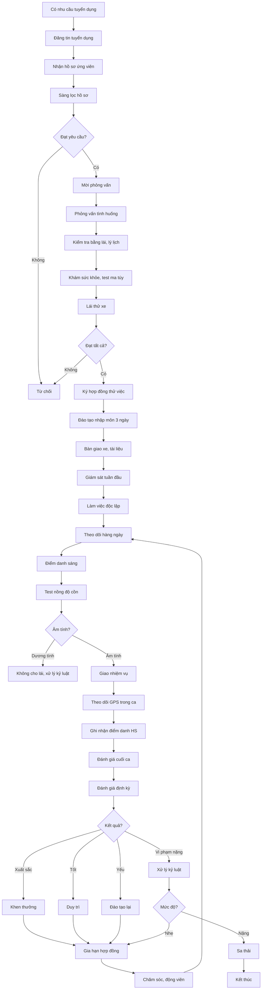

# SOP-02.2: QUẢN LÝ TÀI XẾ VÀ NHÂN VIÊN

## 1. THÔNG TIN QUY TRÌNH

| **Thuộc tính** | **Nội dung** |
|---|---|
| Mã SOP | SOP-02.2 |
| Tên quy trình | Quản lý tài xế và nhân viên xe đưa đón |
| Quy trình cha | SOP-02: Quản lý xe đưa đón |
| Phiên bản | 1.0 |
| Ngày ban hành | [Ngày/Tháng/Năm] |
| Người phê duyệt | Hiệu trưởng |
| Phạm vi áp dụng | Tất cả tài xế và nhân viên xe đưa đón |
| Chu kỳ đánh giá | Hàng tháng (theo dõi), Học kỳ (đánh giá), Năm (tổng kết) |

## 2. MỤC ĐÍCH

Quy trình này thiết lập hệ thống quản lý nhân sự xe đưa đón chuyên nghiệp nhằm:

- **Tuyển chọn đúng người**: Đảm bảo tài xế, nhân viên đủ năng lực, phẩm chất
- **Đào tạo bài bản**: Trang bị kiến thức, kỹ năng cần thiết cho công việc
- **Giám sát chặt chẽ**: Theo dõi hiệu suất, kỷ luật, thái độ phục vụ
- **Động viên khuyến khích**: Ghi nhận, khen thưởng để nâng cao chất lượng
- **Xử lý vi phạm**: Kịp thời phát hiện và xử lý các hành vi sai trái
- **Giữ chân nhân tài**: Môi trường làm việc tốt, thu nhập ổn định

## 3. PHẠM VI ÁP DỤNG

### 3.1. Tiêu chuẩn tuyển dụng

| **Vị trí** | **Yêu cầu bắt buộc** | **Yêu cầu ưu tiên** |
|---|---|---|
| **Tài xế** | - Bằng lái hạng D (hoặc phù hợp)<br>- Kinh nghiệm ≥ 3 năm<br>- Độ tuổi 25-55<br>- Không tiền án, tiền sự<br>- Sức khỏe tốt (có giấy khám sức khỏe)<br>- Không nghiện rượu, ma túy | - Đã lái xe học sinh<br>- Am hiểu tâm lý trẻ em<br>- Biết sơ cứu cơ bản<br>- Ưu tiên nam giới |
| **Nhân viên hỗ trợ** | - Yêu thương trẻ em<br>- Khỏe mạnh, nhanh nhẹn<br>- Giao tiếp tốt<br>- Độ tuổi 22-50<br>- Không tiền án, tiền sự | - Có kinh nghiệm giáo dục<br>- Biết tiếng Anh<br>- Biết sơ cứu<br>- Ưu tiên nữ giới |

### 3.2. Cơ cấu đội xe

| **Nhân sự** | **Số lượng cần** | **Ghi chú** |
|---|---|---|
| Tài xế chính | 1 người/xe | Lái xe chính hàng ngày |
| Tài xế dự phòng | 2-3 người | Thay thế khi nghỉ, ốm |
| Nhân viên hỗ trợ | 1 người/xe | Bắt buộc cho mầm non, khuyến khích cho cấp khác |
| Trưởng phòng Xe | 1 người | Quản lý toàn bộ đội xe |
| Điều phối viên | 1-2 người | Điều phối lộ trình, xử lý sự cố |

## 4. QUY TRÌNH THỰC HIỆN

### 4.1. Tuyển dụng và tiếp nhận

**Bước 1: Tuyển dụng**

Quy trình theo SOP-01 (Nhân sự), riêng với tài xế cần kiểm tra thêm:

| **Nội dung kiểm tra** | **Cách thực hiện** | **Tiêu chí đạt** |
|---|---|---|
| Bằng lái | Kiểm tra bản chính, chụp lưu | Bằng còn hạn, đúng hạng |
| Lý lịch tư pháp | Yêu cầu giấy xác nhận | Không có tiền án, tiền sự |
| Sức khỏe | Khám tại bệnh viện | Đạt chuẩn nghề lái xe |
| Test ma túy, rượu | Xét nghiệm máu/nước tiểu | Âm tính |
| Kỹ năng lái xe | Lái thử xe trường 30 phút | Lái vững, tuân thủ luật |
| Thái độ với trẻ | Phỏng vấn tình huống | Kiên nhẫn, yêu trẻ |

**Bước 2: Đào tạo nhập môn (3 ngày)**

Chương trình đào tạo:

| **Ngày** | **Nội dung** | **Thời gian** |
|---|---|---|
| **Ngày 1** | - Giới thiệu trường, quy chế<br>- Tuyến xe, lộ trình<br>- Hệ thống xe, thiết bị<br>- Quy định an toàn | 4 giờ |
| **Ngày 2** | - Kỹ năng giao tiếp với HS, PH<br>- Xử lý tình huống khẩn cấp<br>- Sơ cứu cơ bản<br>- Thực hành lái tuyến | 4 giờ |
| **Ngày 3** | - Sử dụng GPS, camera, app<br>- Điểm danh, báo cáo<br>- Chạy thử tuyến có giám sát<br>- Kiểm tra đánh giá | 4 giờ |

**Bước 3: Bàn giao và theo dõi thử việc**

- Bàn giao xe, danh sách học sinh, tài liệu
- Thời gian thử việc: 2 tháng
- Giám sát viên đi cùng xe tuần đầu tiên
- Đánh giá cuối thử việc (Form QT01-F31)
- Quyết định: Nhận chính thức / Kéo dài thử việc / Không nhận

### 4.2. Quản lý hàng ngày

**Bước 4: Điểm danh và giao ca**

Mỗi sáng (5:45), tất cả tài xế điểm danh tại trường:
- Điểm danh (không được vắng mặt)
- Kiểm tra trang phục (đồng phục sạch sẽ)
- Kiểm tra sức khỏe (mệt mỏi, say xỉn → không cho lái)
- Test nhanh nồng độ cồn (máy thổi) - **BẮT BUỘC**
- Nhận nhiệm vụ ngày (danh sách HS, lộ trình)
- Báo cáo bất thường (xe hỏng, HS nghỉ...)

**Bước 5: Theo dõi trong ca**

Điều phối viên theo dõi real-time qua GPS:
- Giờ xuất phát
- Vị trí xe trên lộ trình
- Tốc độ (cảnh báo nếu quá tốc độ)
- Dừng đúng điểm đón
- Thời gian đến trường
- Ghi chú bất thường

**Bước 6: Đánh giá cuối ca**

Sau mỗi ca, tài xế:
- Điền sổ giao ca (Form QT01-F32)
- Báo cáo sự cố (nếu có)
- Giao lại xe (vệ sinh, kiểm tra xăng)
- Nộp danh sách điểm danh
- Nhận ý kiến phụ huynh

### 4.3. Đào tạo và phát triển

**Bước 7: Đào tạo định kỳ**

| **Chủ đề** | **Nội dung** | **Tần suất** | **Thời gian** |
|---|---|---|---|
| **An toàn giao thông** | Luật mới, kỹ năng lái an toàn | 6 tháng | 2 giờ |
| **Sơ cứu - PCCC** | Xử lý tai nạn, cháy xe | 6 tháng | 3 giờ |
| **Kỹ năng mềm** | Giao tiếp, xử lý xung đột | Năm | 4 giờ |
| **Tâm lý trẻ em** | Hiểu và ứng xử với HS | Năm | 2 giờ |
| **Công nghệ** | Sử dụng GPS, app mới | Khi có thay đổi | 1 giờ |

**Bước 8: Đánh giá năng lực**

Định kỳ đánh giá (học kỳ):

| **Tiêu chí** | **Thang điểm** | **Trọng số** |
|---|---|---|
| Kỷ luật (điểm danh, giờ giấc) | 0-10 | 20% |
| An toàn (tuân thủ luật, không vi phạm) | 0-10 | 30% |
| Thái độ phục vụ (với HS, PH) | 0-10 | 20% |
| Kỹ năng lái xe (êm, an toàn) | 0-10 | 15% |
| Xử lý tình huống | 0-10 | 10% |
| Giao tiếp, báo cáo | 0-10 | 5% |

**Phân loại:**
- Xuất sắc (≥ 9.0): Thưởng + Tăng lương
- Tốt (8.0-8.9): Giữ vững
- Trung bình (7.0-7.9): Nhắc nhở, đào tạo thêm
- Yếu (< 7.0): Cảnh cáo, xem xét chuyển việc

### 4.4. Chế độ và phúc lợi

**Bước 9: Lương và phụ cấp**

| **Khoản** | **Mức** | **Điều kiện** |
|---|---|---|
| Lương cơ bản | Theo hợp đồng | Theo năng lực, kinh nghiệm |
| Phụ cấp xăng xe | [X] VNĐ/tháng | Theo km thực tế |
| Phụ cấp cơm trưa | 30,000 VNĐ/ngày | Các ngày làm việc |
| Phụ cấp điện thoại | 200,000 VNĐ/tháng | Liên lạc công việc |
| Thưởng tháng | 500,000 - 2,000,000 | Dựa vào đánh giá |
| Thưởng an toàn | 1,000,000 VNĐ/năm | Không vi phạm, tai nạn |
| BHXH, BHYT | Theo luật | Đóng đầy đủ |

**Bước 10: Chế độ làm việc**

- Giờ làm việc: 6:00-8:00 và 15:00-17:00 (hoặc theo ca)
- Nghỉ phép: 12 ngày/năm
- Nghỉ lễ: Theo quy định
- Được khám sức khỏe định kỳ (6 tháng/lần)
- Được đào tạo nâng cao (miễn phí)
- Được mua bảo hiểm tai nạn 24/7

### 4.5. Kỷ luật và xử lý vi phạm

**Bước 11: Theo dõi kỷ luật**

Ghi nhận vi phạm vào Sổ theo dõi kỷ luật:

| **Vi phạm** | **Mức độ** | **Xử lý lần 1** | **Xử lý lần 2** | **Xử lý lần 3** |
|---|---|---|---|---|
| Đến muộn < 15 phút | Nhẹ | Nhắc nhở | Cảnh cáo | Trừ lương |
| Vi phạm giao thông | Nặng | Cảnh cáo + Học lại | Phạt tiền | Sa thải |
| Lái xe khi uống rượu | Rất nặng | **SA THẢI NGAY** | - | - |
| Thái độ xấu với HS, PH | Nặng | Cảnh cáo | Phạt + Đào tạo lại | Sa thải |
| Không điểm danh HS | Nặng | Cảnh cáo + Phạt | Hạ bậc lương | Sa thải |
| Để quên HS | Rất nặng | Phạt nặng + Đình chỉ | **SA THẢI** | - |
| Gây tai nạn do lỗi | Rất nặng | Đình chỉ + Điều tra | **SA THẢI** + Bồi thường | - |

**Bước 12: Khen thưởng**

Hình thức khen thưởng:

| **Thành tích** | **Hình thức** |
|---|---|
| Tài xế xuất sắc tháng | Giấy khen + 500,000 VNĐ |
| Tài xế an toàn năm | Giấy khen + 2,000,000 VNĐ |
| Phát hiện sự cố kỹ thuật kịp thời | Thưởng đột xuất 300,000 VNĐ |
| Được phụ huynh khen ngợi nhiều | Bằng khen + Thưởng |
| 5 năm không vi phạm | Tăng lương đặc biệt |

### 4.6. Chăm sóc và gắn kết

**Bước 13: Họp giao ban định kỳ**

- **Hàng tuần**: Họp ngắn 15 phút (vấn đề nóng)
- **Hàng tháng**: Họp 1 giờ (đánh giá, đào tạo)
- **Học kỳ**: Họp tổng kết, động viên

Nội dung:
- Khen ngợi thành tích
- Phê bình vi phạm
- Chia sẻ kinh nghiệm
- Thông tin mới
- Lắng nghe tâm tư

**Bước 14: Hỗ trợ và động viên**

- Tổ chức sinh nhật, ngày lễ cho tài xế
- Hỗ trợ khi gặp khó khăn (ốm đau, hoàn cảnh)
- Tạo group chat để giao lưu
- Tổ chức team building (năm)
- Tặng quà tết, thưởng cuối năm

## 5. LƯU ĐỒ QUY TRÌNH



## 6. BIỂU MẪU LIÊN QUAN

| **Mã biểu mẫu** | **Tên biểu mẫu** | **Mục đích** |
|---|---|---|
| QT01-F31 | Phiếu đánh giá thử việc tài xế | Đánh giá sau 2 tháng thử việc |
| QT01-F32 | Sổ giao ca tài xế | Ghi nhận hàng ngày |
| QT01-F33 | Phiếu test nồng độ cồn | Kiểm tra hàng ngày |
| QT01-F34 | Sổ theo dõi kỷ luật | Ghi nhận vi phạm |
| QT01-F35 | Phiếu đánh giá định kỳ | Đánh giá học kỳ/năm |
| QT01-F36 | Phiếu khen thưởng | Ghi nhận thành tích |
| QT01-R07 | Báo cáo quản lý nhân sự xe | Báo cáo cho Ban Giám hiệu |

## 7. TIÊU CHUẨN VÀ CHỈ TIÊU

| **Chỉ tiêu** | **Mục tiêu** | **Phương pháp đo** |
|---|---|---|
| Tỷ lệ tài xế đạt chuẩn | 100% | Số tài xế có đầy đủ giấy tờ hợp lệ |
| Tỷ lệ đi làm đúng giờ | ≥ 98% | Số ca đúng giờ / Tổng số ca |
| Tỷ lệ test cồn âm tính | 100% | Không có ca dương tính |
| Điểm đánh giá trung bình | ≥ 8.5/10 | TB điểm tất cả tài xế |
| Tỷ lệ phụ huynh hài lòng | ≥ 90% | Khảo sát định kỳ |
| Tỷ lệ giữ chân nhân viên | ≥ 85%/năm | Số người ở lại / Tổng số |

## 8. TRÁCH NHIỆM CỤ THỂ

| **Vai trò** | **Trách nhiệm** |
|---|---|---|
| **Trưởng phòng Xe** | - Tuyển dụng, đào tạo<br>- Quản lý, giám sát hàng ngày<br>- Đánh giá, khen thưởng, kỷ luật<br>- Chăm sóc, gắn kết đội ngũ |
| **Điều phối viên** | - Điểm danh, test cồn hàng ngày<br>- Theo dõi GPS, xử lý sự cố<br>- Ghi nhận vi phạm<br>- Báo cáo lên Trưởng phòng |
| **Tài xế** | - Tuân thủ quy định<br>- Lái xe an toàn<br>- Chăm sóc học sinh<br>- Báo cáo trung thực |
| **Phòng Nhân sự** | - Hỗ trợ tuyển dụng<br>- Quản lý hợp đồng<br>- Tính lương, BHXH<br>- Xử lý kỷ luật theo quy chế |

## 9. LƯU Ý QUAN TRỌNG

### 9.1. Nguyên tắc vàng

- 🚗 **Zero tolerance với rượu bia** - Test cồn HÀNG NGÀY, dương tính = ĐÌNH CHỈ NGAY
- 🚗 **An toàn học sinh là trên hết** - Bất kỳ hành vi nguy hiểm đều bị xử lý nghiêm
- 🚗 **Thái độ phục vụ tận tâm** - Học sinh là khách hàng, phải được tôn trọng
- 🚗 **Kỷ luật nghiêm minh** - Không có ngoại lệ, không có cảm tình
- 🚗 **Công bằng, minh bạch** - Khen thưởng, kỷ luật phải rõ ràng

### 9.2. Dấu hiệu cần thay tài xế

| **Dấu hiệu** | **Mức độ** | **Hành động** |
|---|---|---|
| Vi phạm luật giao thông nhiều lần | Nghiêm trọng | Cảnh cáo, đào tạo lại, xem xét sa thải |
| Thái độ thô lỗ với HS, PH | Nghiêm trọng | Cảnh cáo, chuyển ca, sa thải nếu tái phạm |
| Thường xuyên đến muộn | Trung bình | Nhắc nhở, phạt, thay nếu không cải thiện |
| Kỹ năng lái xe kém | Trung bình | Đào tạo lại, giám sát sát, chuyển tuyến dễ |
| Sức khỏe suy giảm | Cần lưu ý | Cho nghỉ, khám lại, chuyển việc nhẹ |

### 9.3. Chăm sóc sức khỏe

**Khám sức khỏe định kỳ (6 tháng):**
- Khám tổng quát
- Đo huyết áp, tim mạch
- Kiểm tra mắt, tai
- Xét nghiệm máu, nước tiểu
- Test phản xạ, vận động
- Đánh giá tâm lý (stress, lo âu)

**Nếu phát hiện vấn đề:**
- Cho nghỉ điều trị
- Chuyển công việc nhẹ hơn
- Hỗ trợ chi phí (nếu cần)
- Không sa thải do bệnh tật

## 10. PHỤ LỤC

### 10.1. Hồ sơ tài xế (Bắt buộc)

- [ ] Sơ yếu lý lịch (có ảnh 4×6)
- [ ] CMND/CCCD (bản photo công chứng)
- [ ] Bằng lái xe (bản chính để đối chiếu)
- [ ] Giấy khám sức khỏe (< 6 tháng)
- [ ] Lý lịch tư pháp (< 6 tháng)
- [ ] Giấy xác nhận chưa có nợ thuế
- [ ] Hợp đồng lao động
- [ ] Cam kết không uống rượu khi lái xe
- [ ] Chứng chỉ đào tạo (sau khi hoàn thành)

### 10.2. Quy tắc ứng xử tài xế

**✅ PHẢI:**
- Mặc đồng phục sạch sẽ, đeo thẻ
- Chào hỏi học sinh, phụ huynh
- Giúp học sinh lên xuống xe an toàn
- Kiểm tra người đón (đúng người mới giao con)
- Báo cáo kịp thời mọi sự cố
- Giữ xe sạch sẽ, thơm tho

**❌ KHÔNG ĐƯỢC:**
- Hút thuốc trên xe hoặc trước mặt học sinh
- Nghe điện thoại khi lái xe
- Chửi thề, nói tục
- La mắng, quát tháo học sinh
- Lái xe khi mệt mỏi, ốm
- Để học sinh đứng, chạy nhảy trên xe

### 10.3. Mẫu cam kết tài xế

```
CAM KẾT CỦA TÀI XẾ

Tôi tên: _________________ - CMND: __________
Cam kết trong quá trình làm việc tại [Tên trường]:

1. Tuân thủ nghiêm luật giao thông
2. Không uống rượu bia khi lái xe
3. Chấp nhận test nồng độ cồn hàng ngày
4. Yêu thương, chăm sóc học sinh
5. Lái xe an toàn, không vượt tốc độ
6. Điểm danh học sinh mỗi chuyến
7. Chỉ giao con cho người được ủy quyền
8. Báo cáo mọi sự cố kịp thời
9. Giữ bí mật thông tin học sinh, phụ huynh
10. Chấp nhận kỷ luật nếu vi phạm

Ngày ___/___/___
[Chữ ký và ghi rõ họ tên]
```

## 11. CÂU HỎI THƯỜNG GẶP (FAQ)

**Q1: Tài xế có được phép từ chối lái nếu thấy xe không an toàn không?**  
A: Có, PHẢI từ chối và báo ngay cho Trưởng phòng Xe. An toàn là trên hết.

**Q2: Nếu tài xế ốm đột xuất, ai thay thế?**  
A: Tài xế dự phòng thay thế ngay. Nếu không có, điều động tài xế tuyến khác hoặc hủy chuyến.

**Q3: Tài xế có được thưởng ngoài lương không?**  
A: Có, có thưởng tháng (dựa vào KPI) và thưởng an toàn năm (nếu không vi phạm).

**Q4: Phụ huynh phàn nàn tài xế, xử lý thế nào?**  
A: Kiểm tra camera xe, lắng nghe 2 bên, xử lý công bằng. Ưu tiên bảo vệ học sinh.

**Q5: Tài xế có được tăng lương không?**  
A: Có, xét tăng lương hàng năm dựa vào KPI, thâm niên, và đóng góp.

---

**PHÊ DUYỆT**

| Người soạn thảo | Trưởng phòng Xe | Hiệu trưởng |
|---|---|---|
| [Họ tên] | [Họ tên] | [Họ tên] |
| Ngày: ___/___/___ | Ngày: ___/___/___ | Ngày: ___/___/___ |

---
*Tài liệu này liên quan đến quản lý nhân sự, cần phối hợp chặt chẽ với Phòng Nhân sự.*
