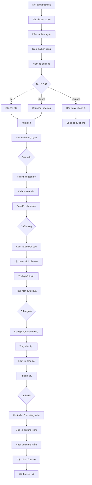

# SOP-02.3: BẢO TRÌ VÀ KIỂM TRA XE

## 1. THÔNG TIN QUY TRÌNH

| **Thuộc tính** | **Nội dung** |
|---|---|
| Mã SOP | SOP-02.3 |
| Tên quy trình | Bảo trì và kiểm tra xe đưa đón |
| Quy trình cha | SOP-02: Quản lý xe đưa đón |
| Phiên bản | 1.0 |
| Ngày ban hành | [Ngày/Tháng/Năm] |
| Người phê duyệt | Hiệu trưởng |
| Phạm vi áp dụng | Tất cả phương tiện đưa đón học sinh |
| Tần suất | Hàng ngày (kiểm tra), Tuần (cơ bản), Tháng (toàn diện), 6 tháng (chuyên sâu) |

## 2. MỤC ĐÍCH

- **Đảm bảo an toàn tuyệt đối**: Xe luôn trong tình trạng kỹ thuật tốt, an toàn vận hành
- **Phòng ngừa sự cố**: Phát hiện sớm hư hỏng, ngăn ngừa tai nạn
- **Kéo dài tuổi thọ xe**: Bảo dưỡng đúng cách giúp xe bền hơn
- **Tiết kiệm chi phí**: Bảo trì phòng ngừa rẻ hơn sửa chữa lớn
- **Tuân thủ quy định**: Đáp ứng Nghị định 10/2020/NĐ-CP về đăng kiểm

## 3. PHẠM VI ÁP DỤNG

### 3.1. Các cấp độ kiểm tra (Công Ty TNHH đầu tư thương mại Du lịch Phương Anh)

| **Cấp độ** | **Người thực hiện** | **Thời gian** | **Nội dung** |
|---|---|---|---|
| **Hàng ngày** | Tài xế | 10 phút/lần | Kiểm tra nhanh trước xuất bến |
| **Hàng tuần** | Tài xế + Kỹ thuật | 30 phút | Kiểm tra cơ bản, vệ sinh |
| **Hàng tháng** | Kỹ thuật viên | 2 giờ | Kiểm tra toàn diện |
| **6 tháng** | Garage chuyên nghiệp | 1 ngày | Bảo dưỡng lớn, thay dầu |
| **Hàng năm** | Trung tâm đăng kiểm | 1 ngày | Đăng kiểm theo quy định |

### 3.2. Danh mục xe quản lý

| **Biển số** | **Loại xe** | **Số chỗ** | **Năm SX** | **Tuyến** |
|---|---|---|---|---|
| 29A-123.45 | Hyundai County | 29 | 2020 | Tuyến 1 |
| 29A-678.90 | Ford Transit | 16 | 2021 | Tuyến 2 |
| ... | ... | ... | ... | ... |

## 4. QUY TRÌNH THỰC HIỆN

### 4.1. Kiểm tra hàng ngày (Trước mỗi chuyến)

**Bước 1: Kiểm tra bên ngoài xe (5 phút)**

| **Hạng mục** | **Cách kiểm tra** | **Tiêu chí đạt** |
|---|---|---|
| Lốp xe | Quan sát, đá nhẹ | Không xẹp, mòn, nứt. Áp suất đủ |
| Đèn chiếu sáng | Bật thử | Đèn pha, cos, xi-nhan, phanh đều sáng |
| Gương chiếu hậu | Quan sát | Không bị vỡ, nứt, điều chỉnh được |
| Cửa xe | Đóng mở thử | Đóng mở nhẹ nhàng, không kẹt |
| Cửa sổ thoát hiểm | Kiểm tra | Mở được, búa thoát hiểm còn |
| Ngoại thất | Quan sát | Không móp méo, va chạm mới |
| Biển số | Quan sát | Rõ ràng, không bị che khuất |

**Bước 2: Kiểm tra bên trong xe (3 phút)**

- Ghế ngồi: Không bị rách, hỏng
- Dây an toàn: Hoạt động tốt, không bị đứt
- Búa thoát hiểm: Còn đủ, treo đúng vị trí
- Bình chữa cháy: Kim áp suất vùng xanh, chưa hết hạn
- Hộp sơ cứu: Đầy đủ vật tư, chưa hết hạn
- Vệ sinh: Sạch sẽ, không rác, mùi hôi

**Bước 3: Kiểm tra động cơ và hệ thống (2 phút)**

- Khởi động máy: Nổ êm, không khói đen
- Nhiên liệu: Đủ cho chuyến đi (≥ 1/4 bình)
- Dầu máy: Mức dầu trong khoảng MIN-MAX
- Nước làm mát: Đủ mức
- Phanh: Đạp thử, phanh chắc, không rít
- Còi xe: Bóp thử, kêu to, rõ
- Điều hòa: Chạy mát (quan trọng mùa hè)

**Bước 4: Ghi nhận và báo cáo**

- Nếu **TẤT CẢ ĐẠT**: Điền "OK" vào Sổ kiểm tra xe, xuất bến
- Nếu **CÓ LỖI NHỎ**: Ghi nhận, sửa sau ca, vẫn được đi
- Nếu **LỖI NGHIÊM TRỌNG**: Báo ngay, KHÔNG ĐƯỢC đi, dùng xe dự phòng

### 4.2. Bảo trì hàng tuần (Chủ nhật)

**Bước 5: Vệ sinh toàn bộ xe**

- Rửa bên ngoài (thân xe, gầm, lốp)
- Hút bụi bên trong
- Lau ghế, sàn, cửa kính
- Vệ sinh khoang máy (lau bụi, kiểm tra dầu nhớt rò rỉ)
- Xịt khử mùi, làm thơm

**Bước 6: Kiểm tra cơ bản**

- Bơm lốp đủ áp suất (theo quy định trên lốp)
- Kiểm tra mức dầu, nước, dầu phanh
- Kiểm tra đèn, còi, gạt nước
- Kiểm tra ắc quy (đo điện áp ≥ 12.5V)
- Kiểm tra camera, GPS hoạt động
- Kiểm tra bình chữa cháy, hộp sơ cứu

### 4.3. Bảo trì hàng tháng

**Bước 7: Kiểm tra chuyên sâu hơn**

| **Hệ thống** | **Nội dung kiểm tra** |
|---|---|
| **Phanh** | Độ dày má phanh, dầu phanh, phanh tay |
| **Lái** | Độ rơ vô lăng, dầu trợ lực lái, cân chỉnh |
| **Treo** | Giảm xóc, lò xo, bạc đạn |
| **Động cơ** | Bugi, lọc gió, lọc nhiên liệu |
| **Điện** | Ắc quy, dây điện, cầu chì |
| **Làm mát** | Két nước, két phụ, quạt |
| **Điều hòa** | Gas, lọc gió, hoạt động |

**Bước 8: Ghi nhận và lập kế hoạch**

- Lập phiếu kiểm tra tháng (Form QT01-F37)
- Chụp ảnh các điểm hỏng hóc
- Lập danh sách cần thay thế, sửa chữa
- Dự trù chi phí, thời gian
- Trình Trưởng phòng Xe phê duyệt

### 4.4. Bảo dưỡng 6 tháng (Garage)

**Bước 9: Đưa xe đi bảo dưỡng lớn**

Nội dung bảo dưỡng:
- Thay dầu máy, lọc dầu
- Thay lọc gió, lọc nhiên liệu
- Kiểm tra hệ thống phanh (thay má nếu mỏng)
- Cân chỉnh và cân bằng lốp
- Kiểm tra hệ thống treo
- Bôi mỡ các khớp nối
- Kiểm tra hệ thống điện
- Nạp gas điều hòa (nếu cần)
- Rửa két làm mát

**Bước 10: Nghiệm thu sau bảo dưỡng**

- Lái thử xe (êm, không lạ)
- Kiểm tra các hạng mục đã sửa
- Đối chiếu với báo giá ban đầu
- Yêu cầu garage giải thích chi tiết
- Nhận phiếu bảo dưỡng, hóa đơn
- Cập nhật sổ bảo trì xe

### 4.5. Đăng kiểm hàng năm

**Bước 11: Chuẩn bị hồ sơ đăng kiểm**

- Giấy chứng nhận đăng ký xe
- Giấy chứng nhận bảo hiểm TNDS
- Phiếu kiểm tra an toàn kỹ thuật định kỳ (nếu hết hạn)

**Bước 12: Đưa xe đi đăng kiểm**

- Vệ sinh xe sạch sẽ
- Đảm bảo các hệ thống hoạt động tốt
- Nộp hồ sơ tại trung tâm đăng kiểm
- Kiểm tra kỹ thuật (phanh, đèn, khí thải...)
- Nhận tem đăng kiểm
- Dán tem lên kính xe

### 4.6. Sửa chữa và thay thế

**Bước 13: Xử lý khi xe hỏng**

| **Mức độ hỏng** | **Thời gian sửa** | **Xử lý** |
|---|---|---|
| Nhẹ (đèn hỏng, gạt nước...) | < 1 ngày | Sửa ngay, không ảnh hưởng vận hành |
| Trung bình (thay lốp, ắc quy...) | 1-2 ngày | Dùng xe dự phòng, sửa xong mới dùng lại |
| Nặng (hỏng hộp số, động cơ...) | 3-7 ngày | Xe dự phòng, đưa garage sửa chữa lớn |
| Rất nặng (tai nạn, hỏng nặng) | > 7 ngày | Báo bảo hiểm, đánh giá sửa hay thanh lý |

**Bước 14: Lưu trữ hồ sơ xe**

Mỗi xe có 1 hồ sơ riêng gồm:
- Giấy tờ xe (đăng ký, bảo hiểm)
- Sổ bảo trì xe
- Hóa đơn sửa chữa, bảo dưỡng
- Lịch sử tai nạn (nếu có)
- Tem đăng kiểm

## 5. LƯU ĐỒ QUY TRÌNH

## 6. BIỂU MẪU

| **Mã** | **Tên** | **Mục đích** |
|---|---|---|
| QT01-F37 | Sổ kiểm tra xe hàng ngày | Tài xế điền mỗi sáng |
| QT01-F38 | Phiếu bảo trì xe tháng | Kỹ thuật viên kiểm tra |
| QT01-F39 | Sổ bảo trì xe | Lưu lịch sử bảo trì |
| QT01-F40 | Phiếu yêu cầu sửa chữa | Đề xuất sửa chữa |

## 7. TIÊU CHUẨN

| **Chỉ tiêu** | **Mục tiêu** |
|---|---|
| Tỷ lệ xe đạt kiểm tra hàng ngày | 100% |
| Tỷ lệ hoàn thành bảo trì đúng hạn | ≥ 98% |
| Số ngày xe hỏng/năm | ≤ 5 ngày |
| Chi phí sửa chữa/giá trị xe | ≤ 8%/năm |

## 8. LƯU Ý

- ⚠️ **KHÔNG CHO XE ĐI nếu có lỗi liên quan phanh, lái, lốp**
- ⚠️ **Kiểm tra bình chữa cháy, hộp sơ cứu HÀNG NGÀY**
- ⚠️ **Thay dầu đúng hạn** (5,000-10,000 km hoặc 6 tháng)
- ⚠️ **Không tự ý sửa chữa lớn** - Phải qua Trưởng phòng Xe

---

**PHÊ DUYỆT**

| Người soạn thảo | Trưởng phòng Xe | Hiệu trưởng |
|---|---|---|
| [Họ tên] | [Họ tên] | [Họ tên] |
| Ngày: ___/___/___ | Ngày: ___/___/___ | Ngày: ___/___/___ |
