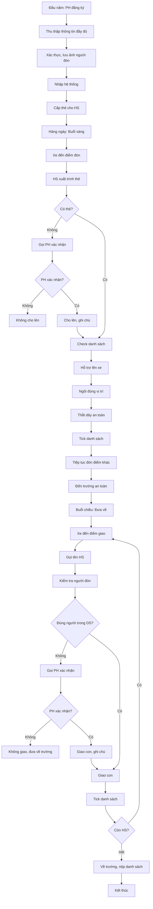

# SOP-02.5: QUẢN LÝ PHỤ HUYNH VÀ HỌC SINH

## 1. THÔNG TIN QUY TRÌNH

| **Thuộc tính** | **Nội dung** |
|---|---|
| Mã SOP | SOP-02.5 |
| Tên quy trình | Quản lý phụ huynh và học sinh trên xe |
| Quy trình cha | SOP-02: Quản lý xe đưa đón |
| Phiên bản | 1.0 |
| Ngày ban hành | [Ngày/Tháng/Năm] |
| Người phê duyệt | Hiệu trưởng |
| Phạm vi áp dụng | Tất cả phụ huynh và học sinh sử dụng xe |
| Cập nhật | Liên tục (khi có thay đổi) |

## 2. MỤC ĐÍCH

- **Xác thực danh tính**: Đón đúng học sinh, giao đúng người
- **Đảm bảo an toàn**: Không để HS thất lạc, bị bắt cóc
- **Giao tiếp hiệu quả**: Thông tin rõ ràng, kịp thời với phụ huynh
- **Quản lý thông tin**: Cập nhật chính xác địa chỉ, số điện thoại, người đón
- **Xử lý linh hoạt**: Đáp ứng nhu cầu thay đổi đột xuất của phụ huynh

## 3. QUY TRÌNH THỰC HIỆN

### 3.1. Đăng ký và quản lý thông tin

**Bước 1: Thu thập hồ sơ đăng ký**

Form đăng ký (QT01-F41) bao gồm:

| **Thông tin** | **Yêu cầu** |
|---|---|
| Họ tên học sinh | Đầy đủ, đúng giấy khai sinh |
| Lớp | Ghi rõ khối, lớp |
| Địa chỉ đón | Số nhà, ngõ, mốc nổi bật |
| Tọa độ GPS | Chính xác đến 10m |
| SĐT phụ huynh | 2 số (bố + mẹ) |
| **Người được phép đón** | **Họ tên, mối quan hệ, SĐT, ẢNH** |
| Tình trạng sức khỏe | Dị ứng, bệnh mãn tính, thuốc thường dùng |
| Ghi chú | Đặc điểm nhận dạng, yêu cầu đặc biệt |

⚠️ **QUAN TRỌNG:** Phải có **ẢNH** của tất cả người được phép đón!

**Bước 2: Xác thực và lưu trữ**

- Đối chiếu thông tin với hồ sơ học sinh
- Kiểm tra ảnh người đón (rõ mặt)
- Nhập vào hệ thống quản lý xe
- Tạo thẻ học sinh (có ảnh, mã QR)
- Lưu bản cứng + bản mềm
- Cấp cho tài xế danh sách có ảnh

**Bước 3: Hướng dẫn phụ huynh**

Phổ biến Quy định đưa đón:
- Giờ xe đến (± 5 phút)
- Điểm đón cố định
- Người đón phải mang CMND, thẻ được cấp
- Học sinh phải có thẻ học sinh
- Báo nghỉ trước 7:00 sáng
- Báo thay đổi trước 1 ngày

### 3.2. Điểm danh và giao nhận hàng ngày

**Bước 4: Điểm danh khi đón (Buổi sáng)**

Tại mỗi điểm đón:
1. Xe dừng đúng vị trí, bật đèn xi-nhan
2. NV hỗ trợ xuống kiểm tra an toàn
3. HS đến, xuất trình thẻ hoặc PH nói tên
4. NV check danh sách (☑ đúng người)
5. Hỗ trợ HS lên xe an toàn
6. HS ngồi vào vị trí cố định, thắt dây an toàn
7. NV check lại, tick vào danh sách
8. Xe chạy tiếp

**Nếu HS không có thẻ:**
- Gọi điện xác nhận với PH
- Nếu không liên lạc được → Không cho lên (an toàn)

**Bước 5: Giao học sinh (Buổi chiều)**

Tại mỗi điểm giao:
1. Xe dừng, NV gọi tên học sinh
2. Kiểm tra có người đón không
3. **XÁC THỰC NGƯỜI ĐÓN:**
   - Đối chiếu ảnh trong danh sách
   - Yêu cầu xuất trình CMND (lần đầu)
   - Nếu lạ mặt: Gọi PH xác nhận
4. Chỉ giao con khi chắc chắn 100%
5. Tick vào danh sách
6. Xe chạy tiếp

**NGUYÊN TẮC VÀNG:**
🔒 **Không giao con nếu nghi ngờ bất kỳ điều gì!**

**Bước 6: Xử lý học sinh không có người đón**

Nếu đến điểm đón mà không có người:
1. Chờ 5 phút, gọi điện cho PH
2. Nếu PH nói đang trên đường → Chờ thêm 10 phút
3. Nếu không liên lạc được → Đưa em về trường
4. Nhân viên văn phòng trường gọi PH, chờ đón
5. Ghi nhận vào sổ, lần sau xử lý

### 3.3. Xử lý thay đổi đột xuất

**Bước 7: Thay đổi điểm đón**

PH báo thay đổi điểm đón:
- Nếu báo trước ≥ 1 ngày: Xem xét điều chỉnh
- Nếu báo đột xuất sáng: Từ chối (trừ trường hợp đặc biệt)
- Phải có lý do chính đáng
- Điểm mới phải thuận lộ trình

**Bước 8: Thay đổi người đón**

PH báo người khác đón:
- Phải báo trước, cung cấp: Họ tên, SĐT, Ảnh, Mối quan hệ
- NV cập nhật vào hệ thống
- In ảnh cho tài xế
- Xác thực kỹ khi giao con

**Bước 9: Học sinh nghỉ học**

- PH báo nghỉ trước 7:00 (qua app/điện thoại)
- Ghi vào nhật ký, xe không đến đón
- Tiết kiệm thời gian cho HS khác

## 4. LƯU ĐỒ QUY TRÌNH

## 5. BIỂU MẪU

| **Mã** | **Tên** |
|---|---|
| QT01-F41 | Form đăng ký đưa đón |
| QT01-F42 | Danh sách người được phép đón (có ảnh) |
| QT01-F43 | Thẻ học sinh xe buýt |
| QT01-F44 | Nhật ký điểm danh hàng ngày |
| QT01-F45 | Phiếu xác nhận người đón lạ |

## 6. QUY ĐỊNH CHUNG

### 6.1. Quy định với học sinh

✅ **Học sinh PHẢI:**
- Mang thẻ xe buýt hàng ngày
- Đến điểm đón đúng giờ (trước 5 phút)
- Ngồi đúng chỗ, thắt dây an toàn
- Giữ trật tự, không la hét
- Không ăn uống trên xe
- Nghe lời tài xế, nhân viên

❌ **Học sinh KHÔNG ĐƯỢC:**
- Đứng, chạy nhảy trên xe
- Ném đồ, đánh bạn
- Bỏ rác bừa bãi
- Tự ý mở cửa khi xe đang chạy

### 6.2. Quy định với phụ huynh

✅ **Phụ huynh PHẢI:**
- Đưa con ra điểm đón đúng giờ
- Thay đổi phải báo trước
- Chỉ người trong danh sách được đón
- Tôn trọng tài xế, nhân viên

❌ **Phụ huynh KHÔNG NÊN:**
- Yêu cầu xe đợi quá lâu (> 3 phút)
- Thay đổi điểm đón liên tục
- La mắng tài xế trước mặt con

## 7. XỬ LÝ VI PHẠM

| **Vi phạm của HS** | **Xử lý** |
|---|---|
| Không mang thẻ nhiều lần | Nhắc nhở PH, phạt không cho lên lần 3 |
| Không thắt dây an toàn | Nhắc mỗi lần, báo PH nếu cố tình |
| Đánh bạn, phá hoại | Báo trường xử lý kỷ luật |

| **Vi phạm của PH** | **Xử lý** |
|---|---|
| Thường xuyên cho con đi muộn | Nhắc nhở, cảnh báo không đợi |
| Thay đổi điểm đón bất thường | Từ chối dịch vụ nếu không cải thiện |
| Thái độ xấu với nhân viên | Báo trường, mời làm việc |

---

**PHÊ DUYỆT**

| Người soạn thảo | Trưởng phòng Xe | Hiệu trưởng |
|---|---|---|
| [Họ tên] | [Họ tên] | [Họ tên] |
| Ngày: ___/___/___ | Ngày: ___/___/___ | Ngày: ___/___/___ |
