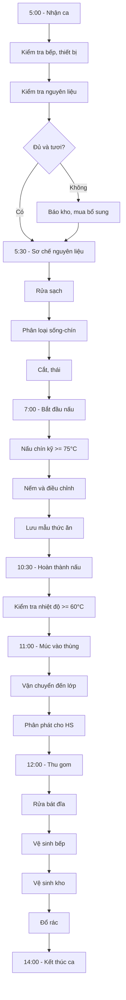

# SOP-03.1: QUY TRÌNH QUẢN LÝ BẾP

## 1. THÔNG TIN QUY TRÌNH

| **Thuộc tính** | **Nội dung** |
|---|---|
| Mã SOP | SOP-03.1 |
| Tên quy trình | Quy trình quản lý bếp ăn |
| Quy trình cha | SOP-03: Quản lý bếp ăn |
| Phiên bản | 1.0 |
| Ngày ban hành | [Ngày/Tháng/Năm] |
| Người phê duyệt | Hiệu trưởng |
| Phạm vi áp dụng | Bếp ăn trường học |
| Tham chiếu | Nghị định 83/2017/NĐ-CP, ISO 22000:2018 |

## 2. MỤC ĐÍCH

- **Đảm bảo ATTP tuyệt đối**: Ngăn ngừa 100% ngộ độc thực phẩm
- **Tổ chức bếp khoa học**: Quy trình rõ ràng, hiệu quả, tiết kiệm
- **Tuân thủ quy định**: Đáp ứng Nghị định 83/2017 về ATTP
- **Cung cấp bữa ăn chất lượng**: Ngon, đủ dinh dưỡng, đa dạng

## 3. CẤU TRÚC TỔ CHỨC BẾP

| **Vị trí** | **Số lượng** | **Trách nhiệm chính** |
|---|---|---|
| Trưởng bếp | 1 | Quản lý toàn bộ bếp, menu, nhân viên |
| Phó bếp | 1 | Hỗ trợ Trưởng bếp, phụ trách ca 2 |
| Bếp trưởng | 2-3 | Nấu món chính, kiểm soát chất lượng |
| Phụ bếp | 4-6 | Sơ chế, nấu phụ, dọn dẹp |
| Nhân viên kho | 1 | Quản lý kho, nhập xuất nguyên liệu |
| Nhân viên vệ sinh | 2 | Vệ sinh bếp, dụng cụ |

## 4. QUY TRÌNH VẬN HÀNH HÀNG NGÀY

### 4.1. Chuẩn bị (5:00 - 7:00)

**Bước 1: Nhận ca và kiểm tra (5:00)**

| **Kiểm tra** | **Tiêu chí** |
|---|---|
| Vệ sinh bếp | Sạch sẽ, không mùi hôi |
| Thiết bị | Hoạt động tốt (bếp, nồi, tủ lạnh...) |
| Nguyên liệu | Đủ theo menu, còn tươi |
| Gia vị, nước | Đầy đủ, chưa hết hạn |
| Dụng cụ | Đủ số lượng, sạch sẽ |

**Bước 2: Sơ chế nguyên liệu (5:30)**

*Nguyên tắc 3 KHÔNG:*
- **KHÔNG** dùng nguyên liệu hết hạn, hỏng
- **KHÔNG** để nguyên liệu sống chạm vào thức ăn chín
- **KHÔNG** dùng chung dao, thớt sống-chín

*Quy trình:*
1. Rửa tay sạch, đeo găng tay
2. Phân loại: Rau - Thịt - Cá
3. Rửa sạch nhiều lần (rau ≥ 3 lần)
4. Để ráo nước
5. Cắt, thái đúng kích cỡ
6. Cho vào khay riêng, có nắp đậy

### 4.2. Chế biến (7:00 - 11:00)

**Bước 3: Nấu theo menu**

| **Nguyên tắc** | **Giải thích** |
|---|---|
| Nấu chín kỹ | Nhiệt độ trung tâm ≥ 75°C, giết hết vi khuẩn |
| Không để qua đêm | Thức ăn nấu trong ngày, ăn trong ngày |
| Nếm đúng cách | Dùng muỗng sạch, không nếm trực tiếp |
| Ướp gia vị vừa phải | Phù hợp khẩu vị trẻ em, ít mặn, ít cay |

**Bước 4: Lưu mẫu thức ăn (Bắt buộc!)**

- Lấy mẫu mỗi món ≥ 100g
- Cho vào túi nilon sạch, dán nhãn (tên món, ngày, giờ)
- Bảo quản tủ lạnh 4-6°C
- Lưu trong 48 giờ
- Tiêu hủy sau 48 giờ nếu không có sự cố

### 4.3. Phân phát (11:00 - 11:30)

**Bước 5: Chuẩn bị phân phát**

- Kiểm tra nhiệt độ thức ăn (≥ 60°C)
- Múc vào thùng inox có nắp đậy
- Vận chuyển bằng xe đẩy sạch
- Đến lớp đúng giờ

**Bước 6: Phân phát cho học sinh**

- Rửa tay trước khi phát
- Đeo khẩu trang, mũ, tạp dề
- Múc đủ khẩu phần (theo độ tuổi)
- Không để tóc, dị vật rơi vào thức ăn

### 4.4. Dọn dẹp và vệ sinh (12:00 - 14:00)

**Bước 7: Thu gom và vệ sinh**

1. Thu thức ăn thừa → Thùng rác riêng
2. Rửa bát đĩa: Xà phòng → Nước sạch → Để ráo
3. Vệ sinh bếp: Lau bếp, nồi, tường, sàn
4. Vệ sinh kho: Quét, lau, kiểm tra côn trùng
5. Đổ rác đúng nơi quy định
6. Rửa tay, thay quần áo

## 5. LƯU ĐỒ QUY TRÌNH

## 6. TIÊU CHUẨN VỆ SINH BẾP

| **Khu vực** | **Tiêu chuẩn** | **Tần suất** |
|---|---|---|
| Khu chế biến | Sạch, không dầu mỡ bám | Sau mỗi ca |
| Kho | Sạch, khô ráo, không côn trùng | Hàng ngày |
| Tủ lạnh | Sạch, không mùi, phân vùng rõ | Hàng tuần |
| Sàn nhà | Sạch, khô, không trơn | Sau mỗi ca |
| Thùng rác | Đậy kín, đổ mỗi ngày | Hàng ngày |

## 7. BIỂU MẪU

| **Mã** | **Tên** |
|---|---|
| QT01-F46 | Sổ theo dõi hoạt động bếp hàng ngày |
| QT01-F47 | Phiếu lưu mẫu thức ăn |
| QT01-F48 | Nhật ký nhiệt độ (nấu, bảo quản) |
| QT01-F49 | Checklist vệ sinh bếp |

## 8. QUY ĐỊNH CHUNG

### 8.1. Quy định nhân viên bếp

✅ **PHẢI:**
- Mặc đồng phục sạch, đội mũ, đeo khẩu trang
- Rửa tay trước khi vào bếp, sau khi đi vệ sinh
- Cắt tóc, móng tay ngắn
- Khám sức khỏe 6 tháng/lần

❌ **KHÔNG ĐƯỢC:**
- Đeo trang sức khi nấu
- Hút thuốc trong khu bếp
- Nấu khi ốm (tiêu chảy, sốt, ho...)
- Để tóc, móng tay dài

### 8.2. Nguyên tắc 5 KHÔNG

1. **KHÔNG** dùng thực phẩm không rõ nguồn gốc
2. **KHÔNG** để thức ăn chín chạm vào sống
3. **KHÔNG** dùng thức ăn qua đêm
4. **KHÔNG** để thức ăn nhiệt độ nguy hiểm (5-60°C > 2 giờ)
5. **KHÔNG** phục vụ khi còn nghi ngờ

---

**PHÊ DUYỆT**

| Người soạn thảo | Trưởng bếp | Hiệu trưởng |
|---|---|---|
| [Họ tên] | [Họ tên] | [Họ tên] |
| Ngày: ___/___/___ | Ngày: ___/___/___ | Ngày: ___/___/___ |
