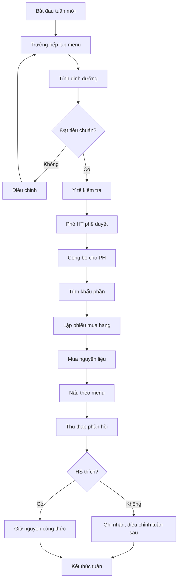

# SOP-03.2: XÂY DỰNG THỰC ĐƠN

## 1. THÔNG TIN QUY TRÌNH

| **Thuộc tính** | **Nội dung** |
|---|---|
| Mã SOP | SOP-03.2 |
| Tên quy trình | Xây dựng thực đơn dinh dưỡng |
| Quy trình cha | SOP-03: Quản lý bếp ăn |
| Phiên bản | 1.0 |
| Phạm vi áp dụng | Menu bữa ăn học sinh tất cả cấp |
| Chu kỳ | Tuần (menu chi tiết), Tháng (điều chỉnh), Học kỳ (đổi mới) |

## 2. MỤC ĐÍCH

- **Đảm bảo dinh dưỡng**: Đủ năng lượng, protein, vitamin cho độ tuổi
- **Đa dạng hóa**: Không trùng lặp, đủ 4 nhóm thực phẩm
- **An toàn**: Tránh thực phẩm dễ dị ứng, độc hại
- **Phù hợp khẩu vị**: Món ngon, trẻ thích ăn

## 3. TIÊU CHUẨN DINH DƯỠNG

| **Cấp học** | **Năng lượng/bữa** | **Protein** | **Chất béo** | **Ghi chú** |
|---|---|---|---|---|
| Mầm non (3-5 tuổi) | 400-500 kcal | 15-20g | 12-15g | Cắt nhỏ, mềm |
| Tiểu học (6-10 tuổi) | 550-650 kcal | 20-25g | 15-18g | Đa dạng |
| THCS (11-14 tuổi) | 700-800 kcal | 25-30g | 18-22g | Nhiều rau, trái cây |

## 4. QUY TRÌNH XÂY DỰNG MENU

**Bước 1: Lập menu tuần**

Nguyên tắc:
- 5 ngày không trùng món chính
- Mỗi ngày có: Cơm/Bún/Phở + Thịt/Cá/Trứng + Rau + Canh + Trái cây
- Cân bằng nhóm thực phẩm:
  - Nhóm 1 (Bột đường): 50-60%
  - Nhóm 2 (Rau củ): 20-25%
  - Nhóm 3 (Protein): 15-20%
  - Nhóm 4 (Béo): 5-10%

**Bước 2: Tham khảo và phê duyệt**

- Trưởng bếp đề xuất menu
- Y tế trường kiểm tra dinh dưỡng
- Phó Hiệu trưởng phê duyệt
- Công bố cho phụ huynh (qua app/website)

**Bước 3: Tính khẩu phần và mua sắm**

- Tính lượng nguyên liệu/học sinh
- Nhân với số HS ăn bán trú
- Dự phòng +10%
- Lập phiếu mua hàng

## 5. LƯU ĐỒ QUY TRÌNH

## 6. MẪU MENU TUẦN

| **Ngày** | **Món chính** | **Rau** | **Canh** | **Tráng miệng** |
|---|---|---|---|---|
| Thứ 2 | Thịt kho tàu | Rau luộc | Canh chua | Chuối |
| Thứ 3 | Cá kho | Rau xào | Canh rau | Cam |
| Thứ 4 | Gà chiên | Salad | Súp gà | Táo |
| Thứ 5 | Trứng chiên | Rau luộc | Canh đậu | Nho |
| Thứ 6 | Tôm rim | Rau xào | Canh cải | Dưa hấu |

---

**PHÊ DUYỆT**

| Trưởng bếp | Y tế trường | Phó Hiệu trưởng |
|---|---|---|
| [Họ tên] | [Họ tên] | [Họ tên] |
| Ngày: ___/___/___ | Ngày: ___/___/___ | Ngày: ___/___/___ |
