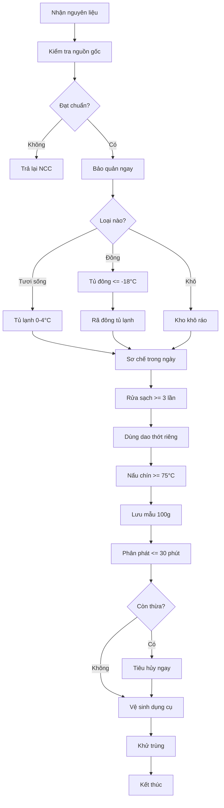

# SOP-03.3: VỆ SINH AN TOÀN THỰC PHẨM

## 1. THÔNG TIN QUY TRÌNH

| **Thuộc tính** | **Nội dung** |
|---|---|
| Mã SOP | SOP-03.3 |
| Tên quy trình | Vệ sinh an toàn thực phẩm |
| Quy trình cha | SOP-03: Quản lý bếp ăn |
| Phiên bản | 1.0 |
| Tham chiếu | Nghị định 83/2017/NĐ-CP, Thông tư 15/2018/TT-BYT |
| Mục tiêu | **ZERO ngộ độc thực phẩm** |

## 2. MỤC ĐÍCH

- **Ngăn ngừa ngộ độc**: Đảm bảo 100% thức ăn an toàn
- **Kiểm soát nguồn gốc**: Chỉ dùng thực phẩm rõ ràng, chứng nhận
- **Quy trình chế biến đúng**: Giết vi khuẩn, tránh nhiễm chéo
- **Vệ sinh môi trường**: Bếp sạch, không côn trùng, chuột

## 3. NGUYÊN TẮC 5 SẠCH

| **Sạch** | **Nội dung** | **Cách thực hiện** |
|---|---|---|
| **1. Sạch NGUỒN GỐC** | Thực phẩm an toàn từ đầu | Mua từ nhà cung cấp uy tín, có hóa đơn, CO, CQ |
| **2. Sạch TAY** | Tay sạch khi chạm thức ăn | Rửa tay 6 bước, đeo găng tay |
| **3. Sạch DỤNG CỤ** | Dao, thớt, nồi, bát sạch | Rửa sạch, khử trùng, phân loại sống-chín |
| **4. Sạch CHẾ BIẾN** | Nấu chín, nhiệt độ đủ | Nhiệt độ trung tâm ≥ 75°C, duy trì ≥ 60°C |
| **5. Sạch MÔI TRƯỜNG** | Bếp, kho, WC sạch | Vệ sinh sau mỗi ca, diệt khuẩn định kỳ |

## 4. QUY TRÌNH VỆ SINH

### 4.1. Vệ sinh cá nhân

**Rửa tay 6 bước (theo WHO):**
1. Ướt tay, bôi xà phòng
2. Chà mu bàn tay
3. Chà kẽ ngón
4. Chà mu lòng bàn tay
5. Chà ngón cái
6. Chà đầu ngón, rửa sạch

**Khi nào phải rửa tay:**
- Trước khi vào bếp
- Sau khi đi vệ sinh
- Sau khi chạm rác, vật bẩn
- Sau khi chạm thực phẩm sống
- Trước khi chạm thức ăn chín

### 4.2. Vệ sinh thực phẩm

| **Loại** | **Cách rửa** | **Ghi chú** |
|---|---|---|
| Rau sống | Rửa ≥ 3 lần, ngâm muối 10 phút | Loại bỏ sâu, thuốc trừ sâu |
| Thịt, cá | Rửa nước sạch 2 lần | Không ngâm lâu (mất chất) |
| Trứng | Rửa vỏ trước khi đập | Tránh vi khuẩn vào món ăn |
| Trái cây | Rửa, gọt vỏ | Phục vụ ngay |

### 4.3. Vệ sinh dụng cụ

**Dao, thớt:**
- Phân loại: Sống (đỏ), Chín (xanh), Rau (vàng)
- Rửa xà phòng → Nước sạch → Phơi khô/Lau khô
- Khử trùng hàng ngày (nước sôi hoặc tủ sấy)

**Bát, đĩa:**
1. Cạo bỏ thức ăn thừa
2. Ngâm nước xà phòng 5 phút
3. Chà rửa sạch
4. Tráng nước sạch ≥ 2 lần
5. Để ráo hoặc lau khô
6. Úp ngược vào giá

## 5. KIỂM SOÁT NHIỆT ĐỘ

| **Giai đoạn** | **Nhiệt độ** | **Thời gian** |
|---|---|---|
| Bảo quản lạnh | 0-4°C | Liên tục |
| Bảo quản đông | ≤ -18°C | Liên tục |
| Rã đông | < 5°C (tủ lạnh) | 12-24 giờ |
| Chế biến | ≥ 75°C (trung tâm) | Ít nhất 1 phút |
| Giữ nóng | ≥ 60°C | Tối đa 2 giờ |
| **NGUY HIỂM** | **5-60°C** | **< 2 giờ** |

⚠️ **Thức ăn để trong khoảng 5-60°C quá 2 giờ = TIÊU HỦY!**

## 6. LƯU ĐỒ QUY TRÌNH

## 7. 5 NGUYÊN NHÂN NGỘ ĐỘC & PHÒNG NGỪA

| **Nguyên nhân** | **Ví dụ** | **Phòng ngừa** |
|---|---|---|
| **1. Nguồn gốc bẩn** | Rau có thuốc sâu, thịt ôi | Mua từ nguồn uy tín, kiểm tra kỹ |
| **2. Không rửa sạch** | Còn đất, thuốc, sâu bọ | Rửa ≥ 3 lần, ngâm muối |
| **3. Nhiễm chéo** | Dao thớt sống chạm chín | Phân loại rõ ràng, rửa sau mỗi lần |
| **4. Nấu chưa chín** | Thịt còn hồng, trứng lòng đào | Nhiệt độ ≥ 75°C, nấu đủ thời gian |
| **5. Bảo quản sai** | Để thức ăn ngoài trời lâu | Tủ lạnh ngay, giữ nóng đúng nhiệt độ |

## 8. TIÊU CHUẨN VỆ SINH

| **Đối tượng** | **Tiêu chuẩn** | **Test** |
|---|---|---|
| Nước rửa rau | Nước sạch, đạt QCVN 01:2009 | Xét nghiệm 6 tháng/lần |
| Dụng cụ | Không có E.coli, Coliform | Test 3 tháng/lần |
| Tay nhân viên | Sạch, không vi khuẩn | Kiểm tra định kỳ |
| Không khí bếp | Thoáng, không khói bụi | Quan sát |

## 9. XỬ LÝ NGHI NGỜ NGỘ ĐỘC

**Nếu nghi ngờ thức ăn có vấn đề:**
1. **DỪNG PHỤC VỤ NGAY**
2. Cách ly mẫu thức ăn
3. Báo Y tế trường + Ban Giám hiệu
4. Gửi mẫu đi xét nghiệm
5. Điều tra nguyên nhân
6. Xử lý trách nhiệm

**Nếu có HS ngộ độc:**
1. Sơ cứu, gọi 115
2. Bảo tồn mẫu thức ăn
3. Dừng bếp, kiểm tra toàn bộ
4. Báo cơ quan chức năng
5. Phối hợp điều tra

---

**PHÊ DUYỆT**

| Trưởng bếp | Y tế trường | Hiệu trưởng |
|---|---|---|
| [Họ tên] | [Họ tên] | [Họ tên] |
| Ngày: ___/___/___ | Ngày: ___/___/___ | Ngày: ___/___/___ |
