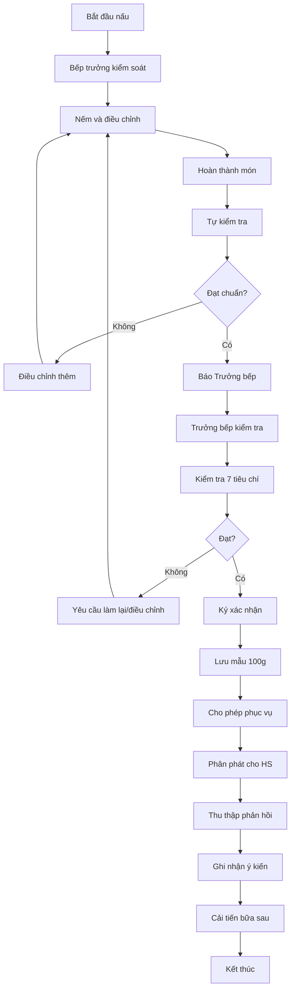

# SOP-03.5: KIỂM SOÁT CHẤT LƯỢNG MÓN ĂN

## 1. THÔNG TIN QUY TRÌNH

| **Thuộc tính** | **Nội dung** |
|---|---|
| Mã SOP | SOP-03.5 |
| Tên quy trình | Kiểm soát chất lượng món ăn |
| Quy trình cha | SOP-03: Quản lý bếp ăn |
| Phiên bản | 1.0 |
| Tần suất | Hàng ngày (mỗi bữa ăn) |

## 2. MỤC ĐÍCH

- **Đảm bảo chất lượng ổn định**: Mỗi bữa ăn đều ngon, an toàn
- **Kiểm soát từ đầu đến cuối**: Từ nguyên liệu → chế biến → phục vụ
- **Phát hiện sớm vấn đề**: Kịp thời điều chỉnh trước khi phục vụ
- **Cải tiến liên tục**: Dựa trên phản hồi học sinh, phụ huynh

## 3. TIÊU CHUẨN CHẤT LƯỢNG

### 3.1. Tiêu chuẩn cảm quan

| **Tiêu chí** | **Đạt** | **Không đạt** |
|---|---|---|
| **Màu sắc** | Tự nhiên, bắt mắt | Xám xịt, nhợt nhạt, đen khét |
| **Mùi vị** | Thơm, đúng món, vừa miệng | Tanh, hôi, ôi, quá mặn/nhạt |
| **Kết cấu** | Vừa mềm, vừa giòn, phù hợp | Quá nhũn, quá cứng, khô |
| **Nhiệt độ** | Nóng ≥ 60°C, lạnh ≤ 5°C | Âm ấm (5-60°C) |
| **Ngoại quan** | Sạch, không dị vật | Có tóc, ruồi, vật lạ |

### 3.2. Tiêu chuẩn an toàn

- Nguyên liệu: Tươi, chưa hết hạn, rõ nguồn gốc
- Chế biến: Nhiệt độ đủ, thời gian đúng
- Không chứa: Hóa chất, thuốc tăng trọng, chất cấm
- Vi sinh: Đạt TCVN 7304:2016

## 4. QUY TRÌNH KIỂM TRA

### 4.1. Kiểm tra 3 cấp

**Cấp 1: Tự kiểm (Bếp trưởng)**
- Khi đang nấu: Nếm, điều chỉnh
- Trước khi lên phục vụ: Kiểm tra tổng thể
- Điền vào Phiếu tự kiểm (Form QT01-F50)

**Cấp 2: Trưởng bếp kiểm tra**
- Mỗi bữa ăn, trước khi lên lớp
- Kiểm tra tất cả món
- Ký xác nhận "Đủ điều kiện phục vụ"

**Cấp 3: Ban kiểm tra liên ngành (Ngẫu nhiên)**
- Y tế trường + Phó HT
- 2 lần/tháng (không báo trước)
- Kiểm tra toàn diện: Kho → Chế biến → Phục vụ

### 4.2. Checklist kiểm tra món ăn

- [ ] Màu sắc: Đẹp, tự nhiên
- [ ] Mùi: Thơm, không tanh, hôi
- [ ] Vị: Vừa ăn, cân bằng
- [ ] Nhiệt độ: ≥ 60°C
- [ ] Lượng: Đủ khẩu phần
- [ ] Vệ sinh: Sạch, không dị vật
- [ ] Lưu mẫu: Đã lưu 100g

## 5. LƯU ĐỒ QUY TRÌNH

## 6. THU THẬP PHẢN HỒI

### 6.1. Từ học sinh

- Quan sát: HS ăn hết không?
- Hỏi trực tiếp: "Các em thấy ngon không?"
- Phiếu đánh giá (cho HS lớn): ☺ ☹
- Ghi nhận món nào HS thích/không thích

### 6.2. Từ giáo viên

- Giáo viên ăn cùng HS, đánh giá
- Báo cáo món nào tốt/chưa tốt
- Đề xuất cải tiến

### 6.3. Từ phụ huynh

- Khảo sát tháng
- Xem menu trên app, góp ý
- Tham quan bếp (mời định kỳ)

## 7. CẢI TIẾN LIÊN TỤC

**Họp bếp hàng tuần:**
- Đánh giá menu tuần
- Phân tích món nào được ưa thích
- Thử món mới
- Chia sẻ công thức hay

**Thi nấu ăn:**
- 3 tháng/lần
- Bếp trưởng trình diễn món mới
- Chọn món ngon nhất đưa vào menu

---

**PHÊ DUYỆT**

| Trưởng bếp | Y tế trường | Hiệu trưởng |
|---|---|---|
| [Họ tên] | [Họ tên] | [Họ tên] |
