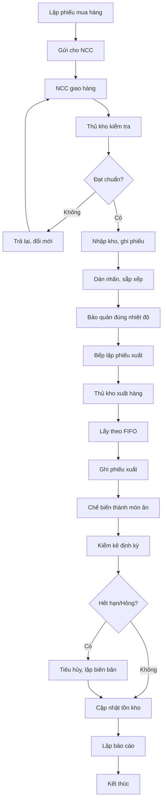

# SOP-03.6: QUẢN LÝ NGUYÊN LIỆU VÀ KHO

## 1. THÔNG TIN QUY TRÌNH

| **Thuộc tính** | **Nội dung** |
|---|---|
| Mã SOP | SOP-03.6 |
| Tên quy trình | Quản lý nguyên liệu và kho |
| Quy trình cha | SOP-03: Quản lý bếp ăn |
| Phiên bản | 1.0 |
| Phạm vi áp dụng | Kho thực phẩm, nguyên liệu |

## 2. MỤC ĐÍCH

- **Kiểm soát nguồn gốc**: Chỉ nhập thực phẩm an toàn, rõ ràng
- **Bảo quản đúng cách**: Giữ thực phẩm tươi ngon, không hỏng
- **Quản lý tồn kho**: Không thiếu, không dư thừa lãng phí
- **Truy xuất nguồn gốc**: Nhanh chóng khi có sự cố

## 3. TIÊU CHUẨN NGUYÊN LIỆU

### 3.1. Nhà cung cấp

| **Tiêu chí** | **Yêu cầu** |
|---|---|
| Giấy phép | Có giấy ĐKKD, giấy ATTP |
| Uy tín | Hoạt động ≥ 2 năm, có danh tiếng tốt |
| Chứng nhận | CO, CQ cho từng lô hàng |
| Giao hàng | Xe chuyên dụng, đúng giờ |
| Giá cả | Cạnh tranh, minh bạch |

### 3.2. Tiêu chuẩn nguyên liệu

| **Loại** | **Tiêu chuẩn** |
|---|---|
| Thịt, cá | Tươi, không nhớt, mùi tự nhiên, nguồn gốc rõ |
| Rau củ | Tươi xanh, không úa, không thuốc sâu |
| Trứng | Vỏ sạch, không nứt, còn tươi |
| Gạo, bột | Hạt đều, không mốc, mùi thơm |
| Dầu ăn | Trong, không tanh, chưa hết hạn |
| Gia vị | Còn hạn, đóng gói kín |

## 4. QUY TRÌNH NHẬP - XUẤT - TỒN

### 4.1. Nhập kho

**Bước 1: Kiểm tra hàng nhập**

- Đối chiếu với đơn hàng
- Kiểm tra chất lượng, hạn sử dụng
- Yêu cầu CO, CQ (thịt, cá, trứng)
- Cân, đong, đếm số lượng
- Nhiệt độ (thực phẩm tươi phải lạnh ≤ 10°C)

**Bước 2: Nhập kho**

- Ghi Phiếu nhập kho (ngày, NCC, loại, số lượng, giá)
- Dán nhãn (tên, ngày nhập, hạn SD)
- Sắp xếp: Cũ trước, mới sau (FIFO)
- Bảo quản ngay (tủ lạnh, kho khô)

### 4.2. Xuất kho

- Phiếu xuất kho (có chữ ký Trưởng bếp)
- Lấy hàng cũ trước (FIFO)
- Ghi số lượng thực xuất
- Cập nhật tồn kho

### 4.3. Kiểm kê tồn kho

- **Hàng ngày**: Kiểm đếm nhanh hàng tươi
- **Hàng tuần**: Kiểm kê toàn bộ
- **Hàng tháng**: Kiểm kê chính thức, đối chiếu sổ sách

## 5. BẢO QUẢN

| **Loại** | **Nhiệt độ** | **Thời gian** | **Lưu ý** |
|---|---|---|---|
| Thịt sống | 0-4°C | 1-2 ngày | Bọc kín, ngăn riêng |
| Cá sống | 0-4°C | 1 ngày | Dùng càng sớm càng tốt |
| Rau xanh | 0-4°C | 2-3 ngày | Không rửa trước, để trong túi |
| Thịt đông | ≤ -18°C | 1-3 tháng | Đóng gói kín |
| Gạo, bột | Khô ráo, thoáng | 3-6 tháng | Tránh ẩm, côn trùng |
| Gia vị khô | Khô ráo | Đến hết hạn SD | Đậy kín sau dùng |

## 6. LƯU ĐỒ QUY TRÌNH

## 7. QUẢN LÝ KHO

### 7.1. Yêu cầu kho

- Sàn: Cao, khô ráo, dễ vệ sinh
- Thông gió: Tốt, có quạt, cửa sổ
- Chiếu sáng: Đủ sáng
- Nhiệt độ: Mát, < 30°C
- Chống côn trùng: Lưới cửa, bẫy chuột
- Phòng cháy: Có bình chữa cháy

### 7.2. Sắp xếp kho

| **Vùng** | **Thực phẩm** |
|---|---|
| Tủ lạnh 1 | Thịt, cá, trứng |
| Tủ lạnh 2 | Rau, củ, trái cây |
| Tủ đông | Thực phẩm đông |
| Kệ A | Gạo, bột, mì |
| Kệ B | Dầu, gia vị |
| Kệ C | Đồ hộp, đóng gói |

### 7.3. Vệ sinh kho

- **Hàng ngày**: Quét sàn, lau kệ
- **Hàng tuần**: Vệ sinh tủ lạnh, kiểm tra côn trùng
- **Hàng tháng**: Đại vệ sinh, phun thuốc (an toàn thực phẩm)

## 8. XỬ LÝ THỰC PHẨM HẾT HẠN/HỎNG

**Quy trình:**
1. Phát hiện → Tách riêng ngay
2. Dán nhãn "TIÊU HỦY - Không sử dụng"
3. Lập biên bản tiêu hủy (có chứng kiến)
4. Chụp ảnh
5. Tiêu hủy đúng quy định
6. Báo cáo Trưởng bếp
7. Phân tích nguyên nhân (mua nhiều? bảo quản sai?)

---

**PHÊ DUYỆT**

| Thủ kho | Trưởng bếp | Hiệu trưởng |
|---|---|---|
| [Họ tên] | [Họ tên] | [Họ tên] |
