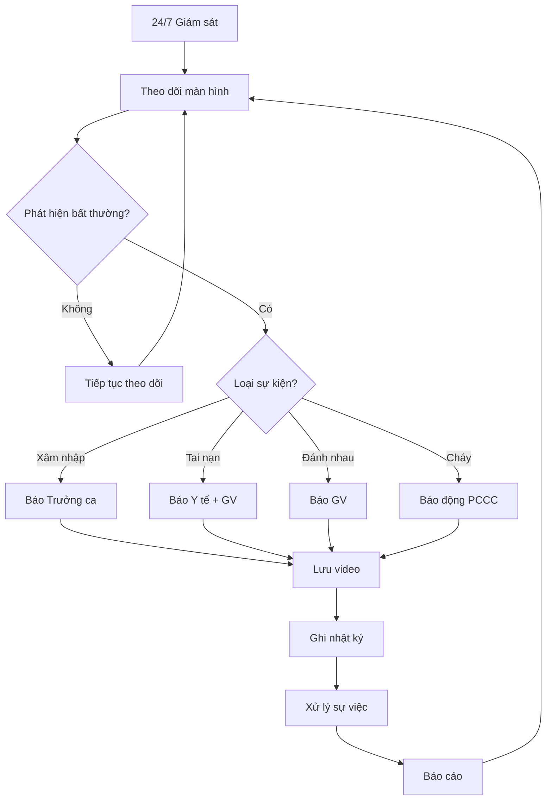

# SOP-04.1: GIÁM SÁT CAMERA

## 1. THÔNG TIN QUY TRÌNH

| **Thuộc tính** | **Nội dung** |
|---|---|
| Mã SOP | SOP-04.1 |
| Tên quy trình | Giám sát hệ thống camera an ninh |
| Quy trình cha | SOP-04: Quản lý bảo vệ - Ra vào |
| Phạm vi áp dụng | Hệ thống camera toàn trường |
| Thời gian | 24/7 (Liên tục) |

## 2. HỆ THỐNG CAMERA

| **Vị trí** | **Số lượng** | **Loại** | **Mục đích** |
|---|---|---|---|
| Cổng chính | 2 | HD, góc rộng | Nhận diện ra vào |
| Sân trường | 4-6 | PTZ, xoay 360° | Theo dõi hoạt động HS |
| Hành lang | 10-15 | Cố định | Giám sát di chuyển |
| Cầu thang | 5-8 | Góc cao | Phát hiện tai nạn |
| Bãi xe | 2-3 | Hồng ngoại | Chống trộm xe |
| Kho, bếp | 3-4 | Cố định | Giám sát tài sản |
| Phòng học | Tùy chọn | Không bắt buộc | Theo dõi giờ học |

## 3. QUY TRÌNH VẬN HÀNH

### 3.1. Giám sát trực tiếp

**Ca 1 (6:00-14:00):** Bảo vệ 1
**Ca 2 (14:00-22:00):** Bảo vệ 2
**Ca 3 (22:00-6:00):** Bảo vệ 3

**Nhiệm vụ:**
- Theo dõi màn hình liên tục
- Chú ý đặc biệt: Cổng, sân, hành lang
- Phát hiện bất thường → Xử lý ngay
- Ghi nhật ký giám sát
- Không ngủ, không làm việc riêng

### 3.2. Phát hiện và xử lý

| **Phát hiện** | **Hành động** |
|---|---|
| Người lạ xâm nhập | Báo Trưởng ca, ra kiểm tra, gọi 113 nếu cần |
| HS đánh nhau | Thông báo giáo viên, lưu video minh chứng |
| Tai nạn HS | Báo y tế, giáo viên, lưu video |
| Trộm cắp | Lưu video, báo 113, bảo vệ hiện trường |
| Cháy, khói | Báo động ngay, theo SOP-01.4 |

### 3.3. Lưu trữ và tra cứu

**Lưu trữ:**
- Lưu liên tục 30 ngày (tối thiểu)
- Sự kiện đặc biệt: Lưu riêng, không xóa
- Backup tuần 1 lần
- Bảo mật: Chỉ cấp quản lý được xem

**Tra cứu:**
- Yêu cầu bằng văn bản
- Chỉ xem tại phòng bảo vệ
- Không được copy ra ngoài (trừ cơ quan chức năng)

## 4. BẢO TRÌ HỆ THỐNG

| **Công việc** | **Tần suất** |
|---|---|
| Lau lens camera | Hàng tuần |
| Kiểm tra đầu ghi | Hàng tháng |
| Backup dữ liệu | Hàng tuần |
| Bảo trì chuyên sâu | 6 tháng |

## 5. LƯU ĐỒ

---

**PHÊ DUYỆT**

| Trưởng ca bảo vệ | Trưởng phòng An toàn | Hiệu trưởng |
|---|---|---|
| [Họ tên] | [Họ tên] | [Họ tên] |
