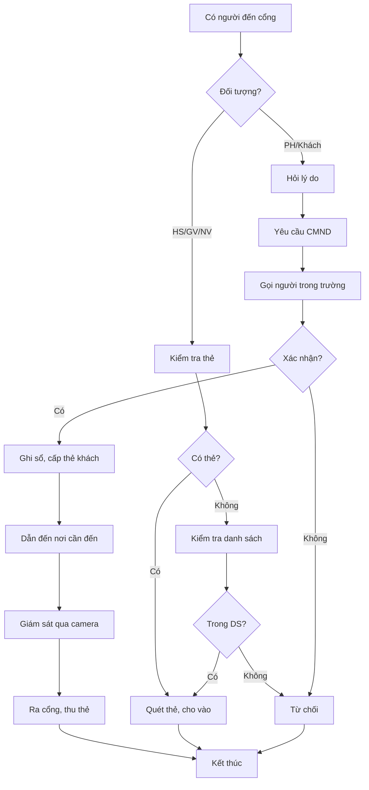

# SOP-04.2: KIỂM SOÁT RA VÀO

## 1. THÔNG TIN

| **Thuộc tính** | **Nội dung** |
|---|---|
| Mã SOP | SOP-04.2 |
| Tên | Kiểm soát ra vào cổng trường |
| Tần suất | Liên tục (giờ mở cổng) |

## 2. QUY TRÌNH KIỂM SOÁT

### 2.1. Vào trường

| **Đối tượng** | **Yêu cầu** | **Thủ tục** |
|---|---|---|
| **Học sinh** | Mặc đồng phục, đeo thẻ | Quét thẻ → Ghi giờ vào → Cho vào |
| **Giáo viên, NV** | Đeo thẻ nhân viên | Quét thẻ → Cho vào |
| **Phụ huynh** | Có việc chính đáng | Xuất trình CMND → Ghi sổ → Cấp thẻ khách |
| **Khách** | Hẹn trước | CMND → Gọi điện xác nhận → Dẫn vào → Thu thẻ |
| **Nhà cung cấp** | Đơn hàng, hợp đồng | Kiểm tra xe → Ghi sổ → Dẫn đến kho |

### 2.2. Ra khỏi trường

| **Đối tượng** | **Kiểm tra** |
|---|---|
| **Học sinh** | Có giấy phép (GV ký) hoặc có PH đón |
| **Nhân viên** | Giờ tan ca, hoặc có giấy phép |
| **Khách** | Thu thẻ khách |
| **Xe hàng** | Kiểm tra có mang tài sản trường đi không |

## 3. GIỜ MỞ CỔNG

| **Thời gian** | **Đối tượng** |
|---|---|
| 6:00 - 7:30 | Học sinh, giáo viên vào |
| 7:30 - 11:00 | Đóng cổng (chỉ mở cho khách hẹn) |
| 11:00 - 11:30 | HS ăn bán trú ra (nếu có) |
| 15:00 - 16:30 | HS tan học ra |
| 16:30 - 18:00 | Giáo viên, nhân viên ra |

## 4. XỬ LÝ TÌNH HUỐNG

| **Tình huống** | **Xử lý** |
|---|---|
| HS không có thẻ | Kiểm tra danh sách, gọi GV chủ nhiệm |
| Người lạ muốn vào | Hỏi rõ lý do, gọi xác nhận, không được thì TỪ CHỐI |
| HS trốn học | Giữ lại, báo GV, gọi PH |
| Phụ huynh đòi vào lớp | Giải thích quy định, hẹn giờ khác |

## 5. LƯU ĐỒ

---

**PHÊ DUYỆT**

| Trưởng ca bảo vệ | Trưởng phòng An toàn | Hiệu trưởng |
|---|---|---|
| [Họ tên] | [Họ tên] | [Họ tên] |
