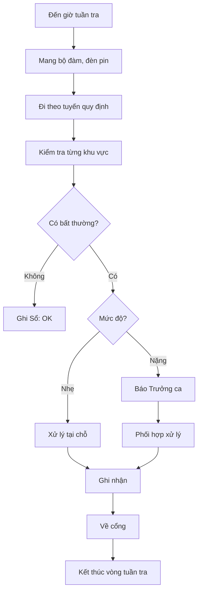

# SOP-04.3: TUẦN TRA AN NINH

## 1. THÔNG TIN

| **Thuộc tính** | **Nội dung** |
|---|---|
| Mã SOP | SOP-04.3 |
| Tên | Tuần tra an ninh trong khuôn viên |
| Tần suất | Mỗi 2 giờ/lần (cả ngày đêm) |

## 2. LỊCH TUẦN TRA

| **Ca** | **Giờ** | **Tuyến** |
|---|---|---|
| Ca 1 | 6:00 - 14:00 | Tuần tra 8:00, 10:00, 12:00 |
| Ca 2 | 14:00 - 22:00 | Tuần tra 16:00, 18:00, 20:00 |
| Ca 3 | 22:00 - 6:00 | Tuần tra 24:00, 2:00, 4:00 |

## 3. TUYẾN TUẦN TRA

**Tuyến 1 (20 phút):**
Cổng → Sân trước → Tòa A → Tòa B → Bếp → Kho → Về cổng

**Tuyến 2 (20 phút):**
Cổng → Sân sau → Tòa C → Sân thể dục → Bãi xe → Về cổng

**Luân phiên 2 tuyến**

## 4. CHECKLIST TUẦN TRA

- [ ] Cổng: Khóa chặt, không hư hỏng
- [ ] Hàng rào: Không bị cắt, phá
- [ ] Cửa ra vào: Đóng đúng cách
- [ ] Đèn chiếu sáng: Sáng bình thường
- [ ] PCCC: Bình chữa cháy, vòi nước OK
- [ ] Điện nước: Không rò rỉ
- [ ] Người lạ: Không có người lạ ẩn nấp
- [ ] Vật dụng: Không bị mất cắp

## 5. GHI NHẬN

**Sổ tuần tra ghi:**
- Giờ tuần tra
- Tuyến tuần tra
- Phát hiện bất thường (nếu có)
- Xử lý (nếu có)
- Chữ ký bảo vệ

## 6. XỬ LÝ BẤT THƯỜNG

| **Phát hiện** | **Hành động** |
|---|---|
| Cửa mở sai quy định | Kiểm tra, khóa lại, báo cáo |
| Đèn hỏng | Ghi nhận, báo kỹ thuật sửa |
| Nước rò rỉ | Báo kỹ thuật xử lý ngay |
| Người lạ ẩn nấp | Tiếp cận thận trọng, hỏi han, báo 113 nếu nguy hiểm |
| Mất trộm | Bảo vệ hiện trường, báo 113, xem camera |

## 7. LƯU ĐỒ

---

**PHÊ DUYỆT**

| Trưởng ca bảo vệ | Trưởng phòng An toàn | Hiệu trưởng |
|---|---|---|
| [Họ tên] | [Họ tên] | [Họ tên] |
