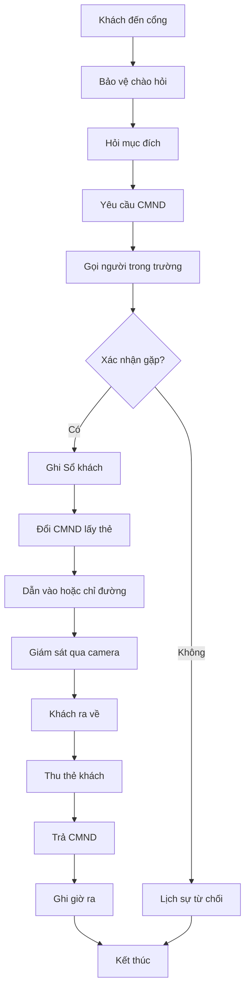

# SOP-04.4: QUẢN LÝ KHÁCH VIẾNG THĂM

## 1. THÔNG TIN

| **Thuộc tính** | **Nội dung** |
|---|---|
| Mã SOP | SOP-04.4 |
| Tên | Quản lý khách viếng thăm |
| Phạm vi | Tất cả khách vào trường |

## 2. PHÂN LOẠI KHÁCH

| **Loại** | **Thủ tục** | **Thời gian cho phép** |
|---|---|---|
| Phụ huynh đón con | Đơn giản | 15:00-16:30 |
| Phụ huynh gặp GV | Hẹn trước | Theo lịch hẹn |
| Cơ quan kiểm tra | Công văn | Theo công văn |
| Đối tác, khách mời | Hẹn trước | Theo lịch |
| Khách khác | Lý do chính đáng | Tùy trường hợp |

## 3. QUY TRÌNH TIẾP KHÁCH

**Bước 1: Tiếp nhận**
- Hỏi: "Chào anh/chị, anh/chị đến gặp ai?"
- Yêu cầu CMND/CCCD
- Ghi vào Sổ khách (Form QT01-F51):
  - Họ tên, số CMND
  - Đến gặp ai
  - Lý do
  - Giờ vào

**Bước 2: Xác nhận**
- Gọi điện cho người được gặp
- Nếu đồng ý → Cho vào
- Nếu từ chối → Lịch sự giải thích

**Bước 3: Cấp thẻ khách**
- Đổi CMND lấy thẻ khách
- Dặn: Chỉ đến nơi cần đến, không lang thang
- Dẫn khách đến đúng nơi (nếu cần)

**Bước 4: Giám sát**
- Theo dõi qua camera
- Nếu khách ở quá lâu (> 2 giờ) → Gọi hỏi

**Bước 5: Tiễn khách**
- Thu thẻ khách
- Trả CMND
- Ghi giờ ra vào Sổ
- Cảm ơn, chào tạm biệt

## 4. TRƯỜNG HỢP ĐẶC BIỆT

**Cơ quan chức năng (Công an, Thanh tra...):**
- Yêu cầu công văn hoặc giấy giới thiệu
- Thông báo ngay Ban Giám hiệu
- Dẫn đến phòng Hiệu trưởng
- Phối hợp đầy đủ

**Khách đông người (Đoàn tham quan):**
- Phải đăng ký trước ≥ 3 ngày
- Có lịch trình rõ ràng
- Có người dẫn đoàn của trường
- Không làm ảnh hưởng giờ học

**Từ chối:**
- Người say, bất thường
- Không có lý do chính đáng
- Thái độ thô lỗ
- Giờ không phù hợp (quá sớm/muộn)

## 5. LƯU ĐỒ

---

**PHÊ DUYỆT**

| Trưởng ca | Trưởng phòng An toàn | Hiệu trưởng |
|---|---|---|
| [Họ tên] | [Họ tên] | [Họ tên] |
