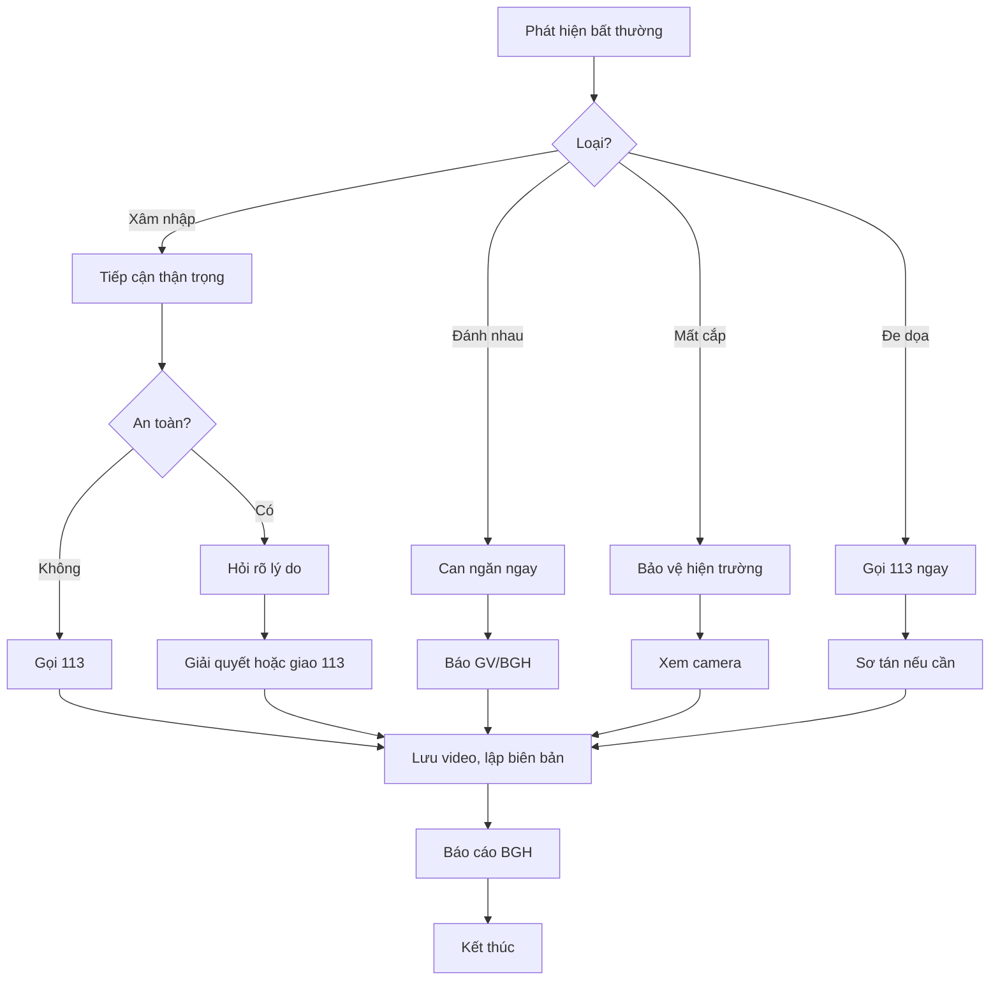

# SOP-04.5: XỬ LÝ TÌNH HUỐNG BẤT THƯỜNG

## 1. THÔNG TIN

| **Thuộc tính** | **Nội dung** |
|---|---|
| Mã SOP | SOP-04.5 |
| Tên | Xử lý tình huống bất thường về an ninh |
| Mức độ | KHẨN CẤP |

## 2. CÁC TÌNH HUỐNG VÀ XỬ LÝ

### 2.1. Xâm nhập trái phép

**Dấu hiệu:**
- Camera phát hiện người lạ trong trường
- Phát hiện người trèo tường, phá cổng

**Xử lý:**
1. Liên hệ bộ đàm yêu cầu hỗ trợ
2. Tiếp cận thận trọng (≥ 2 người)
3. Hỏi: "Anh/chị là ai? Vào đây làm gì?"
4. Nếu lý do chính đáng → Dẫn ra cổng làm thủ tục
5. Nếu đáng ngờ → Giữ lại, gọi 113
6. Lưu video, chụp ảnh
7. Lập biên bản

### 2.2. Đánh nhau, cãi vã

**Giữa học sinh:**
1. Can ngăn ngay
2. Tách riêng 2 bên
3. Báo giáo viên chủ nhiệm
4. Lưu video minh chứng
5. Giao cho giáo viên xử lý

**Phụ huynh với giáo viên:**
1. Can ngăn, trấn tĩnh
2. Dẫn vào phòng riêng
3. Báo Ban Giám hiệu
4. Bảo vệ giáo viên nếu bị hành hung
5. Gọi 113 nếu cần thiết

### 2.3. Đe dọa, bạo lực học đường

**Phát hiện học sinh bị đe dọa, bắt nạt:**
1. Can thiệp ngay, bảo vệ nạn nhân
2. Tách người bắt nạt ra
3. Báo ngay giáo viên, y tế (nếu bị thương)
4. Lưu video
5. Báo cáo Ban Giám hiệu
6. Phối hợp xử lý theo quy chế

### 2.4. Mất cắp tài sản

**Phát hiện mất cắp:**
1. Xác nhận: Mất gì? Khi nào? Ai báo?
2. Bảo vệ hiện trường
3. Rà soát camera thời điểm mất
4. Nếu xác định được kẻ trộm → Xử lý nội bộ
5. Nếu không → Báo 113
6. Lập biên bản

### 2.5. Cháy, nổ

→ Xử lý theo **SOP-01.4**

### 2.6. Đe dọa đánh bom, khủng bố

**TUYỆT ĐỐI NGHIÊM TÚC!**

1. **Báo 113 NGAY** - Không chủ quan!
2. Thông báo Ban Giám hiệu
3. Sơ tán toàn trường (nếu được chỉ đạo)
4. Phong tỏa khu vực nghi ngờ
5. Phối hợp với công an

## 3. NGUYÊN TẮC XỬ LÝ

🛡️ **AN TOÀN CÁ NHÂN TRƯỚC TIÊN**
- Không liều mạng
- Yêu cầu hỗ trợ khi cần
- Gọi 113 nếu vượt quá khả năng

🛡️ **KHÔNG XỬ LÝ TƯ**
- Báo cáo lên cấp trên
- Không đánh, chửi người vi phạm
- Tôn trọng pháp luật

🛡️ **GHI NHẬN ĐẦY ĐỦ**
- Lưu video, chụp ảnh
- Ghi rõ thời gian, địa điểm
- Có nhân chứng

## 4. LƯU ĐỒ

---

**PHÊ DUYỆT**

| Trưởng ca | Trưởng phòng An toàn | Hiệu trưởng |
|---|---|---|
| [Họ tên] | [Họ tên] | [Họ tên] |
