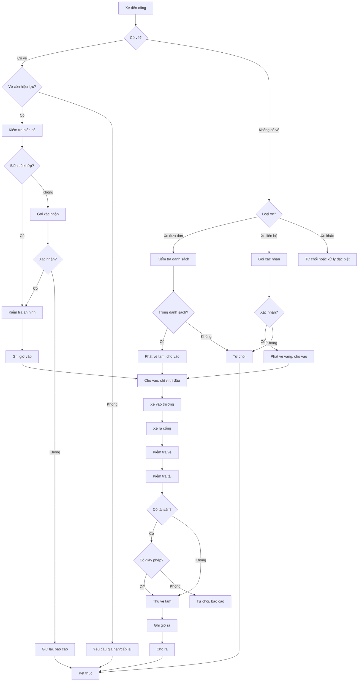

# SOP-04.6: PHÁT VÉ - QUẢN LÝ VÉ XE VÀ PHƯƠNG TIỆN

## 1. THÔNG TIN

| **Thuộc tính** | **Nội dung** |
|---|---|
| Mã SOP | SOP-04.6 |
| Tên | Phát vé - Quản lý vé xe và phương tiện khi đến trường đưa đón / liên hệ công tác |
| Tần suất | Liên tục (khi có xe vào/ra) |
| Phạm vi | Tất cả phương tiện vào trường |

## 2. MỤC ĐÍCH

- Kiểm soát và quản lý tất cả phương tiện ra vào trường
- Đảm bảo an ninh, an toàn cho học sinh và tài sản trường
- Theo dõi và lưu trữ thông tin phương tiện
- Phân biệt rõ ràng giữa xe đưa đón học sinh và xe liên hệ công tác
- Ngăn chặn phương tiện không được phép vào trường

## 3. PHÂN LOẠI PHƯƠNG TIỆN

| **Loại phương tiện** | **Mô tả** | **Màu vé** | **Thời hạn** |
|---|---|---|---|
| **Xe đưa đón học sinh** | Xe bus, xe đưa đón của trường | Xanh | Theo năm học |
| **Xe liên hệ công tác** | Xe của đối tác, nhà cung cấp, khách | Vàng | 1 ngày |
| **Xe nhân viên** | Xe máy, ô tô của GV/NV | Trắng | Theo năm học |
| **Xe phụ huynh** | Xe đưa đón con (tạm thời) | Hồng | 1 lần |
| **Xe khẩn cấp** | Xe cứu thương, cứu hỏa, công an | Đỏ | Không cần vé |

## 4. QUY TRÌNH PHÁT VÉ

### 4.1. Xe đưa đón học sinh

**Bước 1: Đăng ký ban đầu**
- Tài xế/Chủ xe nộp đơn đăng ký (Form BM-56A)
- Cung cấp: Giấy phép lái xe, Giấy đăng ký xe, Bảo hiểm xe, Hợp đồng với trường
- Trưởng phòng An toàn xét duyệt
- Cấp vé thường trú (màu xanh) có mã số riêng

**Bước 2: Cấp vé**
- Ghi thông tin vào Sổ quản lý vé xe (BM-56):
  - Mã vé
  - Biển số xe
  - Họ tên tài xế
  - Số điện thoại
  - Tuyến đường
  - Ngày cấp
  - Ngày hết hạn
- Dán nhãn vé lên kính chắn gió (góc trên bên phải)
- Chụp ảnh xe và tài xế (lưu hồ sơ)

**Bước 3: Kiểm tra định kỳ**
- Hàng tháng: Kiểm tra vé còn hiệu lực
- Hàng quý: Kiểm tra lại giấy tờ xe
- Khi có thay đổi: Cập nhật thông tin

### 4.2. Xe liên hệ công tác

**Bước 1: Tiếp nhận yêu cầu**
- Người lái xe trình CMND/CCCD
- Hỏi: "Anh/chị đến gặp ai? Mục đích?"
- Kiểm tra có hẹn trước không

**Bước 2: Xác nhận**
- Gọi điện cho người được gặp
- Xác nhận: Tên người lái, biển số xe, mục đích
- Nếu đồng ý → Tiếp tục
- Nếu từ chối → Từ chối vào

**Bước 3: Phát vé tạm thời**
- Ghi thông tin vào Sổ quản lý vé xe:
  - Biển số xe
  - Họ tên người lái
  - CMND/CCCD
  - Người gặp
  - Mục đích
  - Giờ vào
  - Dự kiến giờ ra
- Cấp vé tạm thời (màu vàng) có số thứ tự
- Đổi CMND lấy vé (nếu cần)
- Hướng dẫn: Đậu xe đúng nơi quy định, không được đi lại trong trường

**Bước 4: Kiểm tra xe**
- Kiểm tra bên ngoài xe: Có vật lạ, có dấu hiệu bất thường
- Ghi chú vào sổ nếu có vấn đề
- Chụp ảnh biển số (nếu cần)

### 4.3. Xe nhân viên

**Bước 1: Đăng ký**
- Nhân viên nộp đơn đăng ký xe (BM-56B)
- Cung cấp: Giấy đăng ký xe, CMND
- Phòng Hành chính xác nhận nhân viên
- Cấp vé thường trú (màu trắng) gắn với thẻ nhân viên

**Bước 2: Cấp vé**
- Ghi thông tin vào sổ
- Dán nhãn vé lên xe
- Ghi chú: Mã nhân viên, vị trí đậu xe

### 4.4. Xe phụ huynh (đưa đón tạm thời)

**Bước 1: Tiếp nhận**
- Phụ huynh trình CMND
- Xác nhận: Tên học sinh, lớp
- Kiểm tra danh sách phụ huynh được phép đón

**Bước 2: Phát vé một lần**
- Cấp vé tạm thời (màu hồng)
- Ghi: Biển số, tên PH, tên HS, giờ vào
- Hướng dẫn: Đậu xe ở khu vực dành riêng, không quá 15 phút

## 5. QUY TRÌNH KIỂM SOÁT XE VÀO/RA

### 5.1. Khi xe vào

| **Bước** | **Hành động** | **Ghi chú** |
|---|---|---|
| 1. Nhận diện | Quan sát biển số, loại xe | Từ xa 20-30m |
| 2. Kiểm tra vé | Xe có vé? Vé còn hiệu lực? | Xe đưa đón: Vé xanh |
| 3. Xác minh | Đối chiếu biển số với sổ | Xe liên hệ: Vé vàng |
| 4. Kiểm tra an ninh | Quan sát bên ngoài xe | Xe NV: Vé trắng |
| 5. Cho vào | Mở cổng, ghi giờ vào | Ghi vào sổ |
| 6. Hướng dẫn | Chỉ vị trí đậu xe | Nếu cần |

### 5.2. Khi xe ra

| **Bước** | **Hành động** | **Ghi chú** |
|---|---|---|
| 1. Nhận diện | Quan sát biển số | |
| 2. Kiểm tra vé | Xe có vé? | |
| 3. Kiểm tra tải | Xe có mang tài sản trường? | Đặc biệt xe liên hệ công tác |
| 4. Xác minh | Đối chiếu với sổ vào | Giờ vào, giờ ra hợp lý? |
| 5. Thu vé | Thu vé tạm thời (nếu có) | Vé thường trú giữ lại |
| 6. Ghi sổ | Ghi giờ ra, tình trạng | |
| 7. Cho ra | Mở cổng, cho xe ra | |

## 6. QUẢN LÝ VÉ

### 6.1. Lưu trữ

- **Vé thường trú**: Lưu hồ sơ tại phòng Bảo vệ
  - Danh sách vé đang lưu hành
  - Ảnh xe và tài xế
  - Giấy tờ liên quan
  
- **Vé tạm thời**: Lưu vào sổ, giữ lại sau khi thu
  - Lưu ít nhất 3 tháng
  - Sắp xếp theo ngày

### 6.2. Thu hồi vé

**Trường hợp thu hồi:**
- Hết hạn hợp đồng (xe đưa đón)
- Nhân viên nghỉ việc
- Vi phạm quy định (3 lần trở lên)
- Xe không còn hoạt động

**Quy trình thu hồi:**
1. Thông báo trước 7 ngày
2. Thu vé và nhãn dán
3. Ghi vào sổ: Lý do, ngày thu
4. Xóa khỏi danh sách đang lưu hành

### 6.3. Cấp lại vé

**Khi nào cấp lại:**
- Vé bị mất, hỏng
- Thay đổi biển số xe
- Thay đổi tài xế (xe đưa đón)

**Quy trình:**
1. Báo cáo mất vé ngay
2. Nộp đơn xin cấp lại (có lý do)
3. Xác minh thông tin
4. Cấp vé mới (ghi chú "Cấp lại")
5. Thu phí (nếu quy định)

## 7. XỬ LÝ TÌNH HUỐNG

| **Tình huống** | **Xử lý** |
|---|---|
| **Xe không có vé** | - Hỏi lý do - Nếu xe đưa đón: Kiểm tra danh sách, gọi xác nhận - Nếu xe liên hệ: Áp dụng quy trình phát vé tạm thời - Nếu không có lý do: Từ chối vào |
| **Vé hết hạn** | - Nhắc nhở - Yêu cầu gia hạn hoặc cấp lại - Nếu cố tình: Từ chối vào, báo cáo |
| **Biển số không khớp** | - Kiểm tra kỹ lại - Gọi tài xế xác nhận - Nếu nghi ngờ: Giữ lại, báo công an |
| **Xe mang tài sản ra** | - Yêu cầu giấy phép xuất tài sản (có chữ ký Ban Giám hiệu) - Kiểm tra kỹ - Không có giấy phép: Từ chối, báo cáo |
| **Xe đậu sai vị trí** | - Nhắc nhở di chuyển - Nếu không chấp hành: Ghi vào sổ vi phạm |
| **Xe gây tai nạn** | - Giữ xe tại chỗ - Báo công an - Báo Ban Giám hiệu - Lập biên bản |
| **Xe khẩn cấp** | - Cho vào ngay, không cần vé - Ghi vào sổ đặc biệt - Hỗ trợ dẫn đường |

## 8. KHU VỰC ĐẬU XE

| **Khu vực** | **Dành cho** | **Vị trí** |
|---|---|---|
| **Khu A** | Xe đưa đón học sinh | Sân sau, gần cổng phụ |
| **Khu B** | Xe nhân viên | Bãi đậu nhân viên |
| **Khu C** | Xe liên hệ công tác | Gần cổng chính, tạm thời |
| **Khu D** | Xe phụ huynh | Khu vực đón trả, tạm thời |
| **Khu E** | Xe khẩn cấp | Gần phòng y tế, ưu tiên |

## 9. LƯU ĐỒ

## 10. BIỂU MẪU LIÊN QUAN

- **BM-56**: Sổ quản lý vé xe
- **BM-56A**: Đơn đăng ký vé xe đưa đón
- **BM-56B**: Đơn đăng ký vé xe nhân viên
- **BM-56C**: Biên bản thu hồi vé
- **BM-56D**: Đơn xin cấp lại vé

## 11. TRÁCH NHIỆM

| **Vai trò** | **Trách nhiệm** |
|---|---|
| **Bảo vệ** | - Phát vé, kiểm soát xe vào/ra - Ghi sổ chính xác - Xử lý tình huống ban đầu |
| **Trưởng ca bảo vệ** | - Giám sát việc phát vé - Xử lý tình huống phức tạp - Kiểm tra sổ hàng ngày |
| **Trưởng phòng An toàn** | - Phê duyệt đăng ký vé thường trú - Quản lý hồ sơ vé - Xử lý vi phạm |
| **Phòng Hành chính** | - Xác nhận nhân viên đăng ký xe - Cập nhật danh sách |

## 12. CHỈ TIÊU

| **Chỉ tiêu** | **Mục tiêu** |
|---|---|
| Tỷ lệ xe vào có vé | 100% |
| Tỷ lệ xe ra được kiểm tra | 100% |
| Thời gian xử lý phát vé | ≤ 3 phút |
| Số lần vi phạm | ≤ 2 lần/tháng |

---

**PHÊ DUYỆT**

| Trưởng ca bảo vệ | Trưởng phòng An toàn | Hiệu trưởng |
|---|---|---|
| [Họ tên] | [Họ tên] | [Họ tên] |

