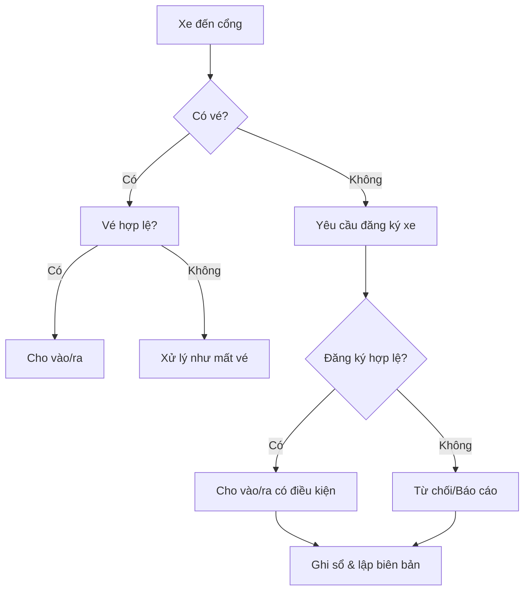

# SOP-04.7: KIỂM SOÁT KHI MẤT HOẶC HỎNG HÓC VÉ XE

---

## 1. THÔNG TIN

| Thuộc tính | Nội dung |
|---|---|
| Mã SOP | SOP-04.7 |
| Tên | Kiểm soát khi mất hoặc hỏng hóc vé xe |
| Tần suất | Khi phát sinh |
| Phạm vi | Tất cả phương tiện ra/vào trường |

---

## 2. MỤC ĐÍCH

- Kiểm soát các trường hợp mất vé, hỏng vé xe  
- Đảm bảo an ninh, an toàn phương tiện và tài sản  
- Ngăn ngừa lợi dụng mất vé để ra/vào trái phép  
- Thống nhất cách xử lý cho bộ phận bảo vệ  

---

## 3. PHÂN LOẠI TRƯỜNG HỢP

| Trường hợp | Mô tả |
|---|---|
| Mất vé | Không xuất trình được vé |
| Vé hỏng | Rách, mờ, bong tróc, không đọc được |
| Vé không khớp | Vé còn nhưng sai biển số |
| Vé không nhận diện | Không xác định được loại/màu/mã |

---

## 4. NGUYÊN TẮC XỬ LÝ

- Không cho phương tiện ra/vào nếu chưa xác minh  
- Giấy đăng ký xe (bản gốc) được dùng để xác minh khi mất vé  
- Không xác minh qua điện thoại hoặc bộ phận khác  
- Mọi trường hợp đều phải ghi sổ và lập biên bản  

---

## 5. QUY TRÌNH XỬ LÝ KHI MẤT VÉ

### 5.1. Khi xe VÀO cổng nhưng bị mất vé

| Bước | Hành động | Ghi chú |
|---|---|---|
| 1 | Yêu cầu xuất trình giấy đăng ký xe + CCCD | Bản gốc |
| 2 | Đối chiếu biển số với đăng ký xe | Không tẩy xóa |
| 3 | Kiểm tra loại xe | Phù hợp phân loại |
| 4 | Quyết định cho vào có điều kiện | Nếu hợp lệ |
| 5 | Ghi sổ quản lý | Ghi rõ mất vé |
| 6 | Lập biên bản BM-56E | Bắt buộc |

---

### 5.2. Khi xe RA cổng nhưng bị mất vé

| Bước | Hành động | Ghi chú |
|---|---|---|
| 1 | Giữ xe tại chốt | Không cho ra ngay |
| 2 | Yêu cầu đăng ký xe + CCCD | Bản gốc |
| 3 | Đối chiếu với sổ xe vào | Giờ vào/ra |
| 4 | Kiểm tra tài sản trên xe | Nếu có |
| 5 | Cho ra nếu hợp lệ | Có biên bản |
| 6 | Báo Trưởng ca nếu nghi ngờ | |

---

## 6. QUY TRÌNH XỬ LÝ KHI VÉ HỎNG

### 6.1. Vé còn nhận diện được

- Đối chiếu thông tin vé  
- Thu vé hỏng  
- Ghi chú “VÉ HỎNG” vào sổ  
- Hướng dẫn làm thủ tục cấp lại  

### 6.2. Vé không còn nhận diện

- Xử lý như mất vé  
- Lập biên bản BM-56E  

---

## 7. QUẢN LÝ VÀ CẤP LẠI VÉ

### 7.1. Trường hợp cấp lại vé

- Vé bị mất  
- Vé bị hỏng  
- Vé không còn sử dụng được  

### 7.2. Quy trình cấp lại

| Bước | Nội dung |
|---|---|
| 1 | Báo mất/hỏng vé |
| 2 | Nộp đơn BM-56D |
| 3 | Xuất trình đăng ký xe |
| 4 | Cấp vé mới (ghi “CẤP LẠI”) |
| 5 | Cập nhật sổ quản lý |

---

## 8. XỬ LÝ TÌNH HUỐNG

| Tình huống | Xử lý |
|---|---|
| Mất vé, có đăng ký xe | Xác minh → Cho ra/vào có điều kiện |
| Mất vé, không có đăng ký | Từ chối → Báo Trưởng ca |
| Vé hỏng | Thu vé → Cấp lại |
| Vé không khớp biển số | Giữ xe → Báo cáo |
| Gian dối | Lập biên bản |

---

## 9. LƯU ĐỒ

---

## 10. BIỂU MẪU LIÊN QUAN

- BM-56: Sổ quản lý vé xe  
- BM-56D: Đơn xin cấp lại vé  
- BM-56E: Biên bản mất/hỏng vé  

---

## 11. TRÁCH NHIỆM

| Vai trò | Trách nhiệm |
|---|---|
| Bảo vệ | Thực hiện SOP |
| Trưởng ca | Giám sát, xử lý tình huống |
| Phòng An toàn | Quản lý hồ sơ |
| Phòng HC | Cập nhật danh sách |

---

## 12. CHỈ TIÊU

| Chỉ tiêu | Mục tiêu |
|---|---|
| Xử lý đúng SOP | 100% |
| Thời gian xử lý | ≤ 5 phút |
| Gian lận | 0 |

---

### PHÊ DUYỆT

| Trưởng ca bảo vệ | Trưởng phòng An toàn | Hiệu trưởng |
|---|---|---|
| [Họ tên] | [Họ tên] | [Họ tên] |
