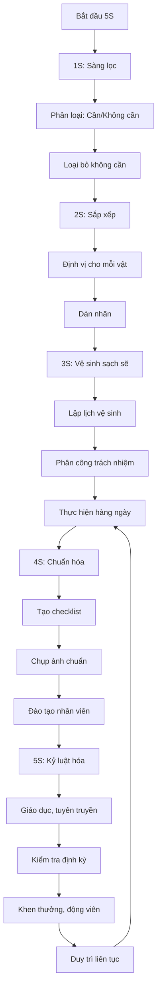

# SOP-05.1: 5S CƠ SỞ VẬT CHẤT

## 1. THÔNG TIN

| **Thuộc tính** | **Nội dung** |
|---|---|
| Mã SOP | SOP-05.1 |
| Tên | 5S Cơ sở vật chất |
| Phạm vi | Tòa nhà, sân vườn, CSVC chung |
| Tần suất | Hàng ngày (duy trì), Tháng (đánh giá) |

## 2. NGUYÊN TẮC 5S

| **S** | **Tiếng Nhật** | **Tiếng Việt** | **Nội dung** |
|---|---|---|---|
| **1S** | Seiri | **Sàng lọc** | Phân loại cần - không cần, loại bỏ không cần |
| **2S** | Seiton | **Sắp xếp** | Sắp xếp gọn gàng, dễ tìm, dễ lấy |
| **3S** | Seiso | **Sạch sẽ** | Vệ sinh sạch sẽ mỗi ngày |
| **4S** | Seiketsu** | **Săn sóc** | Duy trì 3S đầu, chuẩn hóa |
| **5S** | Shitsuke | **Sẵn sàng** | Tạo thói quen, tự giác thực hiện |

## 3. ÁP DỤNG 5S CHO CSVC

### 3.1. Seiri - Sàng lọc

**Rà soát tài sản:**
- Đồ dùng, thiết bị nào cần?
- Cái nào không dùng > 6 tháng?
- Cái nào hỏng, không sửa được?

**Phân loại:**

| **Nhãn** | **Ý nghĩa** | **Xử lý** |
|---|---|---|
| Xanh | Dùng hàng ngày | Giữ lại, để vị trí dễ lấy |
| Vàng | Dùng thỉnh thoảng | Giữ lại, cất kho |
| Đỏ | Không dùng, hỏng | Thanh lý, bán phế liệu |

### 3.2. Seiton - Sắp xếp

**Nguyên tắc sắp xếp:**
- Dùng nhiều → Đặt gần, tầm tay
- Dùng ít → Cất cao, trong kho
- Nặng → Dưới thấp
- Nhẹ → Trên cao
- Nguy hiểm → Riêng biệt, có khóa

**Định vị:**
- Kẻ vạch vị trí đặt đồ
- Dán nhãn tên
- Sơn màu phân khu vực
- Vẽ sơ đồ 5S

### 3.3. Seiso - Sạch sẽ

**Vệ sinh hàng ngày:**

| **Khu vực** | **Công việc** | **Người thực hiện** |
|---|---|---|
| Sân trường | Quét lá, nhặt rác | NV vệ sinh |
| Hành lang | Lau sàn, lan can | NV vệ sinh |
| WC | Vệ sinh, khử mùi | NV vệ sinh |
| Phòng học | Quét, lau bảng | HS trực nhật |
| Văn phòng | Lau bàn, sắp xếp | NV phòng |

**Vệ sinh cuối tuần:**
- Đại vệ sinh toàn trường
- Lau cửa kính, đèn
- Cắt cỏ, tỉa cây
- Vệ sinh mương thoát nước

### 3.4. Seiketsu - Săn sóc (Chuẩn hóa)

**Tạo tiêu chuẩn:**
- Checklist 5S từng khu vực
- Ảnh "Trước - Sau" 5S
- Ảnh chuẩn để so sánh
- Quy định rõ: Ai làm gì, khi nào, như thế nào

### 3.5. Shitsuke - Sẵn sàng (Kỷ luật)

**Tạo thói quen:**
- Giáo dục HS giữ vệ sinh
- Slogan 5S treo khắp trường
- Thi đua lớp sạch đẹp
- Khen thưởng định kỳ

## 4. ĐÁNH GIÁ 5S

### 4.1. Tiêu chí đánh giá

| **Tiêu chí** | **Điểm tối đa** | **Cách cho điểm** |
|---|---|---|
| 1S - Sàng lọc | 20 | Không có đồ thừa, hỏng |
| 2S - Sắp xếp | 20 | Gọn gàng, dễ tìm |
| 3S - Sạch sẽ | 30 | Sạch, không bụi bẩn |
| 4S - Săn sóc | 15 | Có tiêu chuẩn, duy trì tốt |
| 5S - Sẵn sàng | 15 | Tự giác, thói quen tốt |

**Xếp loại:**
- Xuất sắc: ≥ 90 điểm
- Tốt: 80-89 điểm
- Đạt: 70-79 điểm
- Chưa đạt: < 70 điểm

### 4.2. Kiểm tra 5S

**Hàng tháng:** Ban kiểm tra 5S (5 người) đi kiểm tra
**Hàng quý:** Công bố kết quả, trao giải
**Giải thưởng:**
- Giải Nhất: 2,000,000 VNĐ
- Giải Nhì: 1,500,000 VNĐ
- Giải Ba: 1,000,000 VNĐ

## 5. LƯU ĐỒ

---

**PHÊ DUYỆT**

| Trưởng phòng Hành chính | Phó HT | Hiệu trưởng |
|---|---|---|
| [Họ tên] | [Họ tên] | [Họ tên] |
