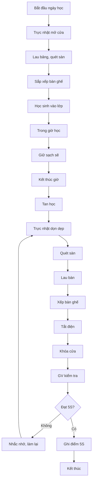

# SOP-05.2: 5S VĂN PHÒNG VÀ PHÒNG HỌC

## 1. THÔNG TIN

| **Thuộc tính** | **Nội dung** |
|---|---|
| Mã SOP | SOP-05.2 |
| Tên | 5S Văn phòng và phòng học |
| Phạm vi | Tất cả văn phòng, phòng học |
| Tần suất | Hàng ngày |

## 2. 5S VĂN PHÒNG

### 2.1. Bàn làm việc

**1S - Sàng lọc:**
- Chỉ giữ đồ đang dùng trên bàn
- Tài liệu cũ → Cất tủ hoặc tiêu hủy
- Đồ hỏng → Sửa hoặc vứt

**2S - Sắp xếp:**
- Máy tính, điện thoại: Vị trí thuận tiện
- Văn bản đang xử lý: Khay đựng riêng
- Dụng cụ văn phòng: Hộp đựng gọn
- Dây điện: Buộc gọn, không rối

**3S - Sạch sẽ:**
- Lau bàn mỗi ngày
- Sắp xếp lại cuối ngày
- Không để cốc, đồ ăn qua đêm

### 2.2. Tủ tài liệu

- Phân loại theo chủ đề
- Dán nhãn rõ ràng
- Sắp xếp theo thứ tự (ABC, năm...)
- Thanh lý tài liệu cũ hàng năm

## 3. 5S PHÒNG HỌC

### 3.1. Trách nhiệm

- **Học sinh**: Giữ gìn bàn ghế, dọn vệ sinh
- **Giáo viên**: Giám sát, nhắc nhở
- **Trực nhật**: Tổ chức vệ sinh

### 3.2. Quy trình hàng ngày

**Buổi sáng (7:00):**
- Mở cửa sổ thoáng khí
- Lau bảng
- Kiểm tra đèn, quạt

**Giữa ngày:**
- Giữ sạch sẽ
- Không vứt rác bừa bãi
- Xếp đồ gọn sau giờ học

**Buổi chiều (trước khi ra về):**
- Quét sàn, lau bàn
- Sắp xếp bàn ghế ngay ngắn
- Tắt đèn, quạt, điều hòa
- Đóng cửa sổ, khóa cửa

### 3.3. Đánh giá lớp 5S

**Tiêu chí (Tổng 100 điểm):**

| **Hạng mục** | **Điểm** |
|---|---|
| Sàn sạch, không rác | 20 |
| Bàn ghế ngay ngắn | 20 |
| Bảng sạch, phấn gọn | 10 |
| Tủ sách, góc học tập | 15 |
| Trang trí đẹp, gọn | 10 |
| Cửa sổ sạch | 10 |
| Tiết kiệm điện nước | 15 |

**Công bố:**
- Tuần: Top 3 lớp sạch nhất
- Tháng: Lớp 5S xuất sắc (cờ, giấy khen)

## 4. LƯU ĐỒ

---

**PHÊ DUYỆT**

| Tổ trưởng chuyên môn | Phó HT | Hiệu trưởng |
|---|---|---|
| [Họ tên] | [Họ tên] | [Họ tên] |
