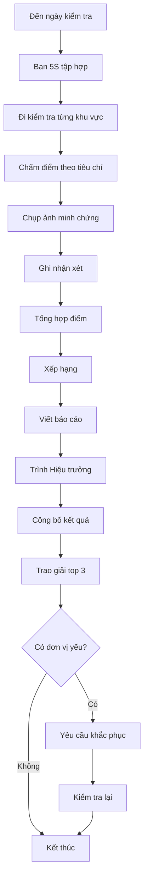

# SOP-05.4: KIỂM TRA VÀ ĐÁNH GIÁ 5S

## 1. THÔNG TIN

| **Thuộc tính** | **Nội dung** |
|---|---|
| Mã SOP | SOP-05.4 |
| Tên | Kiểm tra và đánh giá 5S |
| Tần suất | Hàng tháng (chính thức), Tuần (nội bộ) |

## 2. BAN KIỂM TRA 5S

**Thành phần:**
- Trưởng ban: Phó Hiệu trưởng
- Thành viên: Trưởng phòng (Hành chính, An toàn, Y tế, Tổ trưởng)

**Nhiệm vụ:**
- Kiểm tra 5S định kỳ
- Chấm điểm công bằng
- Nhận xét, gợi ý cải tiến
- Công bố kết quả

## 3. QUY TRÌNH KIỂM TRA

**Bước 1: Lập lịch kiểm tra**
- Hàng tháng: Ngày 25-28
- Không báo trước (kiểm tra đột xuất)

**Bước 2: Kiểm tra thực tế**
- Đi từng khu vực
- Chấm điểm theo bảng tiêu chí
- Chụp ảnh minh chứng
- Ghi nhận điểm tốt, điểm chưa tốt

**Bước 3: Tổng hợp kết quả**
- Tính điểm từng khu vực
- Xếp hạng
- Viết nhận xét

**Bước 4: Công bố**
- Họp toàn trường đầu tháng sau
- Trao giải cho top 3
- Yêu cầu khắc phục điểm yếu

## 4. BẢNG CHẤM ĐIỂM 5S

| **Hạng mục** | **Xuất sắc (9-10)** | **Tốt (7-8)** | **TB (5-6)** | **Yếu (< 5)** |
|---|---|---|---|---|
| **1S - Sàng lọc** | Không 1 thứ thừa | Ít đồ thừa | Còn nhiều đồ thừa | Lộn xộn |
| **2S - Sắp xếp** | Gọn gàng, dễ tìm | Tương đối gọn | Hơi lộn xộn | Rất lộn xộn |
| **3S - Sạch sẽ** | Rất sạch, bóng | Sạch | Bụi bẩn chút | Bẩn nhiều |
| **4S - Chuẩn hóa** | Có tiêu chuẩn, làm tốt | Có tiêu chuẩn | Chưa rõ tiêu chuẩn | Không có |
| **5S - Kỷ luật** | Tự giác, thói quen tốt | Tự giác | Phải nhắc | Phải ép |

## 5. KHEN THƯỞNG

**Hàng tháng:**
- Lớp 5S xuất sắc: Cờ lưu động + Giấy khen
- Văn phòng 5S tốt nhất: Tiền thưởng 1,000,000 VNĐ

**Hàng năm:**
- Cá nhân 5S xuất sắc: Bằng khen + Thưởng
- Đơn vị 5S xuất sắc: Bằng khen tập thể

## 6. XỬ LÝ KHÔNG ĐẠT

**Lần 1:** Nhắc nhở, yêu cầu khắc phục trong 3 ngày
**Lần 2:** Cảnh cáo, trưởng bộ phận chịu trách nhiệm
**Lần 3:** Xử lý kỷ luật, ảnh hưởng đánh giá cuối năm

## 7. LƯU ĐỒ

---

**PHÊ DUYỆT**

| Trưởng ban 5S | Phó HT | Hiệu trưởng |
|---|---|---|
| [Họ tên] | [Họ tên] | [Họ tên] |
