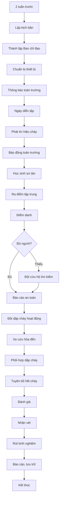

# SOP-06.1: DIỄN TẬP PCCC

## 1. THÔNG TIN

| **Thuộc tính** | **Nội dung** |
|---|---|
| Mã SOP | SOP-06.1 |
| Tên | Diễn tập phòng cháy chữa cháy |
| Tần suất | 6 tháng/lần (Bắt buộc theo luật) |
| Thời gian | 2-3 giờ |

## 2. MỤC ĐÍCH

- **Rèn luyện kỹ năng**: Mọi người biết phải làm gì khi có cháy
- **Kiểm tra kế hoạch**: Phát hiện sơ hở trong phương án ứng phó
- **Xây dựng phản xạ**: Hành động tự động khi nghe báo cháy
- **Tuân thủ luật**: Luật PCCC quy định bắt buộc diễn tập

## 3. QUY TRÌNH DIỄN TẬP

### 3.1. Chuẩn bị (Trước 2 tuần)

**Bước 1: Lập kịch bản**

- Giả định: Cháy tại [vị trí], vào lúc [giờ]
- Mức độ: Cấp [X]
- Số người: Toàn trường/1 khối
- Vai trò từng người
- Timeline chi tiết (từng phút)

**Bước 2: Thành lập Ban chỉ đạo**

- Chỉ huy: Hiệu trưởng
- Các đội: Dập cháy, sơ tán, cứu hộ, liên lạc...
- Quan sát viên: Đánh giá hiệu quả

**Bước 3: Chuẩn bị**

- Thông báo cho toàn trường (không tiết lộ giờ chính xác)
- Mời Cảnh sát PCCC quan sát, hướng dẫn
- Chuẩn bị thiết bị: Còi, bình chữa cháy, băng ca...
- Nhân viên y tế, xe cứu thương sẵn sàng

### 3.2. Thực hiện (2 giờ)

**T+0: Phát hiện cháy (giả định)**
- Nhân viên kịch bản la to "CHÁY!"
- Kích hoạt báo động

**T+1 phút: Sơ tán bắt đầu**
- Giáo viên điều khiển lớp
- Học sinh xếp hàng, di chuyển

**T+5 phút: Toàn trường ra điểm tập trung**
- Điểm danh từng lớp
- Báo cáo cho Chỉ huy

**T+7 phút: Đội dập cháy hoạt động**
- Dùng bình chữa cháy (có thể dùng nước thay)
- Diễn tập phun bình

**T+10 phút: Xe cứu hỏa đến (nếu mời)**
- Hướng dẫn vị trí
- Phối hợp dập cháy

**T+15 phút: Tuyên bố hết cháy**
- Còi 3 hồi ngắn
- Điểm danh lại lần cuối
- Cho phép vào lớp

**T+30 phút: Đánh giá**
- Cảnh sát PCCC nhận xét
- Ban chỉ đạo đánh giá
- Chỉ ra điểm tốt, điểm chưa tốt

### 3.3. Sau diễn tập

**Bước 4: Họp rút kinh nghiệm**
- Thời gian sơ tán: Đạt mục tiêu chưa?
- Ai làm tốt? Ai chưa tốt?
- Sai sót nào cần khắc phục?
- Cập nhật kế hoạch ứng phó

**Bước 5: Báo cáo và lưu trữ**
- Lập báo cáo diễn tập
- Gửi Sở PCCC (nếu yêu cầu)
- Lưu ảnh, video
- Cập nhật Sổ diễn tập

## 4. ĐÁNH GIÁ DIỄN TẬP

| **Tiêu chí** | **Mục tiêu** | **Kết quả** |
|---|---|---|
| Thời gian phát hiện → báo động | ≤ 1 phút | ... |
| Thời gian sơ tán hoàn toàn | ≤ 10 phút | ... |
| Tỷ lệ lớp sơ tán đúng quy trình | 100% | ... |
| Tỷ lệ HS biết lối thoát | ≥ 90% | ... |
| Hiệu quả dập cháy | Dập được trong 5 phút | ... |

**Xếp loại:**
- Xuất sắc: Tất cả tiêu chí đạt
- Tốt: 4/5 tiêu chí đạt
- Đạt: 3/5 tiêu chí đạt
- Chưa đạt: < 3 tiêu chí → **Diễn tập lại!**

## 5. LƯU ĐỒ

---

**PHÊ DUYỆT**

| Trưởng phòng An toàn | Phó HT | Hiệu trưởng |
|---|---|---|
| [Họ tên] | [Họ tên] | [Họ tên] |
