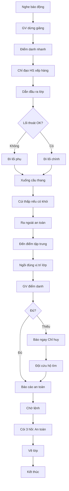

# SOP-06.2: SƠ TÁN KHẨN CẤP

## 1. THÔNG TIN

| **Thuộc tính** | **Nội dung** |
|---|---|
| Mã SOP | SOP-06.2 |
| Tên | Sơ tán khẩn cấp |
| Áp dụng | Cháy, nổ, động đất, đe dọa |
| Mục tiêu | Sơ tán toàn trường ≤ 10 phút |

## 2. KẾ HOẠCH SƠ TÁN

### 2.1. Sơ đồ thoát hiểm

**Mỗi phòng học phải có:**
- Sơ đồ mặt bằng tòa nhà
- Vị trí hiện tại (YOU ARE HERE)
- Lối thoát chính (màu xanh)
- Lối thoát phụ (màu vàng)
- Điểm tập trung (⭐)
- Vị trí bình chữa cháy (🔥)

### 2.2. Lối thoát hiểm

| **Tòa nhà** | **Lối thoát chính** | **Lối thoát phụ** |
|---|---|---|
| Tòa A | Cầu thang A1 | Cầu thang A2, Cửa thoát hiểm tầng 1 |
| Tòa B | Cầu thang B1 | Cầu thang B2, Thang thoát hiểm ngoài |
| Tòa C | Cầu thang C1 | Cửa sau, Cầu thang C2 |

**Yêu cầu:**
- Rộng tối thiểu 1.2m
- Luôn thông thoáng, không để đồ
- Đèn thoát hiểm luôn sáng
- Biển chỉ dẫn rõ ràng

### 2.3. Điểm tập trung

**Điểm chính:** Sân trường (phía trước)
**Điểm dự phòng:** Sân thể dục (phía sau)

**Vị trí từng lớp tại điểm tập trung:**
- Mầm non: Khu A (gần nhất)
- Tiểu học: Khu B
- THCS: Khu C
- Cách nhau 2m, dễ nhận diện

## 3. QUY TRÌNH SƠ TÁN

**Khi nghe báo động:**

**Giáo viên:**
1. Dừng giảng ngay, giữ bình tĩnh
2. Điểm danh nhanh bằng mắt
3. Chỉ đạo: "Xếp hàng 2, nắm tay, theo cô/thầy!"
4. Dẫn đầu, đi nhanh nhưng không chạy
5. Đi theo lối thoát gần nhất
6. Ra điểm tập trung
7. Điểm danh lại, báo cáo

**Học sinh:**
1. Nghe lệnh giáo viên
2. Xếp hàng nhanh
3. Nắm tay bạn
4. Cúi thấp nếu có khói
5. Đi theo giáo viên
6. Không nói chuyện, không chạy
7. Đến điểm tập trung, ngồi xuống

**Nhân viên văn phòng:**
- Sơ tán theo lối thoát gần nhất
- Tập trung tại khu riêng
- Điểm danh, báo cáo

## 4. THỨ TỰ ƯU TIÊN SƠ TÁN

1. Mầm non (tầng 1 trước, tầng 2 sau)
2. Tiểu học (tầng cao trước)
3. THCS (tầng cao trước)
4. Nhân viên

## 5. XỬ LÝ TÌNH HUỐNG

| **Tình huống** | **Xử lý** |
|---|---|
| Lối thoát bị chặn | Dùng lối phụ |
| HS hoảng loạn | GV nắm tay, dẫn riêng |
| HS ngã | Dừng, đỡ dậy, tiếp tục |
| HS khuyết tật | 2 bạn hoặc GV hỗ trợ |
| Khói dày | Bò sát sàn |

## 6. SAU SƠ TÁN

**Tại điểm tập trung:**
- Giáo viên điểm danh, báo cáo ngay
- Giữ học sinh tại chỗ, không về lớp
- Chờ lệnh Chỉ huy

**Khi được phép:**
- Còi 3 hồi ngắn: An toàn, về lớp
- Giáo viên dẫn về theo đội hình
- Về lớp, ổn định

## 7. LƯU ĐỒ

---

**PHÊ DUYỆT**

| Trưởng phòng An toàn | Phó HT | Hiệu trưởng |
|---|---|---|
| [Họ tên] | [Họ tên] | [Họ tên] |
