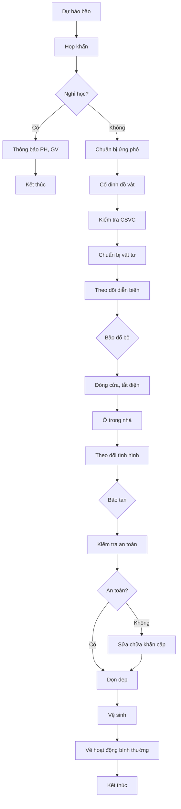

# SOP-06.4: ỨNG PHÓ THIÊN TAI

## 1. THÔNG TIN

| **Thuộc tính** | **Nội dung** |
|---|---|
| Mã SOP | SOP-06.4 |
| Tên | Ứng phó thiên tai |
| Phạm vi | Bão, lũ, động đất, sét |

## 2. CÁC LOẠI THIÊN TAI VÀ ỨNG PHÓ

### 2.1. Bão, mưa lớn

**Trước bão (24-48h):**
- Theo dõi dự báo thời tiết
- Thông báo PH, GV (có thể nghỉ học)
- Cố định đồ vật dễ bay
- Kiểm tra mái nhà, cửa sổ
- Chuẩn bị: Đèn pin, nước uống, lương khô
- Cắt tỉa cây xanh nguy hiểm

**Trong bão:**
- Đóng cửa, không ra ngoài
- Tắt điện, rút phích cắm
- Tránh xa cửa sổ
- Theo dõi tình hình

**Sau bão:**
- Kiểm tra an toàn trước khi vào
- Dọn dẹp cây đổ, mái tôn
- Kiểm tra điện nước
- Vệ sinh toàn trường

### 2.2. Động đất

**Khi rung chấn:**

**Nếu trong phòng:**
1. La to: "ĐỘNG ĐẤT! Núp gầm bàn!"
2. HS núp gầm bàn, ôm chân bàn
3. Tránh xa cửa kính, tường
4. Chờ hết rung → Sơ tán ra ngoài

**Nếu ngoài trời:**
1. Tránh xa tòa nhà, cây cao, cột điện
2. Ngồi xuống, ôm đầu
3. Chờ hết rung

**Sau động đất:**
- Sơ tán ra khu vực thoáng
- Điểm danh
- Kiểm tra tòa nhà (có nứt, nghiêng không?)
- Chỉ vào lại khi chắc chắn an toàn

### 2.3. Sét đánh

**Khi có sấm sét:**
- Không đứng ngoài trời
- Vào trong nhà
- Tránh xa cửa sổ, cột sắt
- Ngồi xuống, không chạy nhảy
- Không dùng điện thoại có dây

**Nếu ai bị sét đánh:**
- An toàn để chạm vào nạn nhân
- Gọi 115
- Thực hiện CPR nếu ngừng thở

### 2.4. Ngập lụt

**Khi có ngập:**
- Tắt điện toàn trường
- Di chuyển HS lên tầng cao
- Không lội nước (nguy hiểm điện giật)
- Gọi cứu hộ nếu nước dâng cao
- Có lương khô, nước uống

## 3. CHUẨN BỊ ỨNG PHÓ

**Túi cứu  khẩn cấp (Emergency Bag):**
- Đèn pin + Pin dự phòng
- Bộ đàm/Còi
- Nước uống đóng chai
- Biscuit, bánh ăn liền
- Thuốc cơ bản
- Danh sách HS, SĐT PH
- Bản đồ, còi, băng

**Vị trí:** Mỗi tòa nhà 1 túi, tại văn phòng

## 4. LƯU ĐỒ (BÃO)

---

**PHÊ DUYỆT**

| Trưởng phòng An toàn | Phó HT | Hiệu trưởng |
|---|---|---|
| [Họ tên] | [Họ tên] | [Họ tên] |
