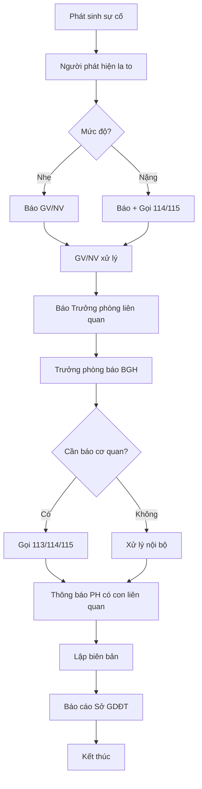

# SOP-06.5: LIÊN LẠC KHẨN CẤP

## 1. THÔNG TIN

| **Thuộc tính** | **Nội dung** |
|---|---|
| Mã SOP | SOP-06.5 |
| Tên | Liên lạc khẩn cấp |
| Phạm vi | Mọi tình huống khẩn cấp |

## 2. HỆ THỐNG LIÊN LẠC KHẨN CẤP

### 2.1. Danh bạ khẩn cấp

**Bên ngoài:**

| **Đơn vị** | **SĐT** | **Khi nào gọi** |
|---|---|---|
| PCCC | 114 | Cháy, nổ |
| Cấp cứu | 115 | Tai nạn, ốm nặng |
| Công an | 113 | An ninh, trật tự |
| Điện lực | 19001006 | Cúp điện, chập |
| Nước sạch | 19006016 | Mất nước, vỡ ống |
| Cứu hộ | 1080 | Hỏng xe, kẹt thang máy |

**Bên trong:**

| **Người** | **SĐT** | **Email** |
|---|---|---|
| Hiệu trưởng | [SĐT] | [Email] |
| Phó HT 1 | [SĐT] | [Email] |
| Phó HT 2 | [SĐT] | [Email] |
| Trưởng phòng An toàn | [SĐT] | [Email] |
| Y tế | [SĐT] | [Email] |
| Bảo vệ trưởng | [SĐT] | [Email] |
| Tổng đài trường | [SĐT] | |

### 2.2. Phương tiện liên lạc

| **Phương tiện** | **Ưu điểm** | **Sử dụng khi** |
|---|---|---|
| Bộ đàm | Nhanh, không cần sóng | Trong trường |
| Điện thoại | Gọi xa, ghi âm | Gọi ra ngoài |
| Loa phát thanh | Thông báo nhiều người | Cảnh báo chung |
| App trường | Gửi hàng loạt | Thông báo PH |
| Email | Chính thức, có chứng từ | Báo cáo cơ quan |

### 2.3. Quy trình liên lạc

**Chuỗi liên lạc:**

```
Người phát hiện
    ↓ (Ngay)
Giáo viên/Nhân viên
    ↓ (< 2 phút)
Trưởng phòng liên quan (An toàn/Y tế...)
    ↓ (< 5 phút)
Ban Giám hiệu
    ↓ (< 10 phút)
Cơ quan chức năng (113/114/115)
    ↓ (< 30 phút)
Sở GD&ĐT
```

## 3. NỘI DUNG THÔNG BÁO

**Nguyên tắc 5W1H:**
- **Who**: Ai bị nạn? (Họ tên, lớp)
- **What**: Chuyện gì? (Cháy/Tai nạn/...)
- **When**: Khi nào? (Giờ, phút)
- **Where**: Ở đâu? (Tòa, tầng, phòng)
- **Why**: Tại sao? (Nguyên nhân nếu biết)
- **How**: Mức độ? (Nhẹ/Nặng)

## 4. THÔNG BÁO PHỤ HUYNH

### 4.1. Tình huống khẩn cấp (Gọi điện)

- Gọi ngay cho 2 số PH
- Nói rõ ràng, bình tĩnh
- Thông báo tình trạng con
- Hướng dẫn PH phải làm gì

### 4.2. Thông báo chung (App/Email/SMS)

**Khi:**
- Nghỉ học do bão
- Sự cố ảnh hưởng toàn trường
- Thay đổi lịch học

**Nội dung:**
- Ngắn gọn, dễ hiểu
- Thông tin chính xác
- Hướng dẫn rõ ràng

## 5. TEST HỆ THỐNG

**Hàng tháng:**
- Test bộ đàm (thử liên lạc giữa các điểm)
- Test loa phát thanh (phát thông báo test)
- Cập nhật danh bạ (SĐT mới)

**6 tháng:**
- Diễn tập liên lạc khẩn cấp
- Đánh giá thời gian phản ứng
- Cải tiến nếu cần

## 6. LƯU ĐỒ



---

**PHÊ DUYỆT**

| Văn phòng | Trưởng phòng An toàn | Hiệu trưởng |
|---|---|---|
| [Họ tên] | [Họ tên] | [Họ tên] |
