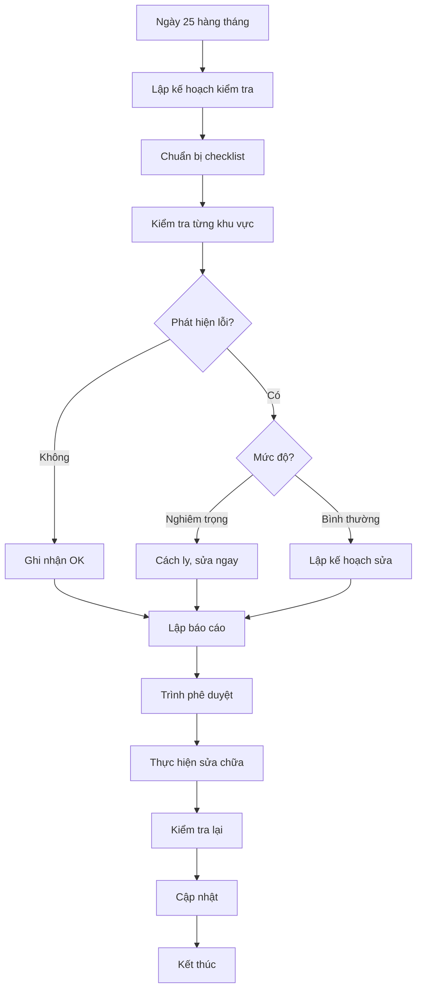

# SOP-07.1: KIỂM TRA AN TOÀN ĐỊNH KỲ

## 1. THÔNG TIN

| **Thuộc tính** | **Nội dung** |
|---|---|
| Mã SOP | SOP-07.1 |
| Tên | Kiểm tra an toàn CSVC định kỳ |
| Tần suất | Hàng tháng |
| Người thực hiện | Nhân viên kỹ thuật + An toàn |

## 2. MỤC ĐÍCH

- **Phát hiện nguy hiểm**: Tìm các yếu tố nguy hiểm tiềm ẩn
- **Phòng ngừa tai nạn**: Xử lý trước khi xảy ra sự cố
- **Bảo vệ tài sản**: CSVC luôn trong tình trạng tốt
- **Tuân thủ quy định**: Theo TCVN về ATVSLĐ

## 3. NỘI DUNG KIỂM TRA

### 3.1. Kiểm tra kết cấu công trình

| **Hạng mục** | **Tiêu chí an toàn** | **Tần suất** |
|---|---|---|
| Móng, nền | Không sụt lún, nứt | 6 tháng |
| Tường | Không nứt, không ẩm mốc | Tháng |
| Mái, trần | Không dột, rỉ nước | Tháng |
| Cầu thang | Không nứt, bong tróc | Tháng |
| Lan can | Chắc chắn, cao đủ (≥ 1.1m) | Tháng |
| Sàn | Không nứt, không trơn | Tháng |

### 3.2. Kiểm tra hệ thống kỹ thuật

**Hệ thống điện:**
- Tủ điện: Đóng kín, không chập
- Dây điện: Không rò, rỉ
- Ổ cắm: Chắc chắn, không nóng
- Đèn: Sáng đầy đủ
- Aptomat: Hoạt động tốt

**Hệ thống nước:**
- Ống nước: Không rò rỉ
- Bồn nước: Sạch, không rỉ sét
- Vòi nước: Hoạt động tốt
- Thoát nước: Thông thoáng

**Hệ thống PCCC:**
- Theo SOP-01.1

### 3.3. Kiểm tra an toàn học sinh

| **Khu vực** | **Kiểm tra** |
|---|---|
| Phòng học | Bàn ghế chắc, cửa không kẹt |
| Sân chơi | Thiết bị vững, thảm đệm đủ |
| WC | Sàn không trơn, đèn sáng |
| Cầu thang | Lan can chắc, không trơn |
| Thang máy | Có giấy kiểm định |

## 4. QUY TRÌNH KIỂM TRA

**Bước 1: Lập kế hoạch**
- Ngày 25 hàng tháng
- Phân công trách nhiệm

**Bước 2: Kiểm tra thực tế**
- Đi từng khu vực
- Dùng checklist
- Chụp ảnh điểm nguy hiểm
- Ghi nhận vào biểu mẫu

**Bước 3: Phân loại**

| **Mức độ** | **Xử lý** |
|---|---|
| **Nguy hiểm nghiêm trọng** | Cách ly ngay, sửa trong 24h |
| **Nguy hiểm** | Sửa trong 7 ngày |
| **Cần lưu ý** | Theo dõi, sửa trong tháng |

**Bước 4: Lập kế hoạch sửa chữa**
- Danh sách cần sửa
- Dự trù chi phí
- Thời gian thực hiện
- Trình phê duyệt

**Bước 5: Theo dõi khắc phục**
- Giám sát tiến độ sửa chữa
- Kiểm tra lại sau khi sửa
- Cập nhật trạng thái

## 5. BÁO CÁO

**Báo cáo tháng:**
- Số điểm kiểm tra
- Số lỗi phát hiện
- Số lỗi đã khắc phục
- Lỗi tồn đọng
- Đề xuất

## 6. LƯU ĐỒ

---

**PHÊ DUYỆT**

| Kỹ thuật trưởng | Trưởng phòng An toàn | Hiệu trưởng |
|---|---|---|
| [Họ tên] | [Họ tên] | [Họ tên] |
