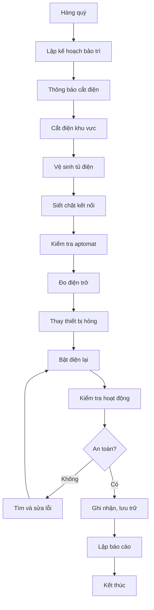

# SOP-07.2: BẢO TRÌ HỆ THỐNG ĐIỆN

## 1. THÔNG TIN

| **Thuộc tính** | **Nội dung** |
|---|---|
| Mã SOP | SOP-07.2 |
| Tên | Bảo trì hệ thống điện |
| Tần suất | Hàng quý (bảo trì), Hàng năm (kiểm định) |

## 2. HỆ THỐNG ĐIỆN

| **Thành phần** | **Nội dung kiểm tra** |
|---|---|
| Tủ điện tổng | Aptomat, cầu chì, kết nối |
| Tủ điện phân phối | Từng tầng, từng khu |
| Dây điện | Rò rỉ, hở, cháy |
| Ổ cắm, công tắc | Nóng, chập, lỏng |
| Đèn chiếu sáng | Hoạt động, tiết kiệm điện |
| Điều hòa | Hoạt động, rò rỉ gas |
| Tiếp địa | Hoạt động tốt |

## 3. QUY TRÌNH BẢO TRÌ

### 3.1. Bảo trì hàng quý

**Bước 1: Thông báo**
- Thông báo cắt điện từng khu vực
- Lịch: Chủ nhật hoặc nghỉ lễ

**Bước 2: Kiểm tra và bảo trì**

| **Công việc** | **Nội dung** |
|---|---|
| Vệ sinh tủ điện | Hút bụi, lau chùi |
| Siết chặt kết nối | Tất cả đầu nối |
| Kiểm tra aptomat | Test ngắt điện |
| Đo điện trở cách điện | Dùng Megaohm meter |
| Kiểm tra dây nối đất | Điện trở ≤ 10 Ohm |
| Thay đèn hỏng | Tất cả đèn hỏng |

**Bước 3: Test lại**
- Bật điện từng khu vực
- Kiểm tra hoạt động
- Xác nhận an toàn

### 3.2. Kiểm định hàng năm

- Thuê đơn vị có chứng chỉ
- Kiểm định toàn bộ hệ thống
- Đo lường chuyên sâu
- Cấp giấy chứng nhận

## 4. AN TOÀN ĐIỆN

### 4.1. Quy tắc 5 KHÔNG

1. KHÔNG sờ tay ướt vào điện
2. KHÔNG dùng điện quá tải
3. KHÔNG tự sửa khi không biết
4. KHÔNG để trẻ em nghịch điện
5. KHÔNG để dây điện lôi thôi

### 4.2. Xử lý sự cố

| **Sự cố** | **Xử lý** |
|---|---|
| Chập điện, cháy | Cắt điện ngay, dùng bình CO2/bột dập |
| Giật điện | Dùng vật cách điện tách người ra, gọi 115 |
| Mất điện | Kiểm tra cầu dao, liên hệ điện lực |
| Quá tải | Tắt bớt thiết bị, kiểm tra nguyên nhân |

## 5. LƯU ĐỒ

---

**PHÊ DUYỆT**

| Điện trưởng | Trưởng phòng An toàn | Hiệu trưởng |
|---|---|---|
| [Họ tên] | [Họ tên] | [Họ tên] |
