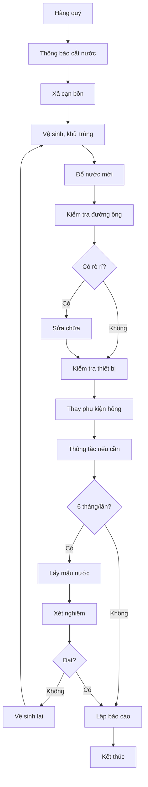

# SOP-07.3: BẢO TRÌ HỆ THỐNG NƯỚC

## 1. THÔNG TIN

| **Thuộc tính** | **Nội dung** |
|---|---|
| Mã SOP | SOP-07.3 |
| Tên | Bảo trì hệ thống nước |
| Tần suất | Hàng quý |

## 2. HỆ THỐNG NƯỚC

| **Thành phần** | **Kiểm tra** |
|---|---|
| Bồn nước | Vệ sinh 3 tháng/lần, không rò rỉ |
| Đường ống | Không rò, rỉ, vỡ |
| Vòi nước | Hoạt động tốt, không hỏng |
| Bồn cầu, tiểu | Xả nước tốt, không tắc |
| Máy bơm | Hoạt động êm, không rò nước |
| Hệ thống lọc | Thay lõi theo định kỳ |

## 3. QUY TRÌNH BẢO TRÌ

### 3.1. Vệ sinh bồn nước (3 tháng)

**Bước 1: Chuẩn bị**
- Thông báo cắt nước
- Xả cạn bồn
- Chuẩn bị bàn chải, xà phòng, clo

**Bước 2: Vệ sinh**
- Chà rửa thành bồn
- Khử trùng bằng clo
- Xả sạch
- Đổ nước mới

**Bước 3: Kiểm tra chất lượng**
- Lấy mẫu nước
- Gửi xét nghiệm (6 tháng/lần)
- Xác nhận đạt QCVN 01:2009

### 3.2. Bảo trì đường ống

- Kiểm tra rò rỉ
- Thay ống gỉ, vỡ
- Thông tắc (nếu có)
- Sơn chống rỉ

### 3.3. Bảo trì thiết bị vệ sinh

- Thay vòi hỏng
- Sửa bồn cầu rò nước
- Thông cống thoát nước
- Thay phụ kiện (đệm, van...)

## 4. TIÊU CHUẨN NƯỚC SẠCH

| **Chỉ tiêu** | **Giới hạn** |
|---|---|
| pH | 6.5 - 8.5 |
| Độ đục | ≤ 2 NTU |
| Coliform | 0 CFU/100ml |
| E.coli | 0 CFU/100ml |
| Clo dư | 0.3 - 0.5 mg/l |

**Xét nghiệm:** 6 tháng/lần tại phòng kiểm nghiệm được công nhận

## 5. XỬ LÝ SỰ CỐ

| **Sự cố** | **Xử lý** |
|---|---|
| Vỡ ống nước | Cắt nước, sửa ngay |
| Nước bẩn | Dừng dùng, vệ sinh bồn, xét nghiệm |
| Tắc cống | Thông tắc bằng máy chuyên dụng |
| Hết nước | Liên hệ công ty nước, dùng nước dự phòng |

## 6. LƯU ĐỒ

---

**PHÊ DUYỆT**

| Kỹ thuật trưởng | Trưởng phòng An toàn | Hiệu trưởng |
|---|---|---|
| [Họ tên] | [Họ tên] | [Họ tên] |
