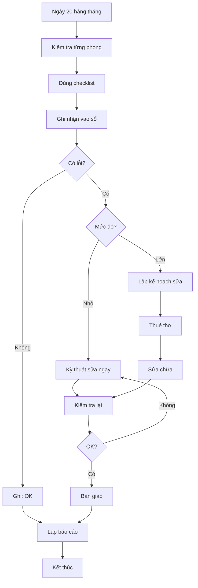

# SOP-07.4: QUẢN LÝ BẢO TRÌ PHÒNG HỌC

## 1. THÔNG TIN

| **Thuộc tính** | **Nội dung** |
|---|---|
| Mã SOP | SOP-07.4 |
| Tên | Quản lý bảo trì phòng học |
| Tần suất | Hàng tháng (kiểm tra), Theo nhu cầu (sửa chữa) |

## 2. NỘI DUNG KIỂM TRA PHÒNG HỌC

### 2.1. Checklist kiểm tra

| **Hạng mục** | **Tiêu chí đạt** | **Không đạt - Xử lý** |
|---|---|---|
| **Bàn học sinh** | Chắc chắn, không lung lay | Siết chặt, hàn lại |
| **Ghế** | Không gãy chân, mặt ghế không rách | Sửa hoặc thay mới |
| **Bảng** | Viết rõ, không bong tróc | Sơn lại, thay mới |
| **Đèn** | Sáng đầy đủ, không chập chờn | Thay bóng, sửa chấn lưu |
| **Quạt** | Quay đều, không kêu | Tra dầu, cân bằng cánh |
| **Cửa sổ** | Đóng mở dễ, kính không vỡ | Sửa bản lề, thay kính |
| **Tường** | Không nứt, bong tróc | Trát lại, sơn mới |
| **Sàn** | Sạch, không trơn, gạch không vỡ | Lau, thay gạch |

### 2.2. Kiểm tra an toàn

| **An toàn** | **Kiểm tra** |
|---|---|
| Điện | Ổ cắm không hở, dây không rối |
| PCCC | Bình chữa cháy còn áp, chưa hết hạn |
| Thoát hiểm | Cửa thoát mở được, không khóa |
| Thông gió | Cửa sổ mở được, quạt hoạt động |

## 3. QUY TRÌNH BẢO TRÌ

**Bước 1: Kiểm tra định kỳ (Ngày 20 hàng tháng)**
- Đội kỹ thuật đi kiểm tra từng phòng
- Dùng checklist
- Ghi nhận vào sổ
- Phân loại: OK / Cần sửa nhỏ / Cần sửa lớn

**Bước 2: Phân công sửa chữa**

| **Loại** | **Ai sửa** | **Thời gian** |
|---|---|---|
| Nhỏ (bóng đèn, ổ cắm...) | Kỹ thuật nội bộ | 1-2 ngày |
| Trung bình (sơn, trát...) | Thợ thuê ngoài | 3-7 ngày |
| Lớn (sửa mái, cầu thang...) | Đơn vị chuyên nghiệp | Theo hợp đồng |

**Bước 3: Thực hiện sửa chữa**
- Sửa vào cuối tuần (không ảnh hưởng học)
- Kiểm tra chất lượng
- Nghiệm thu
- Thanh toán

**Bước 4: Bàn giao lại**
- Kiểm tra lại toàn bộ
- Bàn giao cho giáo viên bộ môn
- Cập nhật sổ bảo trì

## 4. BẢO TRÌ HÈ (Mỗi năm)

**Sửa chữa lớn:**
- Sơn lại tường, trần
- Sửa mái dột
- Thay bàn ghế hỏng nhiều
- Nâng cấp thiết bị

**Vệ sinh tổng thể:**
- Lau kính cửa sổ
- Quét trần, tường
- Đánh bóng sàn

## 5. LƯU ĐỒ

---

**PHÊ DUYỆT**

| Kỹ thuật trưởng | Phó HT | Hiệu trưởng |
|---|---|---|
| [Họ tên] | [Họ tên] | [Họ tên] |
