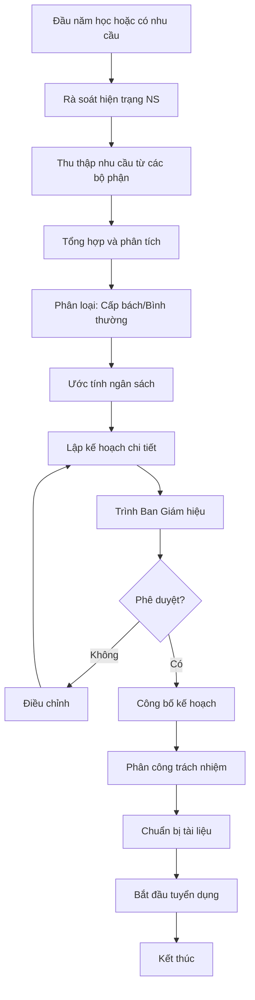

# SOP-01.1: XÂY DỰNG KẾ HOẠCH TUYỂN DỤNG

## 1. THÔNG TIN QUY TRÌNH

| **Thuộc tính** | **Nội dung** |
|---|---|
| Mã SOP | SOP-01.1 |
| Tên quy trình | Xây dựng kế hoạch tuyển dụng |
| Quy trình cha | SOP-01: Tuyển dụng |
| Phiên bản | 1.0 |
| Tần suất | Hàng năm (đầu năm học), Đột xuất (khi có nhu cầu) |

## 2. MỤC ĐÍCH

- **Xác định nhu cầu**: Phân tích chính xác cần tuyển vị trí gì, bao nhiêu người
- **Lập kế hoạch chi tiết**: Thời gian, ngân sách, phương pháp tuyển dụng
- **Phê duyệt trước**: Đảm bảo nguồn lực sẵn sàng trước khi tuyển
- **Tuyển đúng người**: Định hướng rõ tiêu chí, tránh tuyển sai

## 3. PHẠM VI ÁP DỤNG

| **Loại tuyển dụng** | **Khi nào** | **Quy trình** |
|---|---|---|
| Tuyển dụng định kỳ | Đầu năm học | Lập kế hoạch năm, phê duyệt chung |
| Tuyển dụng thay thế | Khi có NV nghỉ | Lập kế hoạch riêng, phê duyệt nhanh |
| Tuyển dụng mở rộng | Khi tăng quy mô | Theo đề án phát triển |

## 4. QUY TRÌNH THỰC HIỆN

### 4.1. Đánh giá nhu cầu

**Bước 1: Rà soát hiện trạng nhân sự**

- Số lượng NV hiện tại
- NV sắp nghỉ hưu, nghỉ việc
- NV chuyển công tác
- Đánh giá năng lực đội ngũ hiện tại

**Bước 2: Thu thập nhu cầu từ bộ phận**

Các Trưởng bộ phận điền Form đề xuất (QT02-F01):

| **Thông tin** | **Nội dung** |
|---|---|
| Vị trí cần tuyển | Giáo viên, NV hành chính, kỹ thuật... |
| Số lượng | Bao nhiêu người |
| Lý do | Thay thế/Mở rộng/Dự án mới |
| Yêu cầu | JD, trình độ, kinh nghiệm |
| Thời gian cần | Ngày cần có người |
| Mức lương dự kiến | Khung lương đề xuất |

### 4.2. Phân tích và lập kế hoạch

**Bước 3: Tổng hợp và phân tích**

Phòng NS tổng hợp:
- Tổng số vị trí cần tuyển
- Phân loại: Cấp bách/Bình thường/Có thể trì hoãn
- Ước tính ngân sách cần thiết
- Xác định phương pháp tuyển (headhunt, đăng tin, giới thiệu...)

**Bước 4: Lập kế hoạch chi tiết**

Kế hoạch tuyển dụng (QT02-R01) bao gồm:

| **Nội dung** | **Chi tiết** |
|---|---|
| Vị trí tuyển | Danh sách đầy đủ với số lượng |
| Tiêu chí tuyển | JD, yêu cầu cụ thể từng vị trí |
| Timeline | Lịch từng giai đoạn (đăng tin → phỏng vấn → nhận việc) |
| Ngân sách | Chi phí đăng tin, headhunt, test, phỏng vấn... |
| Phân công | Ai phụ trách từng vị trí |
| KPI | Thời gian, chất lượng ứng viên |

### 4.3. Phê duyệt và triển khai

**Bước 5: Trình phê duyệt**

- Trình Ban Giám hiệu
- Giải trình ngân sách, tính cấp thiết
- Điều chỉnh nếu có ý kiến
- Ký phê duyệt

**Bước 6: Triển khai kế hoạch**

- Công bố nội bộ
- Phân công cụ thể cho từng người
- Chuẩn bị tài liệu, biểu mẫu
- Bắt đầu tuyển dụng theo SOP-01.2

## 5. LƯU ĐỒ QUY TRÌNH

## 6. BIỂU MẪU LIÊN QUAN

| **Mã** | **Tên** | **Mục đích** |
|---|---|---|
| QT02-F01 | Form đề xuất tuyển dụng | Bộ phận đề xuất nhu cầu |
| QT02-R01 | Kế hoạch tuyển dụng | Kế hoạch tổng thể năm |
| QT02-F02 | Bảng dự trù ngân sách TD | Ước tính chi phí |

## 7. TIÊU CHUẨN

| **Chỉ tiêu** | **Mục tiêu** |
|---|---|
| Thời gian lập kế hoạch | ≤ 15 ngày |
| Tỷ lệ phê duyệt lần 1 | ≥ 90% |
| Độ chính xác dự trù | ≥ 85% |

## 8. TRÁCH NHIỆM

| **Vai trò** | **Trách nhiệm** |
|---|---|
| **Trưởng bộ phận** | Đề xuất nhu cầu, JD cụ thể |
| **Phòng NS** | Tổng hợp, lập kế hoạch, trình duyệt |
| **BGH** | Phê duyệt, phân bổ ngân sách |

## 9. LƯU Ý

- ⚠️ **Lập kế hoạch trước 3 tháng** trước khi cần người (để đủ thời gian tuyển)
- ✅ **JD phải rõ ràng, cụ thể** - Tránh mơ hồ
- ✅ **Ngân sách phải thực tế** - Có dự phòng 10-15%

## 10. PHỤ LỤC

### 10.1. Checklist lập kế hoạch

- [ ] Rà soát NV hiện tại
- [ ] Thu thập đề xuất bộ phận
- [ ] Xác định vị trí ưu tiên
- [ ] Viết JD từng vị trí
- [ ] Ước tính ngân sách
- [ ] Lập timeline
- [ ] Trình BGH phê duyệt

## 11. FAQ

**Q1: Kế hoạch tuyển dụng có thể thay đổi giữa chừng không?**  
A: Được, nhưng phải có lý do chính đáng và được BGH phê duyệt lại.

**Q2: Nếu không tuyển đủ người theo kế hoạch thì sao?**  
A: Kéo dài thời gian tuyển, mở rộng kênh, hoặc xem xét hạ tiêu chí (có phê duyệt).

---

**PHÊ DUYỆT**

| Trưởng phòng NS | Phó HT | Hiệu trưởng |
|---|---|---|
| [Họ tên] | [Họ tên] | [Họ tên] |
