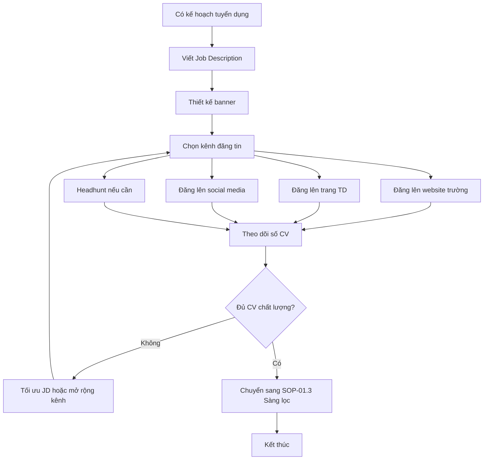

# SOP-01.2: ĐĂNG TIN TUYỂN DỤNG

## 1. THÔNG TIN QUY TRÌNH

| **Thuộc tính** | **Nội dung** |
|---|---|
| Mã SOP | SOP-01.2 |
| Tên quy trình | Đăng tin tuyển dụng |
| Quy trình cha | SOP-01: Tuyển dụng |
| Phiên bản | 1.0 |
| Tần suất | Khi có vị trí tuyển dụng |

## 2. MỤC ĐÍCH

- **Tiếp cận ứng viên chất lượng**: Đăng đúng kênh, đúng đối tượng
- **Xây dựng thương hiệu nhà tuyển dụng**: Nội dung chuyên nghiệp, hấp dẫn
- **Tối ưu chi phí**: Chọn kênh hiệu quả nhất với ngân sách hợp lý

## 3. PHẠM VI ÁP DỤNG

Áp dụng với mọi vị trí tuyển dụng theo kế hoạch SOP-01.1

## 4. QUY TRÌNH THỰC HIỆN

### 4.1. Chuẩn bị nội dung

**Bước 1: Viết Job Description (JD)**

Cấu trúc JD chuẩn:

| **Mục** | **Nội dung** |
|---|---|
| Tiêu đề | Ngắn gọn, hấp dẫn (VD: "Primary Homeroom Teacher - International School") |
| Giới thiệu trường | 2-3 câu về trường, môi trường làm việc |
| Trách nhiệm | 5-7 điểm cụ thể công việc chính |
| Yêu cầu | Bằng cấp, kinh nghiệm, kỹ năng, ngoại ngữ... |
| Quyền lợi | Lương, BHXH, phúc lợi, đào tạo, môi trường... |
| Cách ứng tuyển | Email, website, form online |

**Bước 2: Chọn kênh đăng tin**

| **Kênh** | **Ưu điểm** | **Nhược điểm** | **Phù hợp cho** |
|---|---|---|---|
| Website trường | Miễn phí, xây dựng thương hiệu | Reach hạn chế | Tất cả vị trí |
| Facebook trường | Miễn phí, tương tác cao | Ứng viên chất lượng trung bình | Vị trí phổ thông |
| VietnamWorks | Reach rộng, nhiều ứng viên | Chi phí cao | Giáo viên, NV chuyên môn |
| CareerBuilder | Đa dạng ngành nghề | Chi phí trung bình | NV hành chính, kỹ thuật |
| TopCV | Miễn phí/trả phí | Đông ứng viên | Vị trí entry-level |
| LinkedIn | Chuyên nghiệp, quốc tế | Ít người Việt Nam | Giáo viên nước ngoài, C-level |
| Headhunt | Ứng viên chất lượng cao | Rất đắt (15-30% lương) | Vị trí quản lý cao |

**Bước 3: Thiết kế hình ảnh**

- Banner tuyển dụng đẹp, chuyên nghiệp
- Thống nhất màu sắc, logo trường
- Highlight điểm nổi bật

### 4.2. Đăng tin và quảng bá

**Bước 4: Đăng tin lên các kênh**

- Website trường → Mục "Career" hoặc "Tuyển dụng"
- Các trang tuyển dụng → Tài khoản doanh nghiệp
- Social media → Fanpage, group giáo viên
- Mạng lưới cá nhân → Nhờ giới thiệu

**Bước 5: Quảng bá (nếu cần)**

- Facebook Ads: Target nhóm đối tượng cụ thể
- Google Ads: Khi có người search "tuyển giáo viên"
- Email marketing: Gửi đến Talent Pool
- Offline: Hội chợ việc làm, hội thảo giáo dục

### 4.3. Theo dõi và tối ưu

**Bước 6: Theo dõi hiệu quả**

| **Chỉ số** | **Cách đo** |
|---|---|
| Số lượt xem | Analytics, dashboard trang TD |
| Số CV nhận được | Hệ thống tuyển dụng |
| Chất lượng CV | Tỷ lệ CV đạt yêu cầu |
| Cost per CV | Chi phí / Số CV nhận |

**Bước 7: Tối ưu nếu cần**

- Ít CV → Sửa JD hấp dẫn hơn, mở rộng kênh
- CV không đạt → Sửa tiêu đề, yêu cầu rõ hơn
- Chi phí cao → Chuyển sang kênh miễn phí

## 5. LƯU ĐỒ QUY TRÌNH



## 6. BIỂU MẪU

| **Mã** | **Tên** |
|---|---|
| QT02-F03 | Template Job Description |
| QT02-R02 | Báo cáo hiệu quả đăng tin |

## 7. TIÊU CHUẨN

| **Chỉ tiêu** | **Mục tiêu** |
|---|---|
| Thời gian từ đăng tin đến nhận đủ CV | ≤ 14 ngày |
| Tỷ lệ CV đạt yêu cầu | ≥ 30% |
| Cost per qualified CV | ≤ 200,000 VNĐ |

## 8. TRÁCH NHIỆM

| **Vai trò** | **Trách nhiệm** |
|---|---|
| **Phòng NS** | Viết JD, đăng tin, theo dõi |
| **Marketing** | Thiết kế hình ảnh, quảng bá |
| **Trưởng BP** | Góp ý JD, giới thiệu ứng viên |

## 9. LƯU Ý

- ⚠️ **JD phải trung thực** - Không thổi phồng, tránh ứng viên thất vọng sau
- ✅ **Cập nhật thường xuyên** - Gỡ tin khi đã đủ người
- ✅ **Trả lời nhanh** - Reply email ứng viên trong 24h

## 10. PHỤ LỤC

### 10.1. Mẫu JD tham khảo

```
🎓 [Tên trường] - TUYỂN DỤNG GIÁO VIÊN TIẾNG ANH TIỂU HỌC

📌 Về chúng tôi:
[Tên trường] là trường quốc tế uy tín với 10+ năm kinh nghiệm...

📝 Trách nhiệm:
• Giảng dạy Tiếng Anh cho học sinh lớp 1-5 (15-20 HS/lớp)
• Xây dựng giáo án theo chương trình Cambridge
• Đánh giá năng lực học sinh định kỳ
• Phối hợp với phụ huynh về tiến bộ học sinh
• Tham gia các hoạt động ngoại khóa

✅ Yêu cầu:
• Tốt nghiệp Đại học ngành Sư phạm Tiếng Anh hoặc tương đương
• Ít nhất 2 năm kinh nghiệm dạy Tiểu học
• IELTS ≥ 7.0 hoặc tương đương
• Nhiệt tình, yêu trẻ, kỹ năng giao tiếp tốt

💰 Quyền lợi:
• Lương: 15-25 triệu (thỏa thuận theo năng lực)
• Thưởng KPI tháng + thưởng cuối năm
• BHXH, BHYT, BHTN đầy đủ
• Đào tạo nghiệp vụ thường xuyên
• Môi trường chuyên nghiệp, quốc tế

📧 Ứng tuyển: careers@[school].edu.vn
```

## 11. FAQ

**Q1: Nên đăng tin trong bao lâu?**  
A: Tối thiểu 14 ngày. Có thể kéo dài nếu chưa đủ ứng viên.

**Q2: Có nên ghi mức lương cụ thể không?**  
A: Nên ghi khung lương để thu hút đúng đối tượng, tránh lãng phí thời gian.

---

**PHÊ DUYỆT**

| Trưởng phòng NS | Phó HT |
|---|---|
| [Họ tên] | [Họ tên] |
