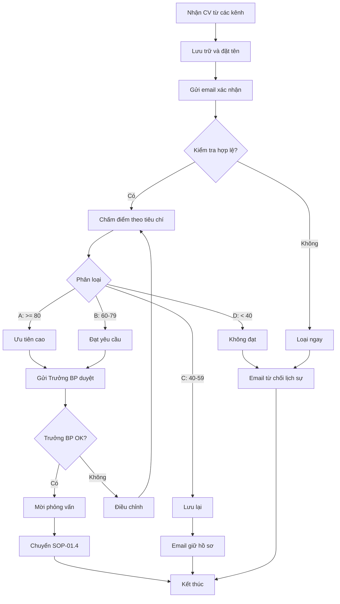

# SOP-01.3: SÀNG LỌC HỒ SƠ ỨNG VIÊN

## 1. THÔNG TIN QUY TRÌNH

| **Thuộc tính** | **Nội dung** |
|---|---|
| Mã SOP | SOP-01.3 |
| Tên quy trình | Sàng lọc hồ sơ ứng viên |
| Quy trình cha | SOP-01: Tuyển dụng |
| Phiên bản | 1.0 |
| Tần suất | Liên tục khi có CV nộp về |

## 2. MỤC ĐÍCH

- **Lựa chọn ứng viên phù hợp**: Chỉ mời phỏng vấn những người đáp ứng yêu cầu
- **Tiết kiệm thời gian**: Loại bỏ nhanh CV không đạt
- **Công bằng, minh bạch**: Tiêu chí rõ ràng, nhất quán

## 3. PHẠM VI ÁP DỤNG

Tất cả CV nhận được từ các kênh tuyển dụng

## 4. QUY TRÌNH THỰC HIỆN

### 4.1. Tiếp nhận và phân loại

**Bước 1: Thu thập CV**

Nguồn CV:
- Email tuyển dụng
- Form trên website
- Trang tuyển dụng (VietnamWorks, LinkedIn...)
- Headhunter
- Giới thiệu nội bộ

**Bước 2: Nhập hệ thống**

- Lưu vào thư mục theo vị trí tuyển
- Đặt tên file: `[Họ tên]_[Vị trí]_[Ngày nhận]`
- Nhập vào ATS (Applicant Tracking System) nếu có
- Gửi email xác nhận nhận được hồ sơ

### 4.2. Sàng lọc CV

**Bước 3: Kiểm tra hợp lệ (1 phút/CV)**

Loại ngay nếu:
- Không đầy đủ thông tin cơ bản
- Sai định dạng, quá lộn xộn
- Không có ảnh (nếu yêu cầu)
- Gửi nhầm vị trí hoàn toàn khác

**Bước 4: Chấm điểm theo tiêu chí (5 phút/CV)**

| **Tiêu chí** | **Điểm tối đa** | **Ghi chú** |
|---|---|---|
| **Bằng cấp** | 25 | Đúng chuyên ngành, trường uy tín |
| **Kinh nghiệm** | 25 | Số năm, độ liên quan |
| **Kỹ năng** | 20 | Kỹ năng chuyên môn, ngoại ngữ |
| **Thành tích** | 15 | Giải thưởng, dự án nổi bật |
| **Ấn tượng CV** | 15 | Trình bày, độ chi tiết, cover letter |
| **Tổng** | **100** | |

**Phân loại:**
- **A (≥ 80 điểm)**: Ưu tiên cao → Mời PV ngay
- **B (60-79 điểm)**: Đạt yêu cầu → Mời PV
- **C (40-59 điểm)**: Lưu lại, mời nếu thiếu người
- **D (< 40 điểm)**: Không đạt → Gửi email từ chối

**Bước 5: Tham khảo ý kiến Trưởng bộ phận**

- Gửi CV nhóm A, B cho Trưởng BP xem
- Trưởng BP góp ý, chọn người mời PV
- Quyết định cuối cùng

### 4.3. Phản hồi ứng viên

**Bước 6: Liên hệ ứng viên**

**Nhóm A, B (Mời PV):**
- Gọi điện hoặc email mời phỏng vấn
- Thông báo thời gian, địa điểm, hình thức (online/offline)
- Hướng dẫn chuẩn bị

**Nhóm C (Giữ lại):**
- Email cảm ơn, thông báo "giữ hồ sơ để xem xét"

**Nhóm D (Từ chối):**
- Email lịch sự, cảm ơn, khuyến khích ứng tuyển vị trí khác

## 5. LƯU ĐỒ QUY TRÌNH



## 6. BIỂU MẪU

| **Mã** | **Tên** |
|---|---|
| QT02-F04 | Bảng chấm điểm CV |
| QT02-F05 | Email mời phỏng vấn |
| QT02-F06 | Email từ chối ứng viên |

## 7. TIÊU CHUẨN

| **Chỉ tiêu** | **Mục tiêu** |
|---|---|
| Thời gian phản hồi CV | ≤ 3 ngày làm việc |
| Tỷ lệ ứng viên được mời PV | 15-25% tổng CV |
| Tỷ lệ ứng viên đồng ý PV | ≥ 80% |

## 8. TRÁCH NHIỆM

| **Vai trò** | **Trách nhiệm** |
|---|---|
| **Phòng NS** | Sàng lọc, chấm điểm, liên hệ UV |
| **Trưởng BP** | Duyệt CV, quyết định mời PV |

## 9. LƯU Ý

- ⚠️ **Không phân biệt đối xử**: Tuổi, giới tính, ngoại hình không phải tiêu chí loại
- ✅ **Giữ thông tin bảo mật**: CV là dữ liệu cá nhân
- ✅ **Phản hồi lịch sự**: Dù từ chối vẫn để lại ấn tượng tốt

## 10. PHỤ LỤC

### 10.1. Mẫu email mời phỏng vấn

```
Tiêu đề: [Tên trường] - Thư mời phỏng vấn vị trí [Tên vị trí]

Kính gửi Anh/Chị [Họ tên],

Cảm ơn Anh/Chị đã quan tâm và ứng tuyển vị trí [Tên vị trí] tại [Tên trường].

Sau khi xem xét hồ sơ, chúng tôi rất ấn tượng với kinh nghiệm và năng lực của Anh/Chị. Chúng tôi xin trân trọng mời Anh/Chị đến phỏng vấn với thông tin như sau:

• Thời gian: [Ngày giờ]
• Địa điểm: [Địa chỉ] hoặc [Link Zoom]
• Người phỏng vấn: [Họ tên + Chức vụ]
• Thời lượng: Khoảng 45-60 phút

Anh/Chị vui lòng chuẩn bị:
- Bản CV và bằng cấp gốc
- Demo bài giảng (nếu là giáo viên)
- Câu hỏi muốn trao đổi

Vui lòng xác nhận tham dự qua email này trước [Ngày].

Trân trọng,
[Họ tên - Phòng Nhân sự]
```

## 11. FAQ

**Q1: Nếu CV tốt nhưng thiếu 1 yêu cầu thì sao?**  
A: Vẫn mời PV để trao đổi. Đôi khi thực tế tốt hơn giấy tờ.

**Q2: Có nên phản hồi email từ chối không?**  
A: Nên! Thể hiện văn hóa tôn trọng, ứng viên có thể giới thiệu người khác.

---

**PHÊ DUYỆT**

| Trưởng phòng NS | Phó HT |
|---|---|
| [Họ tên] | [Họ tên] |
