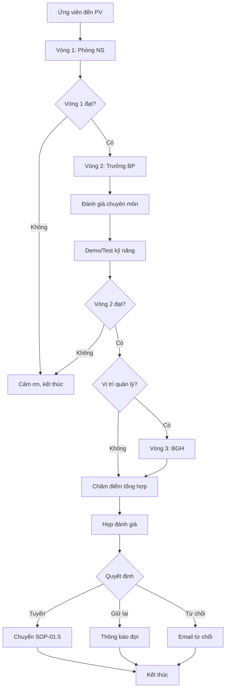

# SOP-01.4: PHỎNG VẤN ỨNG VIÊN

## 1. THÔNG TIN QUY TRÌNH

| **Thuộc tính** | **Nội dung** |
|---|---|
| Mã SOP | SOP-01.4 |
| Tên quy trình | Phỏng vấn ứng viên |
| Quy trình cha | SOP-01: Tuyển dụng |
| Phiên bản | 1.0 |
| Tần suất | Khi có ứng viên được mời PV |

## 2. MỤC ĐÍCH

- **Đánh giá toàn diện**: Năng lực chuyên môn, kỹ năng mềm, văn hóa phù hợp
- **Trao đổi 2 chiều**: Ứng viên hiểu rõ công việc, trường hiểu rõ ứng viên
- **Quyết định chính xác**: Thu thập đủ thông tin để tuyển đúng người

## 3. PHẠM VI ÁP DỤNG

Tất cả ứng viên được mời phỏng vấn sau khi CV đạt yêu cầu

## 4. QUY TRÌNH THỰC HIỆN

### 4.1. Chuẩn bị phỏng vấn

**Bước 1: Chuẩn bị tài liệu**

- [ ] CV ứng viên
- [ ] Bảng chấm điểm phỏng vấn (QT02-F07)
- [ ] Danh sách câu hỏi theo vị trí
- [ ] JD chi tiết
- [ ] Giới thiệu về trường (brochure)

**Bước 2: Chuẩn bị phòng PV / Link Zoom**

- Phòng riêng tư, yên tĩnh
- Nước uống, giấy bút
- Thiết bị kỹ thuật (máy chiếu, laptop nếu cần demo)

**Bước 3: Phân công người phỏng vấn**

| **Vòng** | **Người PV** | **Nội dung đánh giá** | **Thời gian** |
|---|---|---|---|
| **Vòng 1** | Phòng NS | Thông tin cơ bản, động cơ, văn hóa | 30 phút |
| **Vòng 2** | Trưởng BP | Chuyên môn, kinh nghiệm, demo | 45-60 phút |
| **Vòng 3** | BGH (nếu cần) | Tầm nhìn, cam kết, thương lượng | 30 phút |

### 4.2. Tiến hành phỏng vấn

**VÒNG 1: Phỏng vấn sơ bộ (Phòng NS)**

**Bước 4: Giới thiệu và làm quen (5 phút)**

- Chào hỏi, tạo không khí thoải mái
- Giới thiệu bản thân, trường học
- Thông báo cấu trúc buổi PV

**Bước 5: Phỏng vấn hành vi (20 phút)**

Các câu hỏi điển hình:

| **Chủ đề** | **Câu hỏi mẫu** |
|---|---|
| Giới thiệu bản thân | "Hãy kể về bản thân và hành trình sự nghiệp của bạn" |
| Động cơ | "Tại sao bạn muốn làm việc tại trường chúng tôi?" |
| Điểm mạnh/yếu | "Điểm mạnh nhất của bạn trong công việc là gì?" |
| Xử lý tình huống | "Kể về lần bạn đối mặt với học sinh khó khăn" |
| Làm việc nhóm | "Bạn đóng góp gì trong team trước đây?" |
| Mục tiêu | "Bạn nhìn thấy mình ở đâu sau 3-5 năm?" |

**Bước 6: Q&A và kết thúc vòng 1 (5 phút)**

- Ứng viên hỏi về công việc, môi trường
- Thông báo bước tiếp theo
- Nếu đạt → Chuyển vòng 2 ngay hoặc hẹn lịch

**VÒNG 2: Phỏng vấn chuyên môn (Trưởng BP)**

**Bước 7: Đánh giá chuyên môn (30-40 phút)**

**Với Giáo viên:**
- Demo bài giảng (15-20 phút)
- Q&A về phương pháp giảng dạy
- Xử lý tình huống lớp học
- Kiến thức chương trình (Cambridge, IB...)

**Với NV hành chính/kỹ thuật:**
- Kiểm tra kỹ năng cụ thể (Excel, kế toán, IT...)
- Tình huống thực tế công việc
- Hiểu biết về quy trình, công cụ

**Bước 8: Trao đổi lương, phúc lợi (10 phút)**

- Mong muốn lương của ứng viên
- Giải thích cơ cấu lương, thưởng
- Thời gian bắt đầu làm việc

**VÒNG 3: Phỏng vấn với BGH (Nếu là vị trí quản lý)**

**Bước 9: Phỏng vấn cấp cao**

- Tầm nhìn về giáo dục
- Khả năng lãnh đạo, quản lý team
- Cam kết gắn bó lâu dài

### 4.3. Sau phỏng vấn

**Bước 10: Chấm điểm và tổng hợp**

Sử dụng Bảng chấm điểm (QT02-F07):

| **Tiêu chí** | **Điểm tối đa** |
|---|---|
| Chuyên môn | 30 |
| Kinh nghiệm | 20 |
| Kỹ năng mềm | 20 |
| Văn hóa phù hợp | 15 |
| Nhiệt huyết | 10 |
| Ấn tượng chung | 5 |
| **Tổng** | **100** |

**Bước 11: Họp đánh giá**

- NS + Trưởng BP + BGH (nếu có) họp
- So sánh các ứng viên
- Quyết định: Tuyển / Giữ lại / Từ chối

## 5. LƯU ĐỒ QUY TRÌNH

## 6. BIỂU MẪU

| **Mã** | **Tên** |
|---|---|
| QT02-F07 | Bảng chấm điểm phỏng vấn |
| QT02-F08 | Biên bản phỏng vấn |
| QT02-F09 | Danh sách câu hỏi phỏng vấn |

## 7. TIÊU CHUẨN

| **Chỉ tiêu** | **Mục tiêu** |
|---|---|
| Tỷ lệ ứng viên PV được tuyển | 30-50% |
| Thời gian từ PV đến thông báo | ≤ 3 ngày |
| Điểm hài lòng của ứng viên về trải nghiệm PV | ≥ 8/10 |

## 8. TRÁCH NHIỆM

| **Vai trò** | **Trách nhiệm** |
|---|---|
| **Phòng NS** | Tổ chức, điều phối, PV vòng 1 |
| **Trưởng BP** | PV vòng 2, đánh giá chuyên môn |
| **BGH** | PV vòng 3 (nếu cần), quyết định cuối |

## 9. LƯU Ý

- ⚠️ **Đúng giờ**: Tôn trọng thời gian ứng viên
- ✅ **Không hỏi nhạy cảm**: Tránh hỏi tôn giáo, chính trị, kế hoạch sinh con...
- ✅ **Lắng nghe nhiều hơn nói**: 70% nghe, 30% nói

## 10. PHỤ LỤC

### 10.1. Câu hỏi STAR (Situation-Task-Action-Result)

Ví dụ: "Kể về lần bạn xử lý xung đột với đồng nghiệp"

- **S**: Tình huống gì?
- **T**: Nhiệm vụ của bạn?
- **A**: Bạn làm gì?
- **R**: Kết quả ra sao?

### 10.2. Red flags cần lưu ý

- Nói xấu công ty cũ
- Không chuẩn bị, không biết về trường
- Chỉ quan tâm lương mà không hỏi công việc
- Thiếu nhiệt huyết, thụ động

## 11. FAQ

**Q1: Nếu ứng viên yêu cầu lương cao hơn khung?**  
A: Thương lượng nếu năng lực thật sự tốt. Nếu không, giải thích khung lương và từ chối lịch sự.

**Q2: Có nên cho biết kết quả PV ngay không?**  
A: Không nên. Cần thời gian đánh giá, so sánh với ứng viên khác.

---

**PHÊ DUYỆT**

| Trưởng phòng NS | Phó HT |
|---|---|
| [Họ tên] | [Họ tên] |
