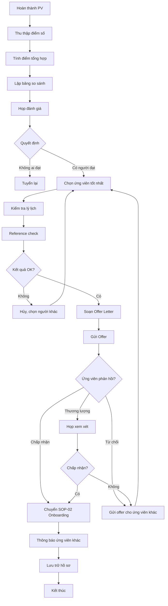

# SOP-01.5: ĐÁNH GIÁ VÀ LỰA CHỌN ỨNG VIÊN

## 1. THÔNG TIN QUY TRÌNH

| **Thuộc tính** | **Nội dung** |
|---|---|
| Mã SOP | SOP-01.5 |
| Tên quy trình | Đánh giá và lựa chọn ứng viên |
| Quy trình cha | SOP-01: Tuyển dụng |
| Phiên bản | 1.0 |
| Tần suất | Sau mỗi vòng phỏng vấn |

## 2. MỤC ĐÍCH

- **Quyết định chính xác**: Chọn ứng viên phù hợp nhất
- **Minh bạch, công bằng**: Dựa trên tiêu chí rõ ràng
- **Hoàn tất thủ tục**: Gửi offer, ký hợp đồng

## 3. PHẠM VI ÁP DỤNG

Tất cả ứng viên đã hoàn thành phỏng vấn

## 4. QUY TRÌNH THỰC HIỆN

### 4.1. Tổng hợp và so sánh

**Bước 1: Thu thập điểm số**

- Điểm CV (từ SOP-01.3)
- Điểm PV vòng 1, 2, 3 (từ SOP-01.4)
- Kết quả test (nếu có)
- Nhận xét của người PV

**Bước 2: Tính điểm tổng hợp**

| **Tiêu chí** | **Trọng số** | **Cách tính** |
|---|---|---|
| Điểm CV | 20% | Điểm CV × 0.2 |
| PV Vòng 1 | 20% | Điểm V1 × 0.2 |
| PV Vòng 2 | 40% | Điểm V2 × 0.4 |
| PV Vòng 3 | 20% | Điểm V3 × 0.2 (nếu có) |
| **Tổng** | **100%** | **Điểm cuối** |

**Bước 3: Lập bảng so sánh**

| **Ứng viên** | **Điểm CV** | **V1** | **V2** | **V3** | **Tổng** | **Ghi chú** |
|---|---|---|---|---|---|---|
| Nguyễn Văn A | 85 | 88 | 90 | - | 88.1 | Kinh nghiệm tốt |
| Trần Thị B | 78 | 85 | 92 | - | 87.2 | Nhiệt huyết cao |
| Lê Văn C | 90 | 80 | 75 | - | 79.0 | Lý thuyết tốt nhưng thực hành yếu |

### 4.2. Họp đánh giá và quyết định

**Bước 4: Họp tuyển dụng**

**Thành phần:**
- Phòng NS
- Trưởng bộ phận
- BGH (nếu vị trí quan trọng)

**Nội dung thảo luận:**
- So sánh điểm số
- Phân tích ưu/nhược điểm từng người
- Xem xét văn hóa phù hợp
- Khả năng gắn bó lâu dài
- Mức lương yêu cầu có hợp lý không

**Bước 5: Quyết định tuyển dụng**

3 kịch bản:

| **Trường hợp** | **Hành động** |
|---|---|
| **Có 1 ứng viên nổi trội** | Tuyển ngay |
| **Có 2-3 ứng viên tương đương** | Chọn người phù hợp văn hóa + lương hợp lý hơn |
| **Không ai đạt yêu cầu** | Tuyển lại, mở rộng tìm kiếm |

### 4.3. Kiểm tra lý lịch

**Bước 6: Xác minh thông tin (Reference Check)**

**Liên hệ:**
- Người giới thiệu (nếu có)
- Công ty cũ (nếu ứng viên đồng ý)
- Xác minh bằng cấp

**Hỏi:**
- Thời gian làm việc có chính xác không?
- Hiệu suất công việc thế nào?
- Lý do nghỉ việc?
- Có vấn đề gì về kỷ luật không?
- Có giới thiệu tuyển lại không?

**Bước 7: Kiểm tra lý lịch tư pháp**

- Yêu cầu ứng viên cung cấp Phiếu lý lịch tư pháp (giấy chứng nhận không có án tích)
- Đặc biệt quan trọng với giáo viên (tiếp xúc trẻ em)

### 4.4. Gửi thư mời làm việc (Offer Letter)

**Bước 8: Soạn thảo Offer**

Nội dung Offer Letter (QT02-F10):

| **Mục** | **Nội dung** |
|---|---|
| Chức danh | Tên vị trí chính thức |
| Ngày bắt đầu | Ngày nhận việc |
| Lương | Lương gross, các phụ cấp |
| Phúc lợi | BHXH, BHYT, thưởng, nghỉ phép... |
| Thời gian thử việc | 2-6 tháng |
| Loại hợp đồng | Xác định/Không xác định thời hạn |
| Thời hạn phản hồi | Ứng viên phải trả lời trong 3-7 ngày |
| Điều kiện | Qua kiểm tra sức khỏe, cung cấp giấy tờ |

**Bước 9: Gửi Offer**

- Email hoặc gặp trực tiếp
- Giải thích rõ các điều khoản
- Trả lời thắc mắc

**Bước 10: Nhận phản hồi**

| **Phản hồi** | **Hành động** |
|---|---|
| **Chấp nhận** | Chuẩn bị nhập việc (SOP-02) |
| **Từ chối** | Hỏi lý do, gửi offer cho ứng viên khác |
| **Thương lượng** | Cân nhắc nếu hợp lý, báo BGH quyết định |

### 4.5. Hoàn tất và lưu trữ

**Bước 11: Thông báo kết quả**

- **Ứng viên được chọn**: Chuyển sang SOP-02 (Onboarding)
- **Ứng viên không được chọn**: Email cảm ơn, giữ lại trong Talent Pool

**Bước 12: Lưu trữ hồ sơ**

- Lưu tất cả CV, điểm PV, biên bản họp
- Cập nhật ATS (Applicant Tracking System)
- Báo cáo tuyển dụng (QT02-R03)

## 5. LƯU ĐỒ QUY TRÌNH



## 6. BIỂU MẪU

| **Mã** | **Tên** |
|---|---|
| QT02-F10 | Offer Letter (Thư mời làm việc) |
| QT02-F11 | Biên bản họp tuyển dụng |
| QT02-R03 | Báo cáo tuyển dụng |

## 7. TIÊU CHUẨN

| **Chỉ tiêu** | **Mục tiêu** |
|---|---|
| Thời gian từ PV đến gửi Offer | ≤ 3 ngày |
| Tỷ lệ ứng viên chấp nhận Offer | ≥ 80% |
| Tỷ lệ tuyển đúng (qua thử việc) | ≥ 90% |

## 8. TRÁCH NHIỆM

| **Vai trò** | **Trách nhiệm** |
|---|---|
| **Phòng NS** | Tổng hợp, tổ chức họp, gửi offer, lưu trữ |
| **Trưởng BP** | Tham gia họp, quyết định chuyên môn |
| **BGH** | Quyết định cuối cùng, ký Offer |

## 9. LƯU Ý

- ⚠️ **Bảo mật thông tin**: Điểm PV không công khai
- ✅ **Động thái nhanh**: Offer nhanh để không mất ứng viên tốt
- ✅ **Thái độ tôn trọng**: Dù không tuyển vẫn giữ quan hệ tốt

## 10. PHỤ LỤC

### 10.1. Mẫu Offer Letter

```
[Logo trường]

THƯ MỜI LÀM VIỆC

Kính gửi: [Họ tên ứng viên]

Sau quá trình phỏng vấn và đánh giá, [Tên trường] rất vui mừng được chào mời Anh/Chị vào vị trí:

• Chức danh: [Tên vị trí]
• Bộ phận: [Tên bộ phận]
• Ngày bắt đầu: [Ngày/Tháng/Năm]
• Thời gian thử việc: [X] tháng
• Loại hợp đồng: [Xác định/Không xác định] thời hạn

CHẾ ĐỘ LƯƠNG VÀ PHÚC LỢI:
• Lương gross: [Số tiền] VNĐ/tháng
• Phụ cấp: [Chi tiết]
• Thưởng KPI: Theo hiệu suất
• BHXH, BHYT, BHTN: Theo luật
• Nghỉ phép: 12 ngày/năm + lễ tết
• Đào tạo: Miễn phí các khóa nâng cao

ĐIỀU KIỆN:
- Cung cấp đầy đủ giấy tờ cá nhân
- Qua kiểm tra sức khỏe
- Phiếu lý lịch tư pháp

Vui lòng phản hồi trước [Ngày] để chúng tôi sắp xếp.

Chúng tôi rất mong được chào đón Anh/Chị!

Trân trọng,
[Họ tên - Hiệu trưởng]
```

## 11. FAQ

**Q1: Nếu ứng viên đòi thương lượng lương?**  
A: Họp lại với BGH. Nếu ứng viên thật sự giỏi và chênh lệch nhỏ, có thể chấp nhận.

**Q2: Ứng viên xin thêm thời gian suy nghĩ?**  
A: Cho thêm 3-5 ngày. Nhưng vẫn tìm phương án dự phòng.

---

**PHÊ DUYỆT**

| Trưởng phòng NS | Phó HT | Hiệu trưởng |
|---|---|---|
| [Họ tên] | [Họ tên] | [Họ tên] |
