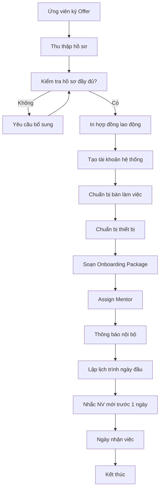

# SOP-02.1: CHUẨN BỊ NHẬP VIỆC

## 1. THÔNG TIN QUY TRÌNH

| **Thuộc tính** | **Nội dung** |
|---|---|
| Mã SOP | SOP-02.1 |
| Tên quy trình | Chuẩn bị nhập việc |
| Quy trình cha | SOP-02: OnBoarding |
| Phiên bản | 1.0 |
| Tần suất | Trước 3-5 ngày nhận việc |

## 2. MỤC ĐÍCH

- **Đảm bảo sẵn sàng**: Mọi thứ đã chuẩn bị kỹ cho ngày đầu tiên
- **Tạo ấn tượng tốt**: NV mới cảm thấy được chào đón, quan tâm
- **Giảm lo lắng**: NV biết rõ sẽ làm gì ngày đầu

## 3. PHẠM VI ÁP DỤNG

Tất cả nhân viên mới được tuyển dụng

## 4. QUY TRÌNH THỰC HIỆN

### 4.1. Chuẩn bị hành chính

**Bước 1: Thu thập hồ sơ nhân sự**

Yêu cầu NV mới gửi trước (QT02-F12 - Danh mục hồ sơ):

| **Giấy tờ** | **Số lượng** | **Ghi chú** |
|---|---|---|
| CMND/CCCD | Bản photo + scan | Còn hạn |
| Hộ khẩu | Bản photo | Trang có tên |
| Giấy khai sinh | Bản photo | |
| Bằng cấp | Bản photo công chứng | Tất cả bằng/chứng chỉ |
| Sơ yếu lý lịch | 02 bản gốc | Có xác nhận chính quyền |
| Phiếu lý lịch tư pháp | 01 bản gốc | Trong vòng 6 tháng |
| Giấy khám sức khỏe | 01 bản gốc | Kết luận "Đủ sức khỏe làm việc" |
| Ảnh 4x6 | 04 ảnh | Nền trắng |
| Số tài khoản | Thông tin | Để chuyển lương |
| Số BHXH (nếu có) | Thông tin | Để chuyển tiếp |

**Bước 2: Hoàn tất thủ tục hợp đồng**

- In hợp đồng lao động (02 bản)
- Chuẩn bị nội quy lao động
- Form đăng ký lương, BHXH

**Bước 3: Tạo tài khoản**

- [ ] Email công ty
- [ ] Tài khoản HRM (chấm công, xin phép...)
- [ ] Tài khoản LMS (nếu là giáo viên)
- [ ] Tài khoản các hệ thống nội bộ

### 4.2. Chuẩn bị vật lý

**Bước 4: Chuẩn bị không gian làm việc**

- [ ] Bàn làm việc, ghế
- [ ] Máy tính / Laptop
- [ ] Điện thoại (nếu có)
- [ ] Dụng cụ văn phòng (bút, giấy, kẹp...)
- [ ] Nameplate (bảng tên)

**Bước 5: Chuẩn bị trang thiết bị**

| **Đối tượng** | **Trang thiết bị** |
|---|---|
| **Giáo viên** | Sách giáo khoa, tài liệu, thiết bị dạy học |
| **NV hành chính** | Máy tính, phần mềm, tài liệu quy trình |
| **NV kỹ thuật** | Dụng cụ, máy móc, bảo hộ lao động |
| **Tất cả** | Thẻ ra vào, đồng phục, danh thiếp |

### 4.3. Chuẩn bị thông tin

**Bước 6: Soạn Onboarding Package**

Gói tài liệu trao tay ngày đầu (QT02-P01):

| **Tài liệu** | **Nội dung** |
|---|---|
| Welcome Letter | Thư chào mừng từ Hiệu trưởng |
| Employee Handbook | Sổ tay nhân viên (nội quy, quy chế, phúc lợi) |
| Org Chart | Sơ đồ tổ chức, danh bạ nội bộ |
| Schedule tuần đầu | Lịch trình tuần 1 chi tiết |
| Map | Sơ đồ mặt bằng trường |
| FAQs | Câu hỏi thường gặp (wifi, bãi xe, ăn trưa...) |

**Bước 7: Thông báo nội bộ**

- Email toàn trường giới thiệu NV mới
- Thông báo bộ phận về NV mới (tên, vị trí, ngày bắt đầu)
- Assign Mentor/Buddy (người hướng dẫn)

**Bước 8: Chuẩn bị lịch trình ngày đầu**

Sample lịch trình:

| **Giờ** | **Hoạt động** | **Người phụ trách** |
|---|---|---|
| 8:00-8:30 | Đón tiếp, bàn giao thẻ, đồng phục | Phòng NS |
| 8:30-9:00 | Gặp Hiệu trưởng chào mừng | BGH |
| 9:00-10:00 | Giới thiệu bộ phận, không gian | Trưởng BP |
| 10:00-11:30 | Hướng dẫn hệ thống, tài khoản | IT / NS |
| 11:30-13:00 | Ăn trưa cùng team | Team |
| 13:00-15:00 | Đào tạo định hướng | Phòng NS |
| 15:00-17:00 | Làm quen công việc cụ thể | Mentor |

## 5. LƯU ĐỒ QUY TRÌNH

## 6. BIỂU MẪU

| **Mã** | **Tên** |
|---|---|
| QT02-F12 | Danh mục hồ sơ nhân sự |
| QT02-P01 | Onboarding Package |
| QT02-F13 | Checklist chuẩn bị nhập việc |

## 7. TIÊU CHUẨN

| **Chỉ tiêu** | **Mục tiêu** |
|---|---|
| Hoàn tất chuẩn bị trước ngày nhận việc | 100% |
| Độ hài lòng NV mới về sự chuẩn bị | ≥ 9/10 |

## 8. TRÁCH NHIỆM

| **Vai trò** | **Trách nhiệm** |
|---|---|
| **Phòng NS** | Tổng điều phối, thu thập hồ sơ, tạo tài khoản, soạn package |
| **IT** | Chuẩn bị máy tính, tài khoản kỹ thuật |
| **Trưởng BP** | Chuẩn bị không gian, thiết bị, assign mentor |
| **Admin** | Làm thẻ, đồng phục, danh thiếp |

## 9. LƯU Ý

- ⚠️ **Chuẩn bị sớm**: Ít nhất 3 ngày trước
- ✅ **Kiểm tra kỹ**: Dùng checklist, đừng quên gì
- ✅ **Liên lạc trước**: Nhắc NV mới 1 ngày trước về giờ giấc, trang phục

## 10. PHỤ LỤC

### 10.1. Checklist chuẩn bị (QT02-F13)

**HỒ SƠ:**
- [ ] Đã nhận đủ giấy tờ
- [ ] In hợp đồng 02 bản
- [ ] Tạo email công ty
- [ ] Tạo tài khoản hệ thống

**VẬT LÝ:**
- [ ] Bàn ghế sạch sẽ
- [ ] Máy tính/Laptop hoạt động tốt
- [ ] Thiết bị chuyên môn đầy đủ
- [ ] Thẻ ra vào đã làm
- [ ] Đồng phục đã chuẩn bị

**THÔNG TIN:**
- [ ] Onboarding Package in sẵn
- [ ] Lịch trình tuần 1 đã lập
- [ ] Đã assign Mentor
- [ ] Email thông báo nội bộ đã gửi
- [ ] Đã nhắc NV trước 1 ngày

## 11. FAQ

**Q1: Nếu NV chưa có số BHXH?**  
A: Sẽ làm mới. Tốn 7-10 ngày, nhưng không ảnh hưởng nhận việc.

**Q2: NV mới xin hoãn ngày nhận việc?**  
A: Nếu lý do chính đáng, chấp nhận. Nhưng cần thông báo trước ít nhất 3 ngày.

---

**PHÊ DUYỆT**

| Trưởng phòng NS | Phó HT |
|---|---|
| [Họ tên] | [Họ tên] |
