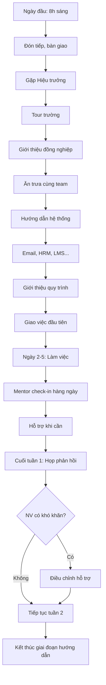

# SOP-02.2: HƯỚNG DẪN NHÂN VIÊN MỚI

## 1. THÔNG TIN QUY TRÌNH

| **Thuộc tính** | **Nội dung** |
|---|---|
| Mã SOP | SOP-02.2 |
| Tên quy trình | Hướng dẫn nhân viên mới |
| Quy trình cha | SOP-02: OnBoarding |
| Phiên bản | 1.0 |
| Tần suất | Tuần đầu tiên nhận việc |

## 2. MỤC ĐÍCH

- **Giúp NV hòa nhập nhanh**: Hiểu môi trường, con người, văn hóa
- **Giảm lo lắng**: NV biết ai là ai, hỏi ai, làm gì
- **Tạo cảm giác thuộc về**: NV cảm thấy là một phần của đội ngũ

## 3. PHẠM VI ÁP DỤNG

Tất cả nhân viên mới trong tuần đầu tiên

## 4. QUY TRÌNH THỰC HIỆN

### 4.1. Ngày đầu tiên

**Bước 1: Đón tiếp ấm áp (8:00-8:30)**

- Phòng NS hoặc Mentor đón tại sảnh
- Bàn giao: Thẻ, đồng phục, Onboarding Package
- Dẫn đến chỗ ngồi, giới thiệu không gian

**Bước 2: Gặp Hiệu trưởng (8:30-9:00)**

- Chào mừng chính thức
- Chia sẻ tầm nhìn, sứ mệnh trường
- Khuyến khích, động viên

**Bước 3: Tour trường (9:00-10:00)**

Mentor dẫn NV đi quanh giới thiệu:

| **Khu vực** | **Giới thiệu** |
|---|---|
| Phòng ban | Vị trí, chức năng, người phụ trách |
| Phòng học | Các khối lớp, đặc điểm |
| Khu vui chơi | Sân chơi, thư viện, phòng đa năng |
| Khu hành chính | Văn phòng BGH, phòng họp, kho |
| Tiện ích | Nhà ăn, toilet, bãi xe, y tế |

**Bước 4: Giới thiệu đồng nghiệp (10:00-11:30)**

- Gặp từng người trong bộ phận
- Trò chuyện ngắn, trao đổi thông tin liên lạc
- Chụp ảnh chung (để đăng nội bộ)

**Bước 5: Ăn trưa cùng team (11:30-13:00)**

- Không nói chuyện công việc
- Trò chuyện thoải mái, làm quen

### 4.2. Hướng dẫn hệ thống

**Bước 6: Đào tạo sử dụng công cụ (13:00-15:00)**

| **Hệ thống** | **Nội dung hướng dẫn** | **Người hướng dẫn** |
|---|---|---|
| **Email** | Cách dùng, quy ước email, signature | IT / NS |
| **HRM** | Chấm công, xin phép, xem bảng lương | NS |
| **LMS** | Đăng bài, chấm điểm, giao bài tập | Giáo viên kinh nghiệm |
| **Drive** | Cấu trúc thư mục, chia sẻ file | IT |
| **Chat** | Zalo/Teams nội bộ, group chính | NS |

**Bước 7: Giới thiệu quy trình cơ bản**

- Quy trình xin phép nghỉ
- Quy trình báo cáo công việc
- Quy trình đề xuất/khiếu nại
- Quy định về trang phục, giờ giấc

### 4.3. Hướng dẫn công việc

**Bước 8: Giao việc đầu tiên (15:00-17:00)**

- Trưởng BP hoặc Mentor giao nhiệm vụ đơn giản
- Giải thích mục tiêu, cách làm, deadline
- Để NV tự làm nhưng hỗ trợ khi cần

**Bước 9: Ngày 2-5 - Làm quen công việc**

- Mỗi ngày giao việc phức tạp hơn một chút
- Mentor check-in 2 lần/ngày: sáng và chiều
- Giải đáp thắc mắc, hướng dẫn chi tiết

**Bước 10: Cuối tuần 1 - Họp phản hồi**

- Trưởng BP + Mentor + NV mới họp 30 phút
- NV chia sẻ cảm nhận, khó khăn
- Trưởng BP góp ý, điều chỉnh

## 5. LƯU ĐỒ QUY TRÌNH

## 6. BIỂU MẪU

| **Mã** | **Tên** |
|---|---|
| QT02-F14 | Checklist ngày đầu |
| QT02-F15 | Form phản hồi tuần 1 |
| QT02-F16 | Nhật ký hướng dẫn Mentor |

## 7. TIÊU CHUẨN

| **Chỉ tiêu** | **Mục tiêu** |
|---|---|
| NV hoàn thành checklist ngày 1 | 100% |
| NV biết sử dụng hệ thống cơ bản | 100% (cuối tuần 1) |
| Điểm hài lòng NV về hướng dẫn | ≥ 9/10 |

## 8. TRÁCH NHIỆM

| **Vai trò** | **Trách nhiệm** |
|---|---|
| **Phòng NS** | Đón tiếp, hướng dẫn hành chính |
| **Mentor** | Dẫn tour, giới thiệu, hỗ trợ hàng ngày |
| **Trưởng BP** | Giao việc, theo dõi, họp phản hồi |
| **IT** | Hướng dẫn hệ thống kỹ thuật |

## 9. LƯU Ý

- ⚠️ **Không quá tải thông tin ngày đầu**: Từ từ, chia nhỏ
- ✅ **Khuyến khích hỏi**: "Hỏi là tốt, đừng ngại!"
- ✅ **Check-in thường xuyên**: Đừng để NV bơ vơ

## 10. PHỤ LỤC

### 10.1. Script giới thiệu mẫu

**Mentor:** "Chào [Tên], mình là [Tên Mentor], sẽ hỗ trợ bạn tuần đầu. Bất cứ lúc nào cần gì, cứ hỏi mình nhé! Bây giờ mình sẽ dẫn bạn đi quanh trường."

### 10.2. Checklist ngày đầu (QT02-F14)

**NV MỚI:**
- [ ] Đã nhận thẻ, đồng phục
- [ ] Gặp Hiệu trưởng
- [ ] Tour xong trường
- [ ] Gặp đủ đồng nghiệp
- [ ] Biết dùng email, HRM
- [ ] Có số điện thoại Mentor
- [ ] Hiểu lịch làm việc, nghỉ giải lao

**MENTOR:**
- [ ] Đón NV đúng giờ
- [ ] Giới thiệu đủ khu vực
- [ ] Giới thiệu đồng nghiệp
- [ ] Hướng dẫn hệ thống
- [ ] Giao việc đầu tiên
- [ ] Hẹn check-in ngày mai

## 11. FAQ

**Q1: Nếu NV quá nhút nhát, không dám hỏi?**  
A: Mentor chủ động hỏi: "Có gì chưa rõ không?", "Mình giải thích thêm nhé".

**Q2: NV nước ngoài, tiếng Việt yếu?**  
A: Assign Mentor biết tiếng Anh, tài liệu song ngữ.

---

**PHÊ DUYỆT**

| Trưởng phòng NS | Phó HT |
|---|---|
| [Họ tên] | [Họ tên] |
