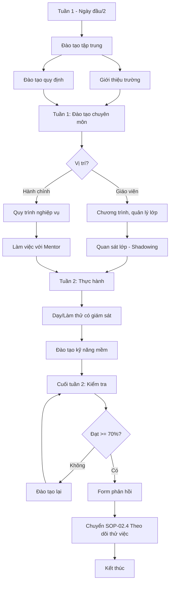

# SOP-02.3: ĐÀO TẠO ĐỊNH HƯỚNG

## 1. THÔNG TIN QUY TRÌNH

| **Thuộc tính** | **Nội dung** |
|---|---|
| Mã SOP | SOP-02.3 |
| Tên quy trình | Đào tạo định hướng |
| Quy trình cha | SOP-02: OnBoarding |
| Phiên bản | 1.0 |
| Tần suất | Tuần 1-2 nhận việc |

## 2. MỤC ĐÍCH

- **Hiểu về tổ chức**: Lịch sử, sứ mệnh, giá trị, mục tiêu
- **Nắm quy định**: Nội quy, quy chế, văn hóa ứng xử
- **Sẵn sàng làm việc**: Có đủ kiến thức, kỹ năng cơ bản

## 3. PHẠM VI ÁP DỤNG

Tất cả nhân viên mới

## 4. QUY TRÌNH THỰC HIỆN

### 4.1. Đào tạo tập trung (Buổi sáng ngày đầu hoặc ngày 2)

**Bước 1: Đào tạo về trường (2 giờ)**

**Nội dung:**

| **Chủ đề** | **Nội dung chi tiết** | **Người trình bày** | **Thời lượng** |
|---|---|---|---|
| **Giới thiệu trường** | Lịch sử, thành tích, tầm nhìn | BGH / NS | 30 phút |
| **Cấu trúc tổ chức** | Sơ đồ, phòng ban, chức năng | NS | 15 phút |
| **Chương trình giảng dạy** | Cambridge, IB, song ngữ... | Học thuật | 30 phút |
| **Giá trị cốt lõi** | Văn hóa, hành vi mong đợi | BGH | 15 phút |
| **Q&A** | Giải đáp thắc mắc | Tất cả | 30 phút |

**Bước 2: Đào tạo quy định (1.5 giờ)**

| **Chủ đề** | **Nội dung** | **Người trình bày** | **Thời lượng** |
|---|---|---|---|
| **Nội quy lao động** | Giờ giấc, trang phục, kỷ luật | NS | 30 phút |
| **An toàn - PCCC** | Quy định ATVSLĐ, lối thoát hiểm | An toàn | 20 phút |
| **Bảo mật thông tin** | Dữ liệu học sinh, thông tin nội bộ | IT / NS | 20 phút |
| **Quy trình hành chính** | Xin phép, đề xuất, báo cáo | NS | 20 phút |

### 4.2. Đào tạo chuyên môn (Tuần 1-2)

**Bước 3: Đào tạo theo vị trí**

**Với GIÁO VIÊN:**

| **Ngày** | **Nội dung** | **Thời lượng** |
|---|---|---|
| **Ngày 2-3** | Chương trình giảng dạy chi tiết, chuẩn đầu ra | 4 giờ |
| **Ngày 4** | Kỹ năng quản lý lớp học, xử lý hành vi | 3 giờ |
| **Ngày 5** | Sử dụng LMS, thiết bị dạy học | 2 giờ |
| **Tuần 2** | Quan sát lớp học (shadowing) | 10 giờ |
| **Tuần 2** | Dạy thử có mentor quan sát | 5 giờ |

**Với NHÂN VIÊN HÀNH CHÍNH:**

| **Nội dung** | **Thời lượng** |
|---|---|
| Quy trình nghiệp vụ chi tiết | 4 giờ |
| Phần mềm chuyên môn (kế toán, nhân sự...) | 4 giờ |
| Làm việc với mentor, thực hành | 10 giờ |

**Bước 4: Đào tạo kỹ năng mềm**

| **Kỹ năng** | **Đối tượng** | **Thời lượng** |
|---|---|---|
| Giao tiếp hiệu quả | Tất cả | 2 giờ |
| Làm việc nhóm | Tất cả | 2 giờ |
| Quản lý thời gian | Tất cả | 1 giờ |
| Xử lý stress | Tất cả | 1 giờ |

### 4.3. Kiểm tra và đánh giá

**Bước 5: Kiểm tra hiểu biết**

**Cuối tuần 2:**
- Trắc nghiệm về quy định, quy trình (20 câu)
- Thực hành công việc có giám sát
- Điểm đạt: ≥ 70%

**Bước 6: Phản hồi và cải tiến**

- NV mới điền Form phản hồi (QT02-F17)
- Phòng NS tổng hợp, cải tiến chương trình

## 5. LƯU ĐỒ QUY TRÌNH

## 6. BIỂU MẪU

| **Mã** | **Tên** |
|---|---|
| QT02-P02 | Tài liệu đào tạo định hướng |
| QT02-F17 | Form phản hồi đào tạo |
| QT02-F18 | Đề kiểm tra định hướng |

## 7. TIÊU CHUẨN

| **Chỉ tiêu** | **Mục tiêu** |
|---|---|
| Tỷ lệ NV qua kiểm tra lần 1 | ≥ 90% |
| Điểm hài lòng về đào tạo | ≥ 8.5/10 |
| NV nắm vững quy định cơ bản | 100% |

## 8. TRÁCH NHIỆM

| **Vai trò** | **Trách nhiệm** |
|---|---|
| **Phòng NS** | Tổ chức, điều phối, đào tạo quy định |
| **BGH / Học thuật** | Đào tạo về trường, chương trình |
| **Trưởng BP** | Đào tạo chuyên môn |
| **Mentor** | Hỗ trợ thực hành |
| **An toàn** | Đào tạo ATVSLĐ, PCCC |

## 9. LƯU Ý

- ⚠️ **Không nhồi nhét**: Chia nhỏ, học dần
- ✅ **Thực hành nhiều**: Lý thuyết 30%, thực hành 70%
- ✅ **Tạo không khí thoải mái**: Khuyến khích hỏi

## 10. PHỤ LỤC

### 10.1. Danh mục tài liệu đào tạo

- **Slide giới thiệu trường** (PPT)
- **Sổ tay nhân viên** (PDF)
- **Video giới thiệu** (5 phút)
- **Tài liệu chương trình giảng dạy**
- **Sơ đồ quy trình** (Flowchart)
- **Danh bạ nội bộ**

### 10.2. Mẫu câu hỏi kiểm tra

**Câu 1:** Giờ hành chính của trường là:
- A. 7:30 - 16:30
- B. 8:00 - 17:00
- C. 7:00 - 16:00

**Câu 2:** Khi có học sinh bị thương, giáo viên cần:
- A. Tự xử lý
- B. Gọi phụ huynh ngay
- C. Báo Y tế trường + BGH ngay lập tức
- D. Gọi 115

*(Đáp án: C là ưu tiên, nếu nặng thì C + D)*

## 11. FAQ

**Q1: Nếu NV không qua kiểm tra?**  
A: Đào tạo lại phần yếu, thi lại sau 3 ngày.

**Q2: NV kinh nghiệm nhiều có cần đào tạo đầy đủ không?**  
A: Có, nhưng có thể rút ngắn phần cơ bản, tập trung vào đặc thù trường.

---

**PHÊ DUYỆT**

| Trưởng phòng NS | Phó HT |
|---|---|
| [Họ tên] | [Họ tên] |
