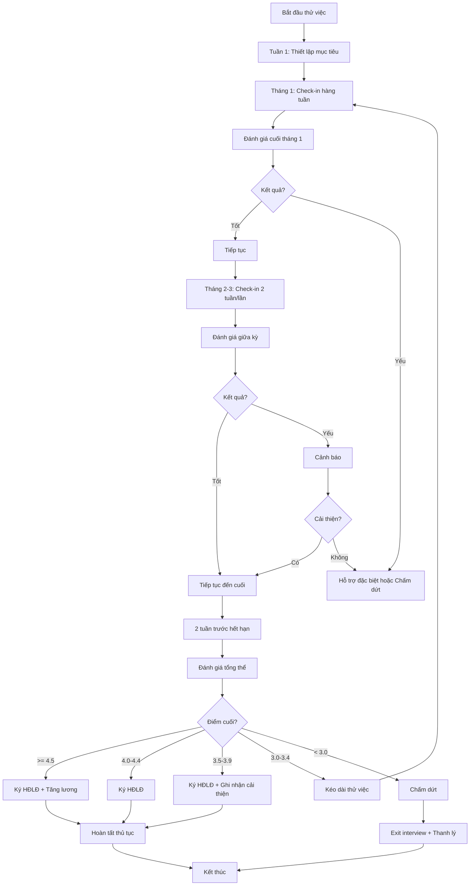

# SOP-02.4: THEO DÕI THỜI GIAN THỬ VIỆC

## 1. THÔNG TIN QUY TRÌNH

| **Thuộc tính** | **Nội dung** |
|---|---|
| Mã SOP | SOP-02.4 |
| Tên quy trình | Theo dõi thời gian thử việc |
| Quy trình cha | SOP-02: OnBoarding |
| Phiên bản | 1.0 |
| Tần suất | Trong suốt thời gian thử việc (2-6 tháng) |

## 2. MỤC ĐÍCH

- **Đánh giá năng lực thực tế**: NV có phù hợp với công việc không
- **Hỗ trợ kịp thời**: Phát hiện sớm khó khăn, hỗ trợ cải thiện
- **Quyết định chính xác**: Ký HĐLĐ chính thức hoặc chấm dứt

## 3. PHẠM VI ÁP DỤNG

Tất cả NV trong thời gian thử việc

| **Vị trí** | **Thời gian thử việc** |
|---|---|
| Nhân viên phổ thông | 60-90 ngày |
| Giáo viên | 90-120 ngày (1 học kỳ) |
| Trưởng bộ phận | 120-180 ngày |
| C-level | 180 ngày (tối đa theo luật) |

## 4. QUY TRÌNH THỰC HIỆN

### 4.1. Giai đoạn đầu (Tháng 1)

**Bước 1: Thiết lập mục tiêu rõ ràng**

Tuần đầu tiên, Trưởng BP + NV mới ngồi lại:

| **Nội dung** | **Chi tiết** |
|---|---|
| **Mục tiêu ngắn hạn** | Cụ thể cho tháng 1, tháng 2, tháng 3 |
| **KPI thử việc** | 3-5 chỉ tiêu đo lường được |
| **Kỹ năng cần cải thiện** | Điểm yếu cần khắc phục |
| **Hỗ trợ cần thiết** | Đào tạo, mentor, công cụ... |

Ký vào Bản cam kết thử việc (QT02-F19)

**Bước 2: Check-in hàng tuần**

**Tuần 1-4:** Trưởng BP hoặc Mentor gặp NV 1 lần/tuần (30 phút)

- Tiến độ công việc
- Khó khăn gặp phải
- Góp ý, hướng dẫn
- Ghi nhận vào Nhật ký thử việc (QT02-F20)

**Bước 3: Đánh giá tháng 1**

Cuối tháng 1:
- Trưởng BP chấm điểm (QT02-F21)
- Phản hồi chi tiết (làm tốt gì, cần cải thiện gì)
- Quyết định: Tiếp tục / Hỗ trợ thêm / Chấm dứt

### 4.2. Giai đoạn giữa (Tháng 2-3)

**Bước 4: Tăng độ khó công việc**

- Giao nhiệm vụ phức tạp hơn
- Giảm dần hỗ trợ từ Mentor
- Để NV tự xử lý vấn đề

**Bước 5: Check-in 2 tuần/lần**

- Giảm tần suất check-in xuống 2 tuần/lần
- Tập trung vào kết quả, không micromanage

**Bước 6: Đánh giá giữa kỳ**

Cuối tháng 2 (hoặc tháng 3):

| **Nội dung** | **Cách đánh giá** |
|---|---|
| Năng lực chuyên môn | Chấm điểm 1-5 |
| Kỹ năng mềm | Chấm điểm 1-5 |
| Thái độ làm việc | Chấm điểm 1-5 |
| Văn hóa phù hợp | Chấm điểm 1-5 |
| KPI đã đạt | Tỷ lệ % |

**Quyết định:**
- **Tốt (≥ 4.0)**: Tiếp tục, có thể ký HĐLĐ sớm
- **Trung bình (3.0-3.9)**: Tiếp tục, cần cải thiện
- **Yếu (< 3.0)**: Cảnh báo, có thể chấm dứt

### 4.3. Giai đoạn cuối (Trước khi hết thử việc)

**Bước 7: Đánh giá cuối kỳ thử việc**

**2 tuần trước hết hạn:**

- Tổng hợp tất cả đánh giá từ đầu
- Trưởng BP + Mentor + NV họp đánh giá
- So sánh mục tiêu ban đầu với kết quả thực tế

**Bước 8: Quyết định ký HĐLĐ chính thức**

| **Trường hợp** | **Quyết định** | **Thủ tục** |
|---|---|---|
| **Xuất sắc (≥ 4.5)** | Ký HĐLĐ + Tăng lương 5-10% | Trình BGH |
| **Tốt (4.0-4.4)** | Ký HĐLĐ | Trình BGH |
| **Trung bình (3.5-3.9)** | Ký HĐLĐ nhưng ghi nhận cần cải thiện | Trình BGH |
| **Yếu (3.0-3.4)** | Kéo dài thử việc thêm 1-2 tháng | Cần lý do rõ, BGH duyệt |
| **Không đạt (< 3.0)** | Chấm dứt HĐLĐ thử việc | Theo SOP-07.4 |

**Bước 9: Thông báo và hoàn tất thủ tục**

**Nếu tiếp tục:**
- Gửi Thư chúc mừng (QT02-F22)
- Ký HĐLĐ chính thức
- Tăng lương (nếu có)
- Công bố nội bộ

**Nếu chấm dứt:**
- Họp trao đổi, giải thích lý do
- Thanh lý HĐLĐ thử việc
- Thanh toán lương, trợ cấp (nếu có)
- Exit interview (SOP-07.4)

## 5. LƯU ĐỒ QUY TRÌNH

## 6. BIỂU MẪU

| **Mã** | **Tên** |
|---|---|
| QT02-F19 | Bản cam kết thử việc |
| QT02-F20 | Nhật ký theo dõi thử việc |
| QT02-F21 | Phiếu đánh giá thử việc |
| QT02-F22 | Thư chúc mừng hoàn thành thử việc |

## 7. TIÊU CHUẨN

| **Chỉ tiêu** | **Mục tiêu** |
|---|---|
| Tỷ lệ NV qua thử việc | ≥ 85% |
| Tỷ lệ NV nghỉ trong 6 tháng đầu | ≤ 10% |
| Check-in đúng hẹn | 100% |

## 8. TRÁCH NHIỆM

| **Vai trò** | **Trách nhiệm** |
|---|---|
| **Trưởng BP** | Đánh giá, check-in, quyết định đề xuất |
| **Mentor** | Hỗ trợ, phản hồi hàng ngày, ghi nhật ký |
| **Phòng NS** | Theo dõi timeline, tổng hợp đánh giá, hoàn tất thủ tục |
| **BGH** | Quyết định cuối về ký HĐLĐ |

## 9. LƯU Ý

- ⚠️ **Phản hồi kịp thời**: Đừng đợi đến cuối mới nói
- ✅ **Ghi chép cụ thể**: Có bằng chứng khi quyết định
- ✅ **Công bằng**: Áp dụng tiêu chí nhất quán cho tất cả

## 10. PHỤ LỤC

### 10.1. Tiêu chí đánh giá chi tiết

| **Tiêu chí** | **1 - Yếu** | **3 - TB** | **5 - Tốt** |
|---|---|---|---|
| **Chuyên môn** | Nhiều sai sót | Đạt cơ bản | Vượt mong đợi |
| **Tốc độ** | Chậm | Bình thường | Nhanh |
| **Chất lượng** | Thường phải sửa | OK | Ít sửa, xuất sắc |
| **Chủ động** | Phải nhắc | Làm khi được giao | Tự đề xuất cải tiến |
| **Team work** | Khó hợp tác | Bình thường | Tích cực, hỗ trợ tốt |
| **Văn hóa** | Không phù hợp | Chấp nhận được | Rất phù hợp |

### 10.2. Các lý do thường gặp không qua thử việc

- Năng lực chuyên môn không đạt
- Thái độ làm việc tiêu cực
- Không hòa nhập được với team
- Đi muộn, nghỉ nhiều
- Không cải thiện dù đã hỗ trợ

## 11. FAQ

**Q1: Có thể ký HĐLĐ trước hết thử việc không?**  
A: Có, nếu NV xuất sắc và 2 bên đồng ý. Nhưng vẫn phải qua ít nhất 1 tháng.

**Q2: NV xin nghỉ việc giữa thử việc?**  
A: Chấp nhận. Báo trước 3 ngày (theo luật). Exit interview để hiểu lý do.

---

**PHÊ DUYỆT**

| Trưởng phòng NS | Phó HT | Hiệu trưởng |
|---|---|---|
| [Họ tên] | [Họ tên] | [Họ tên] |
