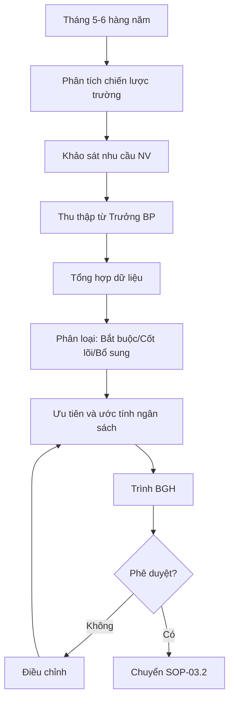

# SOP-03.1: ĐÁNH GIÁ NHU CẦU ĐÀO TẠO

## 1. THÔNG TIN QUY TRÌNH

| **Thuộc tính** | **Nội dung** |
|---|---|
| Mã SOP | SOP-03.1 |
| Tên quy trình | Đánh giá nhu cầu đào tạo |
| Quy trình cha | SOP-03: Đào tạo |
| Tần suất | Hàng năm (Tháng 5-6), Đột xuất khi cần |

## 2. MỤC ĐÍCH

Xác định chính xác khoảng cách kỹ năng (skill gap) để lập kế hoạch đào tạo phù hợp

## 3. PHẠM VI

Tất cả cán bộ, giáo viên, nhân viên

## 4. QUY TRÌNH

### 4.1. Thu thập dữ liệu

**Bước 1: Phân tích chiến lược**
- Mục tiêu trường năm tới → Cần kỹ năng gì?

**Bước 2: Rà soát hiện trạng**
| **Nguồn** | **Thông tin** |
|---|---|
| Đánh giá năng lực | Điểm yếu cần cải thiện |
| Khảo sát NV | NV muốn học gì |
| Trưởng BP | Bộ phận cần đào tạo gì |
| Yêu cầu chương trình | Cambridge, IB... cập nhật mới |

### 4.2. Phân tích và ưu tiên

**Bước 3: Phân loại nhu cầu**
| **Loại** | **Ví dụ** | **Ưu tiên** |
|---|---|---|
| Bắt buộc | ATVSLĐ, PCCC, Pháp luật | Cao |
| Chuyên môn cốt lõi | Phương pháp giảng dạy, Chương trình mới | Cao |
| Kỹ năng mềm | Giao tiếp, Quản lý thời gian | Trung bình |
| Phát triển cá nhân | Ngoại ngữ, MBA... | Thấp |

**Bước 4: Lập danh sách**
Form đề xuất đào tạo (QT02-F23)

### 4.3. Phê duyệt

**Bước 5: Trình BGH**
Kế hoạch đào tạo sơ bộ với ưu tiên và ngân sách dự kiến

## 5. LƯU ĐỒ

## 6. BIỂU MẪU

- QT02-F23: Form khảo sát nhu cầu đào tạo
- QT02-F24: Bảng tổng hợp nhu cầu

## 7. TIÊU CHUẨN

| **Chỉ tiêu** | **Mục tiêu** |
|---|---|
| Tỷ lệ NV tham gia khảo sát | ≥ 90% |
| Thời gian hoàn thành đánh giá | ≤ 20 ngày |

## 8. TRÁCH NHIỆM

- **Phòng NS**: Thu thập, phân tích, đề xuất
- **Trưởng BP**: Đề xuất nhu cầu bộ phận
- **BGH**: Phê duyệt

## 9. LƯU Ý

- ⚠️ Cân bằng giữa mong muốn NV và nhu cầu thực tế
- ✅ Ưu tiên đào tạo có tác động lớn

## 10. PHỤ LỤC

**Câu hỏi khảo sát mẫu:**
1. Kỹ năng nào bạn thấy còn yếu?
2. Khóa đào tạo nào bạn muốn tham gia?
3. Bạn học online hay offline?

## 11. FAQ

**Q: Nếu ngân sách không đủ?**  
A: Ưu tiên bắt buộc và cốt lõi trước, phần còn lại năm sau.

---
**PHÊ DUYỆT** | Trưởng NS | Phó HT |
