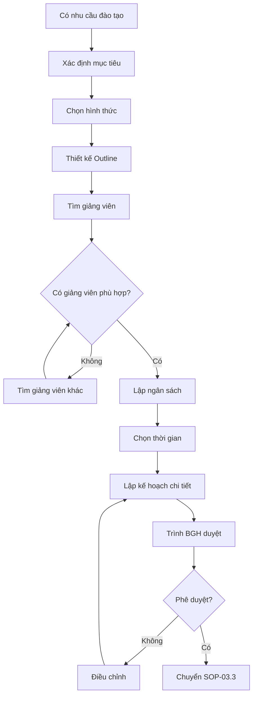

# SOP-03.2: XÂY DỰNG CHƯƠNG TRÌNH ĐÀO TẠO

## 1. THÔNG TIN QUY TRÌNH

| **Thuộc tính** | **Nội dung** |
|---|---|
| Mã SOP | SOP-03.2 |
| Tên quy trình | Xây dựng chương trình đào tạo |
| Quy trình cha | SOP-03: Đào tạo |
| Tần suất | Sau khi có nhu cầu đào tạo |

## 2. MỤC ĐÍCH

Thiết kế chương trình đào tạo hiệu quả, phù hợp với nhu cầu và ngân sách

## 3. PHẠM VI

Tất cả khóa đào tạo nội bộ và bên ngoài

## 4. QUY TRÌNH

### 4.1. Thiết kế nội dung

**Bước 1: Xác định mục tiêu học tập**
- Sau khóa học, NV phải làm được gì?
- Đo lường bằng cách nào?

**Bước 2: Lựa chọn hình thức**
| **Hình thức** | **Ưu điểm** | **Nhược điểm** |
|---|---|---|
| Nội bộ | Rẻ, linh hoạt | Chất lượng phụ thuộc giảng viên |
| Mời chuyên gia | Chất lượng cao | Đắt |
| Gửi đào tạo bên ngoài | Chứng chỉ quốc tế | Rất đắt |
| E-learning | Linh hoạt thời gian | Hiệu quả thấp |

**Bước 3: Thiết kế Outline**
Đề cương chi tiết: Nội dung, thời lượng từng phần, phương pháp, tài liệu

### 4.2. Chuẩn bị nguồn lực

**Bước 4: Tìm giảng viên**
- Nội bộ: Mời NV giỏi
- Bên ngoài: Liên hệ chuyên gia, công ty đào tạo

**Bước 5: Lập ngân sách**
| **Chi phí** | **Ghi chú** |
|---|---|
| Giảng viên | Nếu mời ngoài |
| Địa điểm | Thuê hội trường nếu cần |
| Tài liệu | In ấn, tài liệu học |
| Ăn uống | Coffee break, ăn trưa |
| Chứng chỉ | In chứng chỉ |

### 4.3. Lên lịch

**Bước 6: Chọn thời gian**
- Tránh cuối tuần, lễ
- Ngoài giờ học (nếu GV)

**Bước 7: Lập kế hoạch chi tiết**
Kế hoạch đào tạo (QT02-P03): Ngày giờ, địa điểm, đối tượng, giảng viên, ngân sách

## 5. LƯU ĐỒ

## 6. BIỂU MẪU

- QT02-P03: Kế hoạch đào tạo chi tiết
- QT02-F25: Outline chương trình

## 7. TIÊU CHUẨN

| **Chỉ tiêu** | **Mục tiêu** |
|---|---|
| Thời gian thiết kế | ≤ 15 ngày |
| Chi phí/người | ≤ 2 triệu đồng/khóa |

## 8. TRÁCH NHIỆM

- **Phòng NS**: Thiết kế, liên hệ giảng viên, lập kế hoạch
- **Trưởng BP**: Góp ý nội dung chuyên môn
- **BGH**: Phê duyệt

## 9. LƯU Ý

- ⚠️ Mục tiêu phải SMART (cụ thể, đo lường được)
- ✅ Thực hành nhiều hơn lý thuyết (70/30)

## 10. PHỤ LỤC

**Outline mẫu:**
- Giờ 1: Lý thuyết cơ bản
- Giờ 2-3: Thực hành, case study
- Giờ 4: Tổng kết, Q&A, test

## 11. FAQ

**Q: Nên đào tạo nội bộ hay thuê ngoài?**  
A: Tùy ngân sách và độ chuyên sâu. Kỹ năng cơ bản → Nội bộ. Chuyên sâu → Thuê ngoài.

---
**PHÊ DUYỆT** | Trưởng NS | Phó HT |
