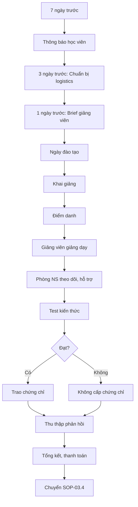

# SOP-03.3: TỔ CHỨC ĐÀO TẠO

## 1. THÔNG TIN QUY TRÌNH

| **Thuộc tính** | **Nội dung** |
|---|---|
| Mã SOP | SOP-03.3 |
| Tên quy trình | Tổ chức đào tạo |
| Quy trình cha | SOP-03: Đào tạo |
| Tần suất | Theo kế hoạch đào tạo |

## 2. MỤC ĐÍCH

Triển khai khóa đào tạo chuyên nghiệp, đạt mục tiêu học tập

## 3. PHẠM VI

Tất cả khóa đào tạo được phê duyệt

## 4. QUY TRÌNH

### 4.1. Chuẩn bị

**Bước 1: Thông báo học viên (Trước 7 ngày)**
Email/Thông báo: Chủ đề, Thời gian, Địa điểm, Yêu cầu chuẩn bị

**Bước 2: Chuẩn bị logistics (Trước 3 ngày)**
| **Hạng mục** | **Chi tiết** |
|---|---|
| Phòng học | Đủ chỗ, máy chiếu, âm thanh OK |
| Tài liệu | In sẵn cho học viên |
| Thiết bị | Laptop, clicker, bảng flip chart |
| Ăn uống | Coffee, nước, snack, ăn trưa (nếu cả ngày) |
| Điểm danh | Bảng điểm danh, bút |
| Chứng chỉ | In sẵn (điền tên sau) |

**Bước 3: Brief giảng viên (Trước 1 ngày)**
- Xác nhận lịch
- Cung cấp thông tin học viên
- Hỗ trợ kỹ thuật nếu cần

### 4.2. Triển khai

**Bước 4: Khai giảng**
- Chào mừng, giới thiệu giảng viên
- Nêu mục tiêu, quy định (điện thoại, giờ giấc...)
- Điểm danh

**Bước 5: Theo dõi trong khóa**
- Phòng NS có 1 người theo dõi
- Hỗ trợ kỹ thuật, logistics
- Thu thập phản hồi tức thì (nếu có vấn đề)

**Bước 6: Đánh giá cuối khóa**
- Test kiến thức (nếu có)
- Học viên điền Form phản hồi (QT02-F26)
- Trao chứng chỉ (nếu đạt)

### 4.3. Kết thúc

**Bước 7: Tổng kết**
- Thu thập tài liệu, ảnh
- Tổng hợp điểm danh, kết quả test
- Thanh toán giảng viên

## 5. LƯU ĐỒ

## 6. BIỂU MẪU

- QT02-F26: Form phản hồi đào tạo
- QT02-F27: Bảng điểm danh
- QT02-F28: Chứng chỉ hoàn thành

## 7. TIÊU CHUẨN

| **Chỉ tiêu** | **Mục tiêu** |
|---|---|
| Tỷ lệ tham dự | ≥ 95% |
| Điểm hài lòng về tổ chức | ≥ 8.5/10 |
| Tỷ lệ đạt test | ≥ 85% |

## 8. TRÁCH NHIỆM

- **Phòng NS**: Tổ chức, điều phối, logistics
- **Giảng viên**: Giảng dạy, đánh giá
- **Học viên**: Tham dự đầy đủ, tích cực

## 9. LƯU Ý

- ⚠️ Test thiết bị trước 1 giờ
- ✅ Chụp ảnh để lưu trữ, truyền thông nội bộ
- ✅ Nhắc nhở học viên trước 1 ngày

## 10. PHỤ LỤC

**Checklist ngày đào tạo:**
- [ ] Phòng mở cửa, điều hòa sẵn sàng
- [ ] Tài liệu đủ số lượng
- [ ] Máy chiếu/Laptop test OK
- [ ] Nước uống đầy đủ
- [ ] Bảng điểm danh chuẩn bị
- [ ] Form phản hồi in sẵn

## 11. FAQ

**Q: Nếu học viên không đến?**  
A: Ghi nhận vào hồ sơ. Nếu không lý do, báo Trưởng BP.

---
**PHÊ DUYỆT** | Trưởng NS | Phó HT |
