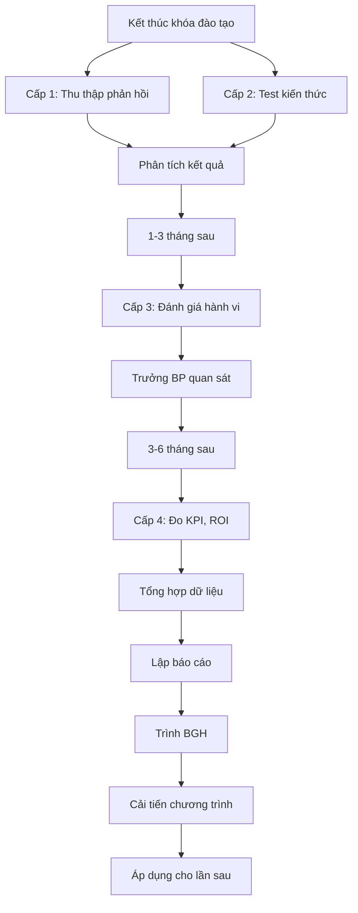

# SOP-03.4: ĐÁNH GIÁ HIỆU QUẢ ĐÀO TẠO

## 1. THÔNG TIN QUY TRÌNH

| **Thuộc tính** | **Nội dung** |
|---|---|
| Mã SOP | SOP-03.4 |
| Tên quy trình | Đánh giá hiệu quả đào tạo |
| Quy trình cha | SOP-03: Đào tạo |
| Tần suất | Sau mỗi khóa đào tạo |

## 2. MỤC ĐÍCH

Đo lường tác động thực tế của đào tạo, cải tiến cho lần sau

## 3. PHẠM VI

Tất cả khóa đào tạo

## 4. QUY TRÌNH

### 4.1. Đánh giá theo mô hình Kirkpatrick 4 cấp độ

**Cấp 1: Phản ứng (Reaction) - Ngay sau khóa**

**Bước 1: Thu thập phản hồi**
Form đánh giá (QT02-F26):
| **Tiêu chí** | **Thang điểm** |
|---|---|
| Nội dung hữu ích | 1-5 |
| Giảng viên | 1-5 |
| Tổ chức | 1-5 |
| Tài liệu | 1-5 |
| Có giới thiệu người khác không? | Có/Không |

**Cấp 2: Học tập (Learning) - Ngay sau khóa**

**Bước 2: Kiểm tra kiến thức**
- Test trắc nghiệm hoặc thực hành
- Tỷ lệ đạt: ≥ 70% = Đạt

**Cấp 3: Hành vi (Behavior) - Sau 1-3 tháng**

**Bước 3: Quan sát thay đổi**
Trưởng BP đánh giá:
- Học viên có áp dụng được không?
- Hiệu suất công việc có cải thiện?

Form đánh giá sau đào tạo (QT02-F29)

**Cấp 4: Kết quả (Results) - Sau 3-6 tháng**

**Bước 4: Đo lường tác động tổng thể**
| **Chỉ số** | **Trước đào tạo** | **Sau đào tạo** | **Cải thiện** |
|---|---|---|---|
| KPI bộ phận | X | Y | +/- % |
| Chất lượng công việc | Điểm | Điểm | +/- |
| Hài lòng khách hàng | % | % | +/- % |

### 4.2. Tổng hợp và báo cáo

**Bước 5: Phân tích ROI**
ROI = (Lợi ích - Chi phí) / Chi phí × 100%

**Bước 6: Lập báo cáo**
Báo cáo đánh giá đào tạo (QT02-R04):
- Tóm tắt khóa học
- Kết quả 4 cấp độ
- ROI (nếu tính được)
- Bài học kinh nghiệm
- Đề xuất cải tiến

**Bước 7: Trình BGH và cải tiến**

## 5. LƯU ĐỒ

## 6. BIỂU MẪU

- QT02-F29: Form đánh giá sau đào tạo 1-3 tháng
- QT02-R04: Báo cáo hiệu quả đào tạo

## 7. TIÊU CHUẨN

| **Chỉ tiêu** | **Mục tiêu** |
|---|---|
| Điểm hài lòng trung bình | ≥ 4.0/5.0 |
| Tỷ lệ đạt test | ≥ 85% |
| Tỷ lệ áp dụng vào công việc | ≥ 70% |

## 8. TRÁCH NHIỆM

- **Phòng NS**: Thu thập, phân tích, báo cáo
- **Trưởng BP**: Đánh giá hành vi thay đổi
- **BGH**: Xem xét, quyết định đầu tư tiếp

## 9. LƯU Ý

- ⚠️ Đánh giá cấp 3, 4 mất thời gian nhưng quan trọng
- ✅ So sánh trước/sau để thấy tác động
- ✅ Không phải khóa nào cũng tính được ROI chính xác

## 10. PHỤ LỤC

**Ví dụ tính ROI:**
- Chi phí đào tạo: 20 triệu
- Sau đào tạo, giảm sai sót 30% → Tiết kiệm 50 triệu/năm
- ROI = (50-20)/20 × 100% = 150%

## 11. FAQ

**Q: Nếu khóa đào tạo không hiệu quả?**  
A: Phân tích nguyên nhân (nội dung, giảng viên, thời gian...), cải tiến hoặc ngừng.

---
**PHÊ DUYỆT** | Trưởng NS | Phó HT |
