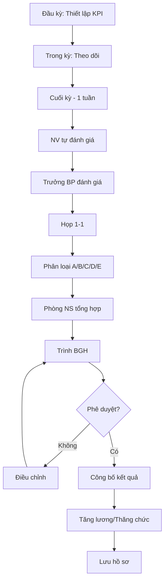

# SOP-04.1: ĐÁNH GIÁ HIỆU SUẤT CÔNG VIỆC

## 1. THÔNG TIN QUY TRÌNH

| **Thuộc tính** | **Nội dung** |
|---|---|
| Mã SOP | SOP-04.1 |
| Tên quy trình | Đánh giá hiệu suất công việc |
| Quy trình cha | SOP-04: Đánh giá chất lượng |
| Tần suất | Học kỳ (6 tháng), Năm (12 tháng) |

## 2. MỤC ĐÍCH

Đo lường KPI, OKR để đánh giá công bằng, tạo động lực, quyết định tăng lương/thăng tiến

## 3. PHẠM VI

Tất cả cán bộ, giáo viên, nhân viên (trừ thử việc < 3 tháng)

## 4. QUY TRÌNH

### 4.1. Chuẩn bị

**Bước 1: Thiết lập KPI đầu năm**
Trưởng BP + NV ngồi lại thiết lập:
| **Loại KPI** | **Ví dụ** | **Trọng số** |
|---|---|---|
| KPI cá nhân | Hoàn thành 100% công việc đúng hạn | 40% |
| KPI nhóm | Bộ phận đạt mục tiêu | 30% |
| KPI trường | Điểm hài lòng PH ≥ 85% | 20% |
| Phát triển | Tham gia dự án cải tiến | 10% |

**Bước 2: Theo dõi trong kỳ**
- Check-in định kỳ (tháng/quý)
- Ghi nhận tiến độ vào hệ thống HRM

### 4.2. Đánh giá

**Bước 3: Tự đánh giá (Trước 1 tuần)**
NV điền Form tự đánh giá (QT02-F30):
- Đạt được gì?
- Khó khăn?
- Kế hoạch cải thiện?

**Bước 4: Trưởng BP đánh giá**
| **Tiêu chí** | **Thang điểm** | **Trọng số** |
|---|---|---|
| Hoàn thành KPI | 1-5 | 50% |
| Chất lượng công việc | 1-5 | 20% |
| Thái độ làm việc | 1-5 | 15% |
| Team work | 1-5 | 10% |
| Sáng tạo, cải tiến | 1-5 | 5% |

**Bước 5: Họp 1-1**
- Trưởng BP + NV họp 30-45 phút
- Chia sẻ kết quả, góp ý 2 chiều
- Cam kết cải thiện

### 4.3. Xếp loại và quyết định

**Bước 6: Phân loại**
| **Loại** | **Điểm** | **Tỷ lệ** | **Quyền lợi** |
|---|---|---|---|
| A - Xuất sắc | ≥ 4.5 | ~10% | Tăng lương 10-15%, Thăng chức |
| B - Tốt | 4.0-4.4 | ~25% | Tăng lương 7-10% |
| C - Đạt | 3.5-3.9 | ~50% | Tăng lương 5-7% |
| D - Cần cải thiện | 3.0-3.4 | ~10% | Không tăng lương, PIP |
| E - Không đạt | < 3.0 | ~5% | Cảnh báo, xem xét chấm dứt |

**Bước 7: Trình BGH phê duyệt**

## 5. LƯU ĐỒ

## 6. BIỂU MẪU

- QT02-F30: Form tự đánh giá
- QT02-F31: Phiếu đánh giá hiệu suất
- QT02-R05: Báo cáo tổng hợp đánh giá

## 7. TIÊU CHUẨN

| **Chỉ tiêu** | **Mục tiêu** |
|---|---|
| 100% NV được đánh giá đúng hạn | 100% |
| Tỷ lệ phân loại chuẩn | A:10%, B:25%, C:50%, D:10%, E:5% |

## 8. TRÁCH NHIỆM

- **NV**: Tự đánh giá, cam kết cải thiện
- **Trưởng BP**: Đánh giá, họp 1-1
- **Phòng NS**: Tổng hợp, hướng dẫn quy trình
- **BGH**: Phê duyệt, quyết định tăng lương

## 9. LƯU Ý

- ⚠️ Đánh giá dựa trên **bằng chứng**, không chủ quan
- ✅ Forced ranking (10-25-50-10-5) để tránh lạm phát điểm
- ✅ Phản hồi xây dựng, không công kích cá nhân

## 10. PHỤ LỤC

**PIP (Performance Improvement Plan):**
- Cho loại D: Lập kế hoạch cải thiện 3 tháng
- Nếu vẫn D → Chuyển E → Xem xét chấm dứt

## 11. FAQ

**Q: Nếu NV không đồng ý kết quả?**  
A: Khiếu nại lên BGH. BGH xem xét, quyết định cuối.

---
**PHÊ DUYỆT** | Trưởng NS | Phó HT | HT |
