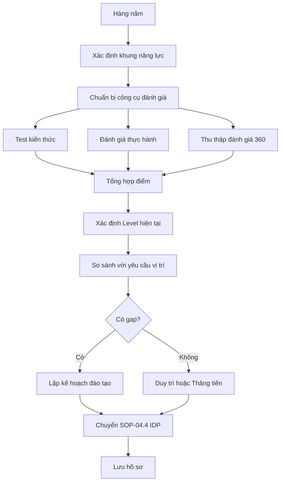

# SOP-04.2: ĐÁNH GIÁ NĂNG LỰC CHUYÊN MÔN

## 1. THÔNG TIN QUY TRÌNH

| **Thuộc tính** | **Nội dung** |
|---|---|
| Mã SOP | SOP-04.2 |
| Tên quy trình | Đánh giá năng lực chuyên môn |
| Quy trình cha | SOP-04: Đánh giá chất lượng |
| Tần suất | Hàng năm |

## 2. MỤC ĐÍCH

Đánh giá kỹ năng, kiến thức chuyên môn thực tế để xác định nhu cầu đào tạo, thăng tiến

## 3. PHẠM VI

Tất cả NV đã qua thử việc

## 4. QUY TRÌNH

### 4.1. Chuẩn bị

**Bước 1: Xác định khung năng lực (Competency Framework)**

| **Cấp độ** | **Mô tả** | **Ví dụ (Giáo viên)** |
|---|---|---|
| **Level 1 - Nhập môn** | Cần hướng dẫn sát | GV mới, < 1 năm kinh nghiệm |
| **Level 2 - Thành thạo** | Làm độc lập | GV 1-3 năm, tốt nghiệp đại học |
| **Level 3 - Thành thục** | Hướng dẫn người khác | GV 3-5 năm, có chứng chỉ quốc tế |
| **Level 4 - Chuyên gia** | Thiết kế chương trình | GV >5 năm, Master, giải thưởng |
| **Level 5 - Guru** | Dẫn dắt ngành | GV >10 năm, PhD, tác giả sách |

**Bước 2: Chuẩn bị công cụ đánh giá**

### 4.2. Đánh giá đa chiều

**Bước 3: Đánh giá kiến thức (20%)**
- Test trắc nghiệm
- Vấn đáp chuyên môn

**Bước 4: Đánh giá kỹ năng thực hành (50%)**

| **Đối tượng** | **Phương pháp** |
|---|---|
| **Giáo viên** | Quan sát giờ dạy (3 buổi), Xem giáo án, Kết quả HS |
| **Kế toán** | Kiểm tra báo cáo, Độ chính xác, Tuân thủ chuẩn mực |
| **IT** | Test thực hành, Xử lý sự cố, Dự án đã làm |
| **Marketing** | Chiến dịch, ROI, Sáng tạo nội dung |

**Bước 5: Đánh giá 360° (30%)**
- Trưởng BP (40%)
- Đồng nghiệp (30%)
- Khách hàng/PH (20%) - Nếu có
- Cấp dưới (10%) - Nếu có

### 4.3. Tổng hợp và lập kế hoạch

**Bước 6: Xác định Level hiện tại**
Dựa vào điểm tổng hợp

**Bước 7: So sánh với yêu cầu vị trí**
- Gap là gì?
- Cần đào tạo gì?

**Bước 8: Lập kế hoạch phát triển (IDP)**
Chuyển sang SOP-04.4

## 5. LƯU ĐỒ

## 6. BIỂU MẪU

- QT02-F32: Khung năng lực theo vị trí
- QT02-F33: Phiếu đánh giá 360°
- QT02-F34: Báo cáo đánh giá năng lực

## 7. TIÊU CHUẨN

| **Chỉ tiêu** | **Mục tiêu** |
|---|---|
| Tỷ lệ NV đạt Level yêu cầu vị trí | ≥ 80% |
| Tỷ lệ NV được đào tạo theo gap | 100% |

## 8. TRÁCH NHIỆM

- **Phòng NS**: Thiết kế công cụ, thu thập đánh giá 360
- **Trưởng BP**: Đánh giá thực hành, xác định level
- **Chuyên gia nội bộ**: Test kiến thức

## 9. LƯU Ý

- ⚠️ Đánh giá năng lực ≠ Đánh giá hiệu suất
- ✅ Năng lực = Có thể làm gì | Hiệu suất = Đã làm được gì
- ✅ Dùng để phát triển, không để phạt

## 10. PHỤ LỤC

**Ví dụ Competency - Giáo viên Tiếng Anh:**
- Kiến thức chuyên môn (Grammar, Phonetics...)
- Kỹ năng giảng dạy (Lesson planning, Classroom management...)
- Kỹ năng đánh giá HS
- Sử dụng công nghệ
- Giao tiếp PH

## 11. FAQ

**Q: Có thể Level cao nhưng hiệu suất thấp?**  
A: Có. Có năng lực nhưng không cố gắng → Vấn đề thái độ, không phải đào tạo.

---
**PHÊ DUYỆT** | Trưởng NS | Phó HT |
