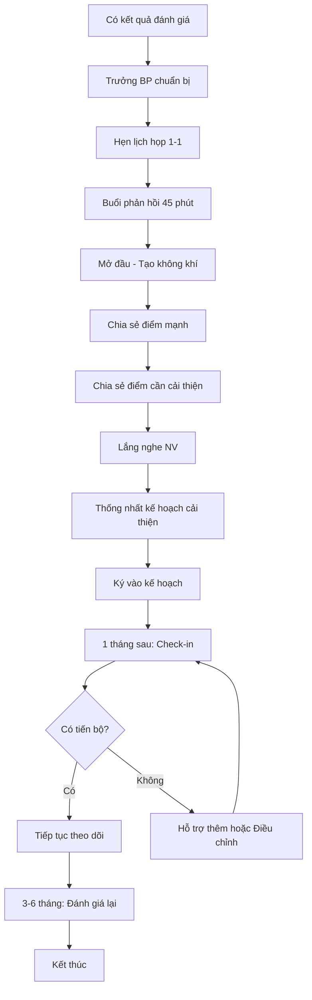

# SOP-04.3: PHẢN HỒI VÀ CẢI THIỆN

## 1. THÔNG TIN QUY TRÌNH

| **Thuộc tính** | **Nội dung** |
|---|---|
| Mã SOP | SOP-04.3 |
| Tên quy trình | Phản hồi và cải thiện |
| Quy trình cha | SOP-04: Đánh giá chất lượng |
| Tần suất | Sau mỗi đánh giá |

## 2. MỤC ĐÍCH

Góp ý 2 chiều, xây dựng kế hoạch cải tiến cụ thể để NV phát triển

## 3. PHẠM VI

Tất cả NV sau đánh giá hiệu suất/năng lực

## 4. QUY TRÌNH

### 4.1. Chuẩn bị phản hồi

**Bước 1: Trưởng BP chuẩn bị**
- Tổng hợp kết quả đánh giá
- Liệt kê điểm mạnh, điểm yếu cụ thể (có bằng chứng)
- Chuẩn bị ví dụ thực tế
- Dự kiến giải pháp

### 4.2. Buổi phản hồi 1-1

**Bước 2: Mở đầu (5 phút)**
- Tạo không khí thoải mái
- Giải thích mục đích: Phát triển, không phạt

**Bước 3: Chia sẻ kết quả (10 phút)**
- Bắt đầu bằng **điểm mạnh**
- Sau đó mới nói **điểm cần cải thiện**
- Dùng mô hình SBI: Situation - Behavior - Impact

**Ví dụ SBI:**
- Situation: "Trong buổi họp PH tuần trước"
- Behavior: "Em đã chủ động trình bày kế hoạch rất rõ ràng"
- Impact: "PH rất hài lòng, tin tưởng trường hơn"

**Bước 4: Lắng nghe phản hồi từ NV (10 phút)**
- NV chia sẻ quan điểm
- Khó khăn, nguyên nhân
- Đề xuất của NV

**Bước 5: Thống nhất kế hoạch cải thiện (15 phút)**

| **Điểm cần cải thiện** | **Hành động cụ thể** | **Deadline** | **Hỗ trợ** |
|---|---|---|---|
| Quản lý thời gian yếu | Học khóa Time Management | 2 tháng | Phòng NS đăng ký |
| Tiếng Anh chưa tốt | Học IELTS, mục tiêu 7.0 | 6 tháng | Hỗ trợ 50% học phí |

**Bước 6: Kết thúc tích cực (5 phút)**
- Khẳng định niềm tin vào NV
- Cam kết hỗ trợ
- Hẹn check-in tiếp theo

### 4.3. Theo dõi cải thiện

**Bước 7: Check-in định kỳ**
- 1 tháng/lần
- Xem tiến độ
- Điều chỉnh kế hoạch nếu cần

**Bước 8: Đánh giá lại**
- Sau 3-6 tháng
- Xem có cải thiện không

## 5. LƯU ĐỒ

## 6. BIỂU MẪU

- QT02-F35: Mẫu phản hồi đánh giá
- QT02-F36: Kế hoạch cải thiện cá nhân

## 7. TIÊU CHUẨN

| **Chỉ tiêu** | **Mục tiêu** |
|---|---|
| 100% NV được phản hồi sau đánh giá | 100% |
| Tỷ lệ NV cải thiện sau 6 tháng | ≥ 70% |

## 8. TRÁCH NHIỆM

- **Trưởng BP**: Phản hồi, theo dõi cải thiện
- **Phòng NS**: Hỗ trợ đào tạo, hướng dẫn quy trình
- **NV**: Cam kết thực hiện kế hoạch

## 9. LƯU Ý

- ⚠️ **Quy tắc Sandwich**: Tốt - Cần cải thiện - Tốt (kết thúc tích cực)
- ✅ Tập trung vào **hành vi có thể thay đổi**, không công kích tính cách
- ✅ Cụ thể, có ví dụ, không chung chung

## 10. PHỤ LỤC

**Câu nói NÊN:**
- "Em đã làm tốt X, tiếp tục phát huy"
- "Anh nghĩ em có thể cải thiện Y bằng cách..."
- "Trường sẽ hỗ trợ em..."

**Câu nói KHÔNG NÊN:**
- "Em luôn luôn..."
- "Em không bao giờ..."
- "Thái độ của em..."

## 11. FAQ

**Q: NV phản ứng tiêu cực, không chấp nhận?**  
A: Lắng nghe, đưa bằng chứng cụ thể, cho thời gian suy nghĩ. Nếu vẫn không đồng ý, báo BGH.

---
**PHÊ DUYỆT** | Trưởng NS | Phó HT |
