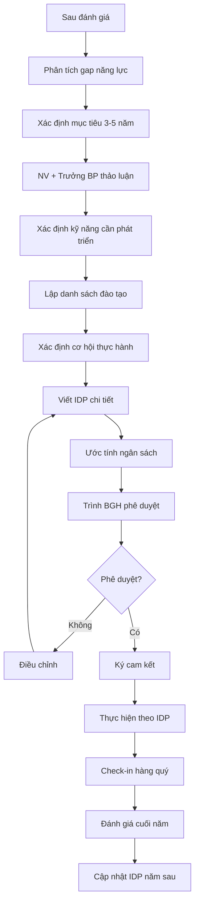

# SOP-04.4: LẬP KẾ HOẠCH PHÁT TRIỂN

## 1. THÔNG TIN QUY TRÌNH

| **Thuộc tính** | **Nội dung** |
|---|---|
| Mã SOP | SOP-04.4 |
| Tên quy trình | Lập kế hoạch phát triển |
| Quy trình cha | SOP-04: Đánh giá chất lượng |
| Tần suất | Hàng năm, sau đánh giá |

## 2. MỤC ĐÍCH

Xây dựng IDP (Individual Development Plan) - Lộ trình phát triển cá nhân rõ ràng

## 3. PHẠM VI

Tất cả NV, đặc biệt NV có tiềm năng thăng tiến

## 4. QUY TRÌNH

### 4.1. Đánh giá hiện trạng

**Bước 1: Phân tích gap**
- Năng lực hiện tại vs Mục tiêu
- Điểm mạnh vs Điểm yếu
- Nguyện vọng của NV

**Bước 2: Xác định mục tiêu phát triển (3-5 năm)**

| **Ví dụ mục tiêu** | **Timeline** |
|---|---|
| Từ GV → GV chủ nhiệm | 1-2 năm |
| Từ GV chủ nhiệm → Tổ trưởng | 2-3 năm |
| Từ Tổ trưởng → Trưởng khối | 3-5 năm |

### 4.2. Lập kế hoạch chi tiết

**Bước 3: Xác định kỹ năng cần phát triển**

| **Kỹ năng** | **Phương pháp** | **Timeline** | **Ngân sách** |
|---|---|---|---|
| Lãnh đạo | Khóa Leadership, Coaching | 1 năm | 10 triệu |
| Ngoại ngữ | IELTS 7.5 | 2 năm | 20 triệu |
| Chuyên môn sâu | Master Education | 3 năm | 200 triệu |

**Bước 4: Cơ hội thực hành**
- Tham gia dự án
- Làm mentor cho NV mới
- Dẫn dắt team nhỏ
- Thay thế sếp khi vắng

**Bước 5: Viết IDP**
Form IDP (QT02-F37) gồm:
- Mục tiêu nghề nghiệp
- Kỹ năng cần phát triển
- Kế hoạch hành động cụ thể
- Nguồn lực hỗ trợ
- Milestone đánh giá

### 4.3. Thực hiện và theo dõi

**Bước 6: Ký cam kết**
NV + Trưởng BP + BGH (nếu cần) ký

**Bước 7: Check-in quý**
- Xem tiến độ
- Hỗ trợ khó khăn
- Điều chỉnh nếu cần

**Bước 8: Đánh giá cuối năm**
- So sánh mục tiêu vs Thực tế
- Cập nhật IDP năm sau

## 5. LƯU ĐỒ

## 6. BIỂU MẪU

- QT02-F37: Form IDP (Individual Development Plan)
- QT02-R06: Báo cáo tổng hợp IDP toàn trường

## 7. TIÊU CHUẨN

| **Chỉ tiêu** | **Mục tiêu** |
|---|---|
| Tỷ lệ NV có IDP | 100% (trừ thử việc) |
| Tỷ lệ hoàn thành mục tiêu IDP | ≥ 70% |
| Tỷ lệ thăng tiến từ talent pool | ≥ 50% |

## 8. TRÁCH NHIỆM

- **NV**: Chủ động đề xuất, cam kết thực hiện
- **Trưởng BP**: Hỗ trợ lập IDP, theo dõi, tạo cơ hội thực hành
- **Phòng NS**: Hỗ trợ đào tạo, tổng hợp báo cáo
- **BGH**: Phê duyệt ngân sách, quyết định thăng chức

## 9. LƯU Ý

- ⚠️ IDP là **kế hoạch phát triển**, không phải cam kết thăng chức chắc chắn
- ✅ Cân bằng giữa **nhu cầu trường** và **nguyện vọng NV**
- ✅ Phải có **hành động cụ thể**, không chỉ mơ ước

## 10. PHỤ LỤC

**Mẫu IDP - Giáo viên Nguyễn Văn A:**

**Mục tiêu 3 năm:** Trở thành Tổ trưởng Tiếng Anh

**Kỹ năng cần phát triển:**
1. Lãnh đạo: Khóa Leadership (năm 1)
2. Chuyên môn: Cambridge TKT Band 4 (năm 1)
3. Ngoại ngữ: IELTS 8.0 (năm 2)
4. Quản lý: Quản lý dự án (năm 2)

**Cơ hội thực hành:**
- Mentor 2 GV mới (năm 1)
- Dẫn dắt dự án chương trình mới (năm 2)
- Tham gia Ban giám khảo (năm 3)

## 11. FAQ

**Q: Nếu NV không muốn thăng tiến?**  
A: OK, IDP tập trung vào phát triển chuyên môn sâu, trở thành chuyên gia.

---
**PHÊ DUYỆT** | Trưởng NS | Phó HT | HT |
